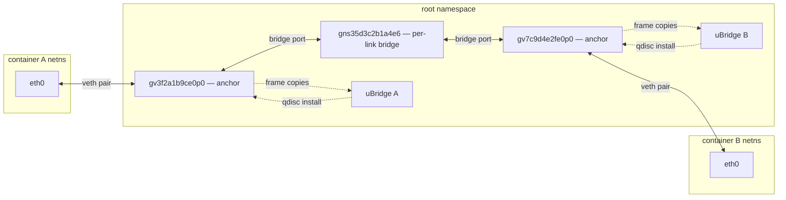
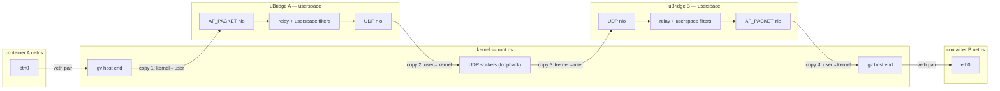
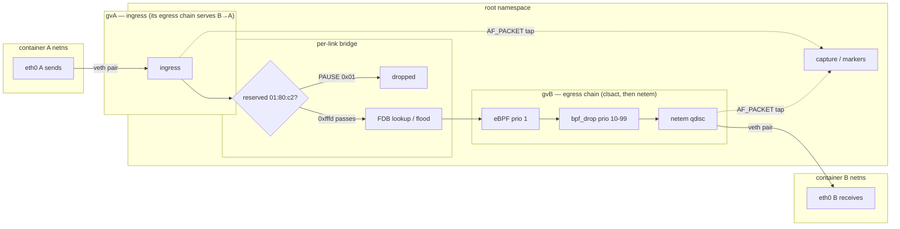
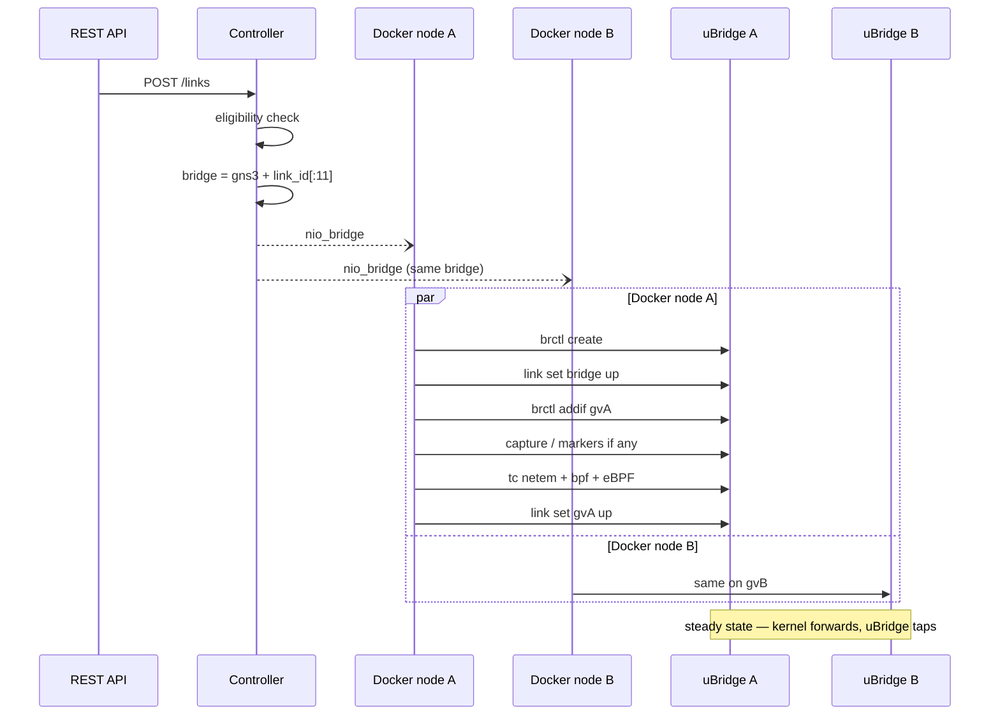

<!--
SPDX-License-Identifier: CC-BY-SA-4.0
See LICENSE file for licensing information.
-->

> This documentation is AI-generated with reference to actual code and verified against real-kernel testing. AI can make mistakes — please verify against the source code when in doubt.

# Docker Kernel Datapath (veth + per-link Linux bridge)

## Overview

Docker node links historically flowed through a uBridge userspace relay: each adapter was a TAP whose file descriptor uBridge pumped between the container and UDP tunnels. This implementation replaces that model with **kernel-native forwarding**: every adapter is born as a **veth pair**, and each link is a **dedicated Linux kernel bridge** enslaving the two endpoints' veth host ends. Frames never leave the kernel.

| | Old (relay) | New (kernel datapath) |
|---|---|---|
| Adapter interface | TAP moved into the container netns | veth pair (guest end in container, host end in root ns) |
| Link | uBridge bridge, TAP fd ↔ UDP, userspace copy | per-link kernel bridge `gns3{link_id[:11]}`, zero-copy |
| Relay latency | ~0.3 ms RTT | ~0.05 ms RTT (measured) |
| Link attach at runtime | yes (relay attaches the pre-existing TAP) | yes (brctl addif / add_nio_ethernet — interface untouched) |
| Packet filters | uBridge userspace filters | tc netem on the veth host end (delay / packet_loss / corrupt / duplicate + the netem extensions rate, reorder, gemodel, seed, limit, jitter distributions, loss correlation); bpf as cls_bpf match-drop classifiers; frequency_drop, quota and window_drop as the eBPF stateful classifier — every filter type has a kernel equivalent |
| Capture / markers | relay bridge | uBridge AF_PACKET modules on the veth host end |

The work landed in nine stages on branch stack `feat/docker-kernel-datapath` → `feat/docker-kernel-capture` → `feat/docker-kernel-markers` → `feat/docker-veth-everywhere` → `feat/docker-kernel-filters` → `feat/docker-kernel-bpf-drop` → `feat/docker-kernel-netem-ext` → `feat/docker-kernel-ebpf-drops` → `feat/docker-kernel-window-drop`:

1. **Kernel datapath** — NIOBridge NIO type, per-link bridges, carrier-based suspend, crash-safe reconciliation.
2. **Capture** — `capture start_kernel` (AF_PACKET) on the veth host end.
3. **Markers** — `marker add_kernel` (AF_PACKET + BPF) with the same signals, pcaps and fine-grained REST operations as the relay `mark` filter.
4. **veth-everywhere** — the TAP path deleted; every adapter is a veth and the datapath is a *runtime* decision (kernel or relay) that never touches a running container's interfaces.
5. **Filters** — impairment filters (delay, packet_loss, corrupt) become one tc netem qdisc per veth host end, pushed through uBridge's netlink `tc` module. This also removes the relay delay filter's nanosleep bottleneck (upstream #2827) from the kernel path.
6. **bpf match-drop** — the `bpf` filter (any line matching drops) runs as cls_bpf classifiers on the veth host end's clsact egress (`tc bpf_drop`: uBridge pcap-compiles the line to classic BPF, the kernel migrates it to eBPF internally — no CAP_BPF needed). Requires a uBridge reporting `cbpf=1` via `tc capabilities`; older builds get a clear upgrade error.
7. **netem extensions** — the netem-extension surface delivered in uBridge `feature/tc-netem-ext` is exposed as GNS3 filter types: `rate`, `reorder`, `gemodel`, `duplicate`, `seed`, `limit`, plus the delay `distribution` and loss/dup `correlation` parameters. Kernel-datapath links only (the relay has no equivalent); capability-gated per uBridge process. Reconcile became reset-before-set: the kernel's netem replace merges optional attributes, so removing a parameter needs the explicit reset.
8. **eBPF stateful drops** — `frequency_drop` becomes the eBPF classifier's exact every-Nth mode (`tc nth_drop`, uBridge `feature/tc-precision`; -1 = drop everything → every 1st) and the new kernel-only `quota` type the byte-cap mode (`tc quota_drop`). Needs a uBridge reporting `ebpf=1` (setcap cap_bpf,cap_net_admin,cap_net_raw=ep — verified working for a non-root server process, the production credential shape). With this, no filter type forces the relay anymore: kernel/relay is a purely topological choice.
9. **window_drop flaps** — the eBPF classifier's time-window mode (`tc window_drop`, uBridge `feature/tc-window`): a single outage that passes traffic before and after, a recurring flap with `period ≥ outage`, and an optional per-cycle jitter that randomizes each beat's outage and period. The originally delivered back-to-back window implementation (which made "outside the window packets pass" unreachable) was fixed uBridge-side; this stage exposes the corrected semantics as the kernel-only `window_drop` filter type.

## Adapter interface types

Which interface a Docker node's adapters use is decided by the node class (`Docker._select_node_class`, from `console_type` + `GNS3_*` environment markers):

| Node class | Selected by | Adapter interface | Kernel links |
|---|---|---|---|
| `DockerVM` | default | veth pair | yes |
| `VendorDockerVM` (non-unix-socket) | `console_type=docker_exec` (XRd, SR Linux, …) | veth pair (same path via `super()`) | yes |
| `IOLDockerVM` | `GNS3_IOL_RUNNER=1` | AF_UNIX datagram socket pairs (`sNN`/`cNN`) — the container netns is unused; kernel links ride persistent `gx` TAP anchors through the port bridge's swappable TAP leg (see `iol-docker-kernel-datapath.md`) | yes (gated on `ubridge_bridge_tap` + `ubridge_tap`) |
| `VendorDockerVM` (unix-socket) | `GNS3_UNIX_SOCKET_NIO=1` | same socket contract, generic capability for vendor NOS images | rejected |

The other `GNS3_*` markers a vendor image sets (`GNS3_SKIP_INIT`, `GNS3_INTERFACE_NAMES`, …) are behavior knobs of the selected class, not class selectors — an environment carrying only `GNS3_SKIP_INIT` stays on `DockerVM`. Unix-socket containers are detected both in the controller (`_is_unix_socket_docker`, link eligibility) and on the compute side (NIO rejection) — a missed detection surfaces as a clearer-late error, except on the Ethernet-switch fast path, where an absent anchor is deferred forever by design (the join must not fail while the peer is stopped), leaving a silently dead cable.

## Architecture

Kernel link between two containers on the same compute. Interface names follow two deterministic rules — `gv|gc{node_id[:8]}e{adapter}p{port}` for the veth pair (`gv` = GNS3 veth host end, `gc` = its guest end, moved into the container and renamed `eth{N}`) and `gns3{link_id[:11]}` for the bridge; the concrete names in the diagrams use node ids `3f2a1b9c` / `7c9d4e2f` and link id prefix `5d3c2b1a4e6`. Terms the diagrams use:

| Term | Meaning |
|---|---|
| uBridge | the per-node helper process gns3-server spawns with elevated capabilities; its hypervisor command surface executes all host-side wiring (veths, bridges, carrier, tc, taps) — on a kernel link it builds and observes the path but never carries frames |
| anchor | the host-side interface a link attaches to — for Docker, the `gv` veth host end |
| per-link bridge | the Linux bridge `gns3{link_id[:11]}` that stands in for the cable; the two anchors are its only ports |
| veth pair | a kernel virtual Ethernet pair — two interfaces created together and wired so a frame into one end comes out the other; here one end is the container's `eth0`, the other the `gv` host end |
| bridge port | an interface enslaved to a Linux bridge (`brctl addif`) — it no longer sends or receives on its own: frames arriving on it go to the bridge's forwarding logic, and the bridge transmits through it |
| veth crossing | a frame passing through the veth pair between a container netns and the root namespace — pure kernel, no userspace |
| FDB | the bridge's forwarding database (learned MAC → port); unknown, broadcast and multicast destinations are flooded |
| `01:80:c2` / `group_fwd_mask` | the IEEE 802.1D reserved multicast range (STP, LACP, LLDP, 802.1X, PAUSE); the bridge forwards it only per the port's `group_fwd_mask` — `0xfffd` passes everything except PAUSE/PFC |
| tc / qdisc | traffic-control objects the kernel inserts into the host end's egress path — stages frames pass through in flight, not external packet consumers; uBridge only installs them over netlink |
| `clsact` | the tc classifier carrier on the host end; its egress chain is where the drop classifiers run |
| eBPF classifier | the stateful drop classifier at clsact egress prio 1 — modes every-Nth, quota, time window and flow (GNS3 exposes the first three as filter types) |
| `bpf_drop` | match-drop BPF expressions at clsact egress prio 10–99 |
| `netem` | the impairment qdisc behind clsact: delay, loss, rate, corrupt, duplicate, … |
| `AF_PACKET tap` | uBridge's packet socket bound to the host end; the kernel clones every frame the interface sends or receives to it (the tcpdump mechanism) — read-only copies, the original stays on the kernel path |
| carrier | the host end's admin state (`link set up/down`); suspend is carrier down on both ends = 100 % loss |
| `nio_bridge` | the NIO record the controller posts to each endpoint node: bridge name, filters, markers, suspend flag |



Everything in the root namespace is built the same way: gns3-server creates the veth pairs at container start, the bridge and its memberships at link creation, and every later change (carrier, capture, markers, filters) by sending hypervisor commands to its per-node uBridge process — the privileged agent that turns them into netlink/ioctl operations (the production credential shape is a non-root server with a capabilities-equipped ubridge). That build flow is the Link creation sequence below; this diagram is the steady state that remains, where the only uBridge relationships left are the two dashed kinds.

uBridge sits off the forwarding path — the dashed edges are control and observation, never data flow. The `qdisc install` edge is uBridge configuring the kernel over netlink; the kernel then runs those qdiscs in-flight on the host end's egress (they are stages of the transmit path, not packet consumers). The `frame copies` edge is the AF_PACKET tap: bound to the host end, the kernel clones every frame the interface sends or receives to uBridge's packet socket (the tcpdump mechanism) — read-only copies; the originals never leave the kernel.

Relay link on the same unified veth and the same single compute as above — what the link becomes when `enable_kernel_datapath` is off (cross-compute wiring and an endpoint that cannot anchor — VPCS, a cloud node, … — fall back too; across computes the UDP hop rides the real network instead of loopback, the copy count unchanged):



Drawn one-way; the reverse direction is the mirror image. A relayed frame crosses the kernel/user boundary **four times each way** (eight per round trip — the measured ≈0.3 ms RTT against ≈0.05 ms on the kernel datapath, whose crossings are zero), and the relay's filters run in userspace on the frames between the copies.

Both datapaths anchor on the *same* veth host end; switching between them (link delete + recreate) never touches the container-side interface.

Frame path for one A → B frame. The impairment chain fires on the egress of the *destination* end's veth, in order clsact → netem (a classifier drop means netem never sees the frame); each direction is impaired exactly once and B → A is symmetric on gvA — hence `delay 100` ≈200 ms RTT, `packet_loss 30` ≈51 % round trip:



What each stage drops: the reserved-range gate passes LACP, LLDP, 802.1X and STP per the port mask but never PAUSE/PFC (Link-local frames below); the clsact/netem stages drop or impair per the installed filters (Packet filters below). Whichever end hosts capture / markers, its AF_PACKET tap — the dashed sideband above — clones the frame at that anchor: a tap on gvA sees the frame on arrival, a tap on gvB only if the clsact chain let it through.

All dozen-plus GNS3 filter types ride these three kernel objects — nine of them (delay, packet_loss, corrupt, duplicate, rate, reorder, gemodel, seed, limit) are parameters of the single netem qdisc, `bpf` expressions are the cls_bpf filters, and frequency_drop / quota / window_drop map to three of the one eBPF program's four modes (evaluated nth → quota → window → flow; the flow-hash mode has no GNS3 filter type). The complete type-to-object mapping and the per-frame evaluation order are documented in `packet-filters.md`.

## Datapath selection

`UDPLink._kernel_datapath_eligible` decides in the controller at NIO prepare time; the compute side only reacts to the NIO type:

* both endpoints on the same compute, both able to anchor — Docker anchors via its veth (any class except unix-socket containers), and QEMU / IOU / Dynamips / Ethernet-switch peers anchor via their own mechanisms, so mixed links take the kernel path too
* `Server.enable_kernel_datapath` enabled (default)

Filters never disqualify the kernel path anymore — every type has a kernel equivalent (netem / cls_bpf / eBPF classifier).

There is **no stopped-node requirement**. Since every adapter is a veth, links attach to running containers: `brctl addif` (kernel) or `bridge add_nio_ethernet` (relay) are runtime-safe operations on the host end. On project (re)open every link re-runs `_prepare`, so relay links whose endpoints became eligible are upgraded to the kernel datapath automatically.

Which datapath a link ended up on is visible in its REST payload (and the `link_list` / `link_get` MCP tools) as the read-only boolean `kernel_datapath`, recomputed from the NIO wiring — a relay link upgraded on reopen flips the field. It is not persisted and never sent on create/update.

## Link creation sequence

Both Docker nodes sit on the same compute (a kernel-link precondition) and each drives its own uBridge process. They attach concurrently and compute the same bridge name independently (a pure function of the link id), so either may win the `brctl create` race — the loser verifies the bridge exists (`brctl show`) and continues:



Every arrow to uBridge is one `_ubridge_send` command line on the node's local hypervisor console; uBridge executes it (netlink/ioctl) and replies OK or an error synchronously before the next command is sent — those replies are omitted for brevity. uBridge never initiates anything: it is a pure executor, and the only data ever flowing back (capture/marker frame copies) rides separate AF_PACKET sockets, not this console.

The veth pairs already exist at attach time — every adapter is born as a veth at container start (Adapter lifecycle below), which is what makes the attach a runtime-safe operation on a running container.

## Adapter lifecycle

* **Birth (container start)** — `_create_veth`: stale sweep of any leftover pair (crash residue), `docker create_veth`, host end admin-down, MAC from the adapter base, `docker move_to_ns` of the guest end (renamed `eth{N}`, or the `GNS3_INTERFACE_NAMES` mapping). Names are deterministic: `gv|gc{node_id[:8]}e{adapter}p{port}` (≤ 15 chars). Unconnected adapters are born too (carrier off) so the interface is visible inside the container.
* **Life (running)** — the veth is never created/deleted/moved again. Link create/delete/switch, suspend, capture and markers only change *what is attached to the host end*.
* **Death (container stop)** — `_remove_kernel_veths` deletes the host ends explicitly: unlike a TAP (which died with the container netns), a veth host end outlives the container. Deleting either end destroys the pair. The node's per-link kernel bridges go with them — deleting a node or closing a project never runs the link-teardown path (no per-link delete is issued), so a bridge whose ports just disappeared would stay behind as an empty orphan. Both endpoints do this and the peer's still-enslaved port makes the delete fail with EBUSY (suppressed, last one wins), the same contract as link deletion; a node restart rebuilds the bridge from the NIO.
* **Host L3 noise (known, hardening specified).** An anchor is a host-side netdev like any other, so the kernel gives it an IPv6 link-local address and emits its own MLD/DAD from it (measured ≈6 frames / 2 s on an idle TAP; the production anchors and per-link bridges carry `fe80::…` today). On a kernel link the bridge floods those frames into the emulated segment — and the host answers neighbor solicitations for its own address, which looks like a phantom IPv6 neighbor to the emulated nodes. The fix is to make anchors pure L2 at creation time on the uBridge side: `docs/design/ubridge-l2-anchor-spec.md`.

## Link operations

| Operation | Kernel-datapath action |
|---|---|
| Create / attach | `brctl create` (EEXIST tolerated via `brctl show` verify) + `link set up` + `brctl addif` both ends (concurrent, race-tolerant) + capture / markers if any + the tc chain (netem, bpf, eBPF) + carrier up |
| Delete / detach | marker teardown → `tc reset` (netem teardown — the veth survives the link) → carrier off → `brctl delif` → `brctl delete` (last endpoint wins; EBUSY/ENOENT suppressed). The veth survives — unlike a relay bridge, whose death dropped its filters, an orphaned AF_PACKET marker would keep sniffing, hence the explicit teardown |
| Reset (`POST /links/{id}/reset`) | delete + create (re-evaluates eligibility) |
| Suspend (`PUT /links/{id}` `{"suspend": true}`) | veth host end admin-state down both ends — 100 % loss, no synthetic filter needed; resume restores (netem qdisc survives the carrier flap) |

## Capture

Kernel links capture via uBridge's AF_PACKET module bound to the veth host end: `capture start_kernel <if> "<pcap>" [dlt]` / `capture stop_kernel`. Single capture per uBridge process (second concurrent → EALREADY): the server tracks which anchor owns the slot, refuses a second port's capture with a clear error instead of leaving it wedged, and only the owning port's stop issues the process-wide `capture stop_kernel`. Start/stop key on the **NIO type**, not on veth presence — a relay NIO riding a veth captures at its relay bridge.

## Markers

Markers ride the NIO like on the relay datapath, routed by `capture_node_id`; the anchor is the veth host end instead of a relay bridge (`_ubridge_apply_markers(anchor, nio)` is datapath-agnostic; DockerVM overrides the add/delete/enable primitives to translate the commands):

```
marker add_kernel    <name> <if> "<bpf>" [tag <id>] [link <id>] [dir <tx|rx>] [linktype <name>] [pcap "<path>"]
marker delete_kernel <if> <name>                    # idempotent
marker enable_kernel <if> <name> <on|off>           # off = installed but silent
```

* Per-deployment convention: **only the capture node's end** runs `add_kernel` (symmetric with capture) — signals form clean send/return pairs (`PACKET_OUTGOING` on the host end = container receiving = `rx`).
* Same BPF compilation, MARK UDP signals, pcap files and fine-grained REST toggle/rebuild/delete endpoints as the relay `mark` filter.
* Node restart reinstalls markers from the NIO; link deletion tears them down.

## Packet filters

Impairment filters are documented once for every kernel-datapath node type in `packet-filters.md` — the 13 filter types ride three kernel objects on the anchor (one netem qdisc, cls_bpf match-drop classifiers, the eBPF stateful classifier; the frame-path diagram above shows where the chain sits), and the type-to-object mapping, per-frame evaluation order, reconcile behaviour, capability gating and window semantics all live there. `KernelDatapathMixin` keys everything on the anchor interface name, which is why this veth datapath and the TAP datapaths (QEMU, IOU, Dynamips) share the implementation unchanged.

## Link-local frames (LACP, LLDP, 802.1X, STP)

The bridge stands in for a cable, but the kernel's `br_handle_frame()` does not forward the IEEE 802.1D reserved range (`01:80:c2:00:00:00`-`0f`) by default — LACP, LLDP/DCBX and 802.1X would never cross a kernel link while the UDP relay carries them fine. uBridge therefore opens every port's per-port `group_fwd_mask` (`IFLA_BRPORT_GROUP_FWD_MASK`) to `0xfffd` at `brctl addif` time (Linux 4.15+, best-effort on older kernels). The bridge-level knob cannot do this: `BR_GROUPFWD_RESTRICTED` rejects bits 0-2, so LACP is reachable per port only.

Result on kernel links: ordinary multicast, STP/RSTP, LACP, 802.1X and LLDP/DCBX all cross; **802.3x PAUSE / PFC does not** — `case 0x01` in `br_handle_frame()` drops it unconditionally and no mask can enable it. That is a documented limit, not a regression (PFC's hardware semantics are out of emulation's reach anyway); a lab that needs PAUSE frames on the wire must use a relay link. Verified live by `tests/e2e/test_docker_link_local_frames.py` (per-MAC guest-to-guest matrix); the contract and kernel references live in `docs/design/ubridge-link-local-frame-forwarding-spec.md`.

## uBridge command surface

No uBridge changes were needed beyond the marker module's `*_kernel` commands (the AF_PACKET capture module was pre-existing):

```
docker create_veth / delete_veth / move_to_ns / set_mac_addr
brctl create / delete / addif / delif / show
link set <if> up|down
capture start_kernel / stop_kernel
marker add_kernel / delete_kernel / enable_kernel
tc netem set <if> [delay <ms>] [jitter <ms>] [loss <%> [correl <%>] | loss gemodel <p> <r> <1-h>]
                                  [dup <%> [correl <%>]] [corrupt <%>] [reorder <%> [correl <%>] [gap <n>]]
                                  [rate <bw>] [limit <pkts>] [distribution uniform|normal|pareto|paretonormal] [seed <u32>]
tc bpf_drop add <if> <prio 10-99> "<expr>" / tc bpf_drop flush <if>
tc nth_drop <if> <n | off>        # eBPF exact every-Nth (frequency_drop)
tc quota_drop <if> <bytes> <pct> | off   # eBPF byte cap (quota)
tc window_drop <if> <start_ms> <outage_ms> <pct> [<period_ms> [<jitter_ms>]] | off  # eBPF time window (window_drop)
tc reset <if>                     # full restore: eBPF filter -> bpf_drops -> clsact -> root qdisc, idempotent
tc capabilities                   # "netem=<kw,...>;ebpf=0|1;cbpf=0|1[;ebpf_modes=<modes>]", probed once per process
bridge add_nio_ethernet / add_nio_udp / start / stop / start_capture / stop_capture
```

## Configuration

```ini
[Server]
# Wire eligible links through kernel interfaces instead of the uBridge UDP relay
enable_kernel_datapath = True
```

This is now the global datapath switch — `_kernel_datapath_eligible` consults it first, and every node type that can anchor a kernel link has landed:

* **Docker** — veth host ends as anchors (this document)
* **QEMU** — persistent TAP anchors, see `docs/features/qemu-kernel-datapath.md`
* **IOU** — TAP-terminated fabric ports (`iol_bridge add_nio_tap`), see `docs/features/iou-kernel-datapath.md`
* **Dynamips** — uBridge-created TAPs the hypervisor opens, see `docs/features/dynamips-kernel-datapath.md`
* **IOL runner containers** — persistent `gx` TAPs through the bridge module's swappable TAP leg, see `docs/features/iol-docker-kernel-datapath.md`
* **Ethernet Switch** — its own uBridge `brctl` bridge that absorbs the peer's anchor as a fast path (switch-to-switch cascades over a veth pair), see `docs/features/ethernet-switch-kernel-datapath.md`

A link rides the kernel when both endpoints sit on one compute, both can anchor (per-type uBridge capabilities), the switch is on and the ports are Ethernet; everything else falls back to the relay. The shared compute machinery behind all of these lives in `gns3server/compute/kernel_datapath.py`.

## Verification

End-to-end on a five-container FRR topology (mixed runtime-drawn and reloaded links): 8/8 links on the kernel datapath, ping RTT ≈ 0.05 ms, FDB learning, suspend = 100 % loss / resume restores, project reopen upgrades relay links, runtime link creation on running containers, marker pcaps exact (tx/rx pairs), capture freeze on stop, server restart reconciliation.

Filters (two-container kernel link, 27/27 checks): baseline 0.06 ms → `delay 100` = 200.2 ms RTT (2× per direction) → `delay 50` = 100.2 ms (atomic replace) → clear = baseline (qdisc detached); `packet_loss 30` = 48 % round-trip loss (expected 51 % = 1 − 0.7²); `frequency_drop` = 409 (at that stage — superseded by the eBPF stage below); suspend with delay active = 100 % loss, resume keeps the qdisc (200.1 ms); node restart restores it (200.1 ms); link delete detaches it (`/usr/sbin/tc qdisc show` — no netem left); re-created link has no residual impairment.

bpf match-drop (same setup, 22/22 checks): `bpf "icmp"` = 100 % loss on both ends' clsact; size-discriminating expression (`greater 150`) = small pings pass / 300-byte pings dropped (real byte-level BPF match); two-line OR; coexistence with netem (delay 50 → small pings 100.2 ms while big dropped); clear removes clsact entirely; suspend/resume keeps the drops; link delete + recreate leaves no residual filters; `frequency_drop` still 409 and hidden (at that stage — superseded by the eBPF stage below); `available_filters` shows `bpf`. Unit tests: `tests/compute/docker/test_docker_kernel_datapath.py`, `tests/controller/test_kernel_datapath_link.py`.

netem extensions (same setup, 24/24 checks): `rate 512kbit` on both veths, 1400-byte pings measure 45.5 ms RTT = baseline + 2× the 22.2 ms serialization (exact); `delay 100 20 paretonormal` applies delay+jitter and clears the previous rate (leak detector for the kernel's merge-on-replace); `reorder 25 gap 5` visible in the qdisc dump and traffic passes; `gemodel 100/0/30` = 50 % bursty round-trip loss with the previous reorder cleared; `duplicate 50` link alive; `packet_loss 30 correl 50` shows `loss 30% 50%`; `seed 42` + `limit 5000` both visible in the dump, RTT exactly 2×50 ms; suspend/resume and node restart keep the filters; a docker↔ethernet-switch relay link rejects `rate` with 409 and its `available_filters` hides the kernel-only types while the kernel link shows them all (frequency_drop included since the eBPF stage); `reorder` without `delay` and `gemodel`+`packet_loss` are 409s; teardown leaves no netem on either veth. Also verified live: a relay attach (`bridge add_nio_ethernet`) on the admin-down veth host end fails in libpcap — the relay path now brings the interface up before attaching.

eBPF stateful drops (same setup, 13/13 checks): `frequency_drop 3` installs the tc_impair classifier on both veths (clsact egress pref 1, visible in `tc filter show`); round-trip loss 57 % against the per-direction theory 1 − (2/3)² = 55.6 % (each direction drops every 3rd independently — the relay's single shared counter would give ≈ 1/3); `frequency_drop -1` = exactly 100 % loss; `quota 3000B/100 %` = pings pass until the byte cap then hard cutoff; coexistence with `delay 50` (RTT 100.3 ms with every-4th drops); clearing filters leaves no residual bpf filter; suspend = 100 % while down with drops persisting after resume; node restart restores every-Nth on the fresh veth; `available_filters` shows frequency_drop + quota on kernel links and hides quota on relay links; a two-leg relay path through an Ethernet switch still serves frequency_drop from the userspace filter (56 % round-trip for N=3). The e2e also exposed and fixed a pre-existing restart bug: the relay bridge-name registry was not cleared on stop, so a node restart with a relay link skipped `bridge create` and failed. Unit tests: `tests/utils/test_packet_filter_validation.py` (P6a class), `tests/compute/docker/test_docker_kernel_datapath.py`, `tests/controller/test_kernel_datapath_link.py`.

window_drop (same setup, 15/15 checks, against uBridge `feature/tc-window`): a single outage `[1000, 1500, 100]` delivers **per-seq evidence** of the B.2 semantics — one ping per 200 ms arrives as `[0,1,2,3,4, 13…19]`: passing before the window, dropped inside it, passing again after; a recurring flap `[300, 1000, 100, 2000]` measures 52 % round-trip loss (the 1000/2000 duty cycle); `period == outage` is a permanent outage (100 %); `period < outage` is a 409 before uBridge sees it; a jittered flap `[0, 1000, 100, 2000, 400]` keeps the ~50 % duty cycle (62 % sampled over 4 cycles — the per-cycle re-draw widens the variance by design); a 30 % chance on a permanent window measures 53 % round trip against the per-direction theory 1 − 0.7² = 51 % (the same arithmetic as `packet_loss 30`); `start = 0` is stored as an *active* filter; the window coexists with netem (`delay 50` + a permanent window = 100 % inside the outage); clearing removes the classifier; a node restart restores the schedule on the fresh veth; `available_filters` shows window_drop on kernel links and a relay link both hides it and 409s it; teardown leaves no filter or qdisc behind. The P6b e2e was re-run as a regression on the same uBridge build (13/13 — nth/quota unaffected by the de-looping below).

In-repo live coverage: `tests/e2e/test_docker_kernel_datapath.py` (pytest marker `e2e`) runs two real Alpine containers on an isolated instance — the per-link bridge enslaving exactly the two veth host ends, real ICMP, the L2-anchor spec §E assertions (no L3 identity, forwarding ports, idle silence with the guests' links down), the filter matrix one type at a time (netem core and extensions, cls_bpf match-drop, the eBPF classifier, each asserted through real traffic), suspend, capture, link delete/re-create, container stop/start, a relay negative control — whose own filters (delay/frequency_drop/bpf) really shape the relay wire, whose capture and markers ride the same relay engine (`bridge start_capture`, the bridge `mark` filter) — and the relay→kernel upgrade on project reopen (the datapath choice is flipped across a server restart). The container image is digest-pinned and pulled through the server's own pull route on a cache miss, so collaborators test the same bytes.

The uBridge-side window work took two fixes that are worth recording, both found by *this* integration rather than by unit tests: the delivered catch-up loop tripped the verifier's 8192 **jump-sequence** budget — on the non-root path the verifier drops the loop counter's bound (`R4=scalar(smax=umax32=0xfffff086)`), treats the loop as unbounded and unrolls it until the pending-state limit, so the program was rejected wholesale (`E2BIG`, `The sequence of 8193 jumps is too complex`) and `tc capabilities` reported `ebpf=0` — taking `frequency_drop` and `quota` down with it, since the classifier loads as one program; lowering the trip cap did not help (128 trips failed identically), removing the loop did (572ca0c: 16-step unroll + outer guard, zero back edges). A latent Makefile header-dependency gap (53e34bb) had been shipping the *old* truncated program object — the kernel answered `jump out of range from insn 9 to 421` with `processed 0 insns`. Both matter to anyone rebuilding uBridge: `ebpf=1` from a direct probe is the only trustworthy signal.
