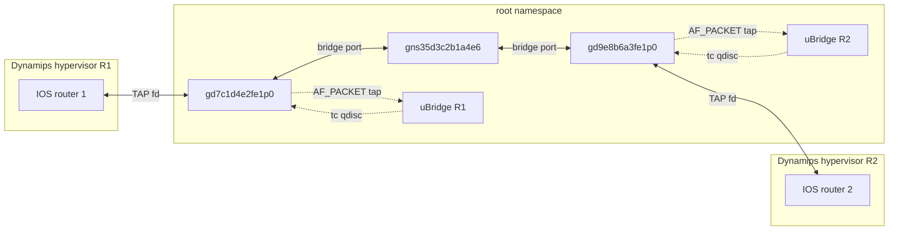
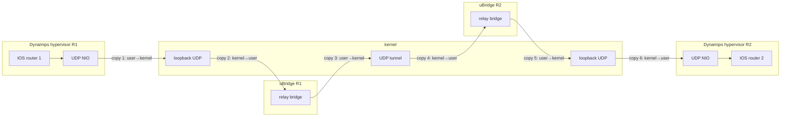
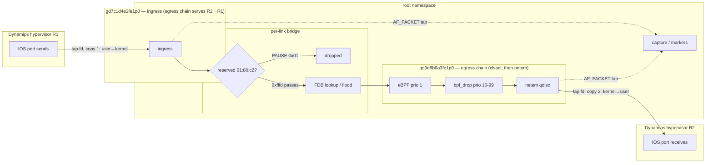
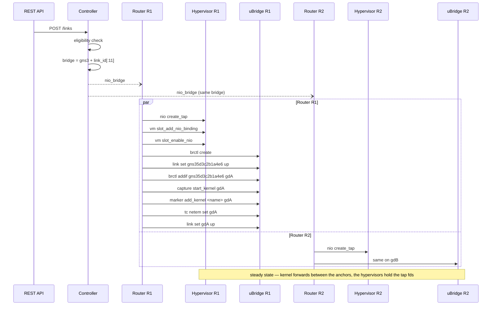

<!--
SPDX-License-Identifier: CC-BY-SA-4.0
See LICENSE file for licensing information.
-->

# Dynamips kernel datapath

Dynamips routers emulate every port inside the Dynamips process; on the relay datapath a link reaches a router through a UDP tunnel (a Dynamips `nio create_udp`, a loopback port pair, the node's uBridge relay, and the link's UDP NIOs). The kernel datapath replaces that segment with the same anchor model Docker, QEMU and IOU use: every **Ethernet slot/port** owns a persistent TAP (`gd{node_id[:8]}e{slot}p{port}`), created by the server through uBridge's tap module, and links attach to the anchor — a per-link Linux bridge enslaves it, tc impairments run on it, capture and markers anchor on it. The Dynamips **hypervisor** opens the TAP with `nio create_tap` (QEMU's move: an external process holds the fd), unprivileged because the server handed the device's ownership to its own user.

## Architecture

The diagram shows the e2e shape — two c7200 routers on one link (slot 1 port 0 each, a PA-2FE-TX — slot 0 is the c7200's fixed I/O slot), the topology `tests/e2e/test_dynamips_kernel_datapath.py` drives. A Dynamips↔Docker/QEMU/IOU link is the same shape with the peer's own anchor on the other side; a routed transit is two such links with IOS forwarding between them. Interface names follow the deterministic rules `gd{node_id[:8]}e{slot}p{port}` for the anchor TAPs and `gns3{link_id[:11]}` for the bridge; the concrete names in the diagrams use node ids `7c1d4e2f` / `9e8b6a3f` and link id prefix `5d3c2b1a4e6` (`gdA`/`gdB` shorthand in the sequence below). Terms the diagrams use:

| Term | Meaning |
|---|---|
| hypervisor | the Dynamips process emulating the router; it holds every anchor TAP's fd |
| anchor | the host-side interface a link attaches to — for Dynamips the `gd` persistent TAP, for Docker the `gv` veth host end |
| persistent TAP | the TAP created per Ethernet slot/port at node start (`tap create` + `tap set_owner`, ownership handed to the server user so the unprivileged hypervisor can open it); born DOWN, it outlives `vm stop` and hypervisor crashes |
| per-link bridge | the Linux bridge `gns3{link_id[:11]}` that stands in for the cable; the two anchors are its only ports |
| tap fd | a TAP's file descriptor: writes inject frames into the kernel as if the device received them, reads return frames the kernel transmits through the device (bridge-forwarded, toward the router) — the hypervisor opens it with `nio create_tap` and holds it for the port's lifetime |
| FDB | the bridge's forwarding database (learned MAC → port); unknown, broadcast and multicast destinations are flooded |
| `01:80:c2` / `group_fwd_mask` | the IEEE 802.1D reserved multicast range (STP, LACP, LLDP, 802.1X, PAUSE); the bridge forwards it only per the port's `group_fwd_mask` — `0xfffd` passes everything except PAUSE/PFC |
| `clsact` | the tc classifier carrier on the anchor; its egress chain is where the drop classifiers run |
| eBPF classifier | the stateful drop modes (every-Nth, quota, time window) at clsact egress prio 1 |
| `bpf_drop` | match-drop BPF expressions at clsact egress prio 10–99 |
| netem | the impairment qdisc behind clsact: delay, loss, rate, corrupt, duplicate, … |
| `AF_PACKET tap` | uBridge's packet socket on the anchor — how capture and markers observe frames off the forwarding path |
| carrier | the anchor's admin state (`link set up/down`); suspend is carrier down — traffic dead both ways |
| `nio_bridge` | the NIO record the controller posts to each endpoint node: bridge name, filters, markers, suspend flag |
| uBridge | the per-node helper process — on a kernel link it created the anchor, enslaves it and taps it, but never carries frames |



The only userspace crossings left are the Dynamips processes themselves — the routers *are* the emulation, and the hypervisor reads and writes the TAP directly (QEMU's external-fd-holder shape, no extra relay hop on the node leg unlike IOU's fabric). What the kernel datapath buys is the link segment: anchor → per-link bridge → peer anchor crosses entirely in the kernel, impairments run as kernel tc instead of userspace filters, and suspend maps to anchor admin-down. Each side's uBridge does its own tap-and-qdisc work on its node's anchor — but neither dashed edge is a steady fixture: the qdisc exists only while the link carries filters (deletion `tc reset`s it), the tap only while capture or markers run, and by convention only on the capture node's end, so an unfiltered, uncaptured link shows neither. The anchors themselves were created through uBridge at node start (Anchor lifecycle below).

The legacy relay is untouched: a port without a kernel link keeps its Dynamips UDP NIO and the node's uBridge relay tunnel exactly as before, and a kernel link binds the same port to its anchor instead — per port, no node-wide switch. The same R1 ↔ R2 link on the relay — one direction drawn, the reverse is the mirror image; this is the exact shape the negative control keeps when `enable_kernel_datapath = false` (Verified below). Each relay bridge is named `DYNAMIPS-{lport}-{rport}` after the loopback port pair its NIO allocates at link time:



Six kernel/user crossings each way, against the kernel datapath's two — and those two are the TAP-fd legs that are the emulation itself, so the relay's four extra copies are pure overhead. Userspace filters run inside the relay bridges, between copies 2-3 and 4-5. On a same-compute link the UDP tunnel rides loopback as drawn; cross-compute it rides the real network with the copy count unchanged.

Frame path for one R1 → R2 frame. The impairment chain fires on the egress of the *destination* end's anchor, in order clsact → netem (a classifier drop means netem never sees the frame); each direction is impaired exactly once and R2 → R1 is symmetric on gdA:



What each stage drops: the reserved-range gate passes LACP, LLDP, 802.1X and STP per the port mask but never PAUSE/PFC (Link-local frames below); the clsact/netem stages drop or impair per the installed filters (Capture, markers, filters below). The R2 → R1 reply is symmetric — its impairment points are `gd9e8b6a3fe1p0`'s egress (entering R2) and `gd7c1d4e2fe1p0`'s egress (entering R1) — so every direction is impaired exactly once, and `delay 100` adds one-way 100 ms per direction, ≈200 ms round trip (the e2e pins the lower bound: RTT ≥ 150 ms with 100% success). Copies 1-2 are the whole kernel/user bill — both are the TAP-fd legs of the emulation itself; the same frame on the relay datapath crosses six times (diagram above). The dashed sideband is uBridge's observation: capture and markers run as AF_PACKET taps on whichever end hosts them, cloning this frame at that anchor's stage — gdA's rx or gdB's tx — and a clsact-dropped frame never reaches the tap.

## Datapath selection

`UDPLink._kernel_datapath_eligible` extends the common rules with:

* the compute must report **`ubridge_tap`** — the anchors are uBridge-created TAPs the hypervisor merely opens, the same capability QEMU gates on; there is no Dynamips-specific one;
* **both ports must be Ethernet**. The controller's port matrix decides per port (the port's `link_type`); serial, ATM and POS ports keep the relay whatever the capabilities. Anchor creation on the compute side uses its own registry of Ethernet models — `ETHERNET_ADAPTERS` / `ETHERNET_WICS` in `compute/dynamips/adapters/adapter.py`, WIC-1ENET included at its Dynamips port number `16 * (wic_slot + 1)` — a name-keyed list kept in step with the controller's matrix by convention, not derivation.

## Link creation sequence

Both routers sit on the same compute (a kernel-link precondition) and each drives its own uBridge process; the hypervisor is one process per router. The sequence shows the running-router case — a router that is stopped stores the NIO and defers every step here to its next start (deferred wiring, below). The two node handlers attach concurrently and compute the same bridge name independently (a pure function of the link id), so either may win the `brctl create` race — the loser verifies the bridge exists (`brctl show`) and continues:



`nio create_tap`, `vm slot_add_nio_binding` and `vm slot_enable_nio` are the Dynamips-specific steps: the hypervisor opens the anchor and binds it to the slot/port before any bridge work, so a half-wired port never appears on the link. Capture, markers and `tc netem set` run only when the NIO carries them — a marker's real form is `marker add_kernel <name> <if> "<bpf>"`, `bpf` expressions arrive as `tc bpf_drop add`, the stateful modes as `tc nth/quota/window_drop` — and `brctl addif` is itself what opens the port's `group_fwd_mask` to `0xfffd` — the server sends no separate command for it (uBridge does have one, `brctl setportgroupfwd`, last-writer-wins against addif's default, which re-applies on every re-attach). The anchor's carrier stays down while the link is suspended. A link created while the router is **stopped** is stored and wired by the next start — the NIO simply waits in the slot adapter (deferred wiring, Anchor lifecycle below).

## Anchor lifecycle

* **Birth (node start)** — `_prepare_tap_datapath` probes the tap module (one create/delete cycle) and creates one persistent TAP per Ethernet slot/port, ownership handed to the server user, born DOWN. A stale leftover from a previous run is swept first; an anchor that already exists (restart) is kept — an anchor is never recreated under a live link. Serial/ATM/POS ports simply have no anchor.
* **Life** — a kernel link opens the anchor in the hypervisor (`nio create_tap`), binds it to the slot/port and enslaves it into the per-link bridge; removing the link unbinds the port, deletes the hypervisor's TAP NIO (releasing the fd) and tears the anchor out of the bridge. A link bound while the router is **stopped** is stored and wired by the next start (deferred wiring — the NIO simply waits in the slot adapter).
* **Death (node close)** — the fd holder releases before the devices are deleted, the order every node type uses: here the Dynamips hypervisor (not uBridge) holds the anchor fds, so its TAP NIOs go first (`nio delete` closes the fd), then `tap delete` per anchor, then the per-link kernel bridges, then uBridge itself.

**A stop is not a close.** `stop` only halts the emulated router: the hypervisor process — and with it the TAP fds, the port bindings and the per-link bridges — survives `vm stop` (the same reason a relay link's tunnel always survived a stop). Links therefore keep working through a stop/start with no re-wiring at all; the restart's attach pass skips every port that still has its TAP NIO. If the hypervisor died mid-flight (crash or kill), the persistent TAPs remain, but the node cannot simply be started again — `start()` speaks to the dead hypervisor and nothing respawns it; recovery is re-creating the node (a project reopen does it), where the stale anchors are swept and rebuilt and the controller re-posts the link NIOs.

## Link operations

| Operation | Kernel-datapath action |
|---|---|
| Create / attach | `nio create_tap` (hypervisor holds the fd) + `vm slot_add_nio_binding` + `brctl create` + `brctl addif` + carrier up + markers + `tc netem set` |
| Delete / detach | marker teardown → `tc reset` → carrier off → `brctl delif`/`brctl delete` → unbind + `nio delete` (release the fd) |
| Update (filters/markers/suspend changed) | reconcile on the anchor only — no re-binding, no re-enslaving |
| Suspend | anchor admin-down (traffic dead both ways) + resume restores |
| Adapter hot-add (OIR) | anchors for the new adapter's Ethernet ports created at once, so a kernel link can attach immediately |

## Capture, markers, filters

Capture on a kernel link is `capture start_kernel <anchor>`; markers ride the base reconcile with the anchor as the location (`marker add_kernel` — the shared KernelDatapathMixin machinery, no Dynamips-specific code); filters are one tc netem qdisc per anchor plus cls_bpf/eBPF drops. A relay port keeps its Dynamips NIO and the node's uBridge relay bridge (`DYNAMIPS-*`) with userspace filters, exactly as before.

## Link-local frames (LACP, LLDP, 802.1X, STP)

The bridge stands in for a cable, but the kernel's `br_handle_frame()` does not forward the IEEE 802.1D reserved range (`01:80:c2:00:00:00`-`0f`) by default — LACP, LLDP/DCBX and 802.1X would never cross a kernel link while the UDP relay carries them fine. uBridge therefore opens every port's per-port `group_fwd_mask` (`IFLA_BRPORT_GROUP_FWD_MASK`) to `0xfffd` at `brctl addif` time (Linux 4.15+, best-effort on older kernels). The bridge-level knob cannot do this: `BR_GROUPFWD_RESTRICTED` rejects bits 0-2, so LACP is reachable per port only.

Result on kernel links: ordinary multicast, STP/RSTP, LACP, 802.1X and LLDP/DCBX all cross; **802.3x PAUSE / PFC does not** — `case 0x01` in `br_handle_frame()` drops it unconditionally and no mask can enable it. That is a documented limit, not a regression (PFC's hardware semantics are out of emulation's reach anyway); a lab that needs PAUSE frames on the wire must use a relay link. Verified live by `tests/e2e/test_docker_link_local_frames.py` (per-MAC guest-to-guest matrix); the contract and kernel references live in `docs/design/ubridge-link-local-frame-forwarding-spec.md`.

## Relay fallback

A uBridge without the tap module keeps the node relay-only: `_prepare_tap_datapath` warns, no anchors are created, the warning says the node cannot carry kernel links, and every link keeps its `nio create_udp` tunnel. The controller never offers such a node a kernel link (capability unreported).

## Verified

Unit level (`tests/compute/dynamips/test_dynamips_kernel_datapath.py`): anchor topology (Ethernet models and WIC-1ENET port numbering only), the lifecycle (create/sweep/skip-existing), deferred wiring of NIOs bound while stopped, attach/update/remove command shapes on both datapaths, the idempotent re-attach across a restart, the stop order (hypervisor NIO delete before tap delete before brctl delete), capture and marker shapes, hot-added adapters, and the manager's `nio_bridge` construction. Plus the controller-eligibility cases (mixable with docker/qemu/iou, tap capability required, serial excluded) in `tests/controller/test_kernel_datapath_link.py`.

End-to-end (`tests/e2e/test_dynamips_kernel_datapath.py`, pytest marker `e2e`) on a live server with **two real c7200 routers on a real IOS image**, driven through the REST API and the IOS consoles with real ICMP:

* a link created while both routers are stopped selects the kernel datapath and is wired by node start (deferred wiring);
* the per-link kernel bridge on the host has exactly the two anchor TAPs enslaved; `show ip int brief` is up/up and ping R1→R2 succeeds;
* `delay 100` ⇒ netem qdisc visible on both anchors and the ping RTT grows by ~200 ms (one-way 100 per direction, each anchor's egress chain impairing the direction entering its own router); clearing resets the qdiscs and the RTT;
* suspend ⇒ anchor administratively down, ping 0%; resume restores both;
* capture writes a pcap full of ICMP-over-Ethernet records;
* a **serial** link between the same two routers stays on the relay (per-port exclusion) and pings over it — the relay regression net;
* link delete/re-create: the bridge goes and comes back, the anchors survive, traffic resumes;
* router stop/start keeps the wiring intact (bridge membership unchanged — the no-duplicate-NIO half is the unit-tested idempotent re-attach) and traffic resumes after the reboot;
* deleting the project removes every anchor and bridge.

`test_dynamips_relay_control` is the negative control: the same topology on an isolated relay-configured instance (`enable_kernel_datapath = false`) has no per-link bridge and nothing enslaved, and still pings — so the kernel objects above can only come from the kernel datapath.

## Configuration

```ini
[Server]
# Wire eligible links (same compute, both endpoints Ethernet and able to
# anchor) through kernel interfaces instead of the uBridge UDP relay.
enable_kernel_datapath = True
```

## Roadmap

The Ethernet switch has landed (see `ethernet-switch-kernel-datapath.md` — it absorbs the peer's anchor into its own kernel bridge, and switch-to-switch cascades with it), and so has the IOL runner container (`iol-docker-kernel-datapath.md`). Every router and switch node type now anchors; VPCS, the hub, the cloud and the NAT node stay on the relay by design. Cross-compute kernel links need VXLAN/GENEVE encapsulation — a separate, still-deferred project.
