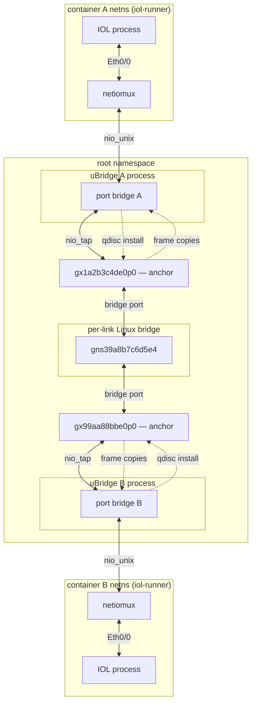
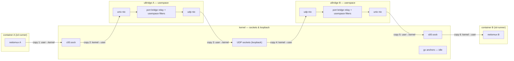
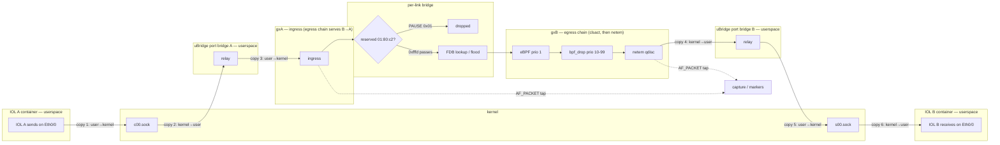
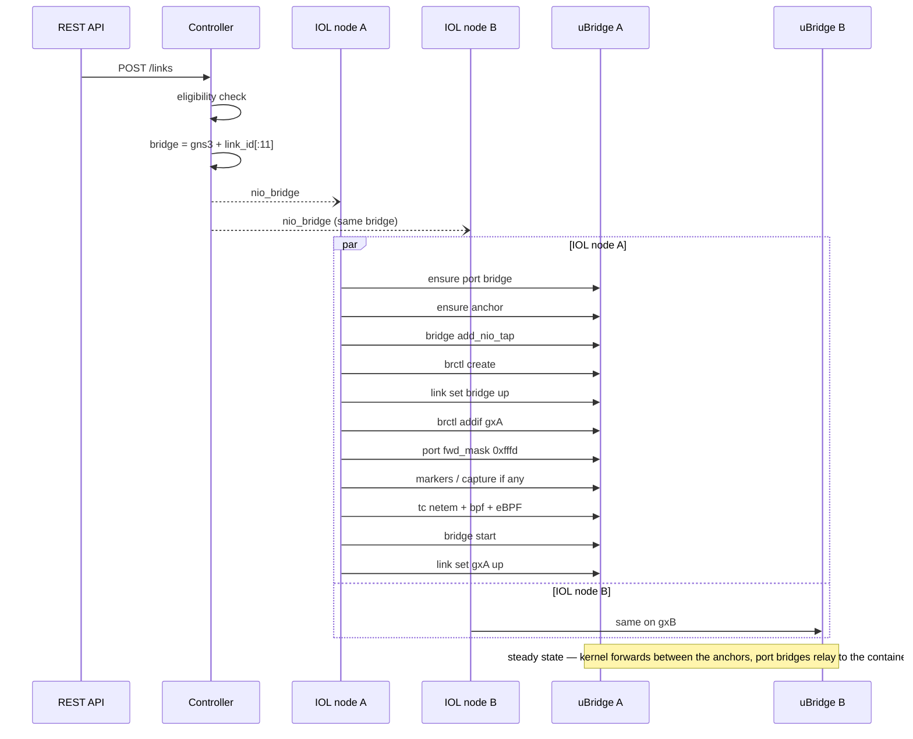

<!--
SPDX-License-Identifier: CC-BY-SA-4.0
See LICENSE file for licensing information.
-->

> This documentation is AI-generated with reference to actual code and verified against real-kernel testing. AI can make mistakes — please verify against the source code when in doubt.

# IOL runner container kernel datapath

## Overview

IOL runner containers (`IOLDockerVM`, selected by the `GNS3_IOL_RUNNER` environment marker — the Cisco CML `iol-runner` images such as `iol-xe/iol-xe:17-18-02`) have no container-namespace networking at all: their guest leg is the runner's per-interface AF_UNIX datagram socket pairs. A unix socket is not a kernel interface, so until now every link of such a container rode the uBridge userspace relay (unix ↔ UDP).

The kernel datapath gives every Ethernet bay/unit a **persistent TAP anchor** (`gx` names, born at node start exactly like IOU's) and wires the *link segment* through the kernel. One userspace hop on the container leg is irreducible — the socket pair is the only physical layer the runner exposes — but the anchor → per-link bridge → peer anchor crossing, the kernel filters, the suspend carrier and the AF_PACKET capture/markers are all native now.

The port bridge is the deployment shape ubridge's `doc/gns3server-integration.md` § *bridge — generic NIO relay with a swappable TAP leg* froze: a per-node bridge created at start, the unix NIO in the first slot for the node's whole life, the topology leg in the second — `add_nio_udp` (relay) or `add_nio_tap` (kernel link) — swapped as links are attached, suspended, deleted or the project reopens, through stop → delete → add → start. The c-socket binding never re-binds across a swap: frames the container sends while the bridge is stopped queue on the socket and relay after `start` (regression-tested in ubridge's bridge suite).

## Architecture

Kernel link between two IOL runner containers on the same compute. Interface names follow the shared deterministic rules — `gx{node_id[:8]}e{bay}p{unit}` for the persistent TAP anchors (one per Ethernet bay/unit) and `gns3{link_id[:11]}` for the bridge; the concrete names in the diagrams use node ids `1a2b3c4d` / `99aa88bb`, Ethernet0/0 on both, and link id prefix `9a8b7c6d5e4`. Terms the diagrams use:

| Term | Meaning |
|---|---|
| netiomux | the runner's network agent: one AF_UNIX datagram socket pair per interface, carrying raw Ethernet frames |
| `sNN.sock` / `cNN.sock` | the interface's socket pair (`NN = bay×4 + unit`): frames sent to `s` are injected into the guest, the guest's egress arrives on `c` |
| wiring dir | the host-side directory bind-mounted at the container's `/tmp` (`$XDG_RUNTIME_DIR/gns3/unixio/<node-id>`) — the same socket files on both sides, short enough for the 107-byte `sun_path` cap |
| uBridge | the per-node helper process gns3-server spawns; its hypervisor command surface executes all host-side wiring (anchors, bridges, carrier, tc, taps) — and, unique to this node type, it also carries frames: the socket guest leg has no kernel form |
| port bridge | the per-bay/unit uBridge bridge (`bridge{bay}_{unit}`): `nio_unix` in its first slot for the node's whole life, the topology leg — `nio_tap` (kernel link) or `nio_udp` (relay) — in the second |
| anchor | the persistent TAP `gx…` a link attaches to: born at node start, DOWN, its fd held by the port bridge while a kernel link binds the port |
| per-link bridge | the Linux bridge `gns3{link_id[:11]}` that stands in for the cable; the two anchors are its only ports |
| bridge port | an interface enslaved to a Linux bridge (`brctl addif`) — it no longer sends or receives on its own: frames arriving on it go to the bridge's forwarding logic, and the bridge transmits through it |
| FDB | the bridge's forwarding database (learned MAC → port); unknown, broadcast and multicast destinations are flooded |
| `01:80:c2` / `group_fwd_mask` | the IEEE 802.1D reserved multicast range (STP, LACP, LLDP, 802.1X, PAUSE); the bridge forwards it only per the port's `group_fwd_mask` — `0xfffd` passes everything except PAUSE/PFC |
| tc / qdisc | traffic-control objects the kernel inserts into the anchor's egress path — stages frames pass through in flight, not external packet consumers; uBridge only installs them over netlink |
| `clsact` | the tc classifier carrier on the anchor; its egress chain is where the drop classifiers run |
| eBPF classifier | the stateful drop modes (every-Nth, quota, time window) at clsact egress prio 1 |
| `bpf_drop` | match-drop BPF expressions at clsact egress prio 10–99 |
| netem | the impairment qdisc behind clsact: delay, loss, rate, corrupt, duplicate, … |
| `AF_PACKET tap` | uBridge's packet socket bound to the anchor; the kernel clones every frame the interface sends or receives to it (the tcpdump mechanism) — read-only copies for capture and markers, the original stays on the kernel path |
| carrier | the anchor's admin state (`link set up/down`); suspend is carrier down on both anchors = 100 % loss |
| `nio_bridge` | the NIO record the controller sends each compute: bridge name, filters, markers, suspend flag |



Everything in the root namespace is built the same way: gns3-server creates the anchor TAPs at node start, the per-link bridge and its memberships at link creation, and every later change (carrier, capture, markers, filters) by sending hypervisor commands to the node's uBridge process. That build flow is the Link operations sequence below; this diagram is the steady state that remains.

The solid chain is the frame path, and it passes through the port bridges — the one userspace hop per container leg the socket pair forces, and the only one on the whole path; unlike the Docker veth datapath, where uBridge sits entirely off the forwarding path, here it is on it. The dashed edges are control and observation: `qdisc install` is the port bridge configuring the kernel over netlink (the kernel then runs those qdiscs in-flight on the anchor's egress — stages of the transmit path, not packet consumers), and `frame copies` is the AF_PACKET tap — read-only clones for capture and markers. Everything sideband is keyed on the anchor's interface name, which is why a TAP anchor and a veth host end are interchangeable in the shared mixin (`gns3server/compute/kernel_datapath.py`).

Relay link (what a missing capability, a cross-compute peer or `enable_kernel_datapath = off` falls back to — same sockets, same port bridge, only the topology leg changes):



Drawn one-way; the reverse direction is the mirror image. The IOL relay crosses the kernel/user boundary **six times each way** — but four of them are the socket guest leg itself, paid identically on the kernel datapath (six there too): unlike Docker's four-against-zero, the crossing count is datapath-invariant here, and the choice swaps only the middle two — loopback UDP between the port bridges (filters userspace, at them) for the per-link bridge between the anchors (filters as tc, on them).

Two further contrasts with Docker's relay: the IOL relay's local leg is the unix NIO itself, so the anchors never appear on the path (idle from birth — a Docker relay attaches to the *same* veth host end the kernel link enslaves); and the port bridge's first slot is shared with the kernel datapath — the unix NIO and its c-socket binding survive every leg swap, so frames the container sends while the bridge is stopped for a swap queue on the socket and relay after `start`. On this datapath suspend rides the synthetic frequency_drop filter (the kernel datapath's suspend is the anchor's admin state).

Frame path for one A → B frame, with the relay diagram's copy numbering: copies 1, 2, 5 and 6 are the socket guest legs and are paid identically on both datapaths — only the middle two swap (TAP fd write/read here, loopback UDP there). The impairment chain fires on the egress of the *destination* anchor, in order clsact → netem (a classifier drop means netem never sees the frame); each direction is impaired exactly once and B → A is symmetric on gxA's egress chain — hence `delay 100` doubles the RTT (measured ≥ 150 ms):



The reserved-range gate passes LACP, LLDP, 802.1X and STP per the port mask but never PAUSE/PFC (Link-local frames below); the clsact/netem stages drop or impair per the installed filters (Capture, markers, filters below). The AF_PACKET taps observe both anchors but never a clsact-dropped frame.

## Datapath selection

`UDPLink._kernel_datapath_eligible` treats an IOL runner container like any Docker node (same compute, Ethernet port) with one gate of its own in `_kernel_endpoint_ready`: the compute must report both

* `ubridge_tap` — the tap module (`tap create`/`tap delete`), the same capability QEMU and Dynamips gate on, and
* `ubridge_bridge_tap` — `bridge delete_nio_tap`, the swappable-leg command (probed with one command against a bridge that cannot exist: 202 = old build, 214 = new; no scratch objects, no capabilities, cached by binary identity like every other probe).

Both strict `True`; anything unreported (old uBridge, failed probe) keeps the link on the relay, where it always works. The generic `GNS3_UNIX_SOCKET_NIO` containers stay excluded as before — that marker's semantics are image-specific, while `GNS3_IOL_RUNNER` selects a class whose anchors this server owns.

## Anchor lifecycle

* **Birth (node start, before any link)** — `_start_ubridge` runs `_prepare_tap_datapath` right after the hypervisor connects: probe both capabilities, then for every (bay, unit 0-3) sweep a leftover (`tap delete`, suppressed), `tap create` (hardened, starts DOWN) and `link set down` — carrier off until a link attaches. The anchors exist whether or not any link ever uses them: an anchor born with its link would leave the Ethernet switch fast path's deferred join waiting forever. No `tap set_owner`: uBridge itself holds these fds.
* **Life** — the anchor is never recreated. Link create/delete/switch, suspend, capture and markers only change what is attached to it, and the ensure-then-add contract guards the one window where the device could have been swept (`/sys/class/net` existence check — `tap create` is strictly create-only, `IFF_TUN_EXCL`, and refuses an existing device with EBUSY).
* **Death (node stop)** — the port bridges hold the anchor fds (`bridge add_nio_tap`), so they are deleted first (`bridge delete` stops their relay threads and frees the NIOs), then the anchors themselves (`tap delete` answers EBADFD on a device another fd still holds), then the per-link kernel bridges — all while the control channel lives, before the hypervisor stops. A restart recreates everything from the NIO.

## Link operations

Both endpoints attach concurrently and compute the same bridge name independently (a pure function of the link id), so either may win the `brctl create` race — the loser verifies the bridge exists (`brctl show`) and continues:



Every arrow to uBridge is one `_ubridge_send` command line on the node's local hypervisor console; uBridge executes it (netlink/ioctl) and replies OK or an error synchronously before the next command is sent — those replies are omitted for brevity. uBridge never initiates anything: it is a pure executor, and the only data ever flowing back (capture/marker frame copies) rides separate AF_PACKET sockets, not this console.

The attach above is `_attach_kernel_link`; its ensures are the frozen ensure-then-add contract: the port bridge (`bridge create` + `add_nio_unix`) comes from the node's start loop or is created here, and `tap create` runs only when `/sys/class/net` shows the anchor missing — it is strictly create-only (`IFF_TUN_EXCL`) and answers EBUSY on the device the start loop just made. `bridge add_nio_tap` is what opens and holds the anchor fd, `bridge start` starts the [unix ↔ tap] relay, and the final `link set up` is the carrier pass that brings the born-down anchor up (a suspended NIO sets it back down).

* **Link delete** (`_release_port_tap`): `bridge stop` (delete_nio_tap refuses while running — the relay threads hold the NIO pointers for their whole life; freeing under them is a use-after-free) → `bridge delete_nio_tap <bridge> "<tap>"` (matched on the kernel-resolved name) → the mixin teardown (markers, tc reset, `brctl delif`, per-link bridge deletion). The anchor survives — the node owns it, not the link.
* **Relay link** — unchanged: the port bridge's second leg is `add_nio_udp`, userspace filters at the port bridge. The unix NIO stays in its slot across every datapath switch.

## Capture, markers, filters

Inherited from `KernelDatapathMixin` unchanged — everything is keyed on the anchor interface name, which is why a TAP and a veth host end are interchangeable there: `capture start_kernel` / `marker add_kernel` (AF_PACKET), one tc netem qdisc (the full netem surface plus the extensions), `bpf` as cls_bpf match-drop, `frequency_drop`/`quota`/`window_drop` as the eBPF stateful classifier — all capability-gated per compute exactly like the Docker veth datapath (the filter semantics live in `docker-kernel-datapath.md`).

Suspend semantics: anchor admin-down. The port bridge's TAP writes fail EIO (tolerated by the delivered uBridge hardening) and its reads fall silent — traffic stops both ways. The runner itself is unaware of the link state (netiomux has no carrier signal), exactly as on the relay datapath where suspend rode the synthetic frequency_drop filter instead.

## Link-local frames (LACP, LLDP, 802.1X, STP)

The bridge stands in for a cable, but the kernel's `br_handle_frame()` does not forward the IEEE 802.1D reserved range (`01:80:c2:00:00:00`-`0f`) by default — LACP, LLDP/DCBX and 802.1X would never cross a kernel link while the UDP relay carries them fine. uBridge therefore opens every port's per-port `group_fwd_mask` (`IFLA_BRPORT_GROUP_FWD_MASK`) to `0xfffd` at `brctl addif` time (Linux 4.15+, best-effort on older kernels). The bridge-level knob cannot do this: `BR_GROUPFWD_RESTRICTED` rejects bits 0-2, so LACP is reachable per port only.

Result on kernel links: ordinary multicast, STP/RSTP, LACP, 802.1X and LLDP/DCBX all cross; **802.3x PAUSE / PFC does not** — `case 0x01` in `br_handle_frame()` drops it unconditionally and no mask can enable it. That is a documented limit, not a regression (PFC's hardware semantics are out of emulation's reach anyway); a lab that needs PAUSE frames on the wire must use a relay link. Verified live by `tests/e2e/test_docker_link_local_frames.py` (per-MAC guest-to-guest matrix); the contract and kernel references live in `docs/design/ubridge-link-local-frame-forwarding-spec.md`.

## Relay fallback

Missing either capability, the node runs relay-only: links ride unix ↔ UDP, `kernel_datapath` stays false, and anchors are simply never created (or, with `enable_kernel_datapath` off server-wide, created but never attached — the same semantics as QEMU's and Dynamips' anchors).

## Verified

Live on the real server (`tests/e2e/test_iol_docker_kernel_datapath.py`, isolated instance, real `iol-xe/iol-xe:17-18-02` images, real uBridge with `bridge delete_nio_tap`):

* kernel link reports `kernel_datapath`, anchors exist from node start, the per-link bridge enslaves exactly the two of them;
* real ICMP crosses the [unix ↔ tap] port-bridge relay (100 % ping);
* the L2-anchor spec §E.2 silence window with the guests shut — the behavioral half of the hardening on anchors created by uBridge's bridge TAP module (`bridge add_nio_tap`);
* `delay 100` lands as netem on both anchors, measured RTT grows ≥ 150 ms and returns < 50 ms when cleared;
* the classifier spot check on a TAP anchor (the Docker suite runs the full matrix on veth host ends): `bpf "icmp"` drops everything (clsact on the anchor), `frequency_drop 3` as the eBPF every-nth mode measured 56 % round-trip loss (theory 55.6 %), both restoring on clear;
* suspend admin-downs the anchor and kills the traffic; resume restores;
* AF_PACKET capture writes a real pcap of the ICMP exchange;
* link delete/re-create swaps the port bridge's TAP leg out and back in (unix binding never re-binds) with the ping returning;
* node stop tears the anchors down (no `gx` devices left), a restart recreates the whole wiring from the NIO;
* project delete leaves no anchors and no bridges; the relay control on a relay-configured instance keeps the link off the kernel and still pings.

Also caught and fixed live: `tap create` is strictly create-only (`IFF_TUN_EXCL`) — the ensure-then-add guard must check existence first (`/sys/class/net`), not re-create unconditionally (EBUSY on the device the start loop just made).

## Configuration

```
[Server]
enable_kernel_datapath = True   # the global switch (link attachment)
```

The anchor lifecycle needs no configuration of its own — the capability probes decide per compute, and an IOL runner container without them simply never anchors.

## Roadmap

Cross-compute kernel links need VXLAN/GENEVE encapsulation — deferred until every node type is kernelized; with the IOL runner container anchored, that condition is one project away from met.
