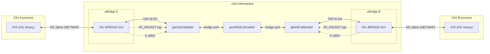
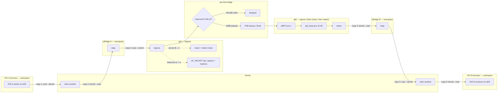
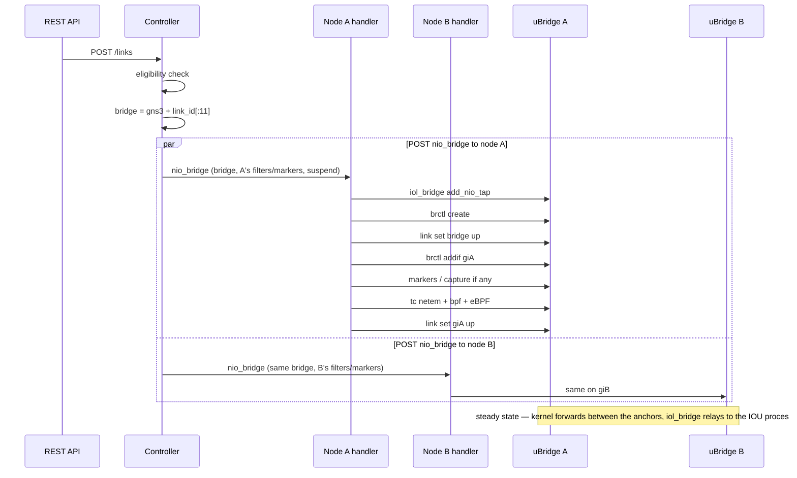

<!--
SPDX-License-Identifier: CC-BY-SA-4.0
See LICENSE file for licensing information.
-->

# IOU kernel datapath

IOU's only physical layer is the Unix-datagram IOL fabric (`/tmp/netio<uid>/`, 8-byte IOL headers, NETMAP), so it has no host netdev to enslave — a kernel link instead gives each **Ethernet bay/unit** a persistent TAP anchor (`gi{node_id[:8]}e{bay}p{unit}`), and uBridge's `iol_bridge` (the fake IOL instance the NETMAP maps to) binds the port to that TAP with `iol_bridge add_nio_tap`. Links then attach to the anchor exactly as they do for Docker (veth) and QEMU (TAP): a per-link Linux bridge enslaves it, tc impairments run on it, capture and markers anchor on it. The uBridge capability is specified in `docs/design/ubridge-iol-tap-anchor-spec.md` and delivered by the `feature/iol-tap-anchor` branch of the ubridge fork.

Serial bays never anchor (a TAP carries Ethernet frames): serial links stay on the relay datapath whatever the compute's capabilities.

## Architecture

The diagram shows the native shape — two IOU devices linked on the kernel datapath, the scenario the e2e suite drives. A Docker or QEMU peer on the far end is the same link segment with a different anchor (a `gv` veth host end or a `gq` TAP — see `docker-kernel-datapath.md`); each IOU still terminates its own fabric in its own uBridge. Interface names follow the deterministic rules `gi{node_id[:8]}e{bay}p{unit}` for the anchors and `gns3{link_id[:11]}` for the per-link bridge; the concrete names in the diagrams use node ids `a1b2c3d4` / `5e6f7a8b` (IOU A/B), link id prefix `5d3c2b1a4e6`, and application ids 1 / 2 (so the fake instances are `IOL-BRIDGE-513` / `IOL-BRIDGE-514`). Terms the diagrams use:

| Term | Meaning |
|---|---|
| IOL fabric | the `/tmp/netio<uid>/` unix-datagram mailboxes — one directory shared by every IOU node on the host, namespaced by IOL id; every frame carries an 8-byte IOL header |
| NETMAP | the per-node redirect table pointing a port's fabric traffic at another IOL id — here uBridge's fake instance |
| `iol_bridge` | uBridge's fake IOL instance — one per node, named `IOL-BRIDGE-{application_id + 512}` (the NETMAP redirects the node's own id to it); one listener thread per bound port, and it holds the anchor TAP fds |
| anchor | the host-side interface a link attaches to — here the `gi` persistent TAP; a Docker peer's `gv` veth host end or a QEMU `gq` TAP is interchangeable as the other port |
| persistent TAP | the TAP created per Ethernet bay/unit at node start (`tap create`): born DOWN, address-free, 4 units per bay (as many bays as the node has Ethernet adapters) |
| per-link bridge | the Linux bridge `gns3{link_id[:11]}` that stands in for the cable; the two anchors are its only ports |
| tap fd | a TAP's file descriptor: reads return frames the kernel received on the device, writes inject frames into it — on this datapath the `iol_bridge` listener holds it |
| FDB | the bridge's forwarding database (learned MAC → port); unknown, broadcast and multicast destinations are flooded |
| `01:80:c2` / `group_fwd_mask` | the IEEE 802.1D reserved multicast range (STP, LACP, LLDP, 802.1X, PAUSE); the bridge forwards it only per the port's `group_fwd_mask` — `0xfffd` passes everything except PAUSE/PFC |
| `clsact` | the tc classifier carrier on the anchor; its egress chain is where the drop classifiers run |
| eBPF classifier | the stateful drop modes (every-Nth, quota, time window) at clsact egress prio 1 |
| `bpf_drop` | match-drop BPF expressions at clsact egress prio 10–99 |
| netem | the impairment qdisc behind clsact: delay, loss, rate, corrupt, duplicate, … |
| `AF_PACKET tap` | uBridge's packet socket on the anchor — how capture and markers observe frames off the forwarding path |
| carrier | the anchor's admin state (`link set up/down`); suspend is carrier down — a down TAP answers EIO in both fd directions (writes drop the frame; the §B hardening tolerates both) |



Unlike the Docker veth datapath, where uBridge sits off the forwarding path and only taps, here each node's uBridge is **on** it: the `iol_bridge` listener terminates the fabric and relays frames between the mailboxes and the anchor TAP fd. That one userspace hop per leg is **irreducible** — the fabric is Unix sockets, so frames always cross fabric → listener thread → TAP fd. What the kernel datapath buys is the **link segment**: anchor → per-link bridge → peer anchor crosses entirely in the kernel (including IOU ↔ Docker/QEMU links), impairments run as kernel tc instead of the userspace delay line (the known blocking-nanosleep RTT defect), and suspend maps to anchor admin-down (writes to a down TAP fail EIO and are dropped by the delivered §B hardening). Direction semantics on the anchor match QEMU's exactly: uBridge holds the fd like the QEMU process does.

Relay link between the same two nodes (what an old uBridge build, a serial port or `enable_kernel_datapath` off falls back to; a cross-compute peer is the same tunnel with the far socket on the real network instead of loopback): each port rides a UDP NIO inside its `iol_bridge` and no kernel interface exists — anchors untouched, filters/capture/markers on the port's userspace list:

```mermaid
flowchart LR
    subgraph IOPA["IOU A process — userspace"]
        iosA["IOS (IOL binary)"]
    end
    subgraph KERN["kernel"]
        mbxA["netio sockets"]
        UDP["UDP sockets (loopback)"]
        mbxB["netio sockets"]
    end
    subgraph UBA["uBridge A — userspace"]
        ioA["IOL nio"]
        enA["relay + userspace filters"]
        nuA["UDP nio"]
    end
    subgraph UBB["uBridge B — userspace"]
        nuB["UDP nio"]
        enB["relay + userspace filters"]
        ioB["IOL nio"]
    end
    subgraph IOPB["IOU B process — userspace"]
        iosB["IOS (IOL binary)"]
    end
    iosA -->|"copy 1: user→kernel"| mbxA
    mbxA -->|"copy 2: kernel→user"| ioA
    ioA --> enA --> nuA
    nuA -->|"copy 3: user→kernel"| UDP
    UDP -->|"copy 4: kernel→user"| nuB
    nuB --> enB --> ioB
    ioB -->|"copy 5: user→kernel"| mbxB
    mbxB -->|"copy 6: kernel→user"| iosB
```



Drawn one-way; the reverse direction is the mirror image. A relayed frame crosses the kernel/user boundary **six times each way** (twelve per round trip — each `sendto` copies user→kernel, each `recvfrom` kernel→user), the UDP hop additionally traversing the protocol stack twice; the relay's filters run in userspace on the frames between the copies.

Frame path for one A → B frame (`giA` = `gia1b2c3de0p0`, `giB` = `gi5e6f7a8be0p0`). The controller ships the same filter dict to **both** endpoints, so the link carries **two impairment points** — each anchor's egress chain — but a one-way frame crosses exactly one of them: the destination anchor's, in order clsact → netem (a classifier drop means netem never sees the frame). The asymmetry is the trace's, not the configuration's — both anchors carry the identical chain: the frame enters the kernel at the sender's anchor **ingress** (the TAP-fd write; this datapath installs nothing on ingress), and the bridge's forward out of the far anchor is an **egress** transmission, which is where the tc chain sits. B → A is symmetric on giA. Capture and markers are the observation point: one AF_PACKET tap at whichever end captures, seeing **both** directions through its anchor:



What each stage drops: the reserved-range gate passes LACP, LLDP, 802.1X and STP per the port mask but never PAUSE/PFC (Link-local frames below); the clsact/netem stages drop or impair per the installed filters (Capture, markers, filters below); the AF_PACKET tap — capture and markers ride it, installed at whichever end captures — observes both directions of the link through its anchor (tx/rx signal pairs) but never a clsact-dropped frame. The crossings do not disappear on this datapath: each leg still crosses the kernel/user boundary three times (`sendto`/`recvfrom` on the fabric, then the TAP write — the B leg mirrors them, six per one-way frame, the same count as the relay); what moves into the kernel is the link segment — no UDP tunnel, no protocol-stack pass — and with it the impairment chain. A fabric → anchor → bridge → anchor → fabric round trip measures ≈0.2 ms (Verified below).

## Datapath selection

`UDPLink._kernel_datapath_eligible` extends the Docker/QEMU rules with:

* the compute must report **`ubridge_iol_tap`** (its own capability: the tap module and `iol_bridge add_nio_tap` land independently, and either can be missing on an old build). Probed by running one add/delete cycle on a scratch bridge + scratch TAP (`probe_iol_tap_support`, cached by binary identity, scratch bridge id 1050 — above the per-node id space 513..1024 the fabric locks); any failure means unknown → relay;
* **both linked ports must be Ethernet** — an IOU serial port disqualifies the kernel path per-port, not per-node, so serial links between capable IOU nodes silently stay on the relay instead of failing at the compute.

The NIO schema on the compute NIO routes accepts `nio_bridge` alongside the UDP/TAP/Ethernet NIOs (the same widening QEMU needed — without it, the controller's NIO POST is 422'd before the node ever sees it).

## Link creation sequence

Both endpoints sit on the **same compute** (a kernel-link prerequisite). The controller derives the bridge name once from the link id and ships one `nio_bridge` record to each endpoint — same bridge name, each side's own filters/markers and the suspend flag — the two POSTs overlapping (`asyncio.gather`, either failure rolls the peer back). The bridge has no owner: both sides race `brctl create` (EEXIST tolerated, the loser verifies via `brctl show`). The anchors already exist, born at node start (Anchor lifecycle below), so attaching only binds and enslaves:



`iol_bridge add_nio_tap <bridge> <iol_id> <bay> <unit> "<tap>"` is the one IOU-specific step: it binds the fabric port to the anchor and hands uBridge the TAP fd. Deletion reverses it in miniature — markers, tc reset, delif, `brctl delete`, then `iol_bridge delete_nio_tap` releases the fd while the control channel lives (Link operations below).

## Anchor lifecycle — and why the stop order is QEMU's reverse

* **Birth (node start)** — `_prepare_tap_datapath` probes the capability and creates one persistent TAP per Ethernet bay/unit (4 units per bay, swept for stale leftovers first, born DOWN). uBridge holds a device's fd only while a kernel link binds the port; until then the TAP has no holder.
* **Life** — the TAP is never recreated. A kernel link adds `iol_bridge add_nio_tap <bridge> <iol_id> <bay> <unit> <tap>` then enslaves the anchor (`_kernel_attach`); a relay link keeps `iol_bridge add_nio_udp` and never touches the anchor. Switching a port between datapaths is just an NIO swap — the IOL port frees its previous NIO (fd or socket) on attach.
* **Death (node stop)** — `_stop_ubridge` runs the cleanup **in the reverse order of QEMU's**, because here uBridge itself holds the anchor fds: `iol_bridge delete` (releases every port's TAP fd) → `tap delete` per anchor (a held TAP answers EBADFD/207) → `brctl delete` for per-link bridges still held → stop the hypervisor. Removing a single kernel link does the same in miniature: `_remove_kernel_nio` (markers, tc reset, delif, brctl delete) then `iol_bridge delete_nio_tap` — releasing the fd while the control channel lives.

## Link operations

| Operation | Kernel-datapath action |
|---|---|
| Create / attach | `iol_bridge add_nio_tap` (bind port ↔ anchor, uBridge holds the fd) + `brctl create` (EEXIST tolerated) + `link set <bridge> up` + `brctl addif` + markers + `tc netem set` + carrier up |
| Delete / detach | marker teardown → `tc reset <tap>` → carrier off → `brctl delif`/`brctl delete` (last endpoint wins) → `iol_bridge delete_nio_tap` (release the fd; the device survives) |
| Update (filters/markers changed) | reconcile on the anchor only — no re-binding, no re-enslaving |
| Suspend | anchor admin-down (TAP-fd writes fail EIO → dropped; reads answer EIO too — the §B hardening tolerates both) + resume restores |

## Capture, markers, filters

Capture on a kernel link is `capture start_kernel <tap>` (driven by the NIO type); markers ride the base reconcile with the anchor as the location — IOU's marker primitives are polymorphic (`marker add_kernel/enable_kernel/delete_kernel` on an anchor, `iol_bridge … mark` on an IOL location), which let the old IOU-specific reconcile override be deleted outright. Filters are one tc netem qdisc per anchor plus cls_bpf/eBPF drops — the port's userspace `iol_bridge add_packet_filter` filters carry relay links only and are never combined with tc on the same port.

## Link-local frames (LACP, LLDP, 802.1X, STP)

The bridge stands in for a cable, but the kernel's `br_handle_frame()` does not forward the IEEE 802.1D reserved range (`01:80:c2:00:00:00`-`0f`) by default — LACP, LLDP/DCBX and 802.1X would never cross a kernel link while the UDP relay carries them fine. uBridge therefore opens every port's per-port `group_fwd_mask` (`IFLA_BRPORT_GROUP_FWD_MASK`) to `0xfffd` at `brctl addif` time (Linux 4.15+, best-effort on older kernels). The bridge-level knob cannot do this: `BR_GROUPFWD_RESTRICTED` rejects bits 0-2, so LACP is reachable per port only.

Result on kernel links: ordinary multicast, STP/RSTP, LACP, 802.1X and LLDP/DCBX all cross; **802.3x PAUSE / PFC does not** — `case 0x01` in `br_handle_frame()` drops it unconditionally and no mask can enable it. That is a documented limit, not a regression (PFC's hardware semantics are out of emulation's reach anyway); a lab that needs PAUSE frames on the wire must use a relay link. Verified live by `tests/e2e/test_docker_link_local_frames.py` (per-MAC guest-to-guest matrix, driven on the Docker datapath — the same per-link-bridge mechanism; the IOU e2e does not repeat it); the contract and kernel references live in `docs/design/ubridge-link-local-frame-forwarding-spec.md`.

## Relay fallback

A uBridge without `iol_bridge add_nio_tap` (old build) keeps the node on the relay datapath unchanged: every link rides `iol_bridge add_nio_udp`, the node starts fine, and the warning says it cannot carry kernel links. The controller never offers such a node a kernel link (capability unreported).

## Verified

Unit level: anchor lifecycle and naming, kernel/relay binding on add, update and remove, the stop order (iol_bridge delete before tap delete before brctl delete before hypervisor stop), `_networking` on restart with mixed kernel/relay ports, capture and marker command shapes on both datapaths, the capability probe (cycle, old-build fallback, cleanup, caching), capability plumbing, and controller eligibility (per-compute capability, its independence from `ubridge_tap`, serial-port exclusion).

End-to-end on a live server (isolated instance, two IOU nodes behind a fake ELF image, the test playing the IOL fabric on `/tmp/netio<uid>/` and pushing frames through it): **64/64 checks** on the kernel datapath and **62/62** on the relay (`enable_kernel_datapath = false`). Kernel highlights:

* 8 anchors per node (2 bays × 4 units), persistent, DOWN, address-free; `link_list` reports `kernel_datapath: true` and one per-link bridge holds both anchors with `brport/state = 3`;
* fabric → anchor → bridge → anchor → fabric in both directions at ~0.2 ms; `delay 100` ⇒ netem on both anchors and a measured **100.5 ms** one-way;
* suspend ⇒ anchor DOWN, no traffic, resume ⇒ 100.4 ms with the qdisc intact;
* capture ⇒ a 328-byte pcap written by `capture start_kernel`;
* link delete ⇒ bridge gone, qdisc clean, anchor alive, re-create at 0.6 ms;
* a **serial** link between the same two capable nodes stays on the relay (`kernel_datapath: false`) — per-port exclusion, not per-node;
* single-sided restart ⇒ stopped node's anchors removed, peer's kept, link re-attached from the NIO (0.3 ms); stop ⇒ no stray anchors, bridges or fabric sockets.

The relay run exercises the same lifecycle with the IOL UDP NIOs (no tc qdiscs, userspace `delay` at 100.7 ms, suspend via the synthetic frequency_drop, `iol_bridge start_capture`), which is also the regression net for the port-coordinate capture restore this work touched.

The repository's live e2e suite carries the same scenario with **real IOU routers** (`tests/e2e/test_iou_kernel_datapath.py`, pytest marker `e2e`): a real L3 IOU image provides the fabric and the real IOS CLI on the server's telnet console, driving anchors-born-with-the-node, the §E.2 idle-silence window with the guests shut, real ICMP through the port bridge, netem delay, the TAP-anchor classifier spot check (bpf match-drop; the eBPF every-nth mode at 56 % measured round-trip loss, 55.6 % expected), suspend, capture, link delete/re-create, node stop/start rewiring with a delay filter restored on the fresh anchor (tc and traffic both), the serial link staying on the relay, and a relay negative control whose real `delay`/`frequency_drop` filters ride the port's `iol_bridge add_packet_filter` list — capture and markers on the same engine (`iol_bridge start_capture` / the port's `mark` filter).

The uBridge side passed its own 30/30 (`tests/iol/test_tap_anchor.py` in the fork), including the DOWN-anchor resilience and kernel-bridge interop this design depends on.

One pre-existing bug surfaced here and is fixed: the IOU NIO **update** route never copied the body's `suspend` onto the NIO (Docker and QEMU routes do). Harmless on the relay, where suspend is emulated by the synthetic frequency_drop filter, but fatal for a kernel link, whose suspend *is* the anchor's admin state — a "suspended" link kept forwarding.

**Measuring seeded impairments on IOU**: IOL emits CDP/keepalive frames of its own, and they draw from the netem RNG stream — a `seed`-reproducible run never matches while they are on (measured: three rounds of mismatches, then bit-identical pcaps after `no cdp run`). Turn the platform chatter off before comparing seeded runs; the extra frames are visible in the capture.

## Configuration

```ini
[Server]
# Wire eligible links (same compute, both endpoints Ethernet and able to
# anchor) through kernel interfaces instead of the uBridge UDP relay.
enable_kernel_datapath = True
```

## Roadmap

Dynamips has landed (see `dynamips-kernel-datapath.md` — the hypervisor opens uBridge-created TAPs, the same shape QEMU uses), and so has the Ethernet switch (see `ethernet-switch-kernel-datapath.md` — it absorbs the peer's anchor into its own kernel bridge). Switch-to-switch cascades (a veth pair between the two kernel bridges) have landed, and so has the IOL runner container — see `iol-docker-kernel-datapath.md` (same persistent-TAP shape, through the generic bridge module's swappable TAP leg instead of the IOL bridge). Cross-compute kernel links need VXLAN/GENEVE encapsulation — deferred until every node type is kernelized.
