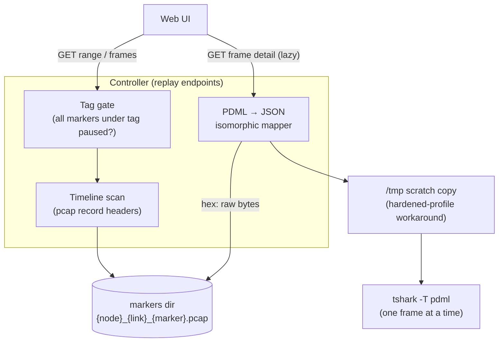
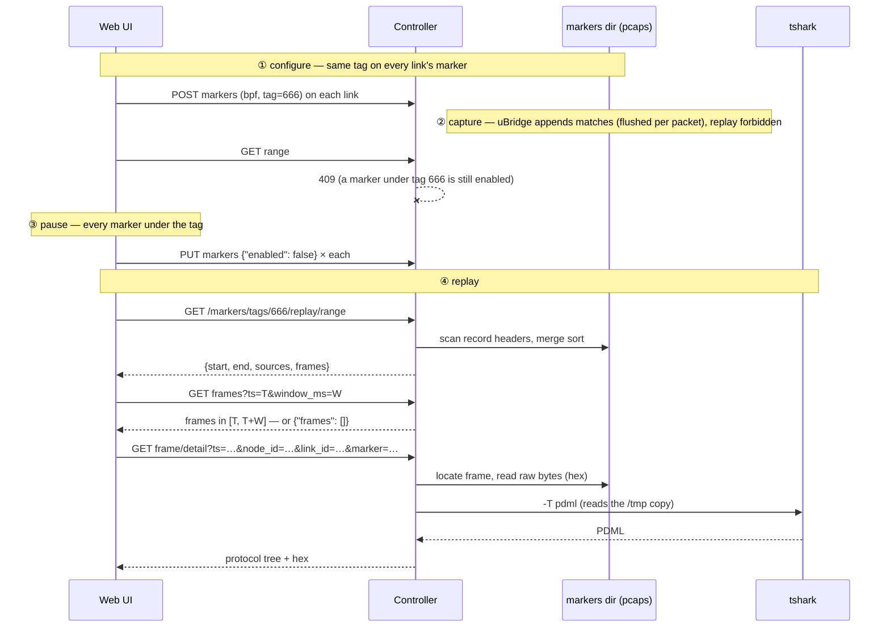

<!--
SPDX-License-Identifier: CC-BY-SA-4.0
See LICENSE file for licensing information.
-->

> This documentation is organized by AI with reference to actual code. AI can make mistakes — please verify against the source code when in doubt.

# Marker Tag Replay (Aggregate Playback)

## Overview

Replays traffic captured by [markers](marker-traffic-insight.md) **across links**, keyed by
`tag`. Markers on different links that share a tag form one *distributed capture session*;
once every marker under the tag is paused, their per-marker pcaps are merged into a single
timestamp-ordered timeline. The Web UI browses that timeline and fetches individual frames
on demand — each fetch decodes exactly one frame via `tshark` into a self-describing JSON
protocol tree.

The unique observable: the delta between the same packet hitting two consecutive links
measures the **intermediate node's forwarding latency** (host view) — something a
single-link capture can never show.

## Architecture



Two deliberately separated performance regimes:

| Path | Work | tshark |
|------|------|--------|
| Timeline | 16-byte record-header scan per frame, cross-file merge sort | **never invoked** — browsing works without tshark |
| Frame detail | locate frame → `tshark -T pdml -Y "frame.number == N"` → map to JSON | forked once per frame the user opens |

tshark call count equals user clicks — no caching or rate limiting needed, and a tshark
failure (501/502) affects only that one frame, never timeline browsing. pcap files are
compute-side (`<project>/project-files/markers/`); the initial scope is single-server
deployments (controller and compute in one process, direct file access) — remote computes
will reuse the existing capture-file proxy pattern.

## Business Process



## The tag gate

Replay reads append-only pcaps, so it is only available while the data is at rest. Every
replay endpoint evaluates the same gate: walk every marker in the project carrying the
requested tag; if any has `enabled: true` → 409 (the response names them); a tag with no
markers at all → 404.

| Marker state under the tag | pcap file | Replay |
|---------------------------|-----------|--------|
| any `enabled: true` (capturing) | growing | denied — 409 |
| all `enabled: false` (paused) | retained, frozen | **allowed** |
| deleted | file unlinked | no data |
| `bpf`/`tag`/`direction` changed (rebuild) | pcap reopened (truncated) — new session | prior history gone |

- **Pause, not delete.** Deleting a marker (or its definition) deletes its pcap — replay
  before deleting or the data is gone.
- **Pause → resume → pause is fine.** The pcap accumulates the full history; replay covers
  everything up to the current pause point.
- uBridge flushes every matched packet to the pcap immediately (`pcap_dump_flush` per
  packet under a mutex — verified in the uBridge source), so a pause boundary never loses
  tail frames.

## API Endpoints

All read-only; JWT bearer token, privilege `Project.Audit`.

| Method | Path | Description |
|--------|------|-------------|
| GET | `/v3/projects/{pid}/markers/tags/{tag}/replay/range` | Timeline metadata + full frame list for the tag |
| GET | `/v3/projects/{pid}/markers/tags/{tag}/replay/frames?ts=&window_ms=&limit=` | Frames with ts in `[T, T+window]`, merged across sources |
| GET | `/v3/projects/{pid}/markers/tags/{tag}/replay/frame/detail?ts=&node_id=&link_id=&marker=` | Single frame: tshark protocol tree + raw hex |

### `range` — the timeline

```json
{
  "tag": 666,
  "start": "1788196663.226372",
  "end": "1788196713.706634",
  "frame_count": 20,
  "truncated": false,
  "sources": [
    { "node_id": "b764c434…", "link_id": "316ef8fd…", "marker": "global-def-…",
      "data_link_type": "DLT_EN10MB", "count": 10 }
  ],
  "frames": [
    { "ts": "1788196663.226372", "len": 98, "node_id": "b764c434…",
      "link_id": "316ef8fd…", "marker": "global-def-…", "frame_number": 1 }
  ]
}
```

- `frames` is the **full, merged, time-ordered list** (cap 5000) — the Web UI lays out the
  whole timeline from one request. Over the cap, `frames` is omitted and per-second
  `buckets` are returned instead with `truncated: true`.
- Each frame entry carries `(node_id, link_id, marker, frame_number)` — the locating
  tuple for the detail request.

### `frames` — point / window query

A time with no frames is a normal, successful answer — an empty array, no sentinel strings:

```json
GET …/replay/frames?ts=1788196700.000&window_ms=500
→ { "frames": [] }
```

### `frame/detail` — lazy single-frame decode

Invoked only when the user opens a frame. The `ts` must be the **exact string received in
the timeline/frame list** (round-tripped verbatim — never re-serialized through a float);
`node_id + link_id + marker` identify the pcap. The server re-resolves the ts against the
file, guarding against a capture rebuilt between the timeline view and this click.

```json
{
  "ts": "1788196663.226372",
  "source": { "node_id": "b764c434…", "link_id": "316ef8fd…",
              "marker": "global-def-…", "frame_number": 1 },
  "tshark_version": "TShark (Wireshark) 4.6.7 …",
  "field_count": 85,
  "hex": "45000062…",
  "tree": [
    { "element": "proto", "name": "ip",
      "showname": "Internet Protocol Version 4, Src: 10.1.10.101, Dst: 203.0.113.1",
      "children": [
        { "element": "field", "name": "ip.ttl", "show": "64",
          "showname": "Time to Live: 64", "value": "40", "size": "1",
          "pos": "22", "children": [] }
      ] }
  ]
}
```

- `tree` mirrors PDML **isomorphically**: every `<proto>`/`<field>` becomes a node, every
  XML attribute (`name`, `show`, `showname`, `value`, `size`, `pos`, `hide`, `mask`,
  `unmaskedvalue`) becomes a JSON key, plus one structural key `element` (proto/field).
  Nothing is selected out, nothing interpreted, and **all values stay strings** — numeric
  conversion is the client's business.
- `hex` is the raw frame bytes read straight from the pcap (not via tshark); keeping
  `pos`/`size` on every field enables Wireshark-style *click field → highlight bytes*.
- `field_count` is the mapped node count — a client-side sanity check.

## Ordering and timestamps

- `ts` is the pcap record timestamp (µs) written by uBridge at match time — a userspace
  `gettimeofday()` instant measured after the packet has crossed the kernel twice. The
  last digit or two are scheduling noise; microseconds are sufficient in a simulated
  environment.
- The sort key is `(ts, source file, frame_number)` — ts alone is **not** unique (two
  links can hit the same microsecond); the tiebreaker yields a stable, determined order
  instead of a fictional one. Index structures must never use ts as a dict key, or
  same-microsecond frames silently overwrite each other.
- The cross-link delta is the intermediate node's end-to-end forwarding latency
  (veth/TAP → guest protocol stack → back to host), typically hundreds of microseconds to
  milliseconds. UI labels should read *node forwarding latency (host view)*, not link
  propagation delay. A live capture pair confirmed it end-to-end: same `ip.id`,
  TTL 64→63, 509 µs between two links.

## Fidelity guarantee (PDML → JSON)

The conversion is an isomorphic structure map, not a semantic transform, with two rules:
**map every attribute** and **keep values as strings**. A round-trip test enforces both:
PDML element count equals JSON node count, and every XML attribute survives with an
identical JSON value (`tests/controller/test_marker_replay.py`). The raw frame bytes —
the one thing PDML genuinely does not contain — are covered by `hex` read directly from
the pcap.

## Error Responses

| Status | Description |
|--------|-------------|
| 401 | Not authenticated |
| 404 | Tag has no markers in the project; detail source unknown, or ts does not match the file (the capture may have been rebuilt) |
| 409 | Tag gate: a marker under the tag is still `enabled: true` (the response lists them) |
| 501 | tshark not installed / unavailable — affects detail only; the timeline never needs tshark |
| 502 | tshark failed or timed out (10 s); truncated output never reaches the mapper |

## Notes

- **Heterogeneous link types coexist.** Frames are never merged into a single pcap
  (mergecap is deliberately not used) — each frame carries its source and is decoded
  individually, so Ethernet and serial (cHDLC/PPP) markers can share one timeline.
  Malformed packets are tshark's problem: it emits `[Malformed Packet]` as regular PDML
  and carries on.
- **Hardened tshark profiles.** openSUSE-style profiles (AppArmor &c.) can deny tshark
  access to the project directory and the user's home even though the server process can
  read both. The detail path therefore copies the pcap to a real file under `/tmp`
  (not a symlink — the profile resolves real paths) and gives tshark a scratch `HOME`;
  the copy is unlinked afterwards. The hex view still reads the original file.
- **Tag type.** REST and the `marker.match` WS event both carry `tag` as `int` (the
  listener normalizes); replay keys on that int value.
- **Follow-ups.** Remote-compute support via the existing capture-file proxy pattern;
  convenience APIs (`GET …/markers/tags` to list tags, `POST …/markers/tags/{tag}/pause`
  to batch-pause — a one-call path to the replayable state).
