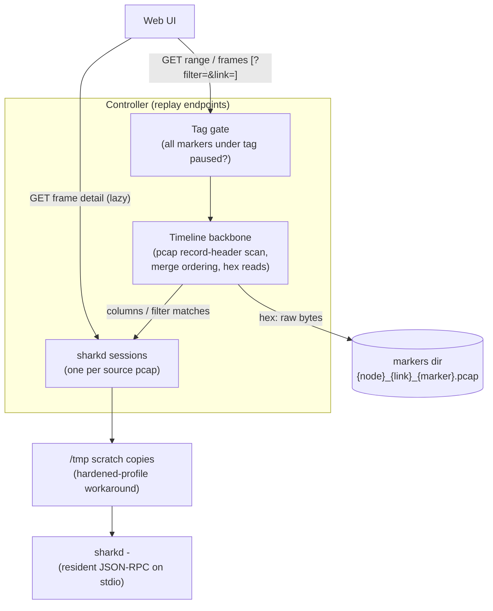
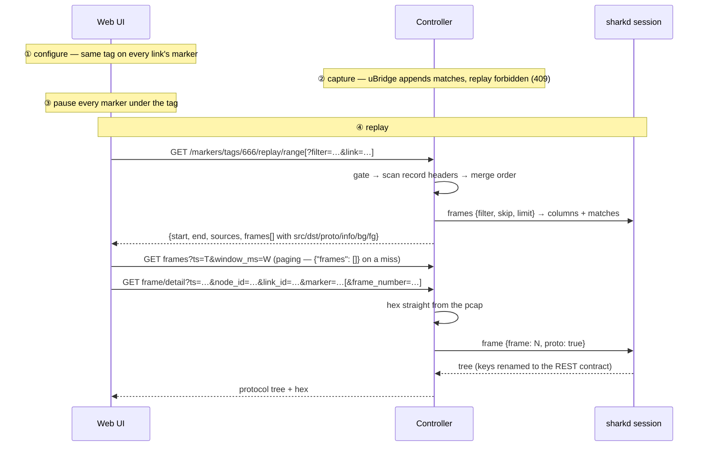

<!--
SPDX-License-Identifier: CC-BY-SA-4.0
See LICENSE file for licensing information.
-->

> This documentation is organized by AI with reference to actual code. AI can make mistakes — please verify against the source code when in doubt.

# Marker Tag Replay (Aggregate Playback)

## Overview

Replays traffic captured by [markers](marker-traffic-insight.md) **across links**, keyed by
`tag`. Markers on different links that share a tag form one *distributed capture session*;
once every marker under the tag is paused, their per-marker pcaps are merged into a single
timestamp-ordered timeline. The Web UI browses that timeline (with Wireshark-style packet
list columns) and fetches individual frames on demand — each fetch decodes exactly one
frame via the resident **sharkd** daemon into a self-describing JSON protocol tree.

The unique observable: the delta between the same packet hitting two consecutive links
measures the **intermediate node's forwarding latency** (host view) — something a
single-link capture can never show.

**sharkd is a hard requirement** (part of the Wireshark package). Without it every replay
endpoint that needs the engine returns 501 — there is deliberately no degraded mode; one
engine, one rendering shape for the Web UI. (A tag whose sources captured nothing returns
an empty timeline without consulting the engine — an empty answer, not a degraded one.)

## Architecture



Backbone vs engine, deliberately separated:

- **Timeline backbone** (plain Python): the tag gate, 16-byte-per-frame pcap record-header
  scan, cross-source merge ordering, canonical ts strings, and raw-bytes reads for the hex
  view. Identity and ordering never depend on the engine.
- **Engine layer (sharkd)**: packet-list columns, display filters, and per-frame protocol
  trees. One resident `sharkd -` process per source pcap (sharkd loads one file at a
  time), spawned lazily on first use, addressed with one-line JSON-RPC on stdio.

Session lifecycle: each session is validated per request against the source pcap's
`(mtime, size)` — a mismatch (e.g. the capture node restarted and uBridge truncated the
pcap while paused) kills and respawns it. Sessions are refcounted while a request holds
them and the LRU bound (16) only ever evicts **idle** sessions, so neither a request's
own walk over a tag with more sources than the bound nor a concurrent request can have
its session killed mid-RPC. A single manager lock makes check-spawn atomic (concurrent
requests share one spawn instead of double-spawning a process nobody reaps). Each RPC
is serialized by a per-session lock (sharkd serves one request at a time), carries a
timeout and an **id check** — any transport failure (timeout, dead pipe, malformed or
stale reply, oversized line) kills the session for good, because a desynchronized
session would serve shifted results. sharkd reads a `/tmp` scratch **directory**
containing a copy of the pcap plus pinned Wireshark preferences (the column layout the
frames RPC is parsed against is a contract the server owns, immune to system or user
column customization) — hardened profiles (AppArmor &c.) deny it the project directory
and the user's home even though the server process can read both. The pcap copy runs
off the event loop, and server shutdown kills every session so no scratch copy leaks
into `/tmp` across restarts.

### Resource bounds

Three independent bounds, easily confused:

| Bound | Value | Governs |
|-------|-------|---------|
| `_STREAM_LIMIT_BYTES` | 16 MB | Max **single JSON-RPC reply line** read from sharkd. A full 1000-row page measures ~190 KB against asyncio's 64 KB default — the trigger is the frame count in one pcap (≥ 1000), never the number of pcaps |
| `_FRAMES_PAGE` | 1000 | Rows fetched per `frames` RPC while draining one source's columns |
| `SESSION_MAX` | 16 | Resident **idle** sharkd sessions (LRU eviction) |

The `range` frame list itself is uncapped by decision — the client owns the
rendering cost of a huge list.

Process count follows usage, not the pcap inventory. sharkd loads one file per
process, so a session exists per source pcap **actually consulted** — a replay
request only touches its own tag's sources, and a session is either in use
(refcounted, held for a whole pagination drain rather than per RPC) or idle
(no holder — the only state the LRU cap ever evicts). At any moment the pool
holds at most `SESSION_MAX` idle sessions plus one per source being drained by
an in-flight request: a project with a thousand marker pcaps still runs at
most `16 + Σ(in-flight sources)` sharkd processes. Each process holds its pcap
in memory (~file size), which is the quantity the session cap primarily bounds.

## Business Process



## The tag gate

Replay reads append-only pcaps, so it is only available while the data is at rest. Every
replay endpoint evaluates the same gate: walk every marker in the project carrying the
requested tag; if any has `enabled: true` → 409 (the response names them); a tag with no
markers at all → 404.

| Marker state under the tag | pcap file | Replay |
|---------------------------|-----------|--------|
| any `enabled: true` (capturing) | growing | denied — 409 |
| all `enabled: false` (paused) | retained, frozen | **allowed** |
| deleted | file unlinked | no data |
| `bpf`/`tag`/`direction` changed (rebuild) | pcap reopened (truncated) — new session | prior history gone |
| capture node (re)started | pcap reopened (truncated) — new session | prior history gone |

- **Pause, not delete.** Deleting a marker (or its definition) deletes its pcap — replay
  before deleting or the data is gone.
- **Pause → resume → pause is fine.** The pcap accumulates the full history; replay covers
  everything up to the current pause point.
- **The replay window ends when nodes restart.** A pcap's lifetime equals its uBridge's
  lifetime: a fresh uBridge reinstalls every desired marker — paused ones too — and
  uBridge opens the pcap with truncate semantics (`pcap_dump_open`, not `_append`). Server
  restart + project reopen **without starting nodes** is safe: nothing touches the files
  until a uBridge comes up. Docker nodes effectively restart on server restart as well
  (stale-container cleanup), so their window is shorter still.

## API Endpoints

All read-only; JWT bearer token, privilege `Project.Audit`. All require sharkd — 501
without it.

| Method | Path | Description |
|--------|------|-------------|
| GET | `/v3/projects/{pid}/markers/tags/{tag}/replay/range[?filter=&link=]` | Timeline metadata + full merged frame list with packet-list columns |
| GET | `/v3/projects/{pid}/markers/tags/{tag}/replay/frames?ts=&window_ms=&limit=[&filter=&link=]` | Frames with ts in `[T, T+window]`, merged across sources |
| GET | `/v3/projects/{pid}/markers/tags/{tag}/replay/frame/detail?ts=&node_id=&link_id=&marker=[&frame_number=]` | Single frame: protocol tree + raw hex (lazy — one call per frame the user opens) |

### `range` — the timeline

```json
{
  "tag": 102,
  "start": "1788369209.406812",
  "end": "1788369219.249085",
  "frame_count": 29,
  "sources": [
    { "node_id": "47703cad…", "link_id": "2697a7c6…", "marker": "global-ospf",
      "data_link_type": "DLT_EN10MB", "count": 4 }
  ],
  "frames": [
    { "ts": "1788369209.406812", "len": 114,
      "node_id": "47703cad…", "link_id": "2697a7c6…",
      "marker": "global-ospf", "frame_number": 1,
      "src": "10.0.12.1", "dst": "224.0.0.5",
      "proto": "OSPF", "info": "Hello Packet",
      "bg": "fff3d6", "fg": "12272e" }
  ]
}
```

- `frames` is the **full, merged, time-ordered list** — one request lays out the whole
  timeline, **deliberately uncapped**: rendering a huge list is the client's concern,
  and the window endpoint exists for incremental views. There is no `truncated` flag
  and no bucket histogram; `frame_count` always equals `len(frames)`.
- Every frame entry carries the Wireshark packet-list columns — `src` / `dst` / `proto`
  / `info` — plus the **coloring-rule hints `bg` / `fg`** (Wireshark's own palette
  decisions, so the UI can color rows exactly like Wireshark without shipping the
  colorization engine). Columns are `null` only for a frame the engine could not describe.
- Each frame entry carries `(node_id, link_id, marker, frame_number)` — the locating
  tuple for the detail request, and the link association for timeline/topology rendering
  (`link_id` joins the Web UI's own link objects).

### Display filter

`?filter=<expression>` on both `range` and `frames` is a Wireshark display filter,
applied **before** counting and slicing — `start` / `end` / `frame_count` / `frames`
are all computed on the matching frames only. Filtered frames keep
their original pcap frame numbers. The filter travels as one argv-style element (never
through a shell) and is capped at 2000 characters. An invalid expression is a **400**
whose message carries sharkd's original error text — suitable for inline display in the
filter bar, and distinct from the 409 gate / 404 unknown-tag semantics. Only sharkd's
filter-rejection error maps to 400; any other engine failure while a filter is set is a
502 (the filter was fine — the engine was not).

### Capture-source selection

`?link=<link_id>` on both `range` and `frames` narrows the frame stream to one
capture source — a pure identity filter applied **before** any engine work (only the
selected link's pcap gets a sharkd pass), AND-composing with `filter`. Windows and the
histogram therefore always agree with the link-filtered view. Two boundaries by
design:

- **`sources` is the stable inventory of the tag**: every capture source is always
  listed, with engine-free **total** counts, unaffected by `link` / `filter` — a
  source dropdown must not shrink when the view narrows.
- **An unknown `link_id` matches nothing**: `frame_count: 0`, `start: null`, empty
  `frames` — the same shape as a zero-match display filter, deliberately not a 404.

### `frames` — point / window query (paging)

A time with no frames is a normal, successful answer — an empty array, no sentinel
strings:

```json
GET …/replay/frames?ts=1788196700.000&window_ms=500
→ { "frames": [] }
```

Paging is deliberately **ts + window_ms only** (no offset/limit over the filtered set):
the merge spans multiple pcaps, so slicing happens server-side on the merged stream
either way, windows align with timeline semantics, and the gate freezes the data (the
window answer is deterministic).

### `frame/detail` — lazy single-frame decode

Invoked only when the user opens a frame. The `ts` must be the **exact string received
in the timeline/frame list** (round-tripped verbatim — never re-serialized through a
float); `node_id + link_id + marker` identify the pcap. The server re-resolves the ts
against the file, guarding against a capture rebuilt between the timeline view and this
click. Since ts is **not unique within one pcap** (same-microsecond frames are kept
deliberately), the optional `frame_number` — carried by every frame list entry —
disambiguates them: it must still land on the exact ts, and without it the first ts
match decodes.

```json
{
  "ts": "1788369209.406812",
  "source": { "node_id": "47703cad…", "link_id": "2697a7c6…",
              "marker": "global-ospf", "frame_number": 1 },
  "field_count": 89,
  "hex": "01005e000005…",
  "tree": [
    { "element": "proto", "label": "Internet Protocol Version 4, …", "children": [
        { "element": "field", "name": "ip.ttl", "label": "Time to Live: 1",
          "filter_expr": "ip.ttl == 1", "pos": 22, "size": 1, "children": [] }
      ] }
  ]
}
```

The tree is sharkd's protocol tree with **keys renamed into the REST contract** — a
closed, protocol-independent key set (census-verified across ICMP / TCP / VLAN+OSPF
trees and pinned by a test), with values untouched:

| sharkd | Contract key | Meaning |
|--------|--------------|---------|
| `t` | `element` | node type (`proto`, …) |
| `l` | `label` | display text |
| `fn` | `name` | field name (`ip.ttl`) |
| `f` | `filter_expr` | **ready-made display filter with the value baked in** — click-to-filter |
| `h` | `pos` + `size` | byte range — click field → highlight hex bytes |
| `s` | `expert` | expert severity name (`Chat` / `Warn` / …) |
| `g` | `generated` | generated-by-Wireshark flag |
| `n` | `children` | nested fields |
| `e` | *(dropped)* | Wireshark-internal hf id, unstable across versions |

Unknown keys from a newer Wireshark pass through verbatim (never silently dropped); a
census test flags new keys for naming. `hex` is the raw frame bytes read straight from
the pcap; `field_count` is the mapped node count (client-side sanity check).

## Ordering and timestamps

- `ts` is the pcap record timestamp (µs) written by uBridge at match time — a userspace
  `gettimeofday()` instant measured after the packet has crossed the kernel twice. The
  last digit or two are scheduling noise; microseconds are sufficient in a simulated
  environment.
- The sort key is `(ts, source file, frame_number)` — ts alone is **not** unique (two
  links can hit the same microsecond); the tiebreaker yields a stable, determined order
  instead of a fictional one.
- The cross-link delta is the intermediate node's end-to-end forwarding latency
  (veth/TAP → guest protocol stack → back to host), typically hundreds of microseconds to
  milliseconds. UI labels should read *node forwarding latency (host view)*, not link
  propagation delay. A live capture pair confirmed it end-to-end: same `ip.id`,
  TTL 64→63, 509 µs between two links.

## Error Responses

All error bodies are `{"message": "…"}` (the app's unified format).

| Status | Description |
|--------|-------------|
| 400 | Invalid display filter (sharkd's filter rejection only; message carries its original text) or filter longer than 2000 chars |
| 401 | Not authenticated |
| 404 | Tag has no markers in the project; detail source unknown; `ts`/`frame_number` do not match the file (the capture may have been rebuilt); or the pcap vanished mid-request |
| 409 | Tag gate: a marker under the tag is still `enabled: true` (the response lists them) |
| 501 | sharkd not installed / unavailable — replay is unavailable, no degraded mode |
| 502 | sharkd failed, timed out (10 s per RPC), or answered out of sync — the session is killed and re-spawned on the next request |

## Notes

- **Heterogeneous link types coexist.** Frames are never merged into a single pcap
  (mergecap is deliberately not used) — each frame carries its source and is decoded
  individually, so Ethernet and serial (cHDLC/PPP) markers can share one timeline.
  Malformed packets are dissected like any other; sharkd marks them in the tree.
- **Live validation (2026-09, 9-link OSPF project, 29 frames over 9 sources).** Cold
  `range` (spawning all sharkd sessions) answered in 0.84 s with full columns and
  Wireshark coloring; filters verified in all four regimes (match / zero-match with
  `start: null`, invalid expression → 400 with sharkd's text, oversized → 400); window
  hit and miss behaved per contract; a frame detail returned 89 nodes with
  `filter_expr: "ip.ttl == 1"` (OSPF multicast TTL) and byte ranges for hex
  highlighting.
- **Columns are re-fetched per request** (~90 ms per source against a loaded session).
  The data is frozen while the gate passes, so a cache keyed on `(mtime, size)` is a
  natural follow-up if list latency ever matters at many-source scale.
- **Session invalidation is cheap and total.** Every request stats the source pcap; a
  rewritten file (mtime/size change) respawns the session — a paused-but-restarted
  capture can never serve stale dissect state. Transport failures are equally total: a
  timeout, dead pipe, malformed or stale reply (id mismatch) kills the session instead
  of leaving a poisoned one resident, and concurrent requests for the same pcap share a
  single spawn.
- **The packet-list layout is pinned, not assumed.** sharkd runs with a scratch `HOME`
  whose Wireshark preferences fix `gui.column.format` to exactly the four columns the
  frame entries carry (personal config overrides any `/etc/wireshark` customization), so
  the column indexes the server parses are a contract it owns.
- **Server shutdown kills every resident session** and drops its `/tmp` scratch
  directory — nothing accumulates across restarts.
- **Tag type.** REST and the `marker.match` WS event both carry `tag` as `int` (the
  listener normalizes); replay keys on that int value.
- **Follow-ups.** Remote-compute support via the existing capture-file proxy pattern;
  convenience APIs (`GET …/markers/tags` to list tags, `POST …/markers/tags/{tag}/pause`
  to batch-pause — a one-call path to the replayable state); uBridge-side
  `pcap_dump_open_append` (with a linktype-header check on the existing file) so capture
  history survives node restarts instead of being truncated on every reinstall.
