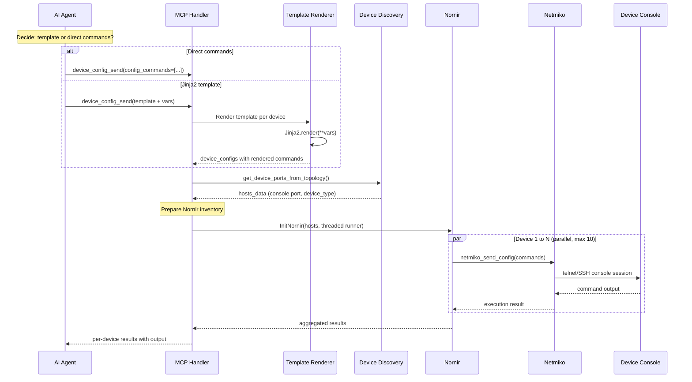

# MCP (Model Context Protocol) Service

## Overview

GNS3 Server provides a standard [Model Context Protocol (MCP)](https://modelcontextprotocol.io/) interface, allowing AI assistants like Claude to interact with GNS3 network simulations through SSE (Server-Sent Events) transport.

The MCP service exposes GNS3 project management operations as MCP tools that can be discovered and called by MCP clients.

## Endpoints

| Path | Method | Description |
|------|--------|-------------|
| `/v3/mcp/` | GET | MCP service metadata |
| `/v3/mcp/transport/sse` | GET | SSE stream (MCP connection) |
| `/v3/mcp/transport/messages/` | POST | JSON-RPC messages |

## Authentication

The SSE endpoint supports two types of credentials, passed the same way.

1. **Authorization header** (recommended):
   ```
   Authorization: Bearer <jwt_or_api_key>
   ```

2. **Query parameter** (for clients that don't support custom headers):
   ```
   GET /v3/mcp/transport/sse?token=<jwt_or_api_key>
   ```

### Option 1: JWT Token (24h expiry)

```bash
curl -X POST http://localhost:3080/v3/access/users/authenticate \
  -H "Content-Type: application/json" \
  -d '{"username": "admin", "password": "admin"}'
```

Default lifetime is **1440 minutes (24 hours)**. Configurable in `gns3_server.conf`:
```ini
jwt_access_token_expire_minutes = 1440  ; 24 hours
```

### Option 2: API Key (permanent, revocable) — Recommended for MCP

API keys never expire and can be revoked individually. Format: `gns3_<api_key_id>_<random_secret>` — the embedded UUID enables O(1) lookup without scanning all keys.

Create one via the REST API:

```bash
# Create an API key (requires a JWT to authenticate)
curl -X POST http://localhost:3080/v3/access/api-keys \
  -H "Authorization: Bearer <your_jwt>" \
  -H "Content-Type: application/json" \
  -d '{"name": "MCP Production"}'
# Response: {"api_key": "gns3_550e8400-e29b-41d4-a716-446655440000_a1b2c3d4...", ...}
# ⚠️ The key is only shown once — save it immediately.
```

API key management endpoints:

| Endpoint | Description |
|----------|-------------|
| `POST /v3/access/api-keys` | Create a new key (returns plaintext once) |
| `GET /v3/access/api-keys` | List all your keys |
| `POST /v3/access/api-keys/{id}/revoke` | Revoke a key (can be restored) |
| `POST /v3/access/api-keys/{id}/restore` | Restore a revoked key |
| `DELETE /v3/access/api-keys/{id}` | Permanently delete a key |

Both JWT tokens and API keys work for MCP and REST API endpoints interchangeably.

### Authentication Flow

When connecting with an API key:

```
SSE connect → Authorization: Bearer gns3_<uuid>_<secret>
  ↓
MCP auth wrapper extracts UUID → single DB query → 1 bcrypt (thread pool)
  ↓
Generates a fresh short-lived JWT → stored in ContextVar for the session
  ↓
All subsequent tool handler REST API calls use this JWT → zero extra bcrypt
```

### Concurrency

| Setting | Value |
|---------|-------|
| MCP batch workers | 100 (`BATCH_MAX_WORKERS`) |
| MCP HTTP client timeout | 30s |
| HTTP connection pool (`pool_connections`/`pool_maxsize`) | 500 / 1000 |
| REST API node/link creation pool | 100 (`Pool(concurrency=100)`) |

## Available Tools

**76 tools** across 11 categories:

### Project (14)

| Tool | Description |
|------|-------------|
| `project_list` | List all projects |
| `project_get` | Get project details |
| `project_create` | Create a project |
| `project_delete` | Delete a project |
| `project_open` | Open a closed project |
| `project_close` | Close an open project |
| `project_stats` | Get project statistics |
| `project_update` | Update project properties |
| `project_duplicate` | Duplicate a project |
| `project_readme_get` | Get project README content |
| `project_readme_update` | Update project README |
| `project_lock` | Lock project (prevent edits) |
| `project_unlock` | Unlock project |
| `project_locked` | Check if project is locked |

### Node (22)

| Tool | Description |
|------|-------------|
| `node_list` | List all nodes (`fields` to filter columns, e.g. `["name","status"]`) |
| `node_get` | Get node details (`fields` to filter columns) |
| `node_create` | Create node(s) — single via `template_id` or batch via `nodes` array. Supports `fields` to filter response. Top-level `template_id` applies as default in batch mode. Pass `name` to override template naming. Coordinates: left-handed Cartesian (origin at canvas center, X right-positive, Y down-positive). |
| `node_delete` | Delete a node |
| `node_update` | Update node properties |
| `node_start` | Start node(s) — `node_id` or `node_ids` array |
| `node_stop` | Stop node(s) — `node_id` or `node_ids` array |
| `node_suspend` | Suspend node(s) — `node_id` or `node_ids` array |
| `node_console` | Get WebSocket console URL |
| `node_file_list` | List files in node directory |
| `node_file_get` | Read a file (with offset/limit) |
| `node_file_write` | Write a file |
| `node_file_delete` | Delete a file |
| `node_start_all` | Start all nodes |
| `node_stop_all` | Stop all nodes |
| `node_suspend_all` | Suspend all nodes |
| `node_duplicate` | Duplicate a node |
| `node_isolate` | Isolate a node (suspend links) |
| `node_unisolate` | Un-isolate a node (resume links) |
| `node_links` | List links connected to a node |

### Link (9)

| Tool | Description |
|------|-------------|
| `link_list` | List all links (`fields` to filter columns) |
| `link_get` | Get link details |
| `link_create` | Create link(s) — single via `nodes` or batch via `links` array. Nodes support compact `[id, ad, pt, id, ad, pt]` format. Supports `fields` to filter response. |
| `link_delete` | Delete link(s) — `link_id` or `link_ids` array |
| `link_update` | Update link (suspend, filters) |
| `link_reset` | Reset link(s) — `link_id` or `link_ids` array |
| `link_capture_start` | Start capture(s) — `link_id` or `link_ids` array |
| `link_capture_stop` | Stop capture(s) — `link_id` or `link_ids` array |
| `link_capture_download` | Get PCAP download URL(s) — `link_id` or `link_ids` array |

### Template (5)

| Tool | Description |
|------|-------------|
| `template_list` | List all templates. Supports `fields` to filter response columns. |
| `template_get` | Get template details |
| `template_create` | Create a template (Docker needs `image`) |
| `template_update` | Update a template |
| `template_delete` | Delete a template |

### Compute (3)

| Tool | Description |
|------|-------------|
| `compute_list` | List registered remote computes |
| `compute_get` | Get compute details (requires UUID) |
| `compute_images` | List emulator images on a compute |

### Snapshot (4)

| Tool | Description |
|------|-------------|
| `snapshot_list` | List snapshots |
| `snapshot_create` | Create a snapshot |
| `snapshot_delete` | Delete a snapshot |
| `snapshot_restore` | Restore a snapshot |

### Drawing (5)

| Tool | Description |
|------|-------------|
| `drawing_list` | List drawings on canvas |
| `drawing_get` | Get drawing details |
| `drawing_create` | Create drawing (SVG label/shape/image) |
| `drawing_update` | Update drawing (position, rotation, SVG) |
| `drawing_delete` | Delete a drawing |

<!--
Symbol tools (symbol_list / symbol_get / symbol_dimensions /
symbol_defaults / symbol_upload / symbol_delete) are disabled for now:
they require a vision-capable model to be genuinely useful. Revisit later.
-->

### Appliance (3)

| Tool | Description |
|------|-------------|
| `appliance_list` | List appliances (`fields` to filter, e.g. `["name","category"]`) |
| `appliance_get` | Get appliance details |
| `appliance_install` | Create template from appliance (images must exist locally) |

### Image (5)

| Tool | Description |
|------|-------------|
| `image_list` | List all images |
| `image_get` | Get image details |
| `image_delete` | Delete an image |
| `image_prune` | Remove images not referenced by any template |
| `image_install` | Auto-create templates from uploaded images by checksum |

### Server (2)

| Tool | Description |
|------|-------------|
| `server_version` | Get GNS3 server version |
| `server_statistics` | Get server statistics (computes, projects, nodes) |

### Device Config (3)

| Tool | Description |
|------|-------------|
| `device_config_send` | Push config commands to devices via console (Nornir + Netmiko). Supports Jinja2 `template` + `vars` |
| `device_show_run` | Run read-only show commands on devices. Supports Jinja2 `template` + `vars` |
| `vpcs_config_set` | Configure VPCS devices (IP, gateway, etc.) |

The tool connects to each device's console via telnet/SSH. Nodes must be in the `started` state (use `node_start` or `node_start_all`). Device type is auto-detected from the node's `device_type:<type>` tag in GNS3.

#### Jinja2 Template Mode

Both `device_config_send` and `device_show_run` support an optional `template` parameter. When provided, each device's `vars` dict is rendered against the template to produce commands. Entries with the same `device_name` are merged into a single device session.

```python
# Direct commands (single/batch)
device_config_send(project_id, device_configs=[
    {"device_name": "R1", "config_commands": ["int lo0", "ip add 1.1.1.1 255.255.255.255"]},
])

# Jinja2 template (reduces token usage for batch)
device_config_send(project_id,
    template="interface lo{{ n }}\nip address {{ ip }} 255.255.255.255",
    device_configs=[
        {"device_name": "R1", "vars": {"n": 0, "ip": "1.1.1.1"}},
        {"device_name": "R2", "vars": {"n": 0, "ip": "2.2.2.2"}},
    ])

# Show commands with template
device_show_run(project_id,
    template="show ip route {{ protocol }}",
    device_configs=[
        {"device_name": "R1", "vars": {"protocol": "ospf"}},
        {"device_name": "R2", "vars": {"protocol": "bgp"}},
    ])
```

### Best Practices

**Prefer template over direct commands for batch.** When ≥2 nodes share the same config structure with different values, use `template`+`vars` instead of writing `config_commands` per node. This reduces token usage and transcription errors.

**Batch merging.** Multiple entries with the same `device_name` are merged into a single Nornir session. The output contains all commands' results in one block. Match results by `device_name`, not list index.

**Don't rely on `status: success` alone.** It only means commands entered config mode. IOS errors (`% Invalid input`, `% overlaps`, `% Incomplete command`) appear inside `output` text — always scan for `%` lines.

**Pilot before full rollout.** Test template + vars on 1–2 devices first to verify rendering and syntax, then expand to all nodes.

**Config backup via file operations.** IOU and Dynamips nodes save startup config as a plain text file (`startup-config.cfg`) in the node directory after `write memory`. These can be backed up and restored via `node_file_get`/`node_file_write`.

```python
# Save config on device
device_show_run(project_id, device_configs=[
    {"device_name": "R1", "commands": ["write memory"]},
])
# Backup
config = node_file_get(project_id, node_id, "startup-config.cfg")
# Restore if config breaks
node_file_write(project_id, node_id, "startup-config.cfg", config)
node_stop(project_id, node_id)
node_start(project_id, node_id)
```

### Device Config Workflow



## Configuration

### Claude Code (CLI)

```bash
# Option A: Using API key (recommended — never expires)
claude mcp add --transport sse My_GNS3_Server \
  http://localhost:3080/v3/mcp/transport/sse \
  -H "Authorization: Bearer gns3_a1b2c3d4..."

# Option B: Using JWT token (expires after 24h)
TOKEN=$(curl -s -X POST http://localhost:3080/v3/access/users/authenticate \
  -H "Content-Type: application/json" \
  -d '{"username": "admin", "password": "admin"}' | python3 -c \
  "import sys,json; print(json.load(sys.stdin)['access_token'])")

claude mcp add --transport sse My_GNS3_Server \
  http://localhost:3080/v3/mcp/transport/sse \
  -H "Authorization: Bearer $TOKEN"
```

## Transport Security

MCP server uses FastMCP's DNS rebinding protection to prevent attackers from
exploiting DNS resolution to access the MCP endpoint through unauthorized domains.

### Default Behaviour

DNS rebinding protection is **disabled by default**, allowing connections from
any host. This aligns with GNS3 server's default `host = 0.0.0.0` binding policy,
which is designed for VM distribution scenarios where users access the server
from various network locations.

### Enabling Protection

Add to `gns3_server.conf` under the `[Server]` section:

```ini
; Enable DNS rebinding protection for MCP server
mcp_enable_dns_rebinding_protection = True

; Allowed hosts (comma-separated, "host:*" port wildcard patterns only)
mcp_allowed_hosts = 127.0.0.1:*,localhost:*,192.168.1.3:*

; Allowed origins (comma-separated)
mcp_allowed_origins = http://127.0.0.1:*,http://localhost:*,http://192.168.1.3:*
```

> **Note**: The MCP library only supports `"host:*"` port wildcard patterns
> (e.g., `"192.168.1.3:*"`). Standalone `"*"` wildcards are not supported.

### Protection Mechanism

When protection is enabled, the MCP server validates the `Host` header of
incoming SSE connection requests:

```python
# Verify the request's Host header matches allowed patterns
validate_request → check Host header → 421 Misdirected Request if invalid
```

This prevents DNS rebinding attacks:
1. Attacker registers `evil.com` pointing to your server's IP
2. User's browser makes requests to `evil.com:3080`
3. MCP server checks Host header = `"evil.com:3080"`
4. `"evil.com:3080"` is not in `allowed_hosts` → connection rejected

### Behaviour Summary

| `mcp_enable_dns_rebinding_protection` | Result |
|:---|:---|
| `False` (default) | All hosts allowed |
| `True` + correct hosts configured | Only configured hosts allowed |
| `True` + missing/wrong hosts | Connections rejected with 421 |

For public-facing MCP servers, set `allowed_hosts` to your server's domain name.

## Architecture

```mermaid
sequenceDiagram
    participant Client as Claude Code
    participant MCP as MCP Service
    participant Auth as Auth
    participant GNS3 as GNS3 REST API

    Note over Client: 1. Connect with API Key or JWT
    Client->>MCP: GET /sse (Authorization: Bearer <key>)
    
    alt API Key (gns3_&lt;uuid&gt;_&lt;secret&gt;)
        MCP->>Auth: Extract UUID → DB lookup → 1 bcrypt (thread pool)
        Auth-->>MCP: Generate fresh JWT
    else JWT
        MCP->>Auth: Decode JWT
        Auth-->>MCP: Token valid
    end
    
    MCP-->>Client: event: endpoint /messages/?session_id=xxx

    Note over Client: 2. Initialize & Call Tools
    Client->>MCP: POST /messages/ (tools/call ...)
    MCP->>GNS3: HTTP request (with JWT from step 1)
    GNS3-->>MCP: Response
    MCP-->>Client: event: message (tool result)
```

## Internal Implementation

- **FastMCP** (Anthropic MCP SDK) is used for tool registration and SSE transport
- The SSE app is mounted as a Starlette sub-application under `/v3/mcp/transport`
- **Auth:** JWT validation via `auth_service`. API key (`gns3_<uuid>_<secret>`) extracts UUID for O(1) DB lookup, runs bcrypt in thread pool, returns a fresh JWT — subsequent calls use the JWT with zero extra bcrypt.
- Tool handlers use `Gns3Connector` (from `gns3_copilot.gns3_client.connector`) via the shared handler layer (`gns3_copilot.gns3_client.api_handlers`), keeping the MCP layer decoupled
- The JWT token is stored in a `contextvars.ContextVar` so it is available within tool handler threads (Python ≥ 3.9 propagates contextvars through `asyncio.to_thread`)

### Console WebSocket

The `node_console` tool returns a WebSocket URL for connecting to a node's console. The URL includes a short-lived **access ticket** (10 min) — a short random string (`gns3t_…`, 22 chars) minted server-side and bound to that node's console endpoints. `link_capture_download` uses the same kind of ticket bound to one exact resource path instead of embedding a Bearer JWT in the returned curl command. Tickets replaced the long JWTs previously embedded in these URLs/commands: LLM clients retyping them into shell commands reliably corrupted a ~200-char JWT, while a short ticket survives copying. Re-request the URL when the ticket expires (logging out also invalidates outstanding tickets). This endpoint is protocol-agnostic — it works for **telnet**, **ssh**, and **vnc** console types alike. The WebSocket simply proxies raw byte streams between the client and the compute node; protocol negotiation (e.g. SSH key exchange) happens on the compute side.

The WebSocket URL is constructed using the server's `_server_url()`, which resolves the host as follows:

| `Server.host` value | Resolved host in URL |
|:---|:---|
| Specific IP or hostname (e.g. `192.168.1.3`) | Used as-is |
| `0.0.0.0` (IPv4 any, default) | Detected via **default route interface IP** |
| `::` (IPv6 any) | Detected via default route interface IP |
| Detection failure | Fallback to `127.0.0.1` |

When `Server.host` is `0.0.0.0` (listen on all interfaces), the MCP server discovers the default route interface IP using a UDP socket connect to `8.8.8.8:80` — no network data is sent, the operating system simply selects the interface that would be used for the default route. This ensures the returned WebSocket URL uses a reachable address (e.g. `192.168.1.3` instead of `127.0.0.1`).

If the configured host is already a specific IP or hostname (not `0.0.0.0`), it is used directly in the URL without modification.

Use `websocat` to connect from the command line (use the `command` returned by `node_console` verbatim — never reconstruct the URL by hand):

```bash
# The host in the URL is automatically resolved to a reachable address
websocat ws://192.168.1.3:3080/v3/projects/{project_id}/nodes/{node_id}/console/ws?token=<console_ticket>
```

### Source Files

| File | Purpose |
|------|---------|
| `gns3server/agent/mcp/__init__.py` | FastMCP server, tool decorators, SSE transport, JWT auth wrapper |
| `gns3server/agent/mcp/projects.py` | Project tool handlers |
| `gns3server/agent/mcp/nodes.py` | Node tool handlers |
| `gns3server/agent/mcp/links.py` | Link tool handlers |
| `gns3server/agent/mcp/templates.py` | Template tool handlers |
| `gns3server/agent/mcp/computes.py` | Compute tool handlers |
| `gns3server/api/server.py` | Mounts MCP routes via `register_starlette_routes()` |
