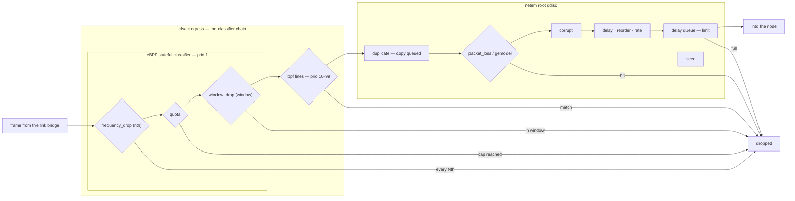

<!--
SPDX-License-Identifier: CC-BY-SA-4.0
See LICENSE file for licensing information.
-->

> This documentation is AI-generated with reference to actual code and verified against real-kernel testing. AI can make mistakes — please verify against the source code when in doubt.

# Packet Filters (link impairments)

## Overview

Per-link impairment filters — delay, packet loss, corruption, rate limiting, deterministic drops — configured through a link's `filters` dict and applied by **both link endpoints**, so every direction of a link is impaired exactly once. A `delay 100` link therefore measures ≈200 ms RTT; `packet_loss 30` measures ≈51 % round trip (1 − 0.7²).

Every kernel-datapath node type shares one implementation: `KernelDatapathMixin` keys everything on the anchor interface name, which is why a Docker adapter's veth host end and a QEMU / IOU / Dynamips adapter's TAP are interchangeable. On the kernel datapath the filters run **in the kernel** as tc objects that uBridge installs over netlink (`tc netem set`, raw netlink — no `tc` binary needed): one netem qdisc, cls_bpf match-drop classifiers and one eBPF stateful classifier per anchor. Relay links run the uBridge userspace filters on the single relay bridge instead — five types there (`delay`, `packet_loss`, `corrupt`, `frequency_drop`, `bpf`); the rest are kernel-only.

## Terms

| Term | Meaning |
|---|---|
| anchor | the host-side interface a link attaches to — a Docker adapter's veth host end, a QEMU / IOU / Dynamips adapter's persistent TAP |
| tc / qdisc | traffic-control objects the kernel inserts into the anchor's egress path — stages frames pass through in flight, not external packet consumers; uBridge only installs them over netlink |
| `clsact` | the tc classifier carrier on the anchor; its egress chain is where the drop classifiers run |
| netem | the impairment qdisc behind clsact: delay, loss, rate, corrupt, duplicate, … |
| eBPF classifier | the stateful drop classifier at clsact egress prio 1 — modes every-Nth, quota, time window and flow (GNS3 exposes the first three as filter types) |
| `bpf_drop` | match-drop BPF expressions at clsact egress prio 10–99 |
| relay filter | a uBridge userspace filter on the relay bridge — both directions cross the single filtered bridge |

## Evaluation order (kernel datapath)

All 13 types in evaluation order for one frame with every filter set — the chain runs once per direction on the destination anchor's egress, the classifier chain first and the single netem qdisc behind it. A drop at any stage ends the frame: whatever the classifiers drop never reaches netem, nor the AF_PACKET tap points — captures and markers will not observe it:

Semantic model rather than kernel source order: the netem draws fire at enqueue (a `duplicate` hit queues a copy alongside the original, `corrupt` damages and passes), `delay`/`reorder`/`rate` fold into one time_to_send that the delay queue drains when due, `limit` is that queue's capacity — the `full` edge above — and `seed` is no stage but the PRNG behind every stochastic draw (duplicate, loss/gemodel, corrupt, jitter). The eBPF program's fourth mode (flow) has no GNS3 filter type, and the attached parameters (jitter, correlation, distribution) ride their types and add no stages. On the relay datapath there is no such chain — the five relay-supported types run as uBridge userspace filters on the single relay bridge, both directions through one filter list.

## Filter types

On the kernel datapath the 13 types ride three kernel objects on the anchor. The `tc …` verbs in the table are uBridge's own hypervisor command names — **not the iproute2 `tc` binary**: uBridge builds every netlink message itself (RTM_NEWQDISC for the netem qdisc, RTM_NEWTFILTER for the cls_bpf and eBPF classifiers), loads the eBPF program through raw `bpf()` syscalls with the instruction array embedded in the binary, embeds the jitter-distribution tables the `tc` CLI would read from disk, and uses libpcap only as a library to compile `bpf` expressions — the same compiler the relay filter uses. The `tc` and `ip` binaries appear only in uBridge's test suite, as kernel-state oracles:

| GNS3 filter | kernel implementation | Notes |
|---|---|---|
| `delay [ms, jitter, dist]` | netem `delay X jitter Y [distribution D]` | jitter 0 omitted; dist ∈ uniform/normal/pareto/paretonormal (kernel-only parameter) |
| `packet_loss [%, correl]` | netem `loss P [correl C]` | per direction (see below); correlation is a kernel-only parameter |
| `corrupt [%]` | netem `corrupt P` | |
| `duplicate [%, correl]` | netem `dup P [correl C]` | kernel-only type |
| `rate ["512kbit"]` | netem `rate B` | tc-style integer+unit (bit/kbit/mbit/gbit/bps/kbps/mbps, ≤100gbit); kernel-only type |
| `reorder [%, correl, gap]` | netem `reorder P [correl C] [gap G]` | requires `delay`; kernel-only type |
| `gemodel [p, r, 1-h]` | netem `loss gemodel P R H` | Gilbert-Elliot bursty loss: p = good→bad transition, r = bad→good transition, 1-h = loss chance in the bad state (good loses nothing) — mean one-way loss p/(p+r)×(1-h); mutually exclusive with `packet_loss`; kernel-only type |
| `seed [u32]` | netem `seed N` | reproducible random draws; kernel-only type |
| `limit [pkts]` | netem `limit N` | queue depth above the 1000 default (rate+delay BDP); kernel-only type |
| `bpf` (one line per expression, OR) | `tc bpf_drop add <if> <prio> "<expr>"` — cls_bpf on clsact egress + gact drop | needs uBridge `cbpf=1` (`tc capabilities`, probed once per uBridge process); a line that fails to compile on the compute is skipped with a warning, mirroring the relay |
| `frequency_drop [N]` | `tc nth_drop <if> N` — the eBPF stateful classifier's exact every-Nth mode (clsact egress prio 1) | needs uBridge `ebpf=1`; -1 = drop everything → every 1st; per-direction counters (see below) |
| `quota [bytes, %]` | `tc quota_drop <if> <bytes> <pct>` — after the byte quota is consumed, each further packet drops with the given chance (100 = hard cutoff) | kernel-only type; needs `ebpf=1`; per-direction byte counters |
| `window_drop [start, outage, %, period?, jitter?]` | `tc window_drop <if> <start> <outage> <pct> [<period> [<jitter>]]` — packets drop with the given chance inside `[start, start+outage)` | kernel-only type; needs `ebpf=1`; see the window semantics below |

## Semantics

* **Both endpoints** receive the filter dict and attach one qdisc to *their* anchor. The qdisc's egress covers traffic entering that node, so every direction of the link is impaired exactly once — the same net effect as the relay, where both directions cross the single filtered bridge. A `delay 100` link measures ≈200 ms RTT; `packet_loss 30` measures ≈51 % round-trip (1 − 0.7²); `rate 512kbit` adds ≈2× the per-packet serialization time to the RTT.
* **Reconcile = reset + full re-apply.** The kernel's netem replace MERGES optional attributes (rate, correlation, reorder, corrupt, gemodel, distribution: an absent attr keeps its previous value), so re-applying a filter set with a parameter *removed* would silently keep the old value. Every apply therefore starts with `tc reset` (also drops clsact and its bpf_drop filters — re-added right after in the same flow) followed by one `netem set` built from the current filters; no per-parameter diffing. An empty filter set is the reset alone (ENOENT-tolerated).
* **Extension gating.** The netem-extension keywords (rate, reorder, gemodel, dist, seed, limit — plus the correl suffixes, which gate on the `rate` token as the extension-build marker) probe `tc capabilities` once per uBridge process and require the tokens; a plain delay/loss/corrupt/dup filter never probes — an old uBridge serves the original surface untouched.
* **kernel-only vs relay-available.** The extension types, `quota` and `window_drop` have no uBridge relay equivalent: `available_filters` hides them on relay links, setting one on a created relay link returns 409, and a project loaded with such filters on a link that cannot be kernel-wired drops them with a warning (invalid filters are dropped the same way at load). `frequency_drop` runs on both datapaths (relay userspace filter / eBPF every-Nth).
* **frequency_drop counting semantics differ per datapath.** The relay's single filtered bridge counts packets of BOTH directions through one counter; the kernel attaches one classifier per anchor, so each direction drops every Nth independently. For a round-trip measurement with every-Nth N: relay ≈ 1/N of frames (phase-locked), kernel = 1 − ((N−1)/N)² (e.g. N=3 → 55.6 % round-trip loss, measured 57 %). The kernel count is exact (atomic counter), unlike netem's stochastic loss.
* **Classifier order** on clsact egress: the eBPF stateful filter runs at prio 1, `bpf_drop` expressions at 10–99 — a packet dropped by the stateful modes never reaches the expression drops, and dropped packets never reach netem. Within the stateful program the modes evaluate in the fixed order nth → quota → window → flow.
* **window_drop semantics.** `start` is relative to the moment the filter is applied — and because reconcile re-sets the classifier on every apply (any filter change, node restart, link reset reloads the program after the netem reset), every such event **restarts the schedule**. 3 parameters = one single outage (`[start, start+outage)`), traffic passes before and after — the classic "link dies at T, comes back at T+outage". 4 parameters = recurring flap: `period ≥ outage` (validated), so the outage occupies `outage/period` of each cycle. 5 parameters = randomized flap: each cycle's outage and period are re-drawn uniformly in nominal ± `jitter` (integer-ms grid; jitter 0 draws nothing and equals the fixed schedule). Inside a window each packet drops with the given chance (100 = full outage, lower = degraded service during the window). Both endpoints run their own schedule, started ~simultaneously by the controller — a round trip survives only when **both** directions are outside their windows. Note `start = 0` (outage begins immediately) is a valid, active configuration — unlike other filters, a zero first parameter does not mean "disabled". A PUT re-sending an unchanged filters dict is normally a controller no-op, but one still carrying `window_drop` is reconciled anyway, so re-applying the same window re-arms a one-shot outage that has already passed (arm the filter immediately before generating traffic, or use a period for a repeatable event).
* **Validation** mirrors the tc grammar: `reorder` requires `delay`, `gemodel` and `packet_loss` are mutually exclusive (both map to the netem loss keyword), `distribution` requires jitter > 0, rate must be integer + unit ≤ 100gbit.
* **Node restart** restores the qdisc from the NIO (like capture and markers); **link deletion** detaches it explicitly — the anchor survives the link and an orphaned qdisc would keep impairing the next one.
* **Suspend** keeps the qdisc (carrier-driven loss); the first packet after resume takes one extra delay interval (known netem idle-baseline behaviour) and steady state is exact.
* **bpf reconcile = flush + re-add** (`tc bpf_drop flush`, then one add per line at priorities 10, 11, …). `tc reset` (link delete / filter clear) is the full restore in uBridge: filters → clsact → root qdisc, idempotent.
* **Observability caveat:** clsact drops happen before the AF_PACKET tap points — markers/captures on the same anchor do not observe cls_bpf-dropped frames (on the relay, filter-vs-mark ordering determined visibility instead). Also note `tc qdisc show` cannot print a distribution's name (the kernel stores only the sampled table).
* **eBPF mode tokens.** A stateful mode is usable iff `tc capabilities` reports `ebpf=1` **and** lists the mode's token in `ebpf_modes` (uBridge `feature/tc-window`+). Builds predating the field keep the modes that shipped with it — everything but `window`, whose semantics were corrected exactly when the field was added: gating on `ebpf=1` alone would silently install the broken back-to-back-window behaviour on a pre-correction build. Requesting an unusable mode fails the apply with an upgrade error; the cleanup ("off") path only touches modes the build declares.
* **Capability reporting.** The compute exposes the probe through `GET /v3/compute/capabilities` as `ubridge_tc` (netem keyword list, `ebpf`/`cbpf` flags, and the usable `ebpf_modes` — legacy fallback applied), answered by a throwaway uBridge spawned as the server's own user and cached by binary identity — the runtime `ebpf` flag flips between users and kernels for the same binary, so a root-run probe would lie for a non-root server. The controller forwards it through `GET /v3/computes` and `available_filters` hides kernel-datapath filter types an endpoint compute reports it cannot run (both ends apply their own filters, so one incapable compute is enough). Computes that report nothing — older servers, failed probe — keep the full list; apply-time validation (409) stays the guard.

## REST surface

Filters travel on the link API: `PUT /v3/links/{link_id}` with a `filters` dict, validated by the controller (the dependency and exclusivity rules above return 409 on violation) and pushed to both endpoints on create, update and project reopen. Each link payload carries read-only `available_filters` — the per-type intersection of what both endpoint computes can run, per the capability reporting above.

## Where the chain sits

The per-node-type frame paths — where an anchor's egress chain sits in the whole journey from one node to another — are drawn in the datapath docs: `docker-kernel-datapath.md` (veth), `qemu-kernel-datapath.md` and `dynamips-kernel-datapath.md` (TAP), `iou-kernel-datapath.md`, `ethernet-switch-kernel-datapath.md` and `iol-docker-kernel-datapath.md`. The frozen uBridge contract behind the kernel objects (netlink encoding, `tc capabilities`, the full-restore `tc reset`) is `../design/ubridge-kernel-impairment-spec.md`.
