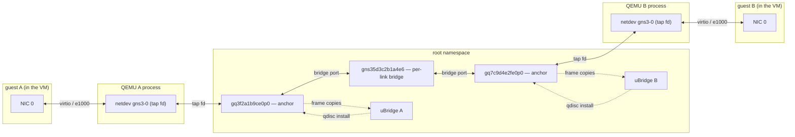
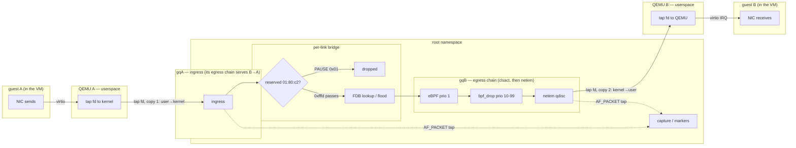
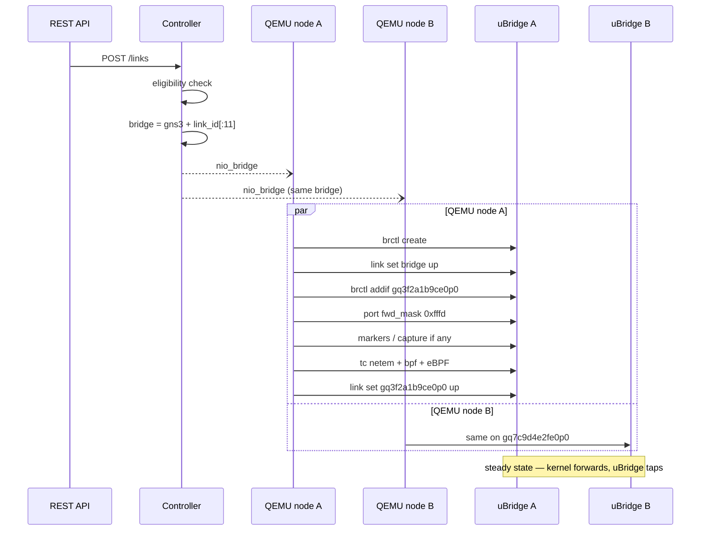

<!--
SPDX-License-Identifier: CC-BY-SA-4.0
See LICENSE file for licensing information.
-->

> This documentation is AI-generated with reference to actual code and verified against real-kernel testing. AI can make mistakes — please verify against the source code when in doubt.

# QEMU kernel datapath

QEMU adapters anchor on a **persistent TAP**, and links between two QEMU nodes — or a QEMU node and a Docker container — on the same compute are wired in the kernel (per-link Linux bridge) instead of the uBridge UDP relay. The compute side is the same machinery Docker already uses: `KernelDatapathMixin` (`gns3server/compute/kernel_datapath.py`) takes an *anchor interface* and does not care whether it is a veth host end or a TAP.

## Architecture

Kernel link between two QEMU nodes on the same compute. Interface names follow the shared contract of `gns3server/utils/kernel_anchor.py`: `gq{node_id[:8]}e{adapter}p{port}` for the persistent TAP (one per QEMU adapter, port always 0) and `gns3{link_id[:11]}` for the bridge; the concrete names in the diagrams use node ids `3f2a1b9c` / `7c9d4e2f` and link id prefix `5d3c2b1a4e6`. A mixed Docker↔QEMU link is the same bridge with the Docker end's `gv` veth host end as its other anchor — the shared mixin is anchor-agnostic; the pure-veth picture is `docker-kernel-datapath.md`. Terms the diagrams use:

| Term | Meaning |
|---|---|
| uBridge | the per-node helper process gns3-server spawns with elevated capabilities; its hypervisor command surface executes all host-side wiring (TAPs, bridges, carrier, tc, taps) — on a kernel link it builds and observes the path but never carries frames |
| anchor | the host-side interface a link attaches to — here the `gq` persistent TAP |
| persistent TAP | the TAP uBridge creates per QEMU adapter at node start (`tap create`, `tap set_owner`); it outlives restarts and crashes, and QEMU opens it by name as its `-netdev tap` |
| per-link bridge | the Linux bridge `gns3{link_id[:11]}` that stands in for the cable; the two anchors are its only ports |
| bridge port | an interface enslaved to a Linux bridge (`brctl addif`) — it no longer sends or receives on its own: frames arriving on it go to the bridge's forwarding logic, and the bridge transmits through it |
| tap fd | a TAP's file descriptor: reads return frames the kernel received on the device, writes inject frames into it — on this datapath QEMU itself holds it |
| FDB | the bridge's forwarding database (learned MAC → port); unknown, broadcast and multicast destinations are flooded |
| `01:80:c2` / `group_fwd_mask` | the IEEE 802.1D reserved multicast range (STP, LACP, LLDP, 802.1X, PAUSE); the bridge forwards it only per the port's `group_fwd_mask` — `0xfffd` passes everything except PAUSE/PFC |
| tc / qdisc | traffic-control objects the kernel inserts into the anchor's egress path — stages frames pass through in flight, not external packet consumers; uBridge only installs them over netlink |
| `clsact` | the tc classifier carrier on the anchor; its egress chain is where the drop classifiers run |
| eBPF classifier | the stateful drop modes (every-Nth, quota, time window) at clsact egress prio 1 |
| `bpf_drop` | match-drop BPF expressions at clsact egress prio 10–99 |
| netem | the impairment qdisc behind clsact: delay, loss, rate, corrupt, duplicate, … |
| `AF_PACKET tap` | uBridge's packet socket bound to the anchor; the kernel clones every frame the interface sends or receives to it (the tcpdump mechanism) — read-only copies for capture and markers, the original stays on the kernel path |
| carrier | the anchor's admin state (`link set up/down`); suspend is carrier down plus QMP `set_link off` so the guest notices |
| QMP | the QEMU machine protocol — how the server drives a running QEMU (link state on suspend/resume) without restarting it |
| `nio_bridge` | the NIO record the controller posts to each endpoint node: bridge name, filters, markers, suspend flag |



Everything in the root namespace is built the same way: gns3-server creates the persistent TAPs at node start (before QEMU is launched), the per-link bridge and its memberships at link creation, and every later change (carrier, capture, markers, filters) by sending hypervisor commands to the node's uBridge process — the privileged agent that turns them into netlink/ioctl operations. That build flow is the Link creation sequence below; this diagram is the steady state that remains, where the only uBridge relationships left are the two dashed kinds.

uBridge sits off the forwarding path — the dashed edges are control and observation, never data flow. The `qdisc install` edge is uBridge configuring the kernel over netlink; the kernel then runs those qdiscs in-flight on the anchor's egress (stages of the transmit path, not packet consumers). The `frame copies` edge is the AF_PACKET tap: the kernel clones every frame the TAP sends or receives to uBridge's packet socket (the tcpdump mechanism) — read-only copies for capture and markers; the originals never leave the kernel. The only userspace on the path is the two QEMU processes pumping their own tap fds — the irreducible VM leg, one fd crossing at each end per direction.

Relay link between the same two QEMU nodes on the same single compute — what every link becomes when `enable_kernel_datapath` is off (mixed node types and cross-compute wiring fall back too; there the UDP hop rides the real network instead of loopback, the copy count unchanged):

```mermaid
flowchart LR
    subgraph GA["guest A (in the VM)"]
        EA["NIC sends"]
    end
    subgraph QA["QEMU A — userspace"]
        NDA["netdev tap fd"]
    end
    subgraph KERN["kernel — root ns"]
        TA["gq3f2a1b9ce0p0 — anchor"]
        UDP["UDP sockets (loopback)"]
        TB["gq7c9d4e2fe0p0 — anchor"]
    end
    subgraph UBA["uBridge A — userspace"]
        NEA["AF_PACKET nio"]
        ENA["relay + userspace filters"]
        NUA["UDP nio"]
    end
    subgraph UBB["uBridge B — userspace"]
        NUB["UDP nio"]
        ENB["relay + userspace filters"]
        NEB["AF_PACKET nio"]
    end
    subgraph QB["QEMU B — userspace"]
        NDB["netdev tap fd"]
    end
    subgraph GB["guest B (in the VM)"]
        EB["NIC receives"]
    end
    EA -->|"virtio"| NDA
    NDA -->|"copy 1: user→kernel"| TA
    TA -->|"copy 2: kernel→user"| NEA
    NEA --> ENA --> NUA
    NUA -->|"copy 3: user→kernel"| UDP
    UDP -->|"copy 4: kernel→user"| NUB
    NUB --> ENB --> NEB
    NEB -->|"copy 5: user→kernel"| TB
    TB -->|"copy 6: kernel→user"| NDB
    NDB -->|"virtio IRQ"| EB
```



Drawn one-way; the reverse direction is the mirror image. A relayed frame crosses the kernel/user boundary **six times each way** (twelve per round trip): the two halves of the irreducible VM leg — QEMU's tap-fd write at the sending end, its read at the receiving end — plus the four the relay adds around them (AF_PACKET read, UDP send, UDP receive, AF_PACKET inject). The kernel datapath's only crossings are the VM leg's two; the relay's filters run in userspace, on the frames between the copies.

The relay attaches the TAP with `bridge add_nio_ethernet` (AF_PACKET, which does not take the device over) — **never** `bridge add_nio_tap`, which would claim the fd QEMU itself holds. And unlike the IOL runner container, whose anchors idle on the relay, the anchor here is the netdev itself: it stays up and carries as the relay's AF_PACKET endpoint — QEMU has no other leg (the legacy socket-netdev fallback below is the one shape without the TAP).

Frame path for one A → B frame. The impairment chain fires on the egress of the *destination* end's TAP, in order clsact → netem (a classifier drop means netem never sees the frame); each direction is impaired exactly once and B → A is symmetric on gqA — hence `delay 100` ≈200 ms round trip (measured 100.3 ms one-way). Each one-way trip crosses the kernel/user boundary exactly twice — the sending QEMU's tap-fd write and the receiving QEMU's tap-fd read, the irreducible VM leg:



What each stage drops: the reserved-range gate passes LACP, LLDP, 802.1X and STP per the port mask but never PAUSE/PFC (Link-local frames below); the clsact/netem stages drop or impair per the installed filters (Capture, markers, filters below). The AF_PACKET taps observe both anchors but never a clsact-dropped frame. Copies 1–2 are the whole path's only kernel/user crossings — both halves of the emulation's own TAP-fd leg (QEMU A's write, QEMU B's read); every stage between them runs in the kernel.

## Why a TAP works like a veth host end

| Event | Docker anchor (veth host end) | QEMU anchor (TAP) |
|---|---|---|
| Frames the node sends | arrive on the veth as `PACKET_HOST` | written to the tap fd, arrive as RX (`PACKET_HOST`) |
| Frames the peer sends | injected by uBridge, seen as `PACKET_OUTGOING` | injected by uBridge, seen as `PACKET_OUTGOING` |
| `tc` egress qdisc impairs | traffic entering the container | traffic entering the VM |
| Capture/marker anchor | the interface | the same interface |

So every filter, capture and marker primitive carries over verbatim, and `delay 100` on both anchors still measures ≈200 ms round trip while each direction is impaired exactly once.

## Datapath selection

`UDPLink._kernel_datapath_eligible` needs both endpoints on one compute and both able to anchor:

* Docker always can (adapters are born as veth pairs);
* QEMU can when that compute's uBridge reports the `tap` module — asked per compute through `/capabilities` (`ubridge_tap`, probed by creating and deleting one throwaway TAP, cached by binary identity), because an old uBridge leaves QEMU on the legacy socket-netdev datapath and cannot anchor a kernel link. An unknown/failed probe keeps the link on the relay.

Because the `-netdev` type is fixed when QEMU is launched, this is all-or-nothing per VM: on the TAP datapath *every* link can attach to (or detach from) a running VM, including switching a link between the two datapaths (delete + re-create, or a project reopen).

## Link creation sequence

Both endpoints attach concurrently and compute the same bridge name independently (a pure function of the link id), so either may win the `brctl create` race — the loser verifies the bridge exists (`brctl show`) and continues. The topology above's link, at attach time:



Every arrow to uBridge is one `_ubridge_send` command line on the node's local hypervisor console; uBridge executes it (netlink/ioctl) and replies OK or an error synchronously before the next command is sent — those replies are omitted for brevity. uBridge never initiates anything: it is a pure executor, and the only data ever flowing back (capture/marker frame copies) rides separate AF_PACKET sockets, not this console.

The TAP already exists at attach time — created at node start, before QEMU launched (Adapter lifecycle below) — which is what makes the attach runtime-safe on a running VM: anchors, bridge memberships and qdiscs all change around the `-netdev tap` QEMU already holds, and nothing talks to QEMU itself outside suspend/resume (QMP `set_link`, so the guest's carrier follows the link).

A mixed Docker↔QEMU link runs the identical sequence per end — each node's uBridge receives the same commands on its own anchor, the Docker end's `gv` veth host end in place of the `gq` TAP; only the anchor name differs (the mixin is anchor-agnostic, which is the point of the shared `gns3server/compute/kernel_datapath.py`).

## Adapter lifecycle

* **Birth (node start, before QEMU is launched)** — `_prepare_tap_datapath` probes the tap module, then `_create_taps` sweeps any leftover (a persistent TAP outlives a crash) and creates one TAP per adapter: `tap create gq{node_id[:8]}e{adapter}p{port}` → `tap set_owner <uid>` (so the unprivileged QEMU process can open it) → `link set <tap> down` (carrier off until a link attaches). QEMU then opens it as `-netdev tap,id=gns3-{adapter},ifname=<tap>,script=no,downscript=no`.
* **Life (running)** — the TAP is never created or destroyed again. Link create/delete/switch, suspend, capture and markers only change *what is attached to it*.
* **Death (node stop)** — the QEMU process is stopped **first**, then `_remove_taps` un-persists the TAPs (`tap delete`) and deletes the per-link kernel bridges the node still holds. The order matters: uBridge's `tap delete` refuses a device another process holds open ("Device or resource busy") and that best-effort delete is suppressed, so deleting the TAPs while QEMU still ran leaked every persistent TAP (process side first, then the devices — the same lesson as IOU's reverse stop order). Deleting a node never runs the link-teardown path, so those bridges would otherwise stay behind as empty orphans; a restart rebuilds them from the NIO.

## Link operations

| Operation | Kernel-datapath action |
|---|---|
| Create / attach | `brctl create` (EEXIST tolerated via `brctl show`) + `link set <bridge> up` + `brctl addif <bridge> <tap>` + carrier up + markers + `tc netem set` (filters) |
| Delete / detach | marker teardown → `tc reset <tap>` → carrier off → `brctl delif` → `brctl delete` (last endpoint wins; EBUSY/ENOENT suppressed). The TAP survives — the adapter keeps it for the next link |
| Reset (`POST /links/{id}/reset`) | delete + create (re-evaluates eligibility) |
| Suspend (`PUT /links/{id}` `{"suspend": true}`) | tap admin-down (writing to a down TAP fd fails with EIO, so the link is genuinely dead) + QMP `set_link gns3-N off` so the guest notices; resume restores both, and the netem qdisc survives the flap |

## Capture, markers, filters

Identical to Docker's kernel links, on the TAP: `capture start_kernel <tap>` (driven by the NIO type, not by a link flag), `marker add_kernel <tap> …` (only the capture node's end), and one `tc netem set` per anchor so each direction is impaired once. `frequency_drop`/`quota`/`window_drop` run as the eBPF classifier on the anchor's clsact egress.

## Link-local frames (LACP, LLDP, 802.1X, STP)

The bridge stands in for a cable, but the kernel's `br_handle_frame()` does not forward the IEEE 802.1D reserved range (`01:80:c2:00:00:00`-`0f`) by default — LACP, LLDP/DCBX and 802.1X would never cross a kernel link while the UDP relay carries them fine. uBridge therefore opens every port's per-port `group_fwd_mask` (`IFLA_BRPORT_GROUP_FWD_MASK`) to `0xfffd` at `brctl addif` time (Linux 4.15+, best-effort on older kernels). The bridge-level knob cannot do this: `BR_GROUPFWD_RESTRICTED` rejects bits 0-2, so LACP is reachable per port only.

Result on kernel links: ordinary multicast, STP/RSTP, LACP, 802.1X and LLDP/DCBX all cross; **802.3x PAUSE / PFC does not** — `case 0x01` in `br_handle_frame()` drops it unconditionally and no mask can enable it. That is a documented limit, not a regression (PFC's hardware semantics are out of emulation's reach anyway); a lab that needs PAUSE frames on the wire must use a relay link. Verified live by `tests/e2e/test_docker_link_local_frames.py` (per-MAC guest-to-guest matrix); the contract and kernel references live in `docs/design/ubridge-link-local-frame-forwarding-spec.md`.

## Legacy fallback

A uBridge build without the `tap` module (or without `CAP_NET_ADMIN`) keeps the previous datapath untouched: local UDP tunnels into uBridge, QEMU launched with `-netdev socket`, and the node logs a warning that it cannot carry kernel links. Such a node is never offered a kernel link, so nothing fails.

## Verified

End-to-end through a real server (isolated instance, two QEMU nodes with a stub binary, the test playing the guest by holding the TAP fds and pushing frames): **32/32 checks** on the kernel datapath and **29/29** on the relay variant (`enable_kernel_datapath = false`). Kernel run highlights:

* anchors created persistent and owned by the server user, QEMU's netdev is the TAP, no local UDP tunnel left; `link_list` reports `kernel_datapath: true` and one per-link bridge holds both taps;
* frames cross in both directions (~0.1 ms); `delay 100` ⇒ netem on both anchors and a measured **100.3 ms** one-way;
* suspend ⇒ anchor DOWN, no traffic, resume ⇒ 100.3 ms again (filter kept);
* capture ⇒ a 252-byte pcap written by `capture start_kernel`;
* link delete ⇒ bridge gone, qdisc clean, anchor alive; re-create ⇒ 0.1 ms with no residual impairment; node stop ⇒ no taps, no bridges left.

Relay run the same script with the flag off: same lifecycle, filter measured at 109.8 ms (applied by uBridge's bridge — no netem on the anchor, as expected), no kernel bridge holding the tap.

The repo suite `tests/e2e/test_qemu_kernel_datapath.py` covers the same ground with a *real* guest: two IOSv routers (a real qcow2 image, linked clone, the real IOS CLI on the telnet console) — the full kernel lifecycle (anchors at start, per-link bridge membership, pure-L2 anchors, the §E.2 idle-silence window with the guests shut, real ICMP, netem delay, suspend, capture, link delete/re-create, node stop/start rewiring, zero residue on project delete) plus the relay negative control, where the anchor is up and carrying as the relay's AF_PACKET endpoint (QEMU has no other leg — the TAP is the netdev on the relay too). It needs an L3 IOSv image in the images directory's `QEMU` subfolder; a raw node must also name `hda_disk_interface` (the default `none` attaches no frontend device and the VM comes up diskless — the IOSv appliance boots virtio).

## Configuration

```ini
[Server]
# Wire eligible links (both endpoints on one compute, both able to anchor)
# through kernel interfaces instead of the uBridge UDP relay.
enable_kernel_datapath = True
```

## Known caveat

Anchors are host-side netdevs, so the kernel gives them an IPv6 link-local address and emits MLD/DAD from them; those frames flood into the emulated segment. The hardening requirement (anchors must be pure L2, no L3 identity) is specified for uBridge in `docs/design/ubridge-l2-anchor-spec.md` and is **delivered**: anchors and per-link bridges come up with `addrgenmode none`, no addresses, and an idle anchor is silent (asserted in the e2e after a 2.5 s settle).

One residual is accepted and documented there: enslaving a port makes the *kernel* announce the bridge's multicast memberships once — an IGMPv3 plus one or two MLDv2 reports in the first second — which floods into the segment like any L2 control frame. It stops; it is outside the L2-only command's reach (no addresses involved, IPv4 has no per-device IGMP switch).

## Roadmap

IOU (its fabric terminator in uBridge needs a TAP-terminated port — `iol_bridge add_nio_tap`, frozen in `docs/design/ubridge-iol-tap-anchor-spec.md`; unlike QEMU, one userspace hop on the IOU leg is irreducible, the fabric is Unix sockets), Dynamips (hypervisor-created taps, enslavable as they are), and the Ethernet switch / cloud paths (their anchors are ubridge-owned by design) are still on the relay; cross-compute kernel links need VXLAN/GENEVE encapsulation, which is a separate project (it would serve Docker links the same way).

Update: **IOU has landed** on the same mixin — see `docs/features/iou-kernel-datapath.md` (Ethernet bays anchor on persistent TAPs bound to the IOL fabric; serial links stay relay). **Dynamips has landed** too — see `docs/features/dynamips-kernel-datapath.md` (the hypervisor opens uBridge-created TAPs with `nio create_tap`: the same external-fd-holder shape QEMU uses; serial/ATM/POS ports stay relay). **The Ethernet switch has landed** — see `docs/features/ethernet-switch-kernel-datapath.md` (the switch absorbs a peer's anchor into its own kernel bridge; switch-to-switch cascades too). **The IOL runner container has landed** — see `docs/features/iol-docker-kernel-datapath.md` (persistent TAP anchors through the generic bridge module's swappable TAP leg; the unix-socket guest leg keeps one userspace hop, like IOU's fabric).
