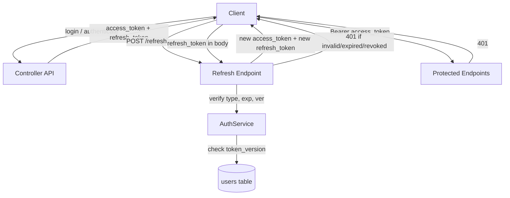
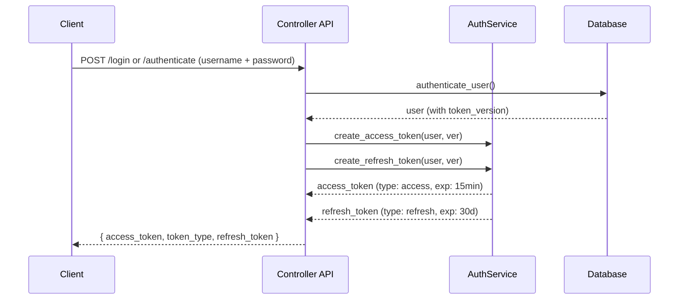
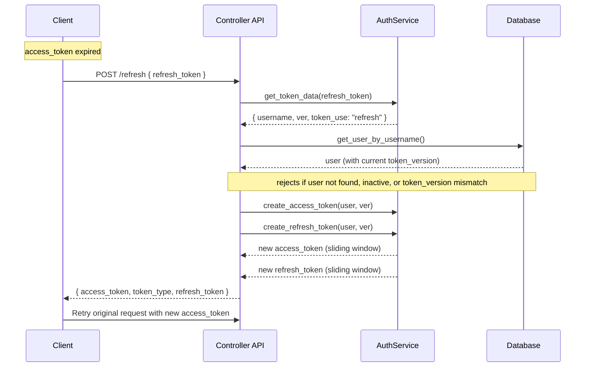
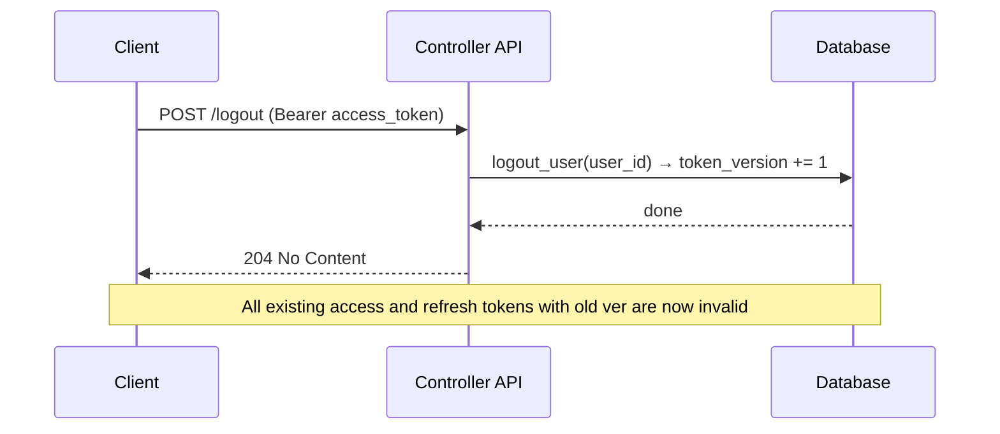

# Stateless JWT Refresh Token Mechanism

## Overview

GNS3 server now supports a stateless JWT refresh token mechanism for interactive sessions (e.g., Web UI). This allows clients to stay authenticated across page reloads without repeated username/password prompts, while keeping access tokens short-lived.

No new database table or migration is required — refresh tokens are signed JWTs using the same secret and algorithm as access tokens.

## Architecture



## Business Process

### Login / Authenticate Flow



### Refresh Flow (Silent Renewal)



### Logout — Token Revocation



## API Endpoints

| Method | Path | Description | Authentication |
|--------|------|-------------|---------------|
| POST | `/v3/access/users/login` | Login with form data, returns access + refresh tokens | Public |
| POST | `/v3/access/users/authenticate` | Login with JSON, returns access + refresh tokens | Public |
| POST | `/v3/access/users/refresh` | Exchange a refresh token for a new access token + refresh token | Public (token itself proves identity) |
| POST | `/v3/access/users/logout` | Revoke all tokens for the current user | Bearer token required |

### POST /v3/access/users/refresh

**Request:**
```json
{
  "refresh_token": "<refresh_token>"
}
```

**Response 200:**
```json
{
  "access_token": "<new_access_token>",
  "token_type": "bearer",
  "refresh_token": "<new_refresh_token>"
}
```

**Error Responses:**
- `401` — Invalid, expired, or revoked refresh token
- `422` — Missing `refresh_token` field in request body

## Security Design

### Token Claims

| Claim | Access Token | Refresh Token |
|-------|-------------|---------------|
| `sub` | username | username |
| `exp` | 24h (configurable) | 30d (configurable) |
| `ver` | user's `token_version` | user's `token_version` |
| `type` | `"access"` | `"refresh"` |

### Key Security Properties

- **Type-based isolation**: Access tokens (`type: access`) are rejected by `/refresh`. Refresh tokens (`type: refresh`) are rejected by HTTP and WebSocket authentication paths. This prevents a stolen long-lived refresh token from being used directly for API access.
- **Token version integration**: Both token types carry the user's `token_version`. `logout` increments `token_version` in the database, immediately invalidating all outstanding access and refresh tokens.
- **Stateless (no replay detection)**: Since there is no `refresh_tokens` database table, a stolen refresh token remains valid until its `exp` or until the user logs out. This is an accepted trade-off for avoiding a new table and migration.
- **Sliding window**: Each `/refresh` call issues a new refresh token with a fresh expiry, keeping active sessions alive indefinitely until logout or inactivity.

### Implementation Files

- `gns3server/services/authentication.py` — `_create_token`, `create_access_token`, `create_refresh_token`, `get_token_data`
- `gns3server/api/routes/controller/users.py` — `refresh_access_token` endpoint handler
- `gns3server/api/routes/controller/dependencies/authentication.py` — `_reject_refresh_token` guard in HTTP and WebSocket paths
- `gns3server/schemas/controller/tokens.py` — `Token`, `TokenData`, `RefreshTokenRequest` models
- `gns3server/schemas/config.py` — `jwt_refresh_token_expire_minutes` configuration

## Configuration

| Setting | Default | Description |
|---------|---------|-------------|
| `Controller.jwt_access_token_expire_minutes` | 1440 (24h) | Access token TTL. Web UI recommends 15 min. |
| `Controller.jwt_refresh_token_expire_minutes` | 43200 (30d) | Refresh token TTL. |
| `Controller.jwt_secret_key` | (random) | HMAC signing key for all JWT tokens. |

## Notes

- **Web UI integration**: The client should implement a response interceptor that catches 401, silently calls `/refresh`, and retries the original request. Multiple concurrent 401s should be queued with a single refresh request.
- **No per-session revocation**: All tokens for a user share the same `token_version`. Logout revokes everything. Per-session granularity would require adding a `refresh_tokens` table.
- **Rate limiting**: `/refresh` is a public endpoint with a valid credential (the refresh token). Rate limiting is recommended if brute-force attacks are a concern.
