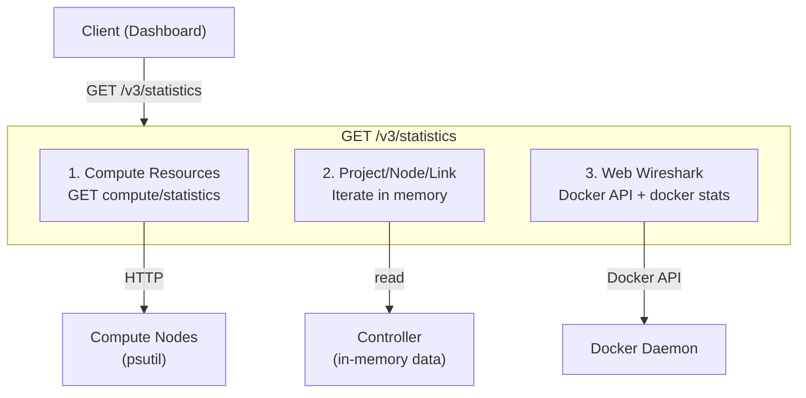
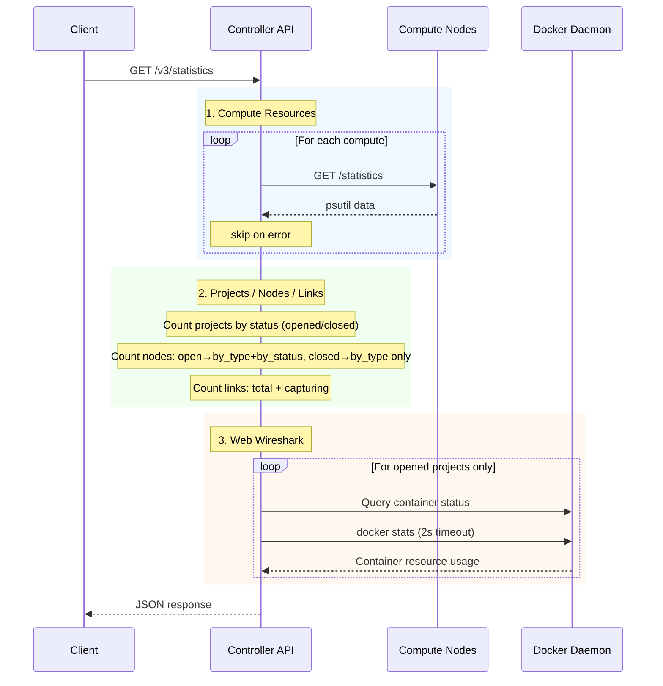

<!--
SPDX-License-Identifier: CC-BY-SA-4.0
See LICENSE file for licensing information.
-->

# Statistics API

## Overview

Aggregated server statistics API for monitoring dashboards. Collects compute resources, project/node/link counts, and Web Wireshark container status in a single request.

## Architecture



## Data Collection Flow



## API Endpoints

| Method | Path | Description | Auth |
|--------|------|-------------|------|
| GET | `/v3/statistics` | Aggregated server statistics | Session |
| GET | `/v3/compute/statistics` | Single compute resource stats | Basic Auth |

## Response

```json
{
  "computes": [
    {
      "compute_id": "local",
      "compute_name": "Local",
      "statistics": {
        "memory_total": 16777216000,
        "memory_free": 8000000000,
        "memory_used": 8777216000,
        "swap_total": 2147479552,
        "swap_free": 1500000000,
        "swap_used": 647279552,
        "cpu_usage_percent": 45,
        "memory_usage_percent": 52,
        "swap_usage_percent": 30,
        "disk_usage_percent": 67,
        "load_average_percent": [12, 8, 5]
      }
    }
  ],
  "projects": {
    "total": 5,
    "opened": 3,
    "closed": 2
  },
  "nodes": {
    "total": 42,
    "open_project_nodes": 30,
    "closed_project_nodes": 12,
    "by_type": { "qemu": 20, "docker": 12, "dynamips": 6, "vpcs": 4 },
    "by_status": { "started": 25, "stopped": 12, "suspended": 5 }
  },
  "links": {
    "total": 38,
    "capturing": 2
  },
  "webwireshark": {
    "total_containers": 1,
    "running_containers": 1,
    "active_sessions": 2,
    "containers": [
      {
        "project_id": "e16e2b51-9ba9-403b-9df4-b2915d7508a3",
        "project_name": "test-project",
        "container_id": "6edc9029bac0",
        "status": "running",
        "running": true,
        "active_sessions": 2,
        "memory_limit": "2.0 GB",
        "cpu_limit": "1.0",
        "pids_limit": 1000,
        "memory": "272.5MiB / 4GiB",
        "cpu": "0.23%",
        "pids": 69
      }
    ]
  }
}
```

## Field Reference

### `computes[]`

| Field | Type | Description |
|-------|------|-------------|
| `compute_id` | string | Compute identifier |
| `compute_name` | string | Display name |
| `statistics` | object | Resource usage (see below) |

**`statistics` fields:**

| Field | Type | Description |
|-------|------|-------------|
| `memory_total` | int | Total RAM (bytes) |
| `memory_free` | int | Available RAM (bytes) |
| `memory_used` | int | Used RAM (bytes) |
| `swap_total` | int | Total swap (bytes) |
| `swap_free` | int | Free swap (bytes) |
| `swap_used` | int | Used swap (bytes) |
| `cpu_usage_percent` | int | CPU usage 0-100 |
| `memory_usage_percent` | int | RAM usage 0-100 |
| `swap_usage_percent` | int | Swap usage 0-100 |
| `disk_usage_percent` | int | Project dir disk usage 0-100 |
| `load_average_percent` | int[] | Load avg per core (1/5/15 min) |

### `projects`

| Field | Type | Description |
|-------|------|-------------|
| `total` | int | All projects |
| `opened` | int | Currently opened |
| `closed` | int | Currently closed |

### `nodes`

| Field | Type | Description |
|-------|------|-------------|
| `total` | int | All nodes across projects |
| `open_project_nodes` | int | Nodes in opened projects (has runtime status) |
| `closed_project_nodes` | int | Nodes in closed projects (from topology JSON, no status) |
| `by_type` | object | Count by node type (qemu, docker, etc.) |
| `by_status` | object | Count by status — **open project nodes only** |

### `links`

| Field | Type | Description |
|-------|------|-------------|
| `total` | int | All links across projects |
| `capturing` | int | Links currently capturing |

### `webwireshark`

| Field | Type | Description |
|-------|------|-------------|
| `total_containers` | int | All Wireshark containers |
| `running_containers` | int | Currently running |
| `active_sessions` | int | Active capture sessions |
| `containers` | array | Per-container details (opened projects only) |

**`containers[]` fields:**

| Field | Type | Description |
|-------|------|-------------|
| `project_id` | string | Project UUID |
| `project_name` | string | Project name |
| `container_id` | string | Docker container ID (12 chars) |
| `status` | string | Container status (running, exited, etc.) |
| `running` | bool | Is running |
| `active_sessions` | int | Active captures in this project |
| `memory_limit` | string | Configured memory limit (e.g. `"2.0 GB"`, `"unlimited"`) |
| `cpu_limit` | string | Configured CPU limit (e.g. `"1.0"`, `"unlimited"`) |
| `pids_limit` | int/string | Process limit (e.g. `1000`, `"unlimited"`) |
| `memory` | string | Live memory usage (conditional, see notes) |
| `cpu` | string | Live CPU usage (conditional, see notes) |
| `pids` | int | Live process count (conditional, see notes) |

## Error Responses

| Status | Description |
|--------|-------------|
| 401 | Unauthorized — invalid or missing session |
| 500 | Internal server error |

## Notes

- **Compute stats are best-effort**: if a compute is unreachable, it is skipped (logged as error) and other data is still returned
- **`by_status` only reflects open project nodes**: closed projects store topology in JSON without runtime status
- **Live container stats** (`memory`, `cpu`, `pids`) are only present when `docker stats` succeeds — may be absent if the Docker daemon is slow (2s timeout)
- **Web Wireshark containers** are only queried for opened projects
