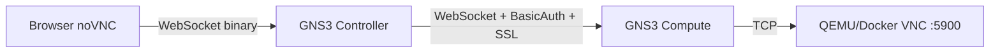
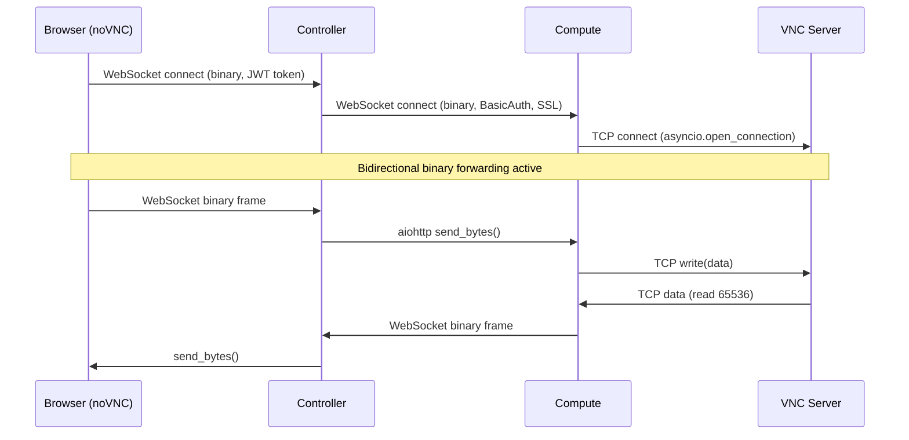

<!--
SPDX-License-Identifier: CC-BY-SA-4.0
See LICENSE file for licensing information.
-->

# VNC WebSocket Console

## Overview

GNS3 server supports WebSocket-based VNC console access, enabling browser-based graphical console connections to QEMU and Docker VMs without requiring standalone VNC client applications.

This implementation uses GNS3's API layer as a transparent WebSocket-to-TCP proxy, forwarding binary VNC protocol data between the browser and the VM's VNC server.

## Architecture

### Connection Flow



**Controller** acts as a WebSocket-to-WebSocket relay (JWT auth, IPv6 handling).
**Compute** acts as a WebSocket-to-TCP bridge (validates node state, opens VNC TCP connection).

### Components

1. **Browser (noVNC)**
   - HTML5 VNC client running in the browser
   - Connects via WebSocket using `binary` subprotocol
   - Handles RFB protocol (Remote Frame Buffer) for VNC

2. **GNS3 Controller API**
   - WebSocket endpoint: `/v3/projects/{project_id}/nodes/{node_id}/console/vnc`
   - Authentication: JWT token via query parameter
   - Authorization: RBAC privilege check via `has_privilege_on_websocket("Node.Console")`
   - Proxies WebSocket to compute node (WebSocket-to-WebSocket relay)
   - Handles IPv6 addresses by wrapping in brackets

3. **GNS3 Compute API**
   - WebSocket endpoint: `/v3/compute/projects/{project_id}/{node_type}/nodes/{node_id}/console/vnc`
   - Authentication: HTTP Basic Auth via `ws_compute_authentication()`
   - Establishes TCP connection to VNC server, bridges WebSocket ↔ TCP

4. **Node (QEMU/Docker)**
   - VNC server listening on configured port (default: 5900+)
   - RFB protocol for remote display

## API Endpoints

### Controller WebSocket Endpoint

**URL**: `ws://{controller_host}:{port}/v3/projects/{project_id}/nodes/{node_id}/console/vnc?token={jwt_token}`

**Authentication**:
- JWT token via query parameter
- User must have `Node.Console` privilege

**WebSocket Subprotocols**:
- Accepts: `binary`
- Used by noVNC for binary data transfer

**Request Example**:
```javascript
const token = "eyJ0eXAiOiJKV1QiLCJhbGc...";
const wsUrl = `ws://localhost:3080/v3/projects/${projectId}/nodes/${nodeId}/console/vnc?token=${token}`;

const ws = new WebSocket(wsUrl, 'binary');
ws.binaryType = 'arraybuffer';
```

### Compute WebSocket Endpoint

**URL**: `ws://{compute_host}:{port}/v3/compute/projects/{project_id}/{node_type}/nodes/{node_id}/console/vnc`

**Authentication**:
- HTTP Basic Auth via `ws_compute_authentication()` dependency
- Configured via `settings.Server.compute_username` (default: `gns3`) and `settings.Server.compute_password` (default: empty)

**Response**:
- Bidirectional binary WebSocket connection
- Transparent VNC protocol forwarding

## Supported Node Types

### QEMU VMs

**Console Type Configuration**:
```json
{
  "console_type": "vnc",
  "console": 5900,
  "console_resolution": "1024x768"
}
```

**QEMU Parameters**:
```bash
-vnc :0  # VNC on display 0 (port = 5900 + display)
```

**Implementation**:
- File: `gns3server/api/routes/compute/qemu_nodes.py`
- Endpoint: `/{node_id}/console/vnc`
- Method: `start_vnc_websocket_console(websocket)`

### Docker Containers

**Console Type Configuration**:
```json
{
  "console_type": "vnc",
  "console": 5900,
  "console_resolution": "1024x768",
  "console_http_port": 8080,
  "console_http_path": "/"
}
```

**Implementation**:
- File: `gns3server/api/routes/compute/docker_nodes.py`
- Endpoint: `/{node_id}/console/vnc`
- Method: `start_vnc_websocket_console(websocket)`

## WebSocket Data Forwarding

### Compute Layer (WebSocket ↔ TCP)

**Location**: `gns3server/compute/base_node.py` — `start_vnc_websocket_console()`

1. Validates node is started and `console_type == "vnc"`; closes WebSocket with code 1000 otherwise
2. Opens TCP connection to VNC server at `console_host:console_port`
3. Runs two concurrent tasks via `asyncio.wait(FIRST_COMPLETED)`:
   - `ws_forward()`: WebSocket → TCP (catches `WebSocketDisconnect`)
   - `vnc_forward()`: TCP → WebSocket (reads 65536-byte buffer)
4. Cancels pending tasks, closes TCP writer on completion

### Controller Layer (WebSocket ↔ WebSocket)

**Location**: `gns3server/api/routes/controller/nodes.py` — `vnc_console()`

1. Authenticates user via `has_privilege_on_websocket("Node.Console")` dependency
2. Constructs compute URL with IPv6 bracket handling
3. Connects to compute WebSocket using `aiohttp.ws_connect()` with HTTP Basic Auth and SSL context
4. Uses `asyncio.ensure_future()` for client→compute forwarding, `async for msg` iteration for compute→client

### Data Flow



## Authentication & Authorization

### Controller Layer

1. **Authentication**:
   - JWT token validation via `has_privilege_on_websocket("Node.Console")` dependency
   - Token passed as query parameter: `?token={jwt}`

2. **Authorization**:
   - RBAC privilege check: `Node.Console`
   - Per-node access control

3. **WebSocket Subprotocol**:
   - Client requests: `binary`
   - Server accepts: `binary` (if requested)

### Compute Layer

1. **Authentication**:
   - HTTP Basic Auth
   - Credentials from controller config
   - Username: `settings.Server.compute_username`
   - Password: `settings.Server.compute_password`

2. **Node Validation**:
   - Check node exists
   - Check node is started
   - Check console type is `vnc`

## Configuration

### Server Settings

**Controller Configuration** (`gns3-server.conf`):
```ini
[Server]
host = 0.0.0.0
port = 3080
```

**Compute Configuration** (same file):
```ini
[Server]
compute_username = gns3
compute_password =    # empty by default, must be set for compute auth
```

### VNC Port Range

VNC console ports are allocated from a configurable range (`gns3server/schemas/config.py`):

| Setting | Default | Range |
|---------|---------|-------|
| `vnc_console_start_port_range` | 5900 | 5900–65535 |
| `vnc_console_end_port_range` | 10000 | 5900–65535 |

Validation: `vnc_console_end_port_range` must be greater than `vnc_console_start_port_range`.

### Node Settings

**QEMU VM Example**:
```json
{
  "name": "vm-1",
  "node_type": "qemu",
  "console_type": "vnc",
  "console": 5900,
  "console_resolution": "1280x720",
  "properties": {
    "qemu_path": "/usr/bin/qemu-system-x86_64"
  }
}
```

**Docker Container Example**:
```json
{
  "name": "container-1",
  "node_type": "docker",
  "console_type": "vnc",
  "console": 5900,
  "console_resolution": "1024x768",
  "console_http_port": 8080
}
```

## Troubleshooting

### Common Issues

**1. "Node is not started"**
- **Symptom**: WebSocket closes immediately
- **Solution**: Start the VM before opening console
- **API Check**: `GET /v3/projects/{project_id}/nodes/{node_id}` → verify `status == "started"`

**2. "Console type is not vnc"**
- **Symptom**: WebSocket closes with error
- **Solution**: Set node console_type to "vnc"
- **API Update**: `PUT /v3/projects/{project_id}/nodes/{node_id}` with `{"console_type": "vnc"}`

**3. "Cannot connect to VNC server"**
- **Symptom**: Connection timeout
- **Possible Causes**:
  - VNC server not listening
  - Port conflict
  - Firewall blocking connection
- **Verification**:
  ```bash
  # Check if VNC is listening
  netstat -tlnp | grep 5900

  # Check QEMU process
  ps aux | grep qemu
  ```

**4. WebSocket Subprotocol Negotiation Failed**
- **Symptom**: Connection rejected during handshake
- **Solution**: Ensure noVNC sends `binary` subprotocol
- **Browser Console Check**:
  ```javascript
  console.log(ws.protocol);  // Should be "binary"
  ```

**5. Authentication Errors**
- **Symptom**: HTTP 401/403 responses
- **Controller**: Check JWT token is valid and not expired
- **Compute**: Verify compute username/password in config

### Debug Logging

**Enable Detailed Logging**:
```ini
[gns3server]
debug = true
```

**Check Controller Logs**:
```bash
# Look for WebSocket connection messages
grep "VNC console WebSocket" /var/log/gns3/gns3.log
```

**Check Compute Logs**:
```bash
# Look for VNC forwarding messages
grep "Connected to VNC server" /var/log/gns3/gns3.log
```

**Browser Console**:
```javascript
// Enable noVNC debugging
RFB.messages.log = function(msg) { console.log(msg); };
```

## Security

### Authentication

1. **Controller → Client**
   - JWT token with expiration
   - RBAC authorization
   - Privilege: `Node.Console`

2. **Controller → Compute**
   - HTTP Basic Auth via `aiohttp.BasicAuth`
   - SSL context from `Controller.instance().ssl_context()`
   - Raises `ControllerForbiddenError` if `compute_username` is not set

3. **VNC Server**
   - Optional VNC password (QEMU only)
   - Configured via node properties

### Network Security

**Recommendations**:
1. Use HTTPS/WSS for production deployments
2. Firewall compute API ports
3. Use short-lived JWT tokens
4. Enable VNC password for sensitive VMs

**Example**:
```bash
# Controller with TLS
gns3server --ssl --cert /path/to/cert.pem --key /path/to/key.pem

# VNC with password
qemu-system-x86_64 -vnc :0,password
```

### WebSocket Security

**Subprotocol Validation**:
- Only `binary` subprotocol is accepted
- Prevents protocol downgrade attacks

**Origin Validation**:
- Browser enforces same-origin policy
- Configure CORS if using separate domains

## Limitations

1. **Single Client per VNC Port**
   - VNC protocol supports one client at a time
   - New connections disconnect existing clients

2. **No Audio Redirection**
   - VNC protocol does not support audio

3. **No USB Redirection**
   - VNC protocol does not support device redirection

4. **Performance Overhead**
   - WebSocket-to-TCP bridging adds processing overhead compared to native VNC clients

## References

- [RFB Protocol 3.8](https://tools.ietf.org/html/rfc6143) - VNC Protocol Specification
- [noVNC Documentation](https://github.com/novnc/noVNC) - HTML5 VNC Client
- [FastAPI WebSocket](https://fastapi.tiangolo.com/advanced/websockets/) - WebSocket Implementation
- [GNS3 Documentation](https://docs.gns3.com/) - General GNS3 Documentation

## Version History

| Version | Date | Changes |
|---------|------|---------|
| 1.1 | 2026-04-19 | Review against code: fix buffer size, auth details, add port range config, remove unverified content |
| 1.0 | 2026-03-17 | Initial VNC WebSocket documentation |
