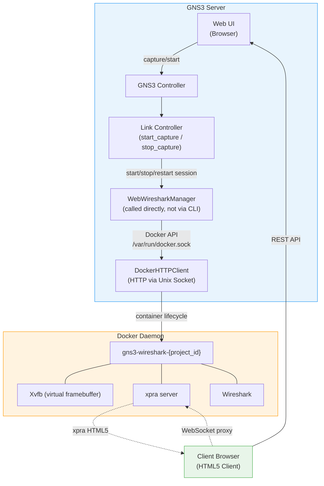
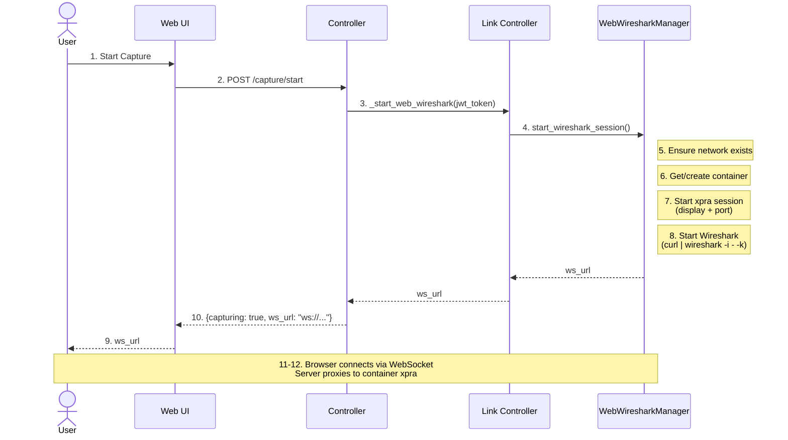
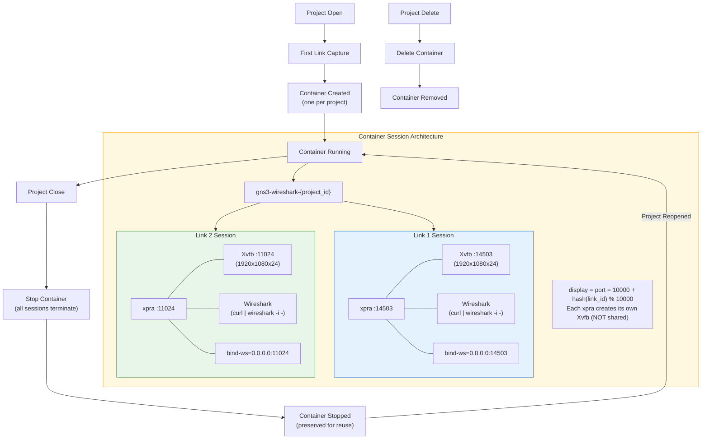
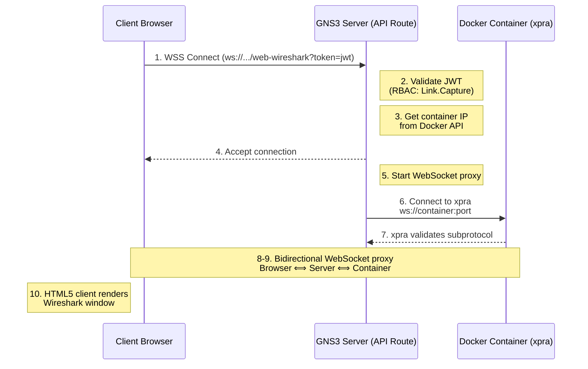
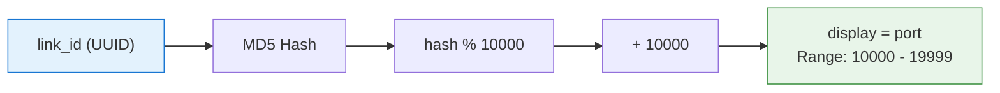
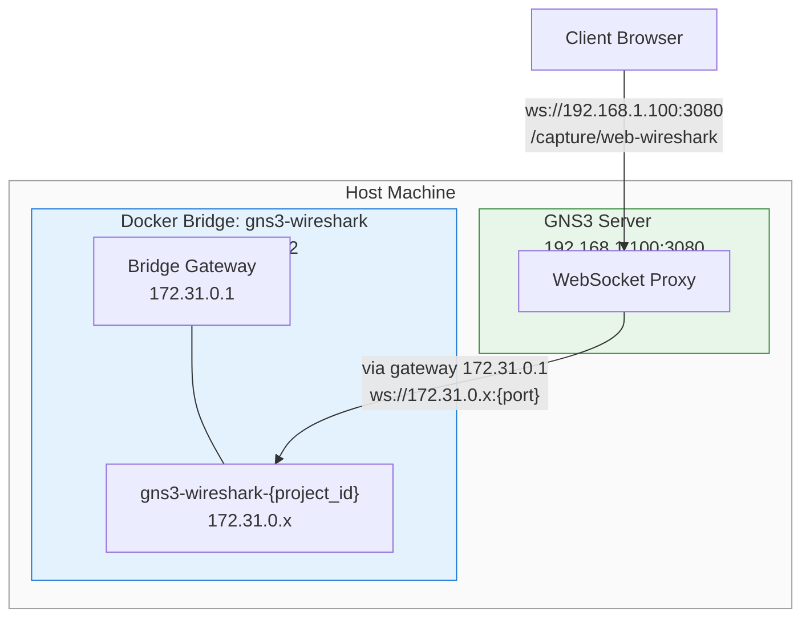
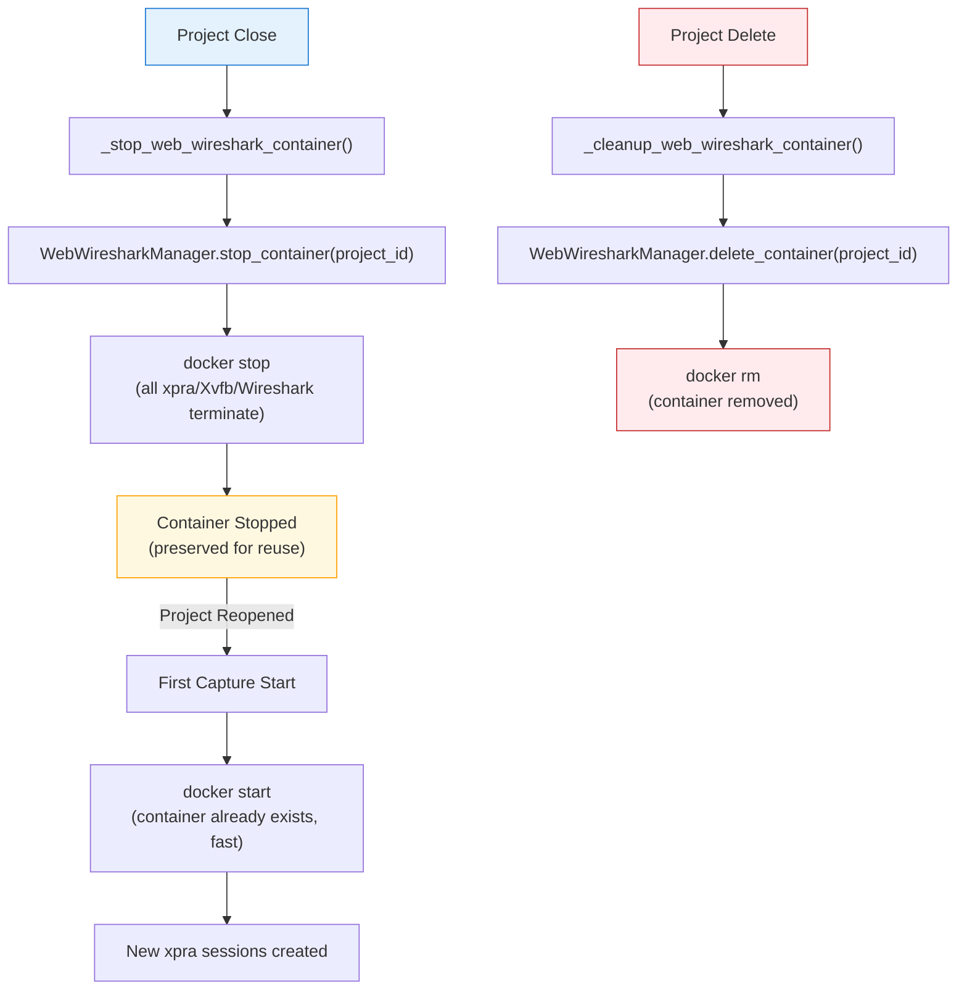

<!--
SPDX-License-Identifier: CC-BY-SA-4.0
See LICENSE file for licensing information.
-->

> This documentation is organized by AI with reference to actual code. AI can make mistakes — please verify against the source code when in doubt.


# Web Wireshark Feature - Business Process Documentation

## Overview

The **Web Wireshark** feature enables users to run Wireshark packet capture analysis directly in a web browser without requiring a desktop environment or VNC connection. This is achieved through an **xpra** (persistent remote applications) HTML5 client running inside a Docker container.

## Feature Summary

- **Core Capability**: Web-based packet capture visualization using Wireshark
- **Technology Stack**: Docker container + xpra + HTML5 WebSocket proxy
- **Target Users**: Network engineers and students who need to analyze network traffic in GNS3 topologies
- **Key Benefit**: Zero-install, browser-based packet capture analysis

---

## Installation

Before using Web Wireshark, install the GNS3 server and set up the Docker image:

```bash
# Development install
pip install -e . && wireshark

# Production install
pip install gns3-server && wireshark
```

This command will:
1. Install the gns3-server package
2. Pull the `gns3/web-wireshark:latest` image from Docker Hub
3. If pull fails, build the image locally using the included Dockerfile

The `wireshark` command shows the raw output from `docker pull` or `docker build`, allowing you to see the full progress.

---

## Architecture Overview



---

## Component Description

### 1. Web UI (Client Browser)
- User interface for starting/stopping packet capture
- Receives WebSocket URL for connecting to xpra HTML5 client
- No plugins required - pure HTML5/JavaScript

### 2. GNS3 Controller
- Orchestrates the capture workflow
- Validates user permissions (RBAC)
- Manages link capture state

### 3. manage_wireshark.py (Management CLI)
- Command-line interface for container and session management
- **For manual debugging and testing only** — the server calls `WebWiresharkManager` directly at runtime
- Handles Docker container lifecycle
- Manages xpra sessions per link

### 4. WebWiresharkManager
- Core business logic for Web Wireshark
- Handles container creation, session startup/shutdown
- Deterministic port allocation based on link_id

### 5. DockerHTTPClient
- Async HTTP client for Docker API
- Communicates via Unix socket (/var/run/docker.sock)
- Manages container lifecycle

### 6. Docker Container (gns3-wireshark-{project_id})
- Runs xpra server with HTML5 support
- Contains Xvfb (virtual framebuffer) for headless Wireshark
- Streams display to browser via WebSocket

---

## Business Processes

### Process 1: Start Packet Capture with Web Wireshark



**API Endpoint**: `POST /v3/projects/{project_id}/links/{link_id}/capture/start`

**Request Body**:
```json
{
  "wireshark": true,
  "data_link_type": "DLT_EN10MB",
  "capture_file_name": "capture.pcap"
}
```

**Response**:
```json
{
  "id": "link-uuid",
  "capturing": true,
  "ws_url": "ws://192.168.1.100:14500"
}
```

### Process 2: Container Lifecycle (Per Project)



### Process 3: WebSocket Connection Flow



**WebSocket Endpoint**: `ws://host/v3/projects/{project_id}/links/{link_id}/capture/web-wireshark?token=<jwt_token>`

### Process 4: Capture Data Flow

```mermaid
flowchart LR
    subgraph GNS3Node["GNS3 Node"]
        Router["Router / Switch"]
    end

    subgraph ComputeNode["Compute Node"]
        Capture["Link Capture Buffer"]
    end

    Router -->|"TAP (raw packets)"| Capture

    subgraph GNS3Server["GNS3 Server"]
        APIRoute["GET /capture/stream<br/>Proxies pcap stream"]
    end

    Capture -->|"pcap stream"| APIRoute

    subgraph DockerContainer["Docker Container"]
        direction TB
        Curl["curl -N -H 'Authorization: Bearer {jwt}'<br/>'{server}/capture/stream'"]
        Wireshark["wireshark -i - -k"]
        Xvfb["Xvfb :display<br/>(1920x1080x24)"]
        Xpra["xpra :display<br/>ws://0.0.0.0:{port}"]

        Curl -->|"stdin pipe"| Wireshark
        Wireshark -->|"renders to"| Xvfb
        Xvfb -->|"X11 display"| Xpra
    end

    APIRoute -.->|"pcap stream<br/>(curl fetches from container)"| Curl

    subgraph Browser["Client Browser"]
        HTML5Client["HTML5/xpra Client"]
        WSUI["Wireshark Web Interface"]
        HTML5Client --> WSUI
    end

    Xpra <-->|"WebSocket"| HTML5Client

    style GNS3Node fill:#f3e5f5,stroke:#7b1fa2
    style ComputeNode fill:#e8eaf6,stroke:#283593
    style GNS3Server fill:#e8f4fd,stroke:#2196f3
    style DockerContainer fill:#fff3e0,stroke:#ff9800
    style Browser fill:#e8f5e9,stroke:#4caf50
```



---

## Port Allocation Strategy

### Deterministic Port Mapping



| link_id | port/display |
|---------|-------------|
| `f233f27f-7432-49c3-9aa2-50e326a10eec` | 14503 |
| `a1b2c3d4-1234-5678-90ab-cdef12345678` | 11024 |
| `12345678-90ab-cdef-1234-567890abcdef` | 17892 |

**Benefits**:
- Same link always gets same port (deterministic)
- Display number = port number (same hash)
- No port conflicts between sessions
- Easy to predict and debug

---

## Network Architecture



---

## Session Management Commands

> **Note**: These commands are for manual debugging and testing only. The GNS3 server calls `WebWiresharkManager` directly at runtime.

### start

Starts Web Wireshark session for a specific link.

| Argument | Required | Default | Description |
|----------|----------|---------|-------------|
| `--project-id` | Yes | - | Project UUID |
| `--link-id` | Yes | - | Link UUID |
| `--jwt-token` | Yes | - | JWT authentication token |
| `--capture-url` | No | auto-detected | PCAP stream URL |
| `--image` | No | `gns3/web-wireshark:latest` | Docker image |
| `--memory` | No | `2g` | Memory limit |
| `--cpus` | No | `1.0` | CPU cores |
| `--pids-limit` | No | `1000` | Process limit |

```bash
python manage_wireshark.py start \
  --project-id "5af0fe00-..." \
  --link-id "f233f27f-..." \
  --jwt-token "eyJhbG..."
```

### Other Commands

| Command | Description | Key Arguments |
|---------|-------------|---------------|
| `stop` | Stop session for a specific link | `--project-id`, `--link-id` |
| `restart` | Restart session (reopens Wireshark window) | `--project-id`, `--link-id`, `--jwt-token` |
| `stop-all` | Stop all sessions for a project | `--project-id` |
| `delete` | Delete container (alias for delete-container) | `--project-id` |
| `stop-container` | Stop container without deleting | `--project-id` |
| `delete-container` | Delete the container | `--project-id` |

---

## Project Close/Delete Workflow



---

## API Endpoints Summary

| Method | Endpoint | Description | Privilege |
|--------|----------|-------------|-----------|
| POST | `/v3/projects/{id}/links/{id}/capture/start` | Start capture with Web Wireshark | Link.Capture |
| POST | `/v3/projects/{id}/links/{id}/capture/stop` | Stop capture | Link.Capture |
| POST | `/v3/projects/{id}/links/{id}/capture/wireshark/restart` | Restart Wireshark window | Link.Capture |
| GET | `/v3/projects/{id}/links/{id}/capture/stream` | Stream PCAP data | Link.Capture |
| GET | `/v3/projects/{id}/links/{id}/capture/file` | Download PCAP file | Link.Capture |
| WS | `/v3/projects/{id}/links/{id}/capture/web-wireshark` | WebSocket proxy for xpra | Link.Capture |

---

## Security Considerations

1. **RBAC Authentication**: All endpoints require `Link.Capture` privilege
2. **JWT Token Validation**: WebSocket connections validate JWT token
3. **WebSocket Subprotocol Negotiation**: Proper xpra subprotocol handling
4. **Container Isolation**: Each project gets its own container with isolated resources
5. **Network Segmentation**: Container runs on isolated Docker network (not host network)

---

## Performance Characteristics

### Startup & Shutdown Performance

| Step | Before Optimization | After Optimization | Improvement |
|------|---------------------|-------------------|-------------|
| **Health Check** | ~1.0s | ~0s | Docker native status |
| **Gateway Detection** | 0.85s | ~0.001s | Docker API vs exec |
| **Process Cleanup** | ~850ms | ~40ms | Host perspective recursive tree walk |
| **Xpra Startup** | 6.4s | ~3s | HTML5 client disabled |
| **Wireshark Launch** | ~1s | ~1s | No change |
| **Total Startup** | **~15s** | **~5-6s** | **67% faster** |

| Step | Before Optimization | After Optimization | Improvement |
|------|---------------------|-------------------|-------------|
| **Process Termination** | ~8s | ~20-40ms | Recursive tree walk, no orphans |
| **File Cleanup** | ~850ms | ~850ms | Docker exec (safety) |
| **Total Shutdown** | **~9s** | **~2s** | **78% faster** |

#### Startup Breakdown: First vs Subsequent

| Phase | First Startup (Container stopped) | Subsequent Startup (Container running) |
|-------|-----------------------------------|----------------------------------------|
| Container startup | ~1-2s | ~0s (already running) |
| Container health check | ~1s (unhealthy→healthy) | ~0s (already healthy) |
| Gateway detection | ~0.001s | ~0.001s |
| Process cleanup | ~40ms | ~40ms |
| Xpra startup | ~3s | ~3s |
| Wireshark launch | ~1s | ~1s |
| **Total** | **~6s** | **~5s** |

#### Measured Performance Data

**Startup (from production logs):**
```
13:46:53 → 13:46:59 = 6s (first startup with container start)
13:47:38 → 13:47:43 = 5s (subsequent startup, container running)
```

**Shutdown (from production logs):**
```
13:48:15 → 13:48:17 = 2s (complete cleanup, no orphan processes)
13:48:50 → 13:48:52 = 2s (complete cleanup, no orphan processes)
```

#### Key Optimizations

- **Complete Process Cleanup**: Recursive process tree traversal eliminates orphaned processes (Xvfb, pulseaudio, ibus-daemon)
- **Fast Gateway Detection**: Docker API query instead of container exec
- **Smart Health Check**: Trust Docker built-in status, no manual ping
- **Xpra Optimization**: Disabled unnecessary HTML5 client (`--html=off`)
- **Reduced Docker Exec Calls**: Combined X lock and xpra socket cleanup into single exec call

### Docker Exec Performance Limitations

**Important**: Docker daemon has internal queuing for concurrent exec requests to the same container.

#### Test Results (Same Container)

| Test Scenario | Execution Time | Avg Per Exec |
|--------------|----------------|--------------|
| Single docker exec | 0.854s | 0.854s |
| Serial 7 docker exec | 7.225s | 1.032s |
| Parallel 7 docker exec | 10.253s | 1.465s |

**Key Finding**: Parallel execution is **42% slower** than serial execution.

```
Serial:   7.225s  (7 requests processed sequentially)
Parallel: 10.253s (Docker daemon still processes sequentially + context switch overhead)
```

#### Impact on Web Wireshark

When stopping multiple capture sessions quickly:
- Each stop requires 1 docker exec (cleanup files)
- Docker daemon processes exec requests sequentially
- 7 sessions × ~1s each = ~7-10 seconds total
- User requests appear to "queue" even though they're concurrent

#### Optimization Strategy

Since Docker exec cannot be parallelized effectively:
1. **Minimize exec calls** - Already implemented: 2 calls → 1 call
2. **Accept serial processing** - No benefit to parallel execution
3. **Focus on fast exec content** - Use simple `rm -f` commands

#### Future Optimization Options

- Use Docker API instead of exec (requires container filesystem access)
- Delay cleanup to next startup (increases startup complexity)
- Batch multiple stops into single operation (requires API changes)

### Resource Usage (Per Wireshark Instance)
| Resource | Typical Usage |
|----------|---------------|
| Memory | 150-250 MB |
| CPU | 0.5-2% (idle to active) |
| Threads | ~30 threads |
| Disk I/O | Minimal |

### Container Configuration

Configured via `WebWiresharkSettings` in `gns3server/schemas/config.py`:

| Parameter | Default | Recommended | Description |
|-----------|---------|-------------|-------------|
| enabled | true | - | Enable/disable Web Wireshark feature |
| image | gns3/web-wireshark:latest | - | Docker image name |
| network_subnet | 172.31.0.0/22 | - | Docker bridge network subnet |
| Memory | 2GB | 2-4GB | Container memory limit |
| CPUs | 1.0 | 1.0-2.0 | Container CPU limit |
| PIDs Limit | 1000 | 1000 | Container process limit |

### Scaling Guidelines
| Instances | Memory | Use Case |
|-----------|--------|----------|
| 1-3 | 450-750 MB | Light projects |
| 4-6 | 600-1.5 GB | Medium projects |
| 7-10 | 1-2.5 GB | Large projects |
| 10+ | >2.5 GB | Increase memory |

---

## Known Limitations

1. **JWT Token Visibility**: Token passed via command-line arguments (visible in `/proc/<pid>/cmdline`)
2. **Single Container**: All Wireshark instances run in a single container per project
3. **Docker Dependency**: Requires Docker daemon running on the server
4. **Browser Support**: Requires modern browser with WebSocket support
5. **Port Range**: Limited to 10,000 unique ports (10000-19999)

---

## File Structure

```
gns3server/
├── controller/
│   ├── link.py                    # Link capture lifecycle
│   └── project.py                 # Project cleanup hooks
├── api/routes/controller/
│   └── links.py                   # REST/WebSocket API endpoints
└── agent/web_wireshark/
    ├── setup_wireshark_image.py   # Docker image setup tool
    ├── manage_wireshark.py        # CLI management tool (manual/debug use only)
    ├── manager.py                 # Session management logic (called by server)
    ├── docker_client.py           # Docker API client
    ├── stats.py                   # Container statistics collection
    ├── docker/
    │   └── Dockerfile            # Container image definition
    └── WEB_WIRESHARK.md          # Technical documentation
```
