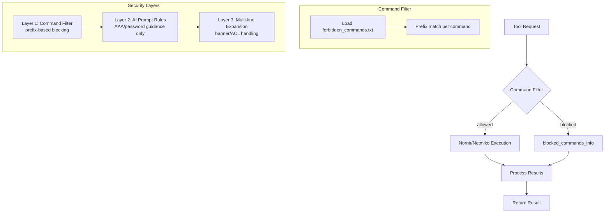
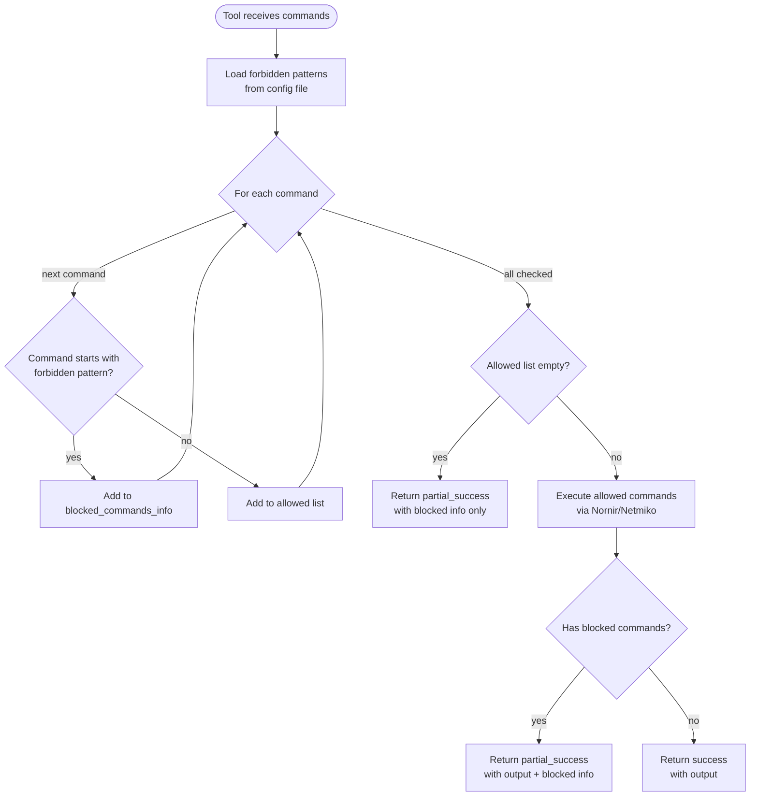
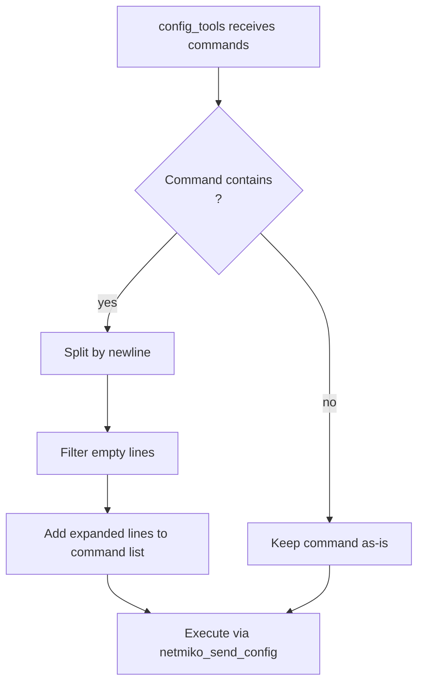

<!--
SPDX-License-Identifier: CC-BY-SA-4.0
See LICENSE file for licensing information.
-->

> This documentation is organized by AI with reference to actual code. AI can make mistakes — please verify against the source code when in doubt.


# Command Security Configuration

## Overview

GNS3-Copilot includes multiple security layers to prevent execution of commands that may cause issues in the lab environment:

- **Command Filtering**: Prevents commands that may timeout or lock up the console
- **Configuration Safety**: Restricts dangerous configuration changes (AAA, passwords, etc.)
- **Multi-line Command Handling**: Properly processes commands with embedded newlines (banner, etc.)

## Architecture



## Business Process

### Command Filtering Flow



### Multi-line Command Expansion Flow



## Tools Using Command Security

| Tool | File | Filter | Multi-line Expansion | Result Fields |
|------|------|--------|---------------------|---------------|
| `ExecuteMultipleDeviceCommands` | `display_tools_nornir.py` | Yes | No | `diagnostic_commands` |
| `ExecuteMultipleDeviceConfigCommands` | `config_tools_nornir.py` | Yes | Yes | `config_commands` |

## Command Filtering System

### Forbidden Commands Configuration

The forbidden commands list is loaded from the external [GNS3-Skills](https://github.com/yueguobin/GNS3-Skills) repository at `config/forbidden_commands.txt`.

**Format:**
- One command pattern per line
- **Prefix matching** (case-insensitive) — matches the beginning of each command
- Empty lines and lines starting with `#` are ignored

**Default patterns (used when skills repository is unavailable):**

| Pattern | Reason |
|---------|--------|
| `traceroute` | Can run 30+ seconds, exceeds tool timeout |
| `tracepath` | Similar to traceroute, long execution time |
| `tracert` | Windows traceroute, same timeout issues |
| `ping -f` | Flood ping can overwhelm lab devices |
| `debug` | Can produce overwhelming output and destabilize devices |
| `test` | May affect device stability |

### Result Format

**Status values:**

| Status | Condition |
|--------|-----------|
| `"success"` | All commands executed, none blocked |
| `"partial_success"` | Some commands blocked (including all blocked + execution succeeded) |
| `"failed"` | Execution failed (device not found, connection error, etc.) |

**Example — partial success (display tool):**

```json
{
    "device_name": "R-1",
    "status": "partial_success",
    "output": "...",
    "diagnostic_commands": ["show version", "show ip int brief"],
    "blocked_commands": ["traceroute 8.8.8.8"],
    "blocked_info": {
        "traceroute 8.8.8.8": "Command 'traceroute 8.8.8.8' is not allowed because it matches the forbidden pattern 'traceroute'. ..."
    }
}
```

> **Note:** `diagnostic_commands` is specific to display tools. Config tools use `config_commands` instead.

## Module Structure

**Command Filter:** `gns3server/agent/gns3_copilot/utils/command_filter.py`

| Function | Purpose |
|----------|---------|
| `filter_forbidden_commands(commands)` | Returns `(allowed_commands, blocked_commands_info)` |
| `is_command_forbidden(command)` | Check if a single command matches a forbidden pattern |
| `get_forbidden_commands()` | Get current forbidden patterns list |
| `reload_forbidden_commands()` | Directly load and cache commands from skills repository |

**Integration points:**
- `display_tools_nornir.py` — `_filter_forbidden_commands_from_device_configs()`
- `config_tools_nornir.py` — `_filter_forbidden_commands_from_device_configs()` + `_expand_multiline_commands()`

## Configuration Safety (AI Prompt Level)

In addition to the command filter, the AI agent is instructed via system prompt (`lab_automation_assistant_prompt.py`) to handle sensitive configuration commands with caution:

**Prompt-enforced rules:**
- **FORBIDDEN (guidance only):** `enable secret`, `username`, `aaa new-model`, `service password-encryption`, `line vty` — AI provides configuration guidance instead of executing
- **Caution required:** `reload`, `erase`, `format` — AI warns user before executing destructive operations

> These are prompt-level rules, not code-level enforcement. Users can always execute commands directly via device console or SSH/Telnet.

## Multi-line Command Handling

Commands containing `\n` are automatically split before execution by `config_tools_nornir.py:_expand_multiline_commands()`.

**Example:** `["banner motd #\nWelcome\n#"]` becomes `["banner motd #", "Welcome", "#"]`

Applies to any command with embedded newlines: `banner`, multi-line ACLs, route-maps, etc.

## Configuration

### Customizing Forbidden Commands

Edit `config/forbidden_commands.txt` in the [GNS3-Skills repository](https://github.com/yueguobin/GNS3-Skills) and push the changes, then call `POST /copilot/reload/skills` to apply them without restarting the server.

## Implementation Verification

### Test Results (Live GNS3 Environment)

**Scenario:** IOU-L2-1 (Cisco IOS L3 switch), mixed allowed/forbidden commands.

```json
{
  "device_name": "IOU-L2-1",
  "status": "partial_success",
  "diagnostic_commands": [
    "show ip route", "show ip interface brief",
    "ping 10.0.0.1", "ping 10.0.0.2", "ping 10.0.0.4"
  ],
  "blocked_commands": ["traceroute 10.0.0.2"],
  "blocked_info": {
    "traceroute 10.0.0.2": "Command 'traceroute 10.0.0.2' is not allowed because it matches the forbidden pattern 'traceroute'. ..."
  }
}
```

| Feature | Status | Notes |
|---------|--------|-------|
| Prefix match filtering | Verified | `traceroute` correctly matched and blocked |
| Partial execution | Verified | Other commands executed successfully |
| `partial_success` status | Verified | Set correctly when blocked + succeeded |
| Multi-device support | Verified | Each device filtered independently |
| Non-blocking behavior | Verified | No tool timeouts or console issues |

## Future Enhancements

- **Regex support** for more sophisticated pattern matching
- **Per-project override files** for forbidden commands
- **Web UI configuration** for managing forbidden commands
- **Audit logging** for blocked command analysis
- **Per-command timeouts** instead of blocking
- **Interrupt mechanism** (Ctrl+C) for long-running commands

## Troubleshooting

| Problem | Solution |
|---------|----------|
| Command blocked unexpectedly | Check `blocked_commands` in result, identify matching pattern, edit `forbidden_commands.txt` |
| "File not found, using defaults" | Verify `config/forbidden_commands.txt` exists and is readable |
| Changes not taking effect | Call `POST /copilot/reload/skills` or restart server |

## Related Documentation

- [Skills Repository](skills-repository.md)
- [Fault Injection](fault-injection.md)
- [Chat API](chat-api.md)

