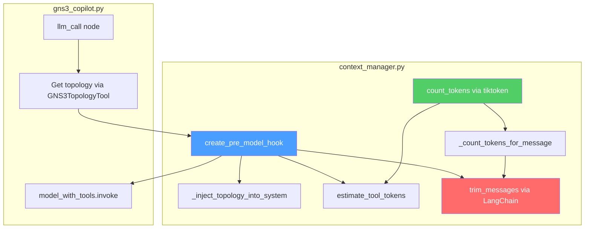
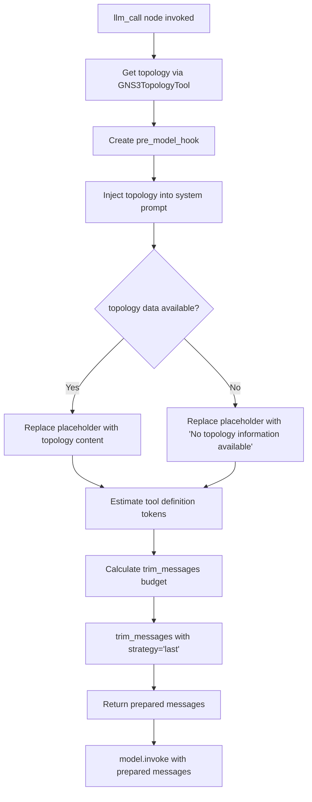
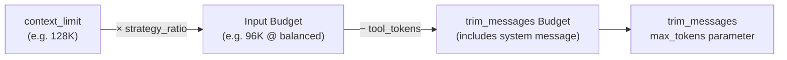

<!--
SPDX-License-Identifier: CC-BY-SA-4.0
See LICENSE file for licensing information.
-->

> This documentation is organized by AI with reference to actual code. AI can make mistakes — please verify against the source code when in doubt.


# LLM Context Window Management

## Overview

GNS3 Copilot's context window management prevents LLM context overflow by trimming conversation history to fit within configured token limits. It uses tiktoken for accurate token counting, supports three context strategies (conservative/balanced/aggressive), and automatically injects GNS3 topology information into the system prompt before each LLM call.

## Architecture



## Key Components

| Function | File | Purpose |
|----------|------|---------|
| `create_pre_model_hook()` | `context_manager.py` | Factory that creates the preprocessing hook |
| `_inject_topology_into_system()` | `context_manager.py` | Injects topology into system prompt via `{{topology_info}}` placeholder |
| `count_tokens()` | `context_manager.py` | Accurate token counting using tiktoken (`cl100k_base`) |
| `estimate_tool_tokens()` | `context_manager.py` | Estimates token cost of tool definitions (JSON serialization) |
| `_count_tokens_for_message()` | `context_manager.py` | Token counter adapter for LangChain's `trim_messages` |
| `llm_call()` | `gns3_copilot.py` | StateGraph node that orchestrates the full LLM call pipeline |

**Token Counting**: Uses tiktoken `cl100k_base` encoding (GPT-4 compatible, 95%+ accuracy for most modern LLMs).

**tiktoken Cache**: Encoding files are cached locally at `<agent_package>/cache/tiktoken/` to avoid repeated downloads. This is configured before tiktoken import via `TIKTOKEN_CACHE_DIR` environment variable.

**Required Dependency**: `tiktoken>=0.8.0` — if not installed, `ModuleNotFoundError` is raised at startup.

## Trimming Process



### Token Budget Calculation



**Key**: `max_tokens` passed to `trim_messages` **includes** the system message. System tokens are NOT subtracted separately — `trim_messages` handles system message preservation via `include_system=True`.

### Budget Calculation Example

| Step | Calculation | Result |
|------|------------|--------|
| Context limit | 128 (configured) | 128K tokens |
| Strategy ratio | balanced = 0.75 | 128 × 1000 × 0.75 = 96,000 |
| Tool definitions | estimated from JSON schema | ~1,725 tokens |
| trim_messages budget | 96,000 − 1,725 | **94,275 tokens** (includes system) |

### Trimming Priority

| Priority | Content | Behavior |
|----------|---------|----------|
| 1 | System Message (system prompt + topology) | Always kept (`include_system=True`) |
| 2 | Latest conversation messages | Kept from newest to oldest |
| 3 | Older conversation history | Discarded first when exceeding budget |

**Note**: System prompt and topology are merged into a single `SystemMessage` via the `{{topology_info}}` template variable and cannot be trimmed independently.

### Edge Case Handling

| Scenario | Behavior |
|----------|----------|
| System + tools > input budget | ERROR log with recommendations (reduce prompt/tools, use larger model, switch to conservative). `trim_messages` is still called — `include_system=True` ensures system message is kept, but no history messages will fit. |
| Trim budget < system × 1.5 | WARNING log: minimal room for conversation history |
| Invalid context_strategy | Falls back to `balanced` with WARNING log |
| `trim_messages` throws exception | Returns untrimmed messages (graceful degradation) |
| Missing `{{topology_info}}` placeholder | Returns original messages without injection, WARNING log |
| Topology retrieval fails | Injects `"(No topology information available)"` placeholder |

## Integration with GNS3 Copilot

**File**: `gns3server/agent/gns3_copilot/agent/gns3_copilot.py`

### Why Direct Call, Not Config-based?

The agent uses a **custom StateGraph** (`StateGraph(MessagesState)`), not LangGraph's pre-built agent. LangGraph's `pre_model_hook` config parameter only works with pre-built agents like `create_react_agent`.

| Agent Type | pre_model_hook Support |
|------------|------------------------|
| `create_react_agent` | Via `config={"configurable": {"pre_model_hook": ...}}` |
| `chat_agent_executor` | Via `config={"configurable": {"pre_model_hook": ...}}` |
| **Custom StateGraph** | **Not supported** — must call directly |

### Execution Flow

In the `llm_call` node of `gns3_copilot.py`:

1. Get `llm_config` from request-scoped context variable
2. Get `project_id` from `config["configurable"]`
3. Retrieve topology via `GNS3TopologyTool._run(project_id)`
4. Select tools based on `copilot_mode` (`teaching_assistant` vs `lab_automation_assistant`)
5. Load system prompt and create `pre_model_hook`
6. **Directly call** `pre_hook({"messages": messages, "topology_info": topology_info})` to prepare messages
7. Invoke `model_with_tools.invoke(prepared_messages)`

> **Note**: The actual `llm_call` function also includes defensive checks for missing config, empty messages, and topology retrieval errors — see source code for full details.

## Strategy Implementation

### Context Strategy Ratios

Defined as `CONTEXT_STRATEGY_RATIOS` in `context_manager.py`, with default `DEFAULT_CONTEXT_STRATEGY = "balanced"`.

| Strategy | Input Ratio | Output Reserved | Calculation |
|----------|-------------|-----------------|-------------|
| Conservative | 60% | 40% | `context_limit × 1000 × 0.60` |
| Balanced | 75% | 25% | `context_limit × 1000 × 0.75` |
| Aggressive | 85% | 15% | `context_limit × 1000 × 0.85` |

## Log Output

### Normal Case (topology injected)

```
INFO: Calling pre_hook to prepare 1 messages
INFO: ✓ Topology injected: 7722 chars, nodes: ['netshoot-1', 'R1', 'R2', 'IOU-L3-1', 'IOU-L3-2']
INFO: Context ready: 2 msgs, ~3815 tokens + 1725 tools = 5540 / 128K (4.3%), strategy=conservative
INFO: Messages prepared: 1 → 2
INFO: LLM call completed: tool_calls=0
```

### When Trimming Occurs

```
INFO: Calling pre_hook to prepare 50 messages
INFO: ✓ Topology injected: 8500 chars, nodes: ['R1', 'R2', ...]
INFO: Messages trimmed: 50 → 25 msgs. Total: ~82000 tokens + 1725 tools = 83725 / 128K (65.4%), strategy=balanced
INFO: Messages prepared: 50 → 25
```

### When Topology is None

```
INFO: Calling pre_hook to prepare 1 messages
WARNING: ✗ Topology data is None, injecting placeholder
INFO: Context ready: 2 msgs, ~800 tokens + 1725 tools = 2525 / 128K (2.0%), strategy=balanced
```

## Error Handling

| Error | Behavior | Resolution |
|-------|----------|------------|
| tiktoken not installed | `ModuleNotFoundError` at startup | `pip install tiktoken>=0.8.0` |
| `context_limit` missing | `ValueError` raised | Add `context_limit` to LLM config |
| Invalid `context_limit` | `ValueError` raised | Must be positive integer |
| Invalid `context_strategy` | WARNING, fallback to `balanced` | Use `conservative`/`balanced`/`aggressive` |
| `trim_messages` failure | ERROR log, returns untrimmed messages | Check message format compatibility |

## Deprecated API

`prepare_context_messages()` is deprecated. It remains in `context_manager.py` for backward compatibility but emits `DeprecationWarning`. Use `create_pre_model_hook()` instead.

## Related Source Files

- `gns3server/agent/gns3_copilot/agent/context_manager.py` — Context management core logic
- `gns3server/agent/gns3_copilot/agent/gns3_copilot.py` — LLM call node (StateGraph)
- `gns3server/agent/gns3_copilot/agent/model_factory.py` — Model creation and tool binding
