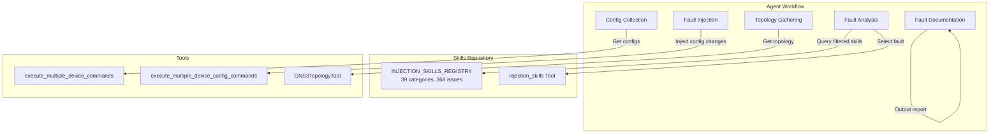
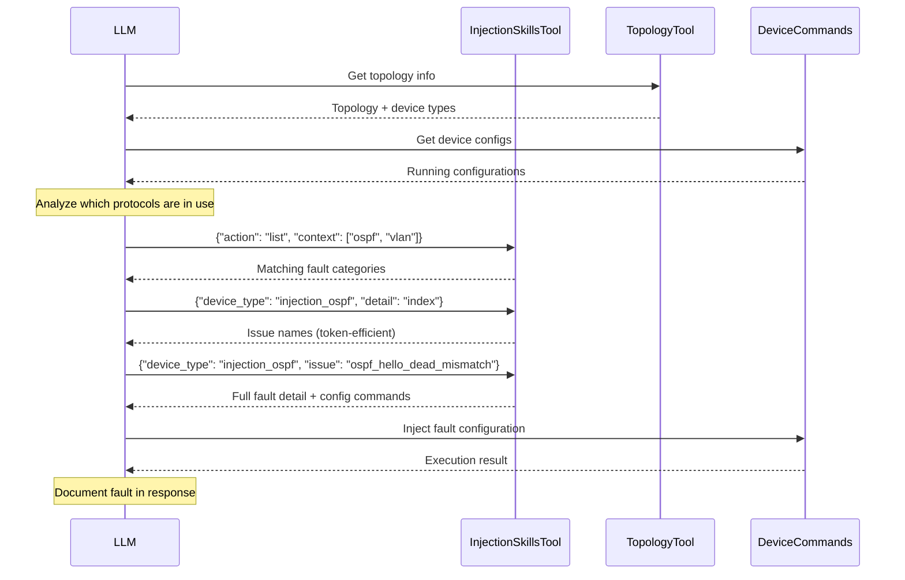

<!--
SPDX-License-Identifier: CC-BY-SA-4.0
See LICENSE file for licensing information.
-->

> This documentation is organized by AI with reference to actual code. AI can make mistakes — please verify against the source code when in doubt.


# Fault Injection Feature

## Overview

The fault injection feature enables GNS3 Copilot to automatically inject realistic network faults into GNS3 labs for troubleshooting training. The agent analyzes the topology, selects an appropriate fault based on the configured protocols, injects it, and documents the results.

## Architecture



## Injection Skills Tool

The `InjectionSkillsTool` (LangChain `BaseTool`) is the primary interface for querying available faults.

### Listing Faults (with context filter)

The LLM MUST pass topology context when listing faults:

```json
{"action": "list", "context": ["ospf", "bgp", "vlan"]}
```

This returns only faults matching the protocols found in the topology. The tool rejects calls without `context`:

```json
{
  "error": "context parameter is required when action='list'",
  "hint": "Analyze the topology and device configurations first...",
  "available_categories": ["bgp", "interface", "mpls", "ospf", ...]
}
```

### Getting Fault Details

Token-efficient usage pattern:

```json
// Step 1: List issue names only (~300 tokens)
{"device_type": "injection_ospf", "detail": "index"}

// Step 2: Get single issue detail (~500 tokens)
{"device_type": "injection_ospf", "issue": "ospf_hello_dead_mismatch"}
```

### Parameters

| Parameter | Required | Description |
|-----------|----------|-------------|
| `action` | No (`"get"`) | `"list"` to browse, `"get"` for details |
| `context` | **Yes** for `action="list"` | Protocols found in topology: `["ospf", "bgp"]` |
| `device_type` | Yes for `action="get"` | e.g. `"injection_ospf"` |
| `detail` | No (`"full"`) | `"index"` (names), `"summary"` (+desc), `"full"` (all) |
| `issue` | No | Single issue key for targeted detail |

## Fault Injection Workflow



## Injection Skills Repository

Skills are organized by protocol/category in the external [GNS3-Skills](https://github.com/yueguobin/GNS3-Skills) repository:

| Category | File | Example Issues |
|----------|------|----------------|
| OSPF | `injection/ospf_issues.yaml` | Hello/Dead mismatch, MTU mismatch, area mismatch |
| BGP | `injection/bgp_issues.yaml` | AS-path prepend, next-hop unreachable, route filtering |
| VLAN | `injection/vlan_issues.yaml` | Trunk allowed mismatch, native VLAN mismatch |
| STP | `injection/stp_issues.yaml` | Root guard, loop guard, port priority |
| MPLS | `injection/mpls_issues.yaml` | LDP session down, label binding failure |
| ... | 34 more files | 368 issues total |

## Recovery

Each injected fault includes restore commands in the documentation. The LLM always provides commands to fully revert all changes.

## API Endpoint

### POST /copilot/projects/{project_id}/chat/inject

Dedicated endpoint for fault injection. Internally sets `copilot_mode` to `troubleshooting_injection` and runs the agent.

**Request:**
```json
{
  "message": "Inject a network fault for troubleshooting practice",
  "session_id": "optional-session-uuid"
}
```

**Response:** Server-Sent Events (SSE) stream identical to the chat stream endpoint.

## Related Documentation

- [Skills Repository](skills-repository.md)
- [Command Security](command-security.md)
- [Chat API](chat-api.md)
