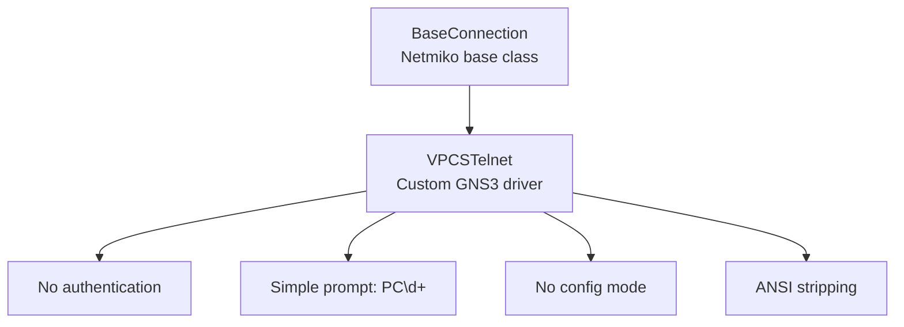
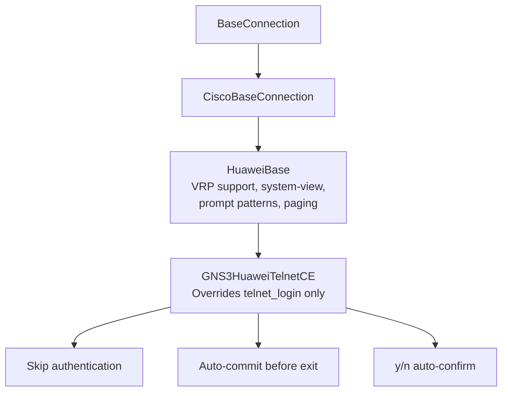
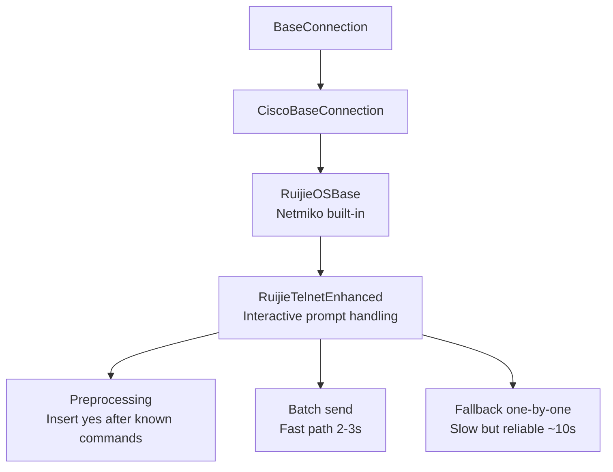
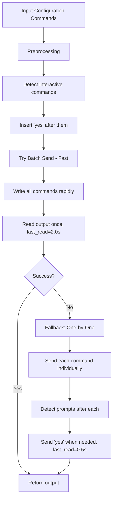
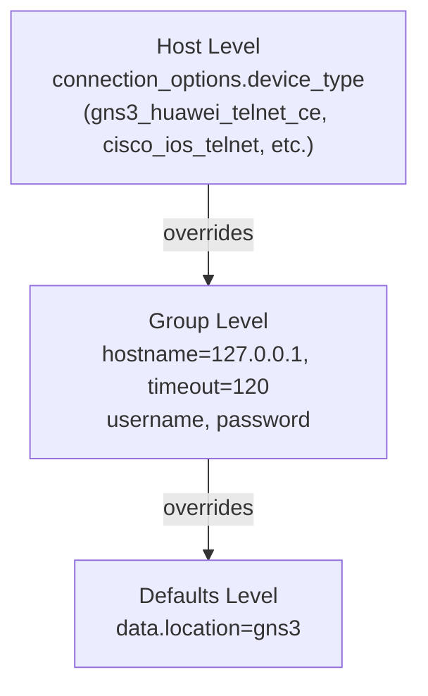
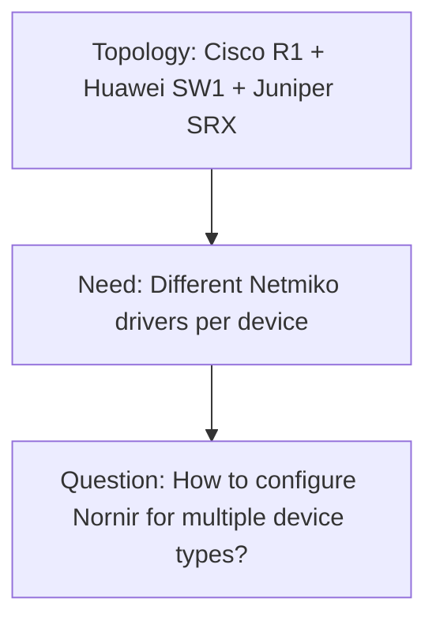
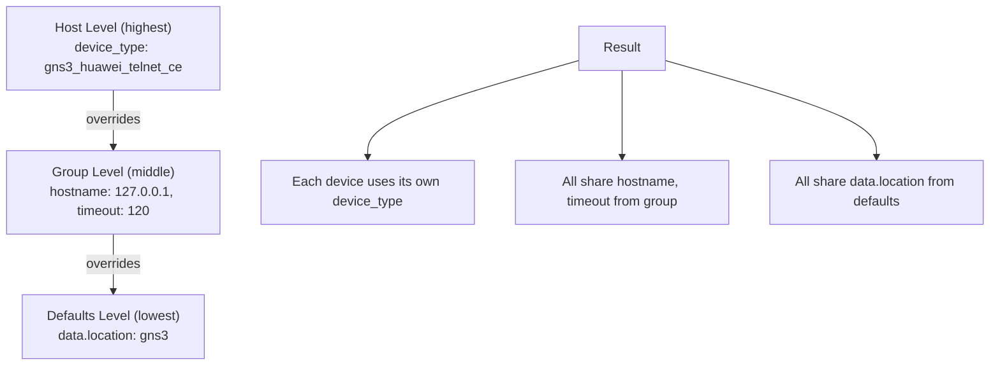

<!--
SPDX-License-Identifier: CC-BY-SA-4.0
See LICENSE file for licensing information.
-->

> This documentation is organized by AI with reference to actual code. AI can make mistakes — please verify against the source code when in doubt.


# Multi-Vendor Network Device Support

## Overview

GNS3-Copilot supports network devices from multiple vendors through Netmiko and Nornir integration. The system includes a custom Netmiko driver for Huawei devices in GNS3 emulation environments and supports dynamic device type detection.

## Supported Vendors

| Vendor | Device Type | Protocol | Status |
|--------|-------------|----------|--------|
| **Cisco** | `cisco_ios_telnet` | Telnet | ✅ Tested |
| **Huawei** | `gns3_huawei_telnet_ce` | Telnet | ✅ Tested (Custom Driver) |
| **Ruijie (锐捷)** | `gns3_ruijie_telnet` | Telnet | ✅ Tested (Custom Driver) |
| **VPCS** | `gns3_vpcs_telnet` | Telnet | ✅ Tested (Custom Driver, Simulator) |

## Custom VPCS Driver (`VPCSTelnet`)

### Problem Statement

VPCS (Virtual PC Simulator) is a lightweight virtual PC simulator used in GNS3 lab environments. Unlike network devices (routers/switches), VPCS devices:

1. **No authentication** - Direct console access without username/password
2. **Simple command interface** - No configuration modes
3. **Simple prompt pattern** - `PC1>`, `PC2>`, etc.

### Solution: Lightweight Custom Driver



**Why Not Use Standard Telnet Driver?**
- Standard drivers attempt authentication (times out)
- No support for VPCS-specific prompt patterns (`PC\d+>`)
- No need for configuration mode handling

### VPCSTelnet Implementation

#### Location
```
gns3server/agent/gns3_copilot/utils/custom_netmiko/vpcs_telnet.py
```

#### Key Features

**1. No Authentication**
```python
def telnet_login(self, pri_prompt_terminator=r"PC\d+>", ...):
    # Send returns until VPCS prompt detected
    for i in range(max_loops):
        self.write_channel(self.RETURN)
        output = self.read_channel()

        if re.search(pri_prompt_terminator, output):
            return output  # Success - VPCS prompt detected
```

**2. Simple Prompt Recognition**
```
PC1> ip 10.10.0.12/24 10.10.0.254
PC1> ping 10.10.0.254
```

**3. No Configuration Mode**
```python
def check_config_mode(self) -> bool:
    return False  # VPCS has no config mode

def config_mode(self) -> str:
    return ""  # No config mode to enter

def exit_config_mode(self) -> str:
    return ""  # No config mode to exit
```

**4. No Paging**
```python
def disable_paging(self) -> str:
    return ""  # VPCS doesn't use paging
```

**5. Custom `send_command`**
VPCS overrides `send_command` with non-standard defaults:
- `strip_prompt=False`, `strip_command=False`, `normalize=False` — VPCS output doesn't need standard Netmiko processing
- Uses `_strip_ansi_codes()` to clean terminal escape sequences from VPCS output

**6. ANSI Escape Code Stripping**
VPCS output often contains ANSI terminal codes. The `_strip_ansi_codes()` method strips bold, underline, reset, and color codes before returning output to callers.

### VPCS Tool Usage

The VPCS driver is used by the `execute_vpcs_commands` tool:

> File: `gns3server/agent/gns3_copilot/tools_v2/vpcs_tools_netmiko.py`

**VPCS Connection Parameters:**

VPCS devices use additional Netmiko parameters for reliable connections:
| Parameter | Value | Reason |
|-----------|-------|--------|
| `fast_cli` | `False` | VPCS is slow, disable fast CLI mode |
| `global_delay_factor` | `2.0` | Double the delay between commands |

```python
"connection_options": {
    "netmiko": {
        "extras": {
            "device_type": "gns3_vpcs_telnet",
            "fast_cli": False,
            "global_delay_factor": 2.0,
        }
    }
}
```

### VPCS Built-in Template Configuration

**✨ Automatic Tags - No Manual Configuration Required**

VPCS nodes created from the built-in template automatically include the necessary tags:

| Tag | Value | Purpose |
|-----|-------|---------|
| `device_type` | `gns3_vpcs_telnet` | Netmiko driver selection |

**Built-in Template Definition:**
> File: `gns3server/services/templates.py`

The VPCS built-in template includes `"tags": ["device_type:gns3_vpcs_telnet"]`, which is automatically applied to all VPCS nodes created from the template.

**User Benefits:**
- ✅ **No manual tagging required** — Tags are applied automatically when creating VPCS nodes
- ✅ **Automatic driver selection** — Copilot tools automatically use the correct Netmiko driver
- ✅ **Consistent behavior** — All VPCS nodes from the built-in template work identically
- ✅ **Zero configuration** — Users don't need to understand device_type tags

**How It Works:**
1. User creates a VPCS node from the built-in "VPCS" template
2. Node automatically inherits the tag: `device_type:gns3_vpcs_telnet`
3. Copilot tools read the tag and select the appropriate VPCS Netmiko driver
4. Commands execute using the VPCS-optimized driver (no authentication, simple prompts)

### Supported VPCS Commands

| Command | Description | Example |
|---------|-------------|---------|
| `ip` | Configure/show IP address | `ip 10.10.0.12/24 10.10.0.254` |
| `ping` | Test connectivity | `ping 10.10.0.254` |
| `arp` | Display ARP table | `arp` |
| `show ip` | Show IP configuration | `show ip` |
| `version` | Show VPCS version | `version` |
| `save` | Save configuration | `save` |
| `load` | Load configuration | `load` |

### Architecture Benefits

**Unified Tool Architecture:**
- ✅ Uses Nornir for connection management (same as network device tools)
- ✅ Uses Netmiko for command execution (consistent with other tools)
- ✅ Follows same patterns as `config_tools_nornir.py` and `display_tools_nornir.py`
- ✅ Simplified codebase - no need for separate telnetlib3 implementation

**Migration from telnetlib3:**
| Aspect | Old (telnetlib3) | New (Netmiko + Nornir) |
|--------|-----------------|-------------------------|
| Library | telnetlib3 | Netmiko |
| Framework | Manual threading | Nornir |
| Code Lines | ~490 lines | ~580 lines (with better structure) |
| Consistency | Unique implementation | Same as other tools |
| Maintenance | Separate code path | Unified architecture |

---

## Custom Huawei Driver (`GNS3HuaweiTelnetCE`)

### Problem Statement

GNS3-emulated Huawei devices connect via console **without requiring authentication**. Standard Netmiko drivers attempt username/password authentication, causing connection timeouts.

**Standard Driver Behavior:**
```
Telnet Connection → Wait for username prompt → Send username → Wait for password → Send password → Access
                    ^ Times out after 20 seconds
```

**GNS3 Huawei Device:**
```
Telnet Connection → Direct access to command line (no login prompts)
                    <HUAWEI>
```

### Solution: Custom Driver Architecture



**Why Inherit from HuaweiBase?**
- ✅ Built-in VRP (Versatile Routing Platform) command handling
- ✅ Huawei-specific configuration mode (`system-view`)
- ✅ Huawei prompt patterns (`<...>`, `[...]`)
- ✅ Huawei paging disable (`screen-length 0 temporary`)
- ✅ Minimal code changes - only override authentication

### GNS3HuaweiTelnetCE Implementation

#### Location
```
gns3server/agent/gns3_copilot/utils/custom_netmiko/huawei_ce.py
```

**Package Structure:**
```
custom_netmiko/
├── __init__.py              # Package initialization, auto-registers all drivers
├── huawei_ce.py             # Huawei CloudEngine custom driver
├── README.md                # Driver development guide
└── tests/                   # Unit tests
    ├── __init__.py
    └── test_huawei_ce.py    # Huawei CE driver tests
```

#### Key Features

1. **Skip Authentication**
   - Directly detect Huawei prompt patterns
   - No username/password prompts
   - Connection ready in < 1 second

2. **VRP Prompt Recognition**
   ```
   User view:    <HUAWEI>
   System view:  [HUAWEI]
   Interface:    [HUAWEI-GigabitEthernet0/0/1]
   ```

3. **Automatic Confirmation Handling**
   - Detects and responds to `[y/n]` prompts
   - Example: `return` command asks "Return to user view? [y/n]:"
   - Automatically sends `y` to confirm

4. **Proper Output Collection**
   - Uses Netmiko's `read_channel_timing()` for reliable output
   - Waits for command completion (2s no new data = done)
   - 30-second absolute timeout prevents hanging

5. **Auto-Commit Before Exit**
   - Automatically sends `commit` command before exiting config mode
   - Prevents "Uncommitted configurations [Y/N/C]" prompt
   - Ensures configuration changes are saved

#### Limitations

**Why Not Use the Standard `huawei_telnet` Driver?**
- The standard Netmiko Huawei driver (`huawei_telnet`) has known issues in GNS3 emulation environments
- This is the primary reason the custom `gns3_huawei_telnet_ce` driver was developed
- The custom driver is designed for GNS3 devices **without authentication**
- If your GNS3 Huawei device has been configured with authentication, remove it for GNS3 testing to use the custom driver

**When to Use:**

| Scenario | Recommendation |
|----------|---------------|
| GNS3 Huawei device | Always use `gns3_huawei_telnet_ce` |
| GNS3 device has auth configured | Remove auth, then use `gns3_huawei_telnet_ce` |

#### Method Overrides

**1. `telnet_login` - Skip Authentication**
```python
def telnet_login(self, pri_prompt_terminator=r"<\S+>|>\s*$",
                alt_prompt_terminator=r"\[\S+\]", ...) -> str:
    # Clear buffer
    self.read_channel()

    # Send returns until prompt detected
    for i in range(max_loops):
        self.write_channel(self.RETURN)
        output = self.read_channel()

        # Check for Huawei prompts
        if re.search(pri_prompt_terminator, output):
            return output  # Success!

    return output  # Best effort
```

**2. `send_config_set` - Configuration Commands**
```python
def send_config_set(self, config_commands, **kwargs) -> str:
    # Enter config mode
    output += self.config_mode(config_command="system-view")

    # Send all commands
    for cmd in config_commands:
        self.write_channel(f"{cmd}{self.RETURN}")
        time.sleep(delay_factor * 0.05)

    # Collect output using Netmiko standard method
    output += self.read_channel_timing(read_timeout=30, last_read=2.0)

    # Auto-commit before exit (prevents [Y/N/C] prompt)
    self.write_channel(f"commit{self.RETURN}")
    time.sleep(0.5 * self.global_delay_factor)
    output += self.read_channel()

    # Exit config mode
    output += self.exit_config_mode()

    return output
```

**3. `exit_config_mode` - Handle Confirmation**
```python
def exit_config_mode(self, exit_config="return", pattern=r"<\S+>|>\s*$") -> str:
    self.write_channel(f"return{self.RETURN}")

    # Look for confirmation prompt
    for _ in range(20):
        new_output = self.read_channel()

        if re.search(r"\[y/n\]", new_output):
            self.write_channel(f"y{self.RETURN}")  # Auto-confirm

        if re.search(pattern, new_output):
            return output  # Back to user view

    return output
```

### Device Type Registration

The custom driver must be registered with Netmiko's global mappings:

```python
def register_custom_device_type() -> None:
    import importlib
    sd = importlib.import_module("netmiko.ssh_dispatcher")

    # Register in CLASS_MAPPER (for ConnectHandler)
    sd.CLASS_MAPPER["gns3_huawei_telnet_ce"] = GNS3HuaweiTelnetCE
    sd.CLASS_MAPPER["huawei_ce"] = GNS3HuaweiTelnetCE

    # Register in CLASS_MAPPER_BASE (for base class definitions)
    sd.CLASS_MAPPER_BASE["gns3_huawei_telnet_ce"] = GNS3HuaweiTelnetCE
    sd.CLASS_MAPPER_BASE["huawei_ce"] = GNS3HuaweiTelnetCE

    # CRITICAL: Rebuild static lists
    sd.platforms = list(sd.CLASS_MAPPER.keys())
    sd.platforms.sort()
    sd.telnet_platforms = [x for x in sd.platforms if "telnet" in x]
```

**Important: Static List Problem**
- `ssh_dispatcher.platforms` is computed at module import time
- Modifying `CLASS_MAPPER` doesn't automatically update `platforms`
- Must manually rebuild the list after registration

**Auto-Registration**
```python
# Automatically runs on module import
try:
    register_custom_device_type()
except Exception as e:
    logger.warning(f"Failed to register custom device type: {e}")
```

## Custom Ruijie Driver (`RuijieTelnetEnhanced`)

### Problem Statement

Ruijie (锐捷) network devices exhibit Cisco-like command syntax but have interactive prompts during configuration that can cause standard Netmiko drivers to fail.

**Common Issue - OSPF Router-ID:**
```
Router(config-router)#router-id 10.0.0.1
Change router-id and update OSPF process! [yes/no]:
```

Standard Netmiko's `send_config_set()` waits for a prompt pattern, but the `[yes/no]:` prompt doesn't match the expected config mode pattern, causing:
1. **ReadTimeout**: Netmiko times out waiting for the prompt
2. **Command Failure**: Subsequent commands are not executed
3. **Device Lockup**: Console remains in the waiting state

### Solution: Hybrid Strategy with Interactive Prompt Handling



**Why Hybrid Strategy?**
1. **Preprocessing**: Automatically insert `yes` after known interactive commands
2. **Fast Path**: Batch send for most commands (2-3 seconds for 13 commands)
3. **Fallback**: One-by-one send with real-time detection (reliable but slower)

### RuijieTelnetEnhanced Implementation

#### Location
```
gns3server/agent/gns3_copilot/utils/custom_netmiko/ruijie_telnet.py
```

#### Key Features

**1. Preprocessing - Known Interactive Commands**
```python
INTERACTIVE_PATTERNS = [
    re.compile(r'^router-id\s+', re.IGNORECASE),  # OSPF/EIGRP/BGP router-id
    re.compile(r'^erase\s+', re.IGNORECASE),        # erase startup-config
    re.compile(r'^delete\s+', re.IGNORECASE),       # delete files
    re.compile(r'^format\s+', re.IGNORECASE),       # format filesystem
    re.compile(r'^reload\b', re.IGNORECASE),        # reload/reboot
    re.compile(r'^boot\s+system\s+', re.IGNORECASE), # change boot image
]
```

**2. Hybrid Send Strategy**



**3. Batch Send Performance**
- **13 commands** with 1 interactive command
- **Fast path**: ~2-3 seconds (includes device processing time)
- **Fallback**: ~10 seconds (if batch fails)

**4. Real-time Detection (Fallback)**
```python
# After each command
new_output = self.read_channel_timing(read_timeout=10, last_read=0.5)

# Check for [yes/no] prompt
if re.search(r"\[yes/no\]", new_output, re.IGNORECASE):
    self.write_channel(f"yes{self.RETURN}")
    output += self.read_channel_timing(read_timeout=30, last_read=0.5)
```

#### GNS3 Node Tag Configuration

**For Ruijie devices in GNS3:**
```
device_type:gns3_ruijie_telnet
```

**Example Usage:**
```python
from netmiko import ConnectHandler
from gns3server.agent.gns3_copilot.utils import custom_netmiko

device = {
    "device_type": "gns3_ruijie_telnet",
    "host": "127.0.0.1",
    "port": 5000,
}

with ConnectHandler(**device) as conn:
    # These commands include router-id (interactive)
    config = [
        "router ospf 1",
        "router-id 10.0.0.1",  # Triggers [yes/no] prompt
        "network 192.168.1.0 0.0.0.255 area 0",
    ]
    # Automatically handles the [yes/no] prompt
    output = conn.send_config_set(config)
```

#### Limitations

**Interactive Command Coverage:**
- **Covered**: `router-id`, `erase`, `delete`, `format`, `reload`, `boot system`
- **Not Covered**: Unknown or vendor-specific interactive prompts
- **Fallback**: If batch fails, falls back to one-by-one with real-time detection

**When to Use:**

| Scenario | Use Driver |
|----------|------------|
| GNS3 Ruijie (known interactive commands) | `gns3_ruijie_telnet` (batch + auto-fallback) |
| GNS3 Ruijie (unknown interactive prompts) | `gns3_ruijie_telnet` (auto-fallback to one-by-one) |

## Dynamic Device Type Detection

### GNS3 Node Tags

Device type is extracted from GNS3 node tags:

```
device_type:gns3_huawei_telnet_ce    → Netmiko driver selection
```

**Tag Examples:**

| Vendor | Device Type Tag | Template Source |
|--------|----------------|-----------------|
| Cisco IOS | `device_type:cisco_ios_telnet` | User appliance |
| Huawei CE | `device_type:gns3_huawei_telnet_ce` | User appliance |
| Ruijie | `device_type:gns3_ruijie_telnet` | User appliance |
| **VPCS** | `device_type:gns3_vpcs_telnet` | **Built-in ✅** |

**VPCS Built-in Template:**
- VPCS has a **built-in template** with pre-configured `device_type` tag
- The tag is **automatically applied** when creating VPCS nodes
- No manual configuration required — works out of the box
- Other devices require users to import appliances and configure tags manually

### Nornir Best Practice: Host-Level Connection Configuration

The system uses **Nornir's configuration priority** (host > group > defaults) to handle multi-vendor environments efficiently:

```python
# From get_gns3_device_port.py
hosts_data[device_name] = {
    "port": console_port,
    "groups": ["network_devices"],  # All devices share one group
    "connection_options": {
        "netmiko": {
            "extras": {"device_type": device_type}  # Device-specific driver
        }
    },
}
```

**Why Host-Level `connection_options`?**
- ✅ Each device has its own `device_type` (host-level config)
- ✅ All devices share common settings via group inheritance (`hostname`, `timeout`)
- ✅ No need to dynamically create multiple groups for each device type
- ✅ Cleaner code structure — single generic group for all devices
- ✅ Follows Nornir best practice: "configuration proximity"

**Configuration Priority:**


| Aspect | Old: Dynamic Groups | New: Host-Level Config |
|--------|--------------------|-----------------------|
| Group count | One per vendor type | Single `network_devices` group |
| Device type location | Group `connection_options` | Host `connection_options` |
| Complexity | Dynamic group creation logic | No dynamic group logic |

## Architecture Evolution

### Problem: Multi-Vendor Device Support

**Initial Challenge:**


### Solution Evolution

| Approach | Strategy | Issue |
|----------|----------|-------|
| ❌ Approach 1 | Single group with first device's `device_type` | All devices use wrong driver |
| ❌ Approach 2 | Dynamic groups per vendor (`huawei_telnet`, `cisco_telnet`, ...) | Complex logic, code duplication, not Nornir best practice |
| ✅ Approach 3 (Current) | **Host-level `connection_options`** + single generic group | Clean, follows Nornir host > group > defaults priority |

> See `get_gns3_device_port.py:get_device_ports_from_topology()` for the current implementation.

### Configuration Priority Demonstration



## Usage Examples

### Direct Netmiko Usage

**Custom driver auto-registers on import. No username/password needed for GNS3 devices.**

| Device Type | `device_type` | Auth | Notes |
|-------------|---------------|------|-------|
| Huawei CE | `gns3_huawei_telnet_ce` | None | Custom driver, skip auth |
| Ruijie | `gns3_ruijie_telnet` | None | Custom driver, interactive prompts handled |
| VPCS | `gns3_vpcs_telnet` | None | Custom driver, no config mode |
| Cisco IOS | `cisco_ios_telnet` | Required | Standard Netmiko driver |

### GNS3 Copilot Tool Usage

> Tools: `tools_v2/display_tools_nornir.py`, `tools_v2/config_tools_nornir.py`, `tools_v2/vpcs_tools_netmiko.py`

Each tool reads node tags to determine `device_type`, builds host-level Nornir inventory, and dispatches commands to the appropriate Netmiko driver. Multi-vendor topologies are handled transparently — each device uses its own driver.

## Module Structure

```
gns3server/agent/gns3_copilot/
├── utils/
│   ├── custom_netmiko/            # Custom Netmiko drivers package
│   │   ├── __init__.py             # Auto-registers all drivers on import
│   │   ├── huawei_ce.py            # Huawei CloudEngine driver
│   │   ├── ruijie_telnet.py        # Ruijie enhanced driver
│   │   ├── vpcs_telnet.py          # VPCS simulator driver
│   │   ├── README.md               # Driver development guide
│   │   └── tests/                  # Unit tests (52 total)
│   │       ├── __init__.py
│   │       ├── test_huawei_ce.py   # Huawei CE driver tests (9)
│   │       ├── test_ruijie_telnet.py # Ruijie driver tests (15)
│   │       └── test_vpcs_telnet.py   # VPCS driver tests (28)
│   └── get_gns3_device_port.py     # Device port extraction
│       └── get_device_ports_from_topology()  # Extract ports + device_type from tags
├── tools_v2/
│   ├── display_tools_nornir.py     # Multi-vendor display commands
│   ├── config_tools_nornir.py      # Multi-vendor config commands
│   │   └── _expand_multiline_commands()   # Expand banner commands
│   └── vpcs_tools_netmiko.py      # VPCS commands using Nornir + Netmiko
│       └── VPCSCommands           # VPCS tool class
```

**Key Architectural Changes (2026-03-14):**
- ❌ Removed: `vpcs_tools_telnetlib3.py` - Replaced with Netmiko implementation
- ✅ Added: `vpcs_telnet.py` - Custom VPCS driver for Netmiko
- ✅ Added: `vpcs_tools_netmiko.py` - VPCS tool using Nornir + Netmiko
- ✅ Simplified: Unified tool architecture - all tools use Nornir + Netmiko
- ✅ Updated: Module structure - all tools follow same pattern

**Key Architectural Changes (2026-03-13):**
- ❌ Removed: `_get_nornir_groups_config()` - No longer needed
- ❌ Removed: `_get_nornir_group()` - No longer needed
- ✅ Simplified: `_initialize_nornir()` - Uses single generic group
- ✅ Updated: `get_gns3_device_port.py()` - Returns host-level `connection_options`
- ✅ Added: `ruijie_telnet.py` - Custom Ruijie driver with interactive prompt handling
- ✅ Added: `_expand_multiline_commands()` - Auto-expands banner and multi-line commands
- ✅ Added: device_type tag validation with error feedback (inline in `_run`)

## Unit Testing

### Test Coverage

> Test files located at: `gns3server/agent/gns3_copilot/utils/custom_netmiko/tests/`

**Total: 52 tests across 3 test files**

| Test File | Tests | Coverage Focus |
|-----------|-------|----------------|
| `test_huawei_ce.py` | 9 | Registration, inheritance, VRP methods, mock connection |
| `test_ruijie_telnet.py` | 15 | Registration, interactive patterns, preprocessing, batch/fallback |
| `test_vpcs_telnet.py` | 28 | Registration, login, command sending, ANSI stripping, config mode |

#### Huawei CE Tests (`TestHuaweiTelnetCEDriver` + `TestHuaweiTelnetCEIntegration`)
- Device type registration in CLASS_MAPPER
- Inheritance from HuaweiBase
- VRP-specific methods (`config_mode`, `check_config_mode`, `exit_config_mode`)
- Prompt pattern constants
- Mock telnet connection

#### Ruijie Tests (`TestRuijieTelnetEnhancedDriver` + `TestRuijieTelnetEnhancedIntegration`)
- Device type registration
- Inheritance from RuijieOSBase
- Interactive pattern matching (`router-id`, `erase`, `delete`, etc.)
- Preprocessing of interactive commands
- Batch and fallback send strategies

#### VPCS Tests (`TestVPCSTelnetDriver` + 5 more test classes)
- Device type registration
- Inheritance from BaseConnection
- No-auth login with `PC\d+>` prompt
- `send_command` / `send_command_timing` overrides
- ANSI escape code stripping (8 dedicated tests)
- Config mode always returns empty/false

**Running Tests:**
```bash
source venv/bin/activate
python -m pytest gns3server/agent/gns3_copilot/utils/custom_netmiko/tests/
```

**Current Test Status:** ✅ All 52 tests passing

## Related Documentation

- [Custom Netmiko README](../../../../../gns3server/agent/gns3_copilot/utils/custom_netmiko/README.md) - Driver development guide
- [Node Control Tools](./node-control-tools.md) - Device lifecycle management
- [Command Security](./command-security.md) - Command filtering and validation
- [Chat API](./chat-api.md) - Session management and SSE

## References

- [Netmiko Documentation](https://ktbyers.github.io/netmiko/)
- [Netmiko PLATFORMS.md](https://github.com/ktbyers/netmiko/blob/master/PLATFORMS.md)
- [Nornir Documentation](https://nornir.readthedocs.io/)

---

_Implementation Date: 2026-03-12_

_Last Updated: 2026-04-20 (Documentation review: fixed VPCS template tags, updated test coverage, added Mermaid diagrams, removed code bloat)_

_Status: ✅ Implemented - Custom drivers for Huawei, Ruijie, and VPCS; multi-vendor support with Cisco IOS, Huawei, Ruijie, and VPCS tested_

_Architecture: Nornir best practice - host-level connection_options with single generic group_

_Unit Tests: ✅ 52/52 passing (9 Huawei + 15 Ruijie + 28 VPCS)_

_Changelog:_
- **2026-03-14**: Added VPCS support and unified tool architecture
  - Implemented `VPCSTelnet` custom Netmiko driver for VPCS simulator
  - Replaced `vpcs_tools_telnetlib3.py` with `vpcs_tools_netmiko.py`
  - Unified all tools to use Nornir + Netmiko architecture
  - Removed dependency on telnetlib3 for VPCS devices
  - Improved code consistency and maintainability
- **2026-03-13 (Evening)**: Added Ruijie enhanced driver and interactive command handling
  - Implemented `RuijieTelnetEnhanced` with hybrid batch/fallback strategy
  - Added automatic `yes` insertion for known interactive commands (`router-id`, `erase`, etc.)
  - Achieves ~2-3 seconds for 13 commands (vs 10+ seconds for one-by-one)
  - Auto-fallback to real-time detection for unknown interactive prompts
  - Registered `gns3_ruijie_telnet` device type
- **2026-03-13 (Afternoon)**: Enhanced configuration safety and command handling
  - Added AAA/password configuration prohibition in system prompts
  - Implemented multi-line command expansion (`_expand_multiline_commands()`)
  - Added `device_type` tag validation with error feedback
  - Prevents execution of commands that could lock users out of devices
  - Properly handles banner and other multi-line configuration commands
- **2026-03-13 (Morning)**: Refactored to use host-level `connection_options` instead of dynamic groups
  - Removed `_get_nornir_groups_config()` and `_get_nornir_group()` helper functions
  - Simplified `_initialize_nornir()` to use single generic group
  - Updated `get_gns3_device_port.py()` to return host-level configuration
- **2026-03-12**: Initial implementation with custom Huawei driver
