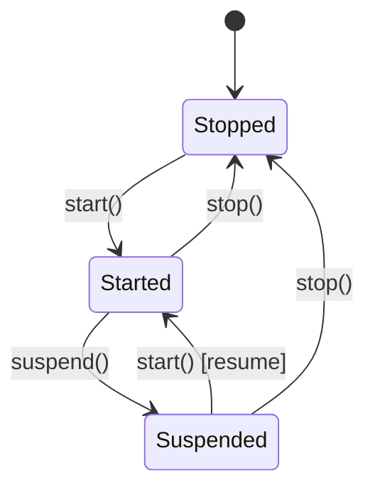

<!--
SPDX-License-Identifier: CC-BY-SA-4.0
See LICENSE file for licensing information.
-->

> This documentation is organized by AI with reference to actual code. AI can make mistakes — please verify against the source code when in doubt.


# Node and Topology Management Tools

## Overview

GNS3-Copilot provides tools for managing the lifecycle of network devices and topology in GNS3 projects. These tools enable AI agents to create, connect, start, stop, suspend, and manage nodes as part of automated lab management workflows.

## Available Tools

### GNS3TemplateTool 🆕

**Tool Name:** `get_gns3_templates`

**Description:** Retrieves all available device templates from the GNS3 server, including template names, IDs, and types. Filters out built-in utility templates that are not useful for network device configuration.

**Input:**
```json
{}
```

**Output:**
```json
{
  "templates": [
    {
      "name": "Cisco IOSv",
      "template_id": "uuid-of-template",
      "template_type": "qemu"
    },
    {
      "name": "VPCS",
      "template_id": "uuid-of-template2",
      "template_type": "vpcs"
    }
  ]
}
```

**Features:**
- Lists all available device templates for network labs
- Filters out built-in utility templates (see filtered list below)
- No input required (connects to configured GNS3 server)
- Returns template_id needed for node creation
- Logs total templates, filtered count, and remaining count

**Filtered Templates:**
The following built-in utility templates are excluded as they are not actual network devices:
- `atm_switch` - ATM switch
- `cloud` - Cloud
- `ethernet_hub` - Ethernet hub
- `ethernet_switch` - Ethernet switch (built-in, not user appliances)
- `frame_relay_switch` - Frame Relay switch
- `nat` - NAT device

**Retained Template Types:**
- `vpcs` - Virtual PC Simulator
- `dynamips` - Cisco router simulator (IOSv, IOSv-L2, etc.)
- `iou` - Cisco IOS on Unix
- `qemu` - QEMU virtual machines
- `docker` - Docker containers
- `virtualbox` - VirtualBox VMs
- `vmware` - VMware VMs

**Use Cases:**
- Discover available device types before creating nodes
- Get template_id for GNS3CreateNodeTool
- Template inventory management
- Focus on network devices rather than utility templates

### GNS3CreateNodeTool 🆕

**Tool Name:** `create_gns3_node`

**Description:** Creates multiple nodes in a GNS3 project using specified templates and coordinates.

**Input:**
```json
{
  "project_id": "uuid-of-project",
  "nodes": [
    {
      "template_id": "uuid-of-template",
      "x": 100,
      "y": -200,
      "name": "R1"
    },
    {
      "template_id": "uuid-of-template2",
      "x": -200,
      "y": 300
    }
  ]
}
```

**Output:**
```json
{
  "project_id": "uuid-of-project",
  "created_nodes": [
    {
      "node_id": "uuid-of-node1",
      "name": "R1",
      "status": "success"
    },
    {
      "node_id": "uuid-of-node2",
      "name": "NodeName2",
      "status": "success"
    }
  ],
  "total_nodes": 2,
  "successful_nodes": 2,
  "failed_nodes": 0
}
```

**Features:**
- Batch create multiple nodes
- Uses templates for consistent node configuration
- X/Y coordinate positioning for topology layout
- Optional `name` field to set node name directly (if omitted, GNS3 assigns default name)
- **Important**: Ensure distance between any two nodes is greater than 250px for clear interface labels

**Use Cases:**
- Automated topology deployment
- Multi-node lab initialization
- Programmatic topology creation

**Implementation Details:**
- Calls `POST /projects/{project_id}/nodes` for each node
- Uses template_id from GNS3TemplateTool
- Assigns default names sequentially (e.g., R1, R2, R3)

### GNS3LinkTool 🆕

**Tool Name:** `create_gns3_link`

**Description:** Creates one or more links between nodes in a GNS3 project by connecting their network ports.

**Input:**
```json
{
  "project_id": "uuid-of-project",
  "links": [
    {
      "node_id1": "uuid-of-node1",
      "port1": "Ethernet0/0",
      "node_id2": "uuid-of-node2",
      "port2": "Ethernet0/0"
    }
  ]
}
```

**Output:**
```json
[
  {
    "link_id": "uuid-of-link",
    "node_id1": "uuid-of-node1",
    "port1": "Ethernet0/0",
    "node_id2": "uuid-of-node2",
    "port2": "Ethernet0/0"
  }
]
```

**Features:**
- Batch create multiple links
- Automatic port discovery by name
- Error handling for individual link failures
- Port names must match topology data

**Use Cases:**
- Automated topology wiring
- Multi-link connection setup
- Network infrastructure deployment

**Implementation Details:**
- Calls `POST /projects/{project_id}/links` for each link
- Port names must match those from `gns3_topology_reader` tool
- Uses adapter_number and port_number for port identification
- Supports both physical and virtual interfaces

### GNS3UpdateNodeNameTool 🆕

**Tool Name:** `update_gns3_node_name`

**Description:** Updates the name of one or multiple nodes in a GNS3 project.

**Input:**
```json
{
  "project_id": "uuid-of-project",
  "nodes": [
    {"node_id": "uuid-of-node-1", "new_name": "Router1"},
    {"node_id": "uuid-of-node-2", "new_name": "Switch1"}
  ]
}
```

**Output:**
```json
{
  "project_id": "...",
  "total_nodes": 2,
  "successful": 2,
  "failed": 0,
  "nodes": [
    {
      "node_id": "...",
      "old_name": "...",
      "new_name": "Router1",
      "status": "success"
    }
  ]
}
```

**Features:**
- Batch rename multiple nodes
- Verification of name change
- Comprehensive error handling

**Use Cases:**
- Apply naming conventions to topology
- Rename nodes for better organization
- Update node names after topology creation

**Implementation Details:**
- Calls `PUT /projects/{project_id}/nodes/{node_id}`
- Cannot rename while node is started (except special node types)
- CAN rename while node is suspended

### GNS3StartNodeTool

**Tool Name:** `start_gns3_node`

**Description:** Starts one or multiple nodes in a GNS3 project with progress tracking and status monitoring. Features dynamic wait time calculation based on device types for optimal performance.

**Input:**
```json
{
  "project_id": "uuid-of-project",
  "node_ids": ["uuid-of-node-1", "uuid-of-node-2"]
}
```

**Output:**
```json
{
  "project_id": "...",
  "total_nodes": 2,
  "successful": 2,
  "failed": 0,
  "nodes": [
    {"node_id": "...", "name": "...", "status": "started"},
    {"node_id": "...", "name": "...", "status": "started"}
  ]
}
```

**Features:**
- Batch start multiple nodes
- Progress bar with visual feedback
- Automatic status verification
- Comprehensive error handling
- **Dynamic wait time based on device types** 🆕

**Dynamic Wait Time Strategy:**

The tool automatically detects node types and calculates optimal wait times:

| Device Type | Base Time | Per Additional Node | Example (5 nodes) |
|-------------|-----------|-------------------|-------------------|
| **VPCS** | 15s | +2s | 23s total |
| **IOU** | 25s | +3s | 37s total |
| **Mixed VPCS/IOU** | 25s | +2s | 33s total |
| **QEMU/Dynamips/Docker/VMs** | 120s | +10s | 160s total |
| **Mixed (any slow device)** | 120s | +10s | 160s total |

**How It Works:**
1. Retrieves node information including `node_type`
2. Checks if all nodes are fast devices (VPCS/IOU only)
3. If all fast: Uses max(15s, 25s) base + 2s per extra node
4. If any slow device present: Uses 120s base + 10s per extra node
5. Logs the detected device types and chosen strategy

**Performance Improvements:**
- ⚡ **1 VPCS node**: 140s → 15s (89% faster)
- ⚡ **5 VPCS nodes**: 180s → 23s (87% faster)
- ⚡ **1 IOU node**: 140s → 25s (82% faster)
- ⚡ **5 IOU nodes**: 180s → 37s (79% faster)
- ⚡ **Mixed VPCS/IOU**: 180s → 33s (82% faster)

**Use Cases:**
- Automated lab deployment
- Multi-node topology initialization
- Lab startup automation
- Fast VPCS/IOU lab deployment

**Implementation Details:**
- Retrieves node type via `node.get()` before starting
- Calculates wait time using `calculate_startup_time()` function
- Uses device-specific `NODE_STARTUP_TIME` configuration
  * VPCS: 15s base + 2s per node (conservative for slower hardware)
  * IOU: 25s base + 3s per node (accounts for IOU initialization overhead)
  * Other: 120s base + 10s per node (conservative for full emulators)
- Logs device types and selected wait strategy
- Progress bar displays calculated wait time

### GNS3StartNodeQuickTool 🆕

**Tool Name:** `start_gns3_node_quick`

**Description:** Starts one or multiple nodes in a GNS3 project WITHOUT waiting for startup completion. Suitable for automated deployment workflows where long waits would cause HTTP timeouts.

**Input:**
```json
{
  "project_id": "uuid-of-project",
  "node_ids": ["uuid-of-node-1", "uuid-of-node-2"]
}
```

**Output:**
```json
{
  "project_id": "...",
  "total_nodes": 2,
  "successful": 2,
  "failed": 0,
  "nodes": [
    {"node_id": "...", "name": "...", "status": "started"},
    {"node_id": "...", "name": "...", "status": "started"}
  ],
  "note": "Start commands sent. Nodes are booting in background. Check node status later."
}
```

**Features:**
- Batch start multiple nodes
- No progress bar or wait time
- Immediate API response
- Nodes boot in background after tool returns
- Comprehensive error handling

**When to Use Quick vs Regular Start:**

| Scenario | Use `start_gns3_node` | Use `start_gns3_node_quick` |
|----------|----------------------|-----------------------------|
| Interactive lab startup | ✅ | ❌ |
| CI/CD pipeline | ❌ | ✅ |
| HTTP timeout risk | ❌ | ✅ |
| Need verified status | ✅ | ❌ |
| Automated bulk deployment | ❌ | ✅ |

**Implementation Details:**
- Calls `POST /projects/{project_id}/nodes/{node_id}/start` for each node
- Returns immediately after sending start commands (no progress bar)
- Status reflects command send result, not boot completion
- Source: `gns3_start_node.py` (same file as `GNS3StartNodeTool`)

### GNS3StopNodeTool

**Tool Name:** `stop_gns3_node`

**Description:** Stops one or multiple nodes in a GNS3 project.

**Input:**
```json
{
  "project_id": "uuid-of-project",
  "node_ids": ["uuid-of-node-1", "uuid-of-node-2"]
}
```

**Output:**
```json
{
  "project_id": "...",
  "total_nodes": 2,
  "successful": 2,
  "failed": 0,
  "nodes": [
    {"node_id": "...", "name": "...", "status": "stopped"},
    {"node_id": "...", "name": "...", "status": "stopped"}
  ]
}
```

**Features:**
- Batch stop multiple nodes
- Immediate API response (no waiting)
- Automatic status verification
- Comprehensive error handling
- Synchronous operation

**Use Cases:**
- Lab shutdown automation
- Resource management
- Energy-saving workflows
- Test cleanup procedures

**Implementation Details:**
- Calls `POST /projects/{project_id}/nodes/{node_id}/stop`
- Verifies node existence before stopping
- Retrieves updated status after stop command
- Returns detailed results for each node

### GNS3SuspendNodeTool

**Tool Name:** `suspend_gns3_node`

**Description:** Suspends one or multiple nodes in a GNS3 project. Suspended nodes preserve their state in memory and can be quickly resumed.

**Input:**
```json
{
  "project_id": "uuid-of-project",
  "node_ids": ["uuid-of-node-1", "uuid-of-node-2"]
}
```

**Output:**
```json
{
  "project_id": "...",
  "total_nodes": 2,
  "successful": 2,
  "failed": 0,
  "nodes": [
    {"node_id": "...", "name": "...", "status": "suspended"},
    {"node_id": "...", "name": "...", "status": "suspended"}
  ],
  "note": "Suspended nodes preserve their state in memory. Use resume to continue where you left off."
}
```

**Features:**
- Batch suspend multiple nodes
- Preserves device state in memory
- Immediate API response (no waiting)
- Fast resume capability
- Automatic status verification
- Comprehensive error handling

**Use Cases:**
- Temporary lab pause (continue later)
- Save experimental state
- Quick context switching
- Resource optimization without losing work

**Key Benefits:**
- **Fast Resume**: Resumes in seconds vs. minutes for full restart
- **State Preservation**: All configurations, connections, and runtime state saved
- **Resource Efficiency**: Pauses devices without releasing memory
- **Lab Snapshots**: Save intermediate states for later analysis

**Implementation Details:**
- Calls `POST /projects/{project_id}/nodes/{node_id}/suspend`
- Verifies node existence before suspending
- Retrieves updated status after suspend command
- Returns detailed results for each node
- Node name can be changed while suspended (unlike started state)

**State Comparison:**

| Operation | Result | Recovery Time | State Preserved? | Resource Usage |
|-----------|--------|---------------|------------------|----------------|
| **Stop** | Powered off | Slow (full boot) | ❌ No | Minimal |
| **Suspend** | Paused | Fast (seconds) | ✅ Yes | Medium (memory) |
| **Start** | Running | N/A | N/A | High |

**When to Use Suspend vs Stop:**

```python
# ✅ Use SUSPEND when:
# - Taking a break and continuing later today
# - Need to test something else temporarily
# - Want to preserve complex configuration state
# - Quick switching between lab scenarios

# ✅ Use STOP when:
# - Done with the lab for now
# - Need to free up system resources
# - Finishing a complete test session
# - Won't need the lab for a while
```

## Technical Implementation

### Module Structure

```
gns3server/agent/gns3_copilot/tools_v2/
├── gns3_create_node.py     # Node creation tool 🆕
├── gns3_create_link.py     # Link creation tool 🆕
├── gns3_get_node_temp.py   # Template retrieval tool 🆕
├── gns3_update_node_name.py # Node rename tool 🆕
├── gns3_start_node.py      # Start node tool (+ GNS3StartNodeQuickTool)
├── gns3_stop_node.py       # Stop node tool
├── gns3_suspend_node.py    # Suspend node tool
├── config_tools_nornir.py  # Configuration command execution
├── display_tools_nornir.py # Display command execution
└── packet_capture_tools.py # Packet capture analysis
```

### API Integration

The tools use the `Node` and `Link` classes from `custom_gns3fy`:

```python
from gns3server.agent.gns3_copilot.gns3_client import Node, Link, get_gns3_connector

# Get templates
templates = get_gns3_connector().get_templates()

# Create node
node = Node(project_id=project_id, template_id=template_id, x=x, y=y, connector=gns3_server)
node.create()

# Create link
link = Link(project_id=project_id, connector=gns3_server, nodes=[...])
link.create()

# Update node name
node = Node(project_id=project_id, node_id=node_id, connector=gns3_server)
node.update(name=new_name)

# Start/stop/suspend node
node = Node(project_id=project_id, node_id=node_id, connector=gns3_server)
node.start()   # or node.stop() / node.suspend()
```

### Progress Tracking

**GNS3StartNodeTool** includes visual progress bar with dynamic wait time:

```
Starting 3 node(s), please wait...
[===========>                      ] 35.0%
```

Wait time is calculated by `calculate_startup_time()` based on node types (see Dynamic Wait Time Strategy above). No hardcoded duration.

**GNS3StartNodeQuickTool** does NOT include progress tracking:
- Returns immediately after sending start commands
- Nodes boot in background

**GNS3StopNodeTool** does not include progress tracking:
- Stop operations are typically fast (< 5 seconds)
- Immediate API response provides status feedback

**GNS3SuspendNodeTool** does not include progress tracking:
- Suspend operations are typically fast (< 10 seconds)
- Immediate API response provides status feedback

## Node State Transitions



> **Note:** Resuming a suspended node uses `start()` — there is no separate `resume()` method.

**State Change Allowed Operations:**

| Current State | Can Start? | Can Stop? | Can Suspend? | Can Rename? |
|---------------|------------|-----------|---------------|--------------|
| **Stopped**   | ✅ Yes     | ❌ No      | ❌ No         | ✅ Yes       |
| **Started**   | ❌ No      | ✅ Yes     | ✅ Yes        | ❌ No*       |
| **Suspended** | ✅ Yes     | ✅ Yes     | ❌ No         | ✅ Yes       |

*Except special node types: cloud, nat, ethernet_switch, ethernet_hub, frame_relay_switch, atm_switch
Note: These special node types are filtered out by GNS3TemplateTool and won't appear in template listings for network lab creation.

## Copilot Mode Integration

### Teaching Assistant Mode

**Tools Available:**
- `GNS3TemplateTool` - List available device templates 🆕
- `GNS3CreateNodeTool` - Create nodes in topology 🆕
- `GNS3LinkTool` - Create links between nodes 🆕
- `GNS3UpdateNodeNameTool` - Rename nodes 🆕
- `GNS3StartNodeTool` - For diagnostics requiring started nodes
- `ExecuteMultipleDeviceCommands` - Execute show/display/debug commands (READ-ONLY)
- `PacketCaptureTool` - Analyze packets from active capture
- `DeviceSkillsTool` - Get device-specific skills and command knowledge

**Capabilities:**
- READ-ONLY diagnostic tools
- Can create and manage topology (nodes, links, names)
- Cannot stop or suspend nodes (prevents disruption of active labs)
- Cannot execute configuration commands

### Lab Automation Assistant Mode

**Tools Available:**
- `GNS3TemplateTool` - List available device templates 🆕
- `GNS3CreateNodeTool` - Create nodes in topology 🆕
- `GNS3LinkTool` - Create links between nodes 🆕
- `GNS3UpdateNodeNameTool` - Rename nodes 🆕
- `GNS3StartNodeTool` - Full lab deployment
- `GNS3StopNodeTool` - Full lab shutdown
- `GNS3SuspendNodeTool` - Lab pause with state preservation
- `ExecuteMultipleDeviceCommands` - Execute show/display/debug commands (READ-ONLY)
- `ExecuteMultipleDeviceConfigCommands` - Execute configuration commands
- `VPCSCommands` - Execute VPCS commands using Netmiko
- `PacketCaptureTool` - Analyze packets from active capture
- `DeviceSkillsTool` - Get device-specific skills and command knowledge

**Capabilities:**
- Full diagnostic and configuration tools
- Complete topology and lifecycle management (create, connect, start/stop/suspend)
- Device configuration via Nornir/Netmiko
- Automated workflows with state preservation
- Lab snapshot capabilities for later resumption

## Usage Examples

### Example 1: Start Nodes with Progress

```python
from gns3server.agent.gns3_copilot.tools_v2 import GNS3StartNodeTool

tool = GNS3StartNodeTool()
result = tool._run(json.dumps({
    "project_id": "abc-123-def",
    "node_ids": ["node-1", "node-2", "node-3"]
}))

# Output includes progress bar and final status
```

### Example 2: Stop Nodes

```python
from gns3server.agent.gns3_copilot.tools_v2 import GNS3StopNodeTool

tool = GNS3StopNodeTool()
result = tool._run(json.dumps({
    "project_id": "abc-123-def",
    "node_ids": ["node-1", "node-2"]
}))

# Immediate return with stop status
```

### Example 3: Automated Lab Lifecycle

```python
# Lab deployment
start_tool = GNS3StartNodeTool()
start_result = start_tool._run(json.dumps({
    "project_id": project_id,
    "node_ids": all_node_ids
}))

# ... Run tests ...

# Lab shutdown
stop_tool = GNS3StopNodeTool()
stop_result = stop_tool._run(json.dumps({
    "project_id": project_id,
    "node_ids": all_node_ids
}))
```

### Example 4: Lab Pause and Resume

```python
from gns3server.agent.gns3_copilot.tools_v2 import GNS3SuspendNodeTool

# Start lab
start_tool = GNS3StartNodeTool()
start_result = start_tool._run(json.dumps({
    "project_id": project_id,
    "node_ids": all_node_ids
}))

# ... Configure devices ...
# ... Run some tests ...

# Suspend lab (preserves all state)
suspend_tool = GNS3SuspendNodeTool()
suspend_result = suspend_tool._run(json.dumps({
    "project_id": project_id,
    "node_ids": all_node_ids
}))
# Nodes suspended - state preserved in memory

# ... Take a break, work on something else ...

# Resume lab (quick recovery)
start_result = start_tool._run(json.dumps({
    "project_id": project_id,
    "node_ids": all_node_ids
}))
# Back to previous state in seconds!
```

### Example 5: Suspend While Renaming Nodes

```python
from gns3server.agent.gns3_copilot.tools_v2 import (
    GNS3SuspendNodeTool,
    GNS3UpdateNodeNameTool
)

# Suspend nodes first (allows renaming)
suspend_tool = GNS3SuspendNodeTool()
suspend_result = suspend_tool._run(json.dumps({
    "project_id": project_id,
    "node_ids": node_ids
}))

# Now rename nodes (possible while suspended!)
rename_tool = GNS3UpdateNodeNameTool()
rename_result = rename_tool._run(json.dumps({
    "project_id": project_id,
    "nodes": [
        {"node_id": "node-1", "new_name": "Router-Primary"},
        {"node_id": "node-2", "new_name": "Router-Backup"}
    ]
}))

# Resume when ready
# Note: Cannot rename while started, but CAN rename while suspended!
```

### Example 6: Get Available Templates 🆕

```python
from gns3server.agent.gns3_copilot.tools_v2 import GNS3TemplateTool

tool = GNS3TemplateTool()
result = tool._run("")

# Returns all available device templates
# {
#   "templates": [
#     {"name": "Cisco IOSv", "template_id": "...", "template_type": "router"},
#     {"name": "Ethernet switch", "template_id": "...", "template_type": "switch"}
#   ]
# }
```

### Example 7: Create Topology Nodes 🆕

```python
from gns3server.agent.gns3_copilot.tools_v2 import GNS3CreateNodeTool

tool = GNS3CreateNodeTool()
result = tool._run(json.dumps({
    "project_id": "abc-123-def",
    "nodes": [
        {
            "template_id": "uuid-of-router-template",
            "x": 100,
            "y": -200
        },
        {
            "template_id": "uuid-of-switch-template",
            "x": -200,
            "y": 300
        }
    ]
}))

# Creates two nodes with specified templates and positions
```

### Example 8: Connect Nodes with Links 🆕

```python
from gns3server.agent.gns3_copilot.tools_v2 import GNS3LinkTool

tool = GNS3LinkTool()
result = tool._run(json.dumps({
    "project_id": "abc-123-def",
    "links": [
        {
            "node_id1": "uuid-of-node1",
            "port1": "Ethernet0/0",
            "node_id2": "uuid-of-node2",
            "port2": "Ethernet0/0"
        },
        {
            "node_id1": "uuid-of-node1",
            "port1": "Ethernet0/1",
            "node_id2": "uuid-of-node3",
            "port2": "Ethernet0/0"
        }
    ]
}))

# Creates two links connecting the nodes
```

### Example 9: Apply Naming Convention 🆕

```python
from gns3server.agent.gns3_copilot.tools_v2 import GNS3UpdateNodeNameTool

tool = GNS3UpdateNodeNameTool()
result = tool._run(json.dumps({
    "project_id": "abc-123-def",
    "nodes": [
        {"node_id": "node-1", "new_name": "R1-Core"},
        {"node_id": "node-2", "new_name": "R2-Core"},
        {"node_id": "node-3", "new_name": "S1-Access"},
        {"node_id": "node-4", "new_name": "S2-Access"}
    ]
}))

# Applies consistent naming to all nodes
```

### Example 10: Complete Topology Creation Workflow 🆕

```python
from gns3server.agent.gns3_copilot.tools_v2 import (
    GNS3TemplateTool,
    GNS3CreateNodeTool,
    GNS3LinkTool,
    GNS3UpdateNodeNameTool,
    GNS3StartNodeTool
)

# Step 1: Get available templates
template_tool = GNS3TemplateTool()
templates = template_tool._run("")
# Find router and switch template_ids...

# Step 2: Create nodes
create_tool = GNS3CreateNodeTool()
nodes = create_tool._run(json.dumps({
    "project_id": project_id,
    "nodes": [
        {"template_id": router_template_id, "x": 0, "y": -200},
        {"template_id": router_template_id, "x": 200, "y": -200},
        {"template_id": switch_template_id, "x": 100, "y": 0}
    ]
}))

# Step 3: Connect nodes
link_tool = GNS3LinkTool()
links = link_tool._run(json.dumps({
    "project_id": project_id,
    "links": [
        {"node_id1": nodes["created_nodes"][0]["node_id"], "port1": "Ethernet0/0",
         "node_id2": nodes["created_nodes"][2]["node_id"], "port2": "Ethernet0/0"},
        {"node_id1": nodes["created_nodes"][1]["node_id"], "port1": "Ethernet0/0",
         "node_id2": nodes["created_nodes"][2]["node_id"], "port2": "Ethernet0/1"}
    ]
}))

# Step 4: Apply naming
name_tool = GNS3UpdateNodeNameTool()
names = name_tool._run(json.dumps({
    "project_id": project_id,
    "nodes": [
        {"node_id": nodes["created_nodes"][0]["node_id"], "new_name": "R1"},
        {"node_id": nodes["created_nodes"][1]["node_id"], "new_name": "R2"},
        {"node_id": nodes["created_nodes"][2]["node_id"], "new_name": "SW1"}
    ]
}))

# Step 5: Start nodes
start_tool = GNS3StartNodeTool()
start_result = start_tool._run(json.dumps({
    "project_id": project_id,
    "node_ids": [n["node_id"] for n in nodes["created_nodes"]]
}))
```

## Error Handling

All tools include comprehensive error handling:

### Missing Required Fields

```json
{
  "error": "Missing required fields: project_id and node_ids."
}
```

### Invalid Input Type

```json
{
  "error": "node_ids must be a list."
}
```

### Node Not Found

```json
{
  "node_id": "uuid",
  "name": "N/A",
  "status": "error",
  "error": "Node not found"
}
```

### Connection Error

```json
{
  "error": "Failed to connect to GNS3 server. Please check your configuration."
}
```

## Security Considerations

### Access Control

- All tools respect GNS3's built-in access control
- Requires valid GNS3 server authentication
- Project-level permissions apply

### Audit Logging

All operations are logged:
```python
logger.info("Starting %d nodes in project %s...", len(node_ids), project_id)
logger.info("Creating %d nodes in project %s...", len(nodes), project_id)
logger.info("Creating %d links in project %s...", len(links), project_id)
logger.info("Updating names for %d nodes in project %s...", len(nodes), project_id)
logger.info("Stop command sent for node %s (%s)", node_id, node.name)
logger.info("Suspend command sent for node %s (%s)", node_id, node.name)
```

### Mode-Based Restrictions

- **Teaching Assistant Mode**:
  - Can create topology (templates, nodes, links, names)
  - Can start nodes for diagnostics
  - Cannot stop, suspend (prevents disruption of active labs)

- **Lab Automation Assistant Mode**:
  - Can create and manage full topology
  - Can start, stop, and suspend nodes (full lifecycle control)
  - Complete lab management including state preservation

## Performance Characteristics

| Operation | Typical Duration | Wait Time | Progress | State Preserved |
|-----------|-----------------|-----------|----------|-----------------|
| Get Templates | < 2s | 0s | No | N/A |
| Create Node | < 1s per node | 0s | No | N/A |
| Create Link | < 1s per link | 0s | No | N/A |
| Update Name | < 1s per node | 0s | No | N/A |
| Start (VPCS/IOU) | 15-37s | Dynamic | Yes | N/A |
| Start (QEMU/etc.) | 120-160s+ | Dynamic | Yes | N/A |
| Start Quick | < 2s | 0s | No | N/A |
| Stop | < 5s | 0s | No | ❌ No |
| Suspend | < 10s | 0s | No | ✅ Yes |

**Notes:**
- Stop operations are significantly faster than start operations
- Suspend is slightly slower than stop but preserves state
- Stop/Suspend do not require progress tracking (immediate feedback)
- Start duration depends on node type (router, switch, PC, etc.)
- Suspend provides fast resume capability compared to full start
- Create node/link operations are fast and require no waiting
- Template retrieval is instant with no parameters needed


## Related Documentation

- [Chat API](./chat-api.md) - Session management and SSE
- [Command Security](./command-security.md) - Security framework
- [LLM Model Configs](./llm-model-configs.md) - Model configuration

---

_Implementation Date: 2026-03-12_

_Last Updated: 2026-03-14 (Added dynamic wait time calculation based on device types)_

_Status: ✅ Implemented - Topology management tools available in both modes. Full lifecycle management (start/stop/suspend) available in Lab Automation Assistant Mode_

_Changelog:_
- **2026-03-14 (Evening)**: Added dynamic wait time calculation
  - `GNS3StartNodeTool` now calculates optimal wait times based on device types
  - Fast devices (VPCS: 15s, IOU: 25s) start much faster than before
  - Conservative timing accounts for slower hardware environments
  - Slow devices (QEMU, Dynamips, etc.) use conservative 120s base time
  - Performance improvements: 79-89% faster for VPCS/IOU labs
  - Automatic device type detection via `node.node_type`
  - Logs selected strategy and detected device types

- **2026-03-14 (Morning)**: Added template filtering
  - `GNS3TemplateTool` now filters out built-in utility templates (cloud, nat, ethernet_hub, ethernet_switch, frame_relay_switch, atm_switch)
  - Focuses on network devices suitable for lab configuration
  - Logs filtered count for transparency
