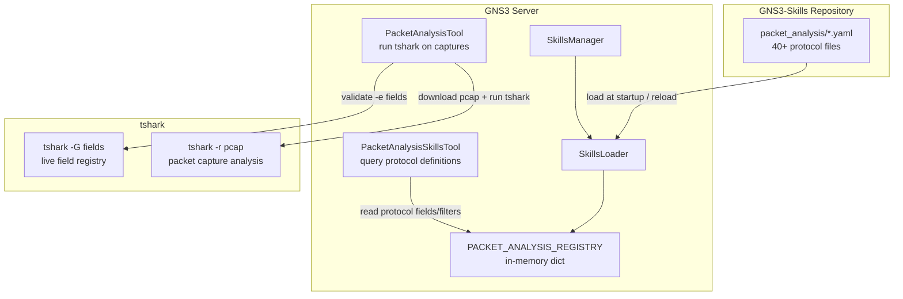
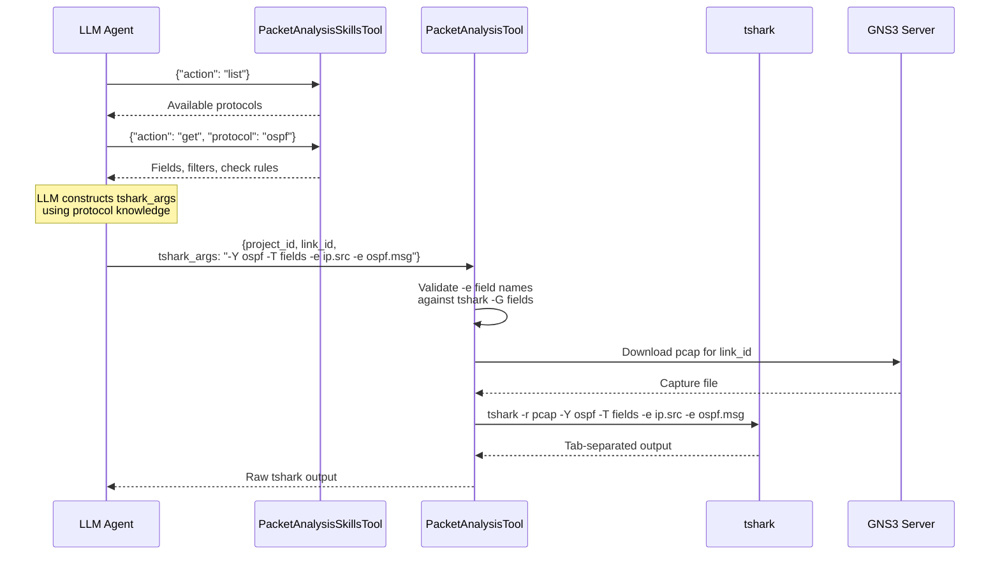

<!--
SPDX-License-Identifier: CC-BY-SA-4.0
See LICENSE file for licensing information.
-->

> This documentation is organized by AI with reference to actual code. AI can make mistakes — please verify against the source code when in doubt.


# Protocol-Oriented Packet Analysis

## Overview

GNS3 Copilot provides protocol-oriented packet analysis that allows the AI assistant to diagnose network issues from live GNS3 captures. Protocol definitions (tshark fields, display filters, check rules) are stored as YAML files in the external GNS3-Skills repository and loaded into memory at startup.

The system exposes two LangChain tools: `PacketAnalysisSkillsTool` queries protocol definitions, and `PacketAnalysisTool` runs tshark against downloaded pcap files using the LLM-constructed arguments.

## Architecture



## Supported Protocols

Definitions are loaded from `GNS3-Skills/packet_analysis/*.yaml`. The following protocol families are covered:

| Category | Protocols |
|----------|-----------|
| Network Layer | ip, ipv6, arp, icmp, icmpv6 |
| Transport Layer | tcp, udp |
| Data Link | ethernet, ppp, hdlc, frame_relay, vlan, isl, llc |
| Routing | ospf, eigrp, rip, bgp, isis, pim, dvmrp |
| Link Protocols | l2tp, lacp, pagp, udld |
| Infrastructure | cdp, lldp, stp, vtp, dtp |
| Management | snmp, telnet, ssh, radius, tacacs |
| Application | dns, http, bootp, dhcp |
| Tunneling / Security | gre, esp, ah, mpls, eapol, ssl, isakmp |
| Miscellaneous | nbns, slarp, ocsp, wccp, auto_rp, loop |

Each protocol YAML contains:

```yaml
name: "OSPF Packet Analysis"
description: "Analyze OSPF routing protocol packets"
protocol_key: "ospf"
display_filter: "ospf"
fields:
  - label: "Source IP"
    tshark_field: "ip.src"
    description: "Source IPv4 address"
  - label: "OSPF Message Type"
    tshark_field: "ospf.msg"
    description: "1=Hello, 2=DBD, 3=LSR, 4=LSU, 5=LSAck"
filter_examples:
  - description: "Show OSPF Hello packets"
    filter: "ospf.msg == 1"
checks:
  - name: hello_dead_mismatch
    severity: critical
    message: "Hello/Dead Interval mismatch between neighbors"
```

## Analysis Flow



## Tool Registration

The packet analysis tools are available in two copilot modes:

| Tool | Teaching Assistant | Lab Automation | Troubleshooting Injection |
|------|:------------------:|:--------------:|:-------------------------:|
| `PacketAnalysisTool` | Yes | Yes | No |
| `PacketAnalysisSkillsTool` | Yes | Yes | No |

## Tool Interface

### PacketAnalysisSkillsTool (`packet_analysis_skills`)

Queries protocol definitions from the `PACKET_ANALYSIS_REGISTRY`. Used before running tshark to look up valid field names, display filters, and anomaly checks.

| Action | Input | Output |
|--------|-------|--------|
| List protocols | `{"action": "list"}` | `{count, protocols: [{protocol, name, description}]}` |
| Get protocol | `{"action": "get", "protocol": "ospf"}` | Protocol definition with fields, filters, checks |

### PacketAnalysisTool (`packet_analysis`)

Runs tshark against a downloaded GNS3 capture file. Supports two modes:

**Capture analysis mode:**

| Parameter | Required | Description |
|-----------|----------|-------------|
| `project_id` | Yes | UUID of the GNS3 project |
| `link_id` | Yes | UUID of the link to analyze |
| `tshark_args` | Yes | tshark arguments (after `-r <pcap>`) |

**Field search mode:**

| Parameter | Required | Description |
|-----------|----------|-------------|
| `action` | Yes | `"search_fields"` |
| `query` | Yes | Single keyword (e.g., `"ospf.lsa"`, `"bgp.open"`) |

### Validation and Error Handling

Before downloading the capture, the tool validates `-e` field names against the live tshark field registry (`tshark -G fields`). Invalid field names are rejected early with a hint to use `search_fields`.

| Scenario | Response |
|----------|----------|
| Invalid `-e` field name | `{error, hint, invalid_fields}` |
| tshark filter/field error | `{error: "tshark argument error", hints}` |
| Empty capture file | `{error: "Capture file is empty"}` |
| No matching packets | `{result: "No matching packets found", hints}` |
| tshark timeout (30s) | `{error: "tshark timeout after 30 seconds"}` |
| tshark not installed | `{error: "tshark not installed"}` |

When `-c` is used and no results are found, the tool hints that `-c` limits total packets read (not matched count), and suggests removing it or piping to `head`.

## Hot Reload

Packet analysis protocols can be reloaded without restarting the server via the existing reload API:

```
POST /v3/copilot/reload/skills
```

This triggers `SkillsManager.reload_packet_analysis_protocols()`, which re-reads all YAML files from the `packet_analysis/` directory and updates `PACKET_ANALYSIS_REGISTRY` in place.

## Related Documentation

- [External Skills Repository](skills-repository.md)
- [Fault Injection](fault-injection.md)
- [Chat API](chat-api.md)
