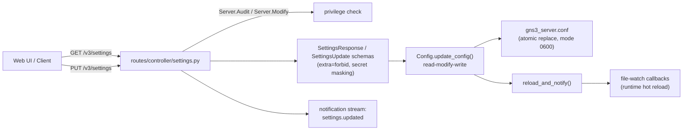
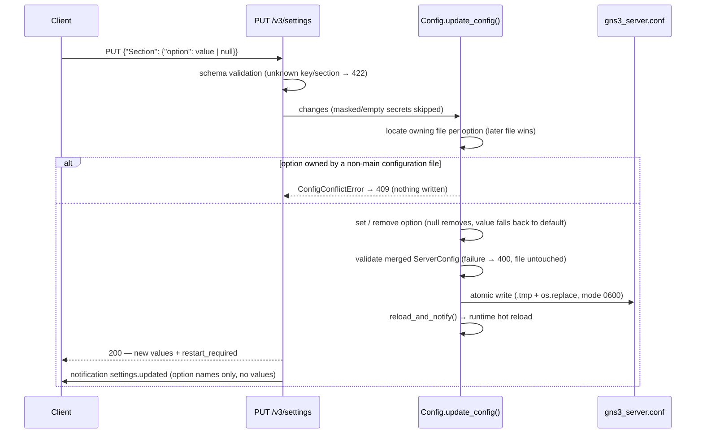

<!--
SPDX-License-Identifier: CC-BY-SA-4.0
See LICENSE file for licensing information.
-->

# Server Settings API

## Overview

REST API for reading and updating `gns3_server.conf` at runtime, enabling a server settings page in the Web UI. Updates are persisted with a read-modify-write strategy (unknown options in the file are preserved), validated before anything touches disk, and hot-reloaded into the running server; the response tells the caller which changes require a restart.

## Architecture



- **Exposure** — all sections except the deprecated `VirtualBox`/`VMware`: `Server`, `Controller`, `VPCS`, `Dynamips`, `IOU`, `Qemu`, `WebWireshark`. `Controller.jwt_secret_key` is excluded entirely: it is loaded from `<secrets_dir>/gns3_jwt_secret_key` and writing it to the configuration file is a no-op.
- **Schema metadata** — every field carries a pydantic `description`, default value and validation bounds. They flow into `/openapi.json` (the `SettingsResponse` component), so clients can render the settings form — labels, tooltips, initial values, input validation — from the OpenAPI schema alone, without maintaining a field table. The human-readable annotated reference is `gns3server/config_samples/gns3_server.conf`, kept in sync with the schema.
- **Write strategy** — `Config.update_config()` re-reads the configuration files with `configparser`, applies only the submitted options, and atomically rewrites the main configuration file. Comments and formatting are lost (accepted trade-off); options unknown to the schema are preserved.
- **Validate before write** — the merged view of all configuration files is validated as `ServerConfig` *before* any disk write. A validation error must never reach disk: the `FileWatcher` reload callback would raise and permanently stop polling that file.

## Business Process (PUT)



## API Endpoints

| Method | Path | Description | Privilege |
|--------|------|-------------|-----------|
| GET | `/v3/settings` | Return all current server settings | `Server.Audit` |
| PUT | `/v3/settings` | Update and persist server settings | `Server.Modify` |

Request example:

```json
{
    "Server": {
        "report_errors": true,
        "allowed_interfaces": ["eth0", "lo"],
        "compute_password": "**********"
    },
    "Qemu": {
        "enable_monitor": false
    }
}
```

Response example (abbreviated):

```json
{
    "Server": { "report_errors": true, "allowed_interfaces": ["eth0", "lo"], "...": "..." },
    "Qemu": { "enable_monitor": false },
    "restart_required": ["Server.port"]
}
```

## Notes

- **Secrets** — `SecretStr` fields are masked in responses. An empty secret (e.g. `compute_password` before the server generates one) serializes as `""` rather than the mask. On PUT, the mask or an empty string means "leave unchanged"; only an explicit new value is written, in clear text like a hand-edited file.
- **`restart_required`** — options that only take effect after a server restart (bind host/port, protocol, TLS and certificates, port ranges, image/symbol/config paths, GNS3 VM credentials, skills paths, …). Everything else hot-reloads via `Config.instance().settings`.
- **GET reflects runtime values** — in-memory settings may differ from disk (e.g. the generated `compute_password`, the resolved `secrets_dir`); the mask/empty skip rule guarantees PUT never writes echoed values back.
- **Privileges** — `Server.Audit`/`Server.Modify` are seeded into the `Administrator` role at table creation only; existing databases need a manual grant. Superadmins bypass RBAC.
- **Hardening** — the file watcher callback is exception-guarded (`utils/file_watcher.py`): a callback failure is logged instead of silently killing the polling loop.

### Related Files

| File | Role |
|------|------|
| `gns3server/config.py` | `Config.update_config()` (read-modify-write, validate-before-write), `reload_and_notify()` |
| `gns3server/utils/file_watcher.py` | callback exception hardening |
| `gns3server/schemas/controller/settings.py` | response/update models, `SECRET_MASK` |
| `gns3server/api/routes/controller/settings.py` | GET/PUT endpoints, `restart_required`, notification |
| `gns3server/db/models/privileges.py` | `Server.Audit` / `Server.Modify` privilege seeds |
| `gns3server/config_samples/gns3_server.conf` | annotated sample configuration, human-readable reference kept in sync with the schema |
