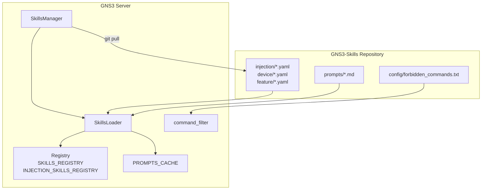
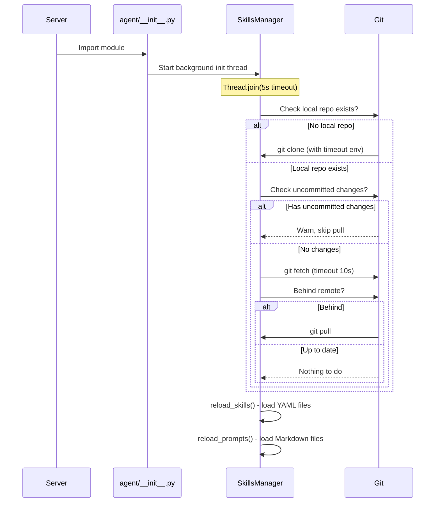

<!--
SPDX-License-Identifier: CC-BY-SA-4.0
See LICENSE file for licensing information.
-->

> This documentation is organized by AI with reference to actual code. AI can make mistakes — please verify against the source code when in doubt.


# External Skills Repository

## Overview

GNS3 Copilot loads all skills, prompts, and security configurations from an external Git repository at [github.com/yueguobin/GNS3-Skills](https://github.com/yueguobin/GNS3-Skills). This enables dynamic updates without server redeployment.

The repository provides:
- **Injection skills** (39 categories): Network fault scenarios for troubleshooting practice
- **Device skills**: Device-specific command knowledge (VPCS, etc.)
- **Feature skills**: Topology planning, network design
- **System prompts**: Agent personality and behavior definitions
- **Forbidden commands**: Security rules for command filtering

## Architecture



## Repository Structure

```
GNS3-Skills/
├── injection/          # 39 YAML files, one per protocol/category
│   ├── ospf_issues.yaml
│   ├── bgp_issues.yaml
│   ├── vlan_issues.yaml
│   └── ...
├── device/             # Device-specific skills
│   └── vpcs.yaml
├── feature/            # Feature skills
│   └── topology_planner.yaml
├── prompts/            # System prompts (Markdown)
│   ├── teaching_assistant.md
│   ├── lab_automation_assistant.md
│   ├── troubleshooting_injection.md
│   └── title.md
└── config/             # Security configuration
    └── forbidden_commands.txt
```

## Configuration

Skills repository settings are configured in `gns3_server.conf` under the `[Server]` section:

```ini
[Server]
skills_repo_url = https://github.com/yueguobin/GNS3-Skills.git
skills_repo_branch = main
skills_auto_update = true
```

| Setting | Default | Description |
|---------|---------|-------------|
| `skills_repo_url` | `https://github.com/yueguobin/GNS3-Skills.git` | Git repository URL |
| `skills_repo_branch` | `main` | Git branch to track |
| `skills_auto_update` | `true` | Automatically pull on reload |

## Initialization Flow



### Git Timeout Configuration

Git operations use per-command environment variables to prevent hanging:

```python
_GIT_TIMEOUT_ENV = {
    'GIT_HTTP_TIMEOUT': '10',           # Connection timeout (default: 120s)
    'GIT_HTTP_LOW_SPEED_TIME': '5',     # Slow speed threshold window
    'GIT_HTTP_LOW_SPEED_LIMIT': '1000', # < 1 KB/s = slow → abort
}
```

These apply only to the specific `clone`/`fetch`/`pull` subprocess, not to the global environment.

## API Endpoint

### POST /copilot/reload/skills

Triggers a full reload of the skills repository. Performs one git update check, then reloads all skills, prompts, and forbidden commands from local files.

**Response:**

```json
{
  "success": true,
  "skills": true,
  "skill_count": 39,
  "prompts": true,
  "prompt_count": 4,
  "forbidden_commands": 6,
  "version": "abc123def456..."
}
```

| Field | Description |
|-------|-------------|
| `success` | Overall success (true if skills or prompts loaded) |
| `skills` | Skills reload result |
| `skill_count` | Number of injection skills loaded |
| `prompts` | Prompts reload result |
| `prompt_count` | Number of prompts loaded |
| `forbidden_commands` | Number of forbidden command patterns |
| `version` | Git commit hash of the repository |

## Related Documentation

- [Fault Injection](fault-injection.md)
- [Command Security](command-security.md)
- [Chat API](chat-api.md)
