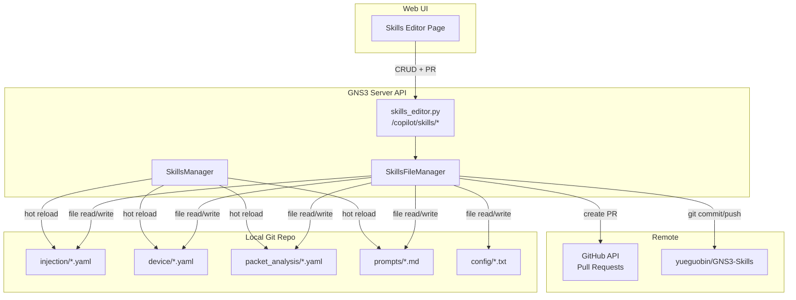
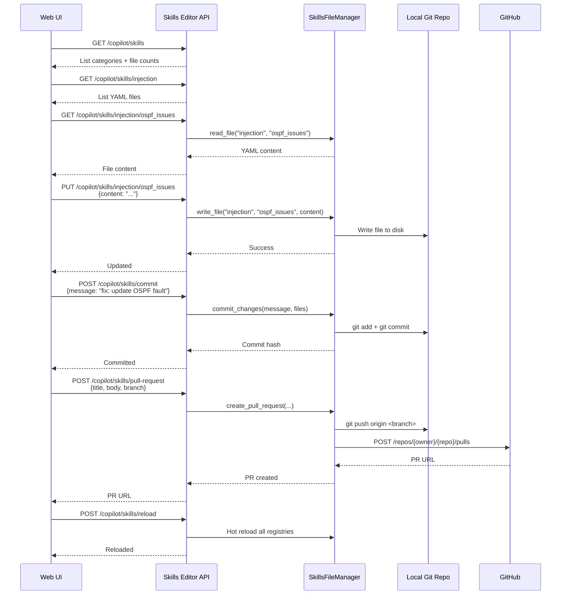

<!--
SPDX-License-Identifier: CC-BY-SA-4.0
See LICENSE file for licensing information.
-->

> This documentation is organized by AI with reference to actual code. AI can make mistakes — please verify against the source code when in doubt.


# Skills Editor API

## Overview

A management API that allows the Web UI to browse, edit, save, and contribute skill files (prompts, fault injection, device skills, packet analysis protocols) back to the upstream GNS3-Skills repository via Pull Requests.

Today, skills are read-only from the server's perspective — the only management endpoint is `POST /copilot/reload/skills` for hot-reloading. This API adds full CRUD operations on the local skills repository plus Git commit/push/PR workflows.

## Architecture



## Business Process

### Edit and Contribute Flow



## Valid Categories

| Category | Directory | File Extension | Content |
|----------|-----------|---------------|---------|
| `prompts` | `prompts/` | `.md` | System prompts (teaching_assistant, lab_automation_assistant, etc.) |
| `injection` | `injection/` | `.yaml` | Fault injection skill definitions (OSPF, BGP, VLAN, etc.) |
| `device` | `device/` | `.yaml` | Device-specific command knowledge |
| `packet_analysis` | `packet_analysis/` | `.yaml` | Protocol definitions for tshark-based analysis |
| `config` | `config/` | `.txt` | Security and configuration files (forbidden_commands, etc.) |

## API Endpoints

All endpoints require **superadmin** authentication. Prefix: `/v3/copilot/skills`.

| Method | Path | Description |
|--------|------|-------------|
| GET | `/copilot/skills` | List all categories with file counts |
| GET | `/copilot/skills/{category}` | List files in a category |
| GET | `/copilot/skills/{category}/{filename}` | Read file content (without extension) |
| POST | `/copilot/skills/{category}` | Create a new skill file |
| PUT | `/copilot/skills/{category}/{filename}` | Update existing file content |
| DELETE | `/copilot/skills/{category}/{filename}` | Delete a skill file |
| GET | `/copilot/skills/status` | Git status (modified/untracked/deleted files) + repo info |
| POST | `/copilot/skills/commit` | Stage and commit changes |
| POST | `/copilot/skills/push` | Push a branch to remote |
| POST | `/copilot/skills/pull-request` | Create a Pull Request (direct or via fork) |
| POST | `/copilot/skills/reload` | Hot reload all skills into memory (replaces `/reload/skills`) |
| POST | `/copilot/skills/rollback/{commit_hash}` | Rollback repository to a specific commit |

### Response Examples

**GET /copilot/skills** — List categories

```json
{
  "categories": [
    {"category": "injection", "file_count": 39, "path": "injection/"},
    {"category": "device", "file_count": 2, "path": "device/"},
    {"category": "packet_analysis", "file_count": 8, "path": "packet_analysis/"},
    {"category": "prompts", "file_count": 4, "path": "prompts/"},
    {"category": "config", "file_count": 1, "path": "config/"}
  ],
  "repository": {
    "repo_url": "https://github.com/yueguobin/GNS3-Skills.git",
    "branch": "main",
    "current_version": "abc123def456...",
    "is_dirty": false
  }
}
```

**GET /copilot/skills/injection** — List files in category

```json
{
  "category": "injection",
  "files": [
    {"filename": "ospf_issues", "extension": ".yaml", "size": 4521, "last_modified": "2026-05-10T08:30:00Z"},
    {"filename": "bgp_issues", "extension": ".yaml", "size": 3820, "last_modified": "2026-05-09T14:00:00Z"}
  ]
}
```

**GET /copilot/skills/injection/ospf_issues** — Read file content

```json
{
  "category": "injection",
  "filename": "ospf_issues",
  "extension": ".yaml",
  "content": "name: OSPF Fault Injection\n...\n",
  "size": 4521,
  "last_modified": "2026-05-10T08:30:00Z"
}
```

**PUT /copilot/skills/injection/ospf_issues** — Update file

```json
{
  "content": "name: OSPF Fault Injection\n..."
}
```

Response:

```json
{
  "category": "injection",
  "filename": "ospf_issues",
  "size": 4600,
  "last_modified": "2026-05-12T10:00:00Z",
  "status": "modified"
}
```

**POST /copilot/skills/commit** — Commit changes

Request:

```json
{
  "message": "fix: update OSPF hello/dead interval fault descriptions",
  "files": ["injection/ospf_issues.yaml"]
}
```

Response:

```json
{
  "success": true,
  "commit_hash": "def456abc789...",
  "message": "fix: update OSPF hello/dead interval fault descriptions",
  "files_committed": 1
}
```

**POST /copilot/skills/pull-request** — Create PR

Request:

```json
{
  "title": "Fix OSPF fault injection descriptions",
  "body": "Updated OSPF hello/dead interval fault descriptions for clarity.",
  "branch": "fix/ospf-descriptions",
  "target_branch": "main",
  "fork_url": "https://github.com/user/GNS3-Skills.git"
}
```

Response:

```json
{
  "success": true,
  "pr_url": "https://github.com/yueguobin/GNS3-Skills/pull/42",
  "pr_number": 42,
  "branch": "fix/ospf-descriptions"
}
```

**GET /copilot/skills/status** — Git status

```json
{
  "current_version": "abc123def456...",
  "branch": "main",
  "is_dirty": true,
  "modified": ["injection/ospf_issues.yaml"],
  "untracked": [],
  "deleted": [],
  "staged": [],
  "available_versions": [
    {"hash": "abc123def456", "message": "Add MPLS fault scenarios", "author": "dev", "date": "2026-05-10T08:00:00Z"}
  ]
}
```

## Implementation Plan

### New Files

| File | Purpose |
|------|---------|
| `gns3server/agent/gns3_copilot/skills/file_manager.py` | `SkillsFileManager` class — file CRUD, git commit/push, GitHub PR API |
| `gns3server/api/routes/controller/skills_editor.py` | FastAPI router with all endpoints above |

### Modified Files

| File | Change |
|------|--------|
| `gns3server/agent/gns3_copilot/skills/manager.py` | Add `get_file_manager()` method returning a `SkillsFileManager` |
| `gns3server/api/routes/controller/__init__.py` | Register `skills_editor` router under `/copilot/skills` prefix |
| `gns3server/api/routes/controller/copilot.py` | Deprecate `/reload/skills` in favor of `/skills/reload` |

### SkillsFileManager Key Methods

| Method | Returns |
|--------|---------|
| `list_categories()` | `list[{category, file_count, path}]` |
| `list_files(category)` | `list[{filename, size, last_modified}]` |
| `read_file(category, filename)` | File content as string |
| `write_file(category, filename, content)` | Write (create or update) |
| `delete_file(category, filename)` | Delete file |
| `get_git_status()` | Modified/untracked/deleted file lists |
| `commit_changes(message, files)` | git add + commit |
| `push_to_remote(branch)` | git push |
| `create_pull_request(title, body, branch, target, fork_url)` | Push + GitHub PR API |

## Security

- **Authentication**: All endpoints require superadmin (`current_user.is_superadmin` check)
- **Path traversal prevention**: Category validated against whitelist; filename sanitized (no `/`, `..`, or absolute paths)
- **File extension enforcement**: `.yaml` for injection/device/packet_analysis, `.md` for prompts, `.txt` for config
- **File size limit**: Reject files > 1MB
- **YAML validation**: Validate with `yaml.safe_load` before saving
- **GitHub token**: Required for PR creation, stored in GNS3 server config

### PR Creation Modes

1. **Direct push**: Push to a new branch on the main repo, create PR via GitHub API
2. **Fork**: Push to user's fork, create PR against upstream

The `fork_url` parameter selects the mode. When omitted, the API pushes to the same repository and creates a PR directly.

## Related Documentation

- [External Skills Repository](../implemented/skills-repository.md)
- [Fault Injection](../implemented/fault-injection.md)
- [Chat API](../implemented/chat-api.md)
