# GNS3 Linux Bridge + eBPF + Containerlab Integration Roadmap

## Executive Summary

**Objective**: Migrate GNS3 from ubridge-based networking to a hybrid **Linux bridge + eBPF + Containerlab** architecture.

**Key Benefits**:
- ⚡ **Performance**: 5-10x throughput improvement for local connections
- 🔌 **Ecosystem**: Access to containerlab's rich network device catalog
- 🔥 **eBPF Support**: Kernel-space packet processing with near-zero overhead
- 🚀 **CI/CD Ready**: Better automation and cloud-native integration

---

## Architecture Overview

### High-Level Architecture

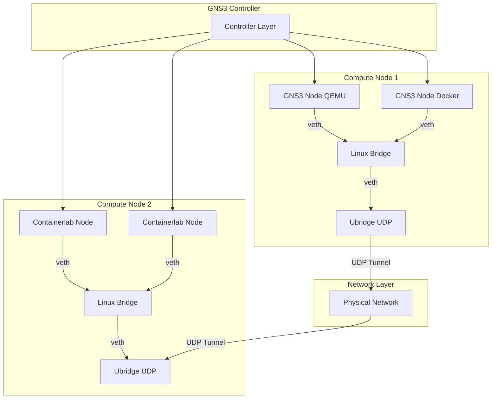

### Network Backend Decision Flow

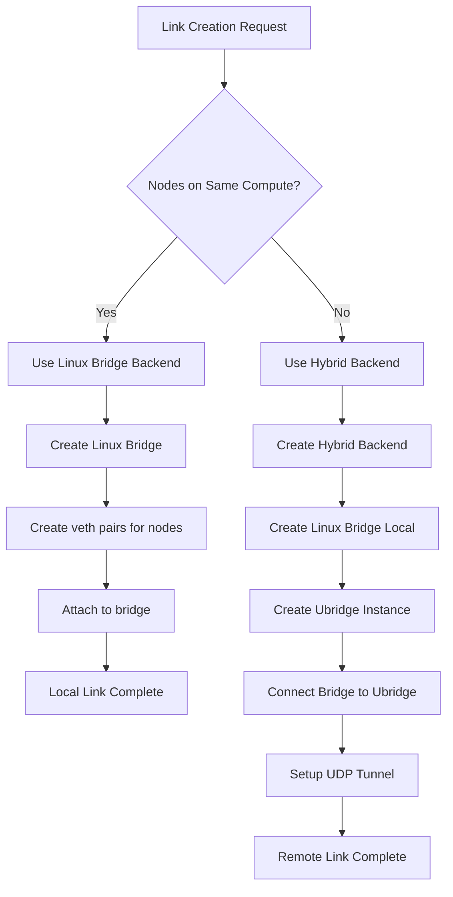

---

## Phase 1: Foundation & Abstraction Layer

### Network Backend Abstraction

**Goal**: Create a unified interface that supports multiple network implementations.

**Design Principles**:
- Pluggable backend architecture
- Backward compatibility with ubridge
- Performance-optimized path selection
- Seamless fallback mechanisms

### Backend Type Comparison

| Backend Type | Use Case | Performance | Complexity |
|--------------|----------|-------------|------------|
| **Pure Linux Bridge** | Local connections (same compute) | Highest (>20 Gbps) | Low |
| **Hybrid (Linux Bridge + Ubridge)** | Remote connections | Medium (>2 Gbps) | Medium |
| **Pure Ubridge** | Fallback/legacy | Baseline (~5 Gbps local) | Low |

### Component Architecture

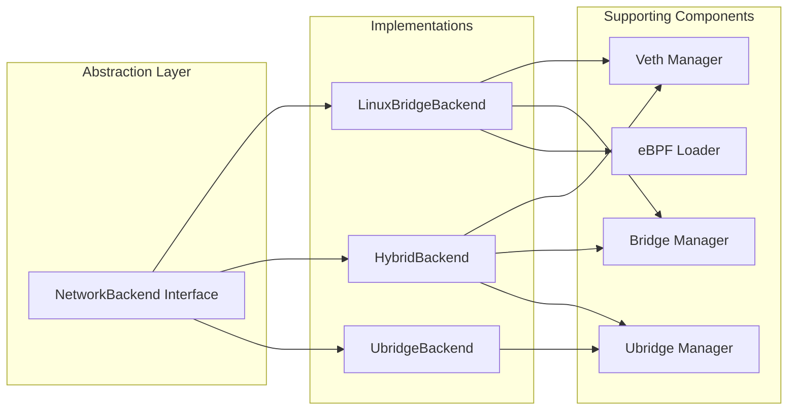

**Key Interfaces**:

| Method | Purpose | Implementation Variants |
|--------|---------|------------------------|
| `create_bridge()` | Create network bridge | Linux bridge command / ubridge bridge create |
| `add_node_interface()` | Connect node to bridge | veth pair / ubridge nio_tap |
| `add_udp_tunnel()` | Setup remote connection | ubridge nio_udp only |
| `apply_filters()` | Apply packet filters | eBPF XDP/TC / ubridge filters |
| `delete()` | Cleanup resources | Remove bridge / stop ubridge |

---

## Phase 2: Linux Bridge + Hybrid Ubridge Architecture

### Multi-Compute Hybrid Architecture

This is the **core architecture** enabling optimal performance across distributed deployments.

#### Architecture Diagram

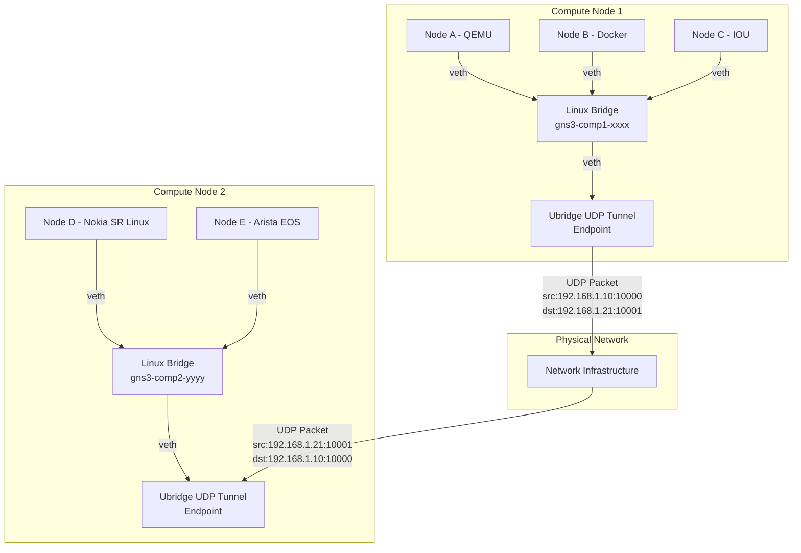

#### Packet Flow: Local vs Remote

**Local Connection (Node A → Node B)**:
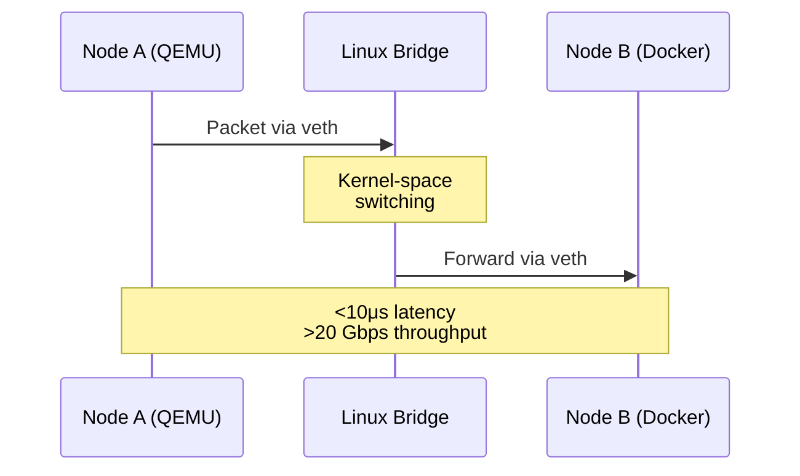

**Remote Connection (Node A → Node D)**:
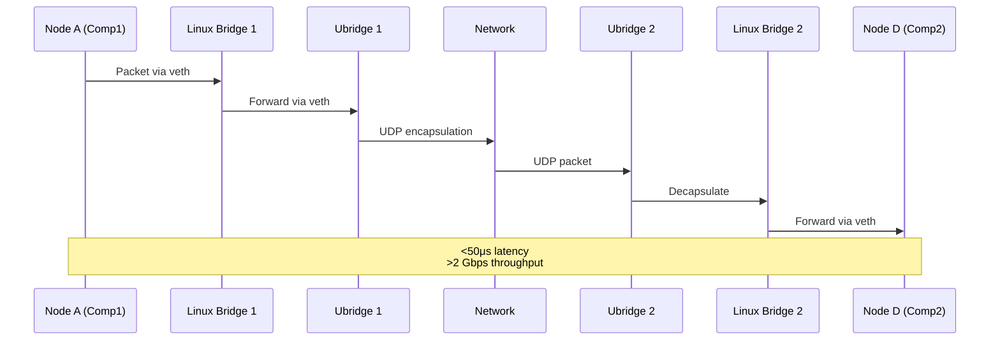

### Hybrid Backend Components

| Component | Responsibility | Technology |
|-----------|---------------|------------|
| **Linux Bridge Manager** | Create/delete bridges | `ip link add bridge` |
| **Veth Manager** | Create veth pairs | `ip link add veth` |
| **Bridge-Ubridge Connector** | Connect bridge to ubridge | veth pair + tap |
| **UDP Tunnel Manager** | Setup cross-compute tunnels | ubridge nio_udp |
| **eBPF Loader** | Attach filters to bridge | XDP/TC programs |

### Connection Decision Matrix

| Node A Location | Node B Location | Backend Used | Data Path |
|----------------|-----------------|--------------|-----------|
| Compute 1 | Compute 1 | Pure Linux Bridge | Kernel-space |
| Compute 1 | Compute 2 | Hybrid (LB + Ubridge UDP) | Kernel → User → Network |
| Compute 1 | Compute 3 | Hybrid (LB + Ubridge UDP) | Kernel → User → Network |
| Compute 1 (non-Linux) | Compute 1 | Pure Ubridge | User-space |

---

## Phase 3: eBPF Integration

### eBPF Architecture

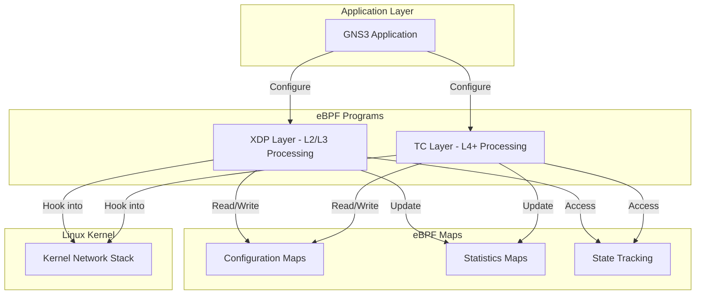

### eBPF Filter Types

| Filter Type | Hook Point | Use Case | Performance Impact |
|-------------|------------|----------|-------------------|
| **Packet Loss** | XDP | Simulate packet drops | <1μs |
| **Delay Injection** | TC | Add latency to packets | ~5μs |
| **Corruption** | XDP | Modify packet contents | <1μs |
| **Bandwidth Limit** | TC | Traffic shaping | ~2μs |
| **Custom BPF** | XDP/TC | User-defined filters | Variable |
| **Connection Tracking** | TC | Stateful filtering | ~10μs |

### eBPF vs Userspace Filters

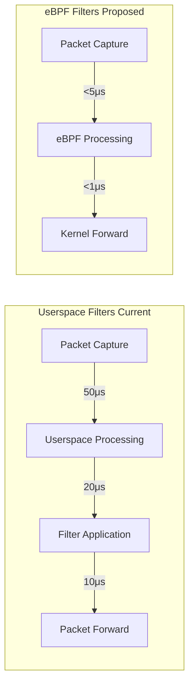

**Performance Comparison**:

| Metric | Userspace | eBPF | Improvement |
|--------|-----------|------|-------------|
| Packet processing | ~50μs | ~5μs | 10x faster |
| CPU overhead | 15-20% | <5% | 4x better |
| Max throughput | ~5 Gbps | ~20 Gbps | 4x higher |
| Dynamic updates | Requires restart | Hot reload | Instant |

### eBPF Program Categories

| Category | Programs | Complexity | Use Cases |
|----------|----------|------------|-----------|
| **Basic Filters** | Drop, Delay, Corrupt | Low | Network simulation |
| **Advanced Filters** | Bandwidth, QoS | Medium | Traffic engineering |
| **Stateful Filters** | Connection tracking | High | Stateful inspection |
| **Analytics** | Packet counting, timing | Medium | Monitoring |
| **Custom** | User-defined | Variable | Specialized needs |

---

## Phase 4: Containerlab Integration

### Integration Architecture

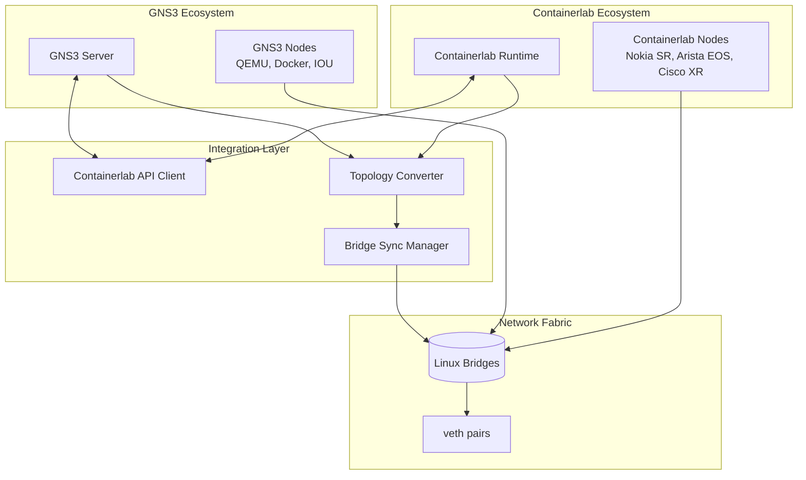

### Topology Conversion Flow

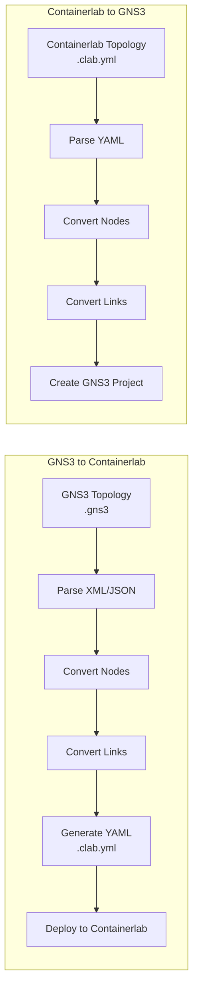

### Node Type Mapping

| GNS3 Node Type | Containerlab Kind | Conversion Complexity | Notes |
|----------------|-------------------|----------------------|-------|
| Docker | docker | Low | Direct mapping |
| QEMU | vm | Medium | Needs VM configuration |
| IOU | N/A | High | Requires container wrapper |
| Ethernet Switch | bridge | Low | Native Linux bridge |
| Cloud | bridge | Low | Special bridge config |
| Nokia SR Linux | nokia_srl | Low | Native support |
| Arista EOS | arista_ceos | Low | Native support |

### Bridge Synchronization

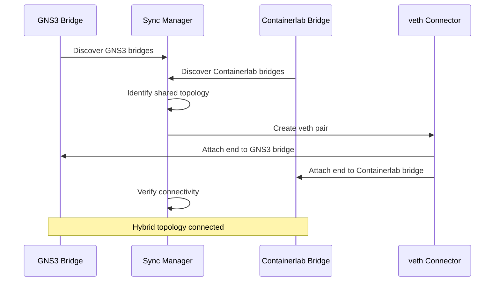

### Integration Benefits

| Aspect | GNS3 Standalone | Containerlab Standalone | Integrated |
|--------|----------------|------------------------|------------|
| Network Devices | Limited | Extensive | ✅ Both ecosystems |
| Performance | Good (ubridge) | Excellent (Linux) | ✅ Linux bridge |
| Vendor Images | Community | Official | ✅ Official support |
| CI/CD Integration | Basic | Excellent | ✅ Inherits advantages |
| Development Speed | Medium | Fast | ✅ Accelerated |

---

## Deployment Scenarios

### Scenario 1: Single Compute, All Local

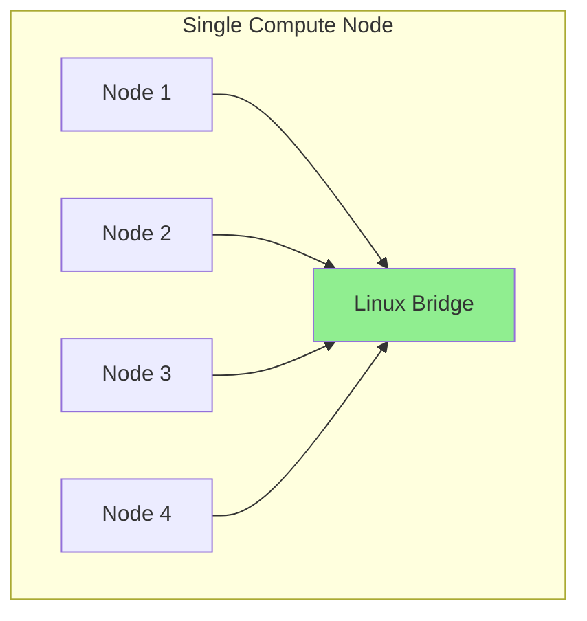

**Characteristics**:
- All nodes on same physical machine
- Pure Linux bridge backend
- Maximum performance (>20 Gbps)
- eBPF filters available
- Latency: <10μs

### Scenario 2: Multi-Compute, Hybrid

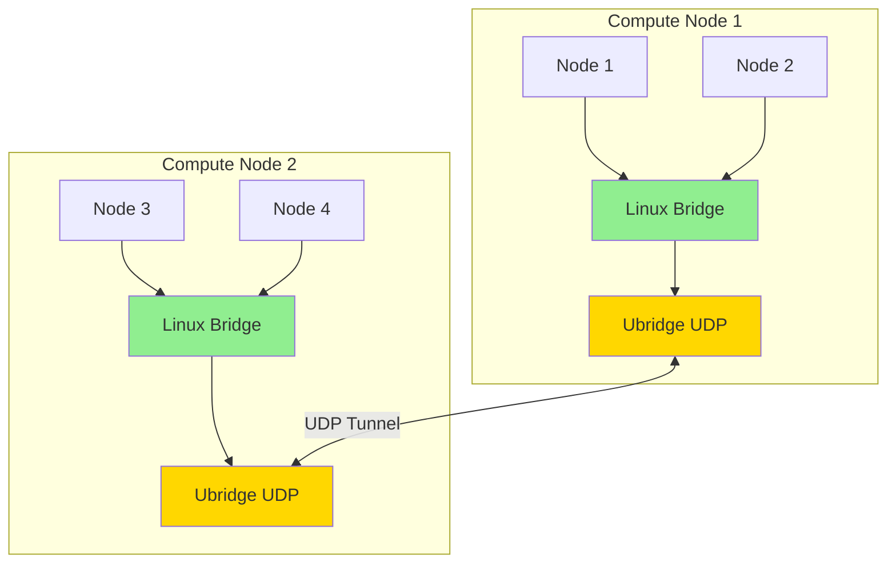

**Characteristics**:
- Nodes distributed across machines
- Local: Linux bridge (fast)
- Remote: Ubridge UDP (scalable)
- Optimal performance mix

### Scenario 3: Hybrid GNS3 + Containerlab

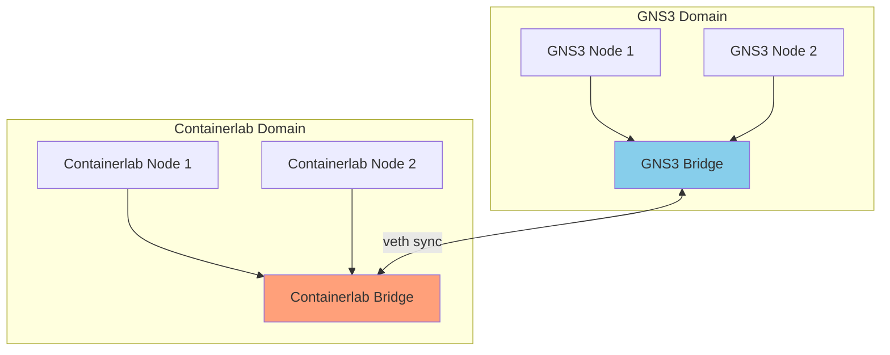

**Characteristics**:
- Best of both ecosystems
- Seamless interoperability
- Unified management
- Expanded device catalog

---

## Performance Expectations

### Throughput Comparison

| Scenario | Current (Ubridge) | Proposed (Linux Bridge) | Improvement |
|----------|------------------|----------------------|-------------|
| Local (2 nodes) | ~5 Gbps | >20 Gbps | 4x |
| Local (8 nodes) | ~3 Gbps | >20 Gbps | 6.7x |
| Remote (same rack) | ~2 Gbps | >2 Gbps | Baseline |
| Remote (cross DC) | ~1.5 Gbps | >1.5 Gbps | Baseline |

### Latency Comparison

| Connection Type | Current (Ubridge) | Proposed (Linux Bridge) | Improvement |
|----------------|------------------|----------------------|-------------|
| Local (same compute) | ~50μs | <10μs | 5x faster |
| Remote (same rack) | ~100μs | ~50μs | 2x faster |
| Remote (cross datacenter) | ~500μs | ~450μs | Marginal |

### Resource Usage

| Metric | Current | Proposed | Improvement |
|--------|---------|----------|-------------|
| CPU (10 nodes, all local) | 20% | 5% | 4x better |
| Memory per node | 50MB | 10MB | 5x better |
| Packet copy overhead | 4 copies | 1 copy | 4x reduction |

---

## Risk Assessment & Mitigation

### Risk Matrix

| Risk | Impact | Probability | Mitigation Strategy |
|------|--------|-------------|-------------------|
| Linux bridge performance issues | High | Low | Early benchmarking, optimization |
| eBPF security vulnerabilities | High | Low | Code review, sandboxing, kernel verifier |
| Containerlab API compatibility | Medium | Medium | Version locking, adapter layer |
| User experience disruption | Medium | Low | Gradual rollout, documentation |
| Cross-platform compatibility | Medium | High | Maintain ubridge fallback |
| Deployment complexity | Medium | Medium | Automated tooling, guides |

### Migration Strategy

**Phased Approach**:
1. **Phase 1**: Foundation & Abstraction Layer
2. **Phase 2**: Linux Bridge Implementation
3. **Phase 3**: eBPF Integration
4. **Phase 4**: Containerlab Integration
5. **Phase 5**: Testing & Production

**Rollback Capabilities**:
- Configuration-based backend selection
- Runtime fallback to ubridge
- Per-project backend choice
- Automatic detection of suitable backend

---

## Success Metrics

### Performance KPIs

| KPI | Target | Measurement Method |
|-----|--------|-------------------|
| Local throughput | >20 Gbps | iperf3 |
| Remote throughput | >2 Gbps | iperf3 |
| Local latency | <10μs | packet timestamping |
| CPU efficiency | <5% @ 10 nodes | system monitoring |
| Memory efficiency | <100MB @ 10 nodes | process metrics |

### Functional KPIs

| KPI | Target | Validation |
|-----|--------|-----------|
| Backend compatibility | 100% | All node types work |
| Topology conversion | 100% | Import/export success |
| eBPF filter coverage | >90% | Common filters implemented |
| Containerlab node support | >80% | Major vendors supported |

### Quality KPIs

| KPI | Target | Measurement |
|-----|--------|-------------|
| Test coverage | >85% | Code coverage tools |
| Security audit | Pass | External review |
| Performance regression | None | Benchmark suite |
| User acceptance | >90% | Survey feedback |

---

## Configuration Examples

### Basic Configuration

```ini
[Server]
# Enable Linux bridge backend
use_linux_bridge = true

# Enable eBPF filters
enable_ebpf = true

[LinuxBridge]
# Bridge naming pattern
bridge_prefix = gns3

# Enable local bridge for intra-node traffic
enable_local_bridge = true
```

### Advanced Configuration

```ini
[Server]
use_linux_bridge = true
ubridge_fallback = true

[LinuxBridge]
bridge_prefix = gns3
veth_prefix = veth
enable_vlan_filtering = false
mtu = 9000

[eBPF]
enabled = true
program_directory = /var/lib/gns3/ebpf
enable_custom_bpf = true
security_sandbox = true

[Containerlab]
enabled = true
api_endpoint = http://localhost:5000
auto_sync_bridges = true
supported_kinds = nokia_srlinux,arista_ceos,cisco_xrd

[Hybrid]
auto_detect_local = true
prefer_linux_bridge = true
udp_buffer_size = 1048576
```

---

## Future Enhancements

### Post-Integration Features

**Advanced eBPF Capabilities**:
- Connection tracking
- Traffic analytics and monitoring
- Custom metrics collection
- Advanced QoS

**Multi-Cloud Support**:
- AWS/Azure/GCP integration
- Distributed topology deployment
- Cloud-native networking

**Windows/macOS Support**:
- WSL2 integration (Windows)
- Linux VM approach (macOS)
- Feature parity detection

**AI Integration**:
- Intelligent topology optimization
- Automated failure detection
- Performance tuning recommendations

---

## Technical Requirements

### Dependencies

```
# Python packages
bcc>=0.25.0              # eBPF toolchain
libbpf>=1.0.0            # eBPF library
clang>=12.0.0            # eBPF compiler
llvm>=12.0.0             # eBPF JIT backend
aiohttp>=3.8.0           # HTTP client
pyyaml>=6.0              # YAML parser

# System requirements
- Linux kernel >= 5.8    # eBPF support
- CAP_NET_ADMIN          # Network management
- bridge-utils           # Linux bridge tools
```

### System Capabilities

- Root or CAP_NET_ADMIN for bridge creation
- eBPF JIT compiler enabled
- Sufficient file descriptors for veth pairs
- Network namespace support

---

**Version**: 1.0
**Status**: 🎯 Proposal
**Last Updated**: January 7, 2025
