# GNS3 Linux Bridge + eBPF + Containerlab 集成路线图

---

**版权所有 (C) 2025 GNS3 Technologies Inc.**

本作品采用知识共享署名-相同方式共享 4.0 国际许可协议进行许可。

您可以自由地：
- **分享** — 以任何媒介或格式复制和分发本材料
- **改编** — 重混、转换和基于本材料构建

只要您遵守以下条款：
- **署名** — 您必须提供适当的 credit，提供许可协议的链接，并说明是否进行了更改。
- **相同方式共享** — 如果您重混、转换或基于本材料构建，您必须以相同许可协议分发您的贡献。

要查看本许可协议的副本，请访问：
http://creativecommons.org/licenses/by-sa/4.0/deed.zh

---

## 执行摘要

**目标**: 将 GNS3 从基于 ubridge 的网络架构迁移到混合的 **Linux bridge + eBPF + Containerlab** 架构。

**核心优势**:
- ⚡ **性能**: 本地连接吞吐量提升 5-10 倍
- 🔌 **生态系统**: 接入 containerlab 丰富的网络设备目录
- 🔥 **eBPF 支持**: 内核态包处理，接近零开销
- 🚀 **CI/CD 就绪**: 更好的自动化和云原生集成

---

## 架构概览

### 高层架构

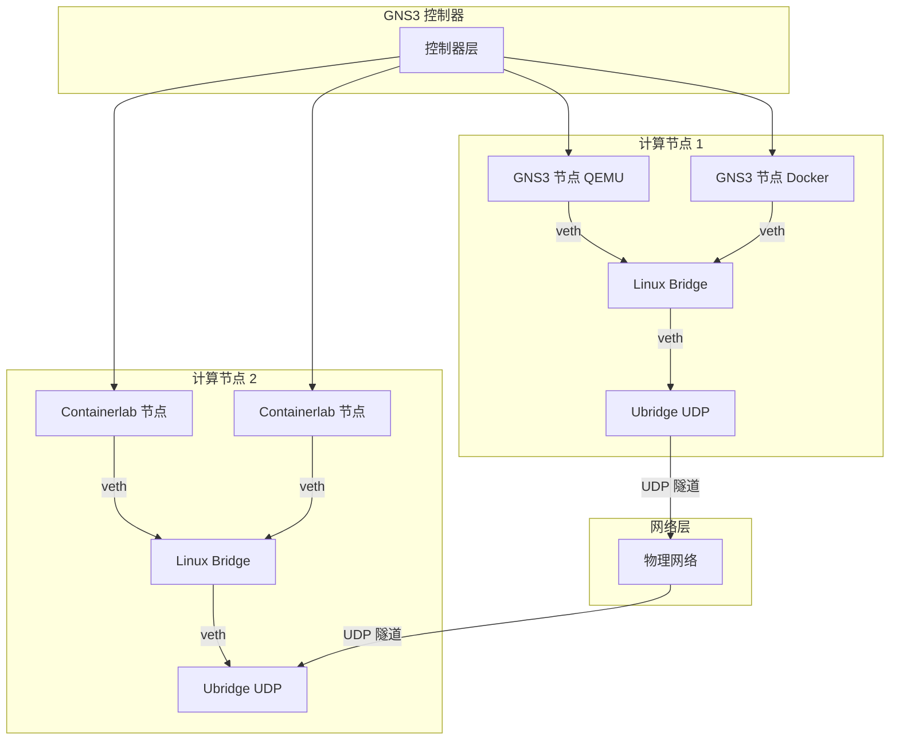

### 网络后端决策流程

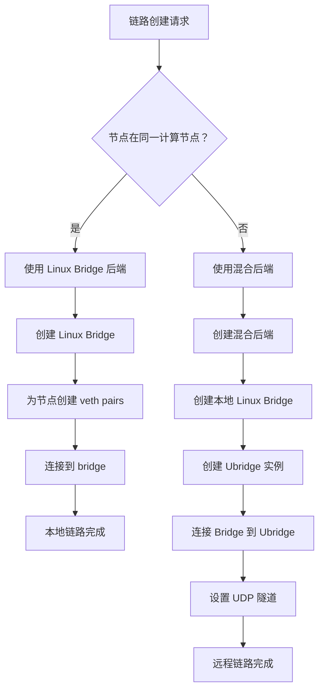

---

## 第一阶段：基础与抽象层

### 网络后端抽象

**目标**: 创建统一接口支持多种网络实现。

**设计原则**:
- 可插拔后端架构
- 与 ubridge 向后兼容
- 性能优化路径选择
- 无缝回退机制

### 后端类型对比

| 后端类型 | 使用场景 | 性能 | 复杂度 |
|--------------|----------|-------------|------------|
| **纯 Linux Bridge** | 本地连接（同一计算节点） | 最高 (>20 Gbps) | 低 |
| **混合 (Linux Bridge + Ubridge)** | 远程连接 | 中等 (>2 Gbps) | 中 |
| **纯 Ubridge** | 回退/传统 | 基准 (~5 Gbps 本地) | 低 |

### 组件架构

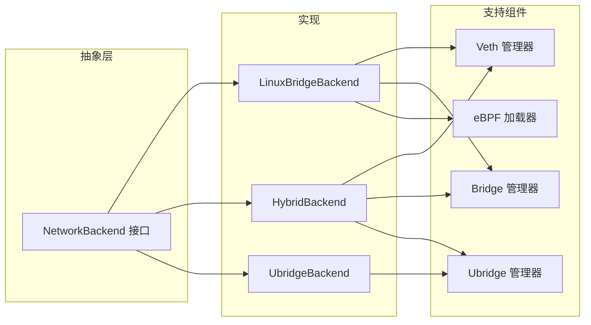

**关键接口**:

| 方法 | 目的 | 实现变体 |
|--------|---------|------------------------|
| `create_bridge()` | 创建网络 bridge | Linux bridge 命令 / ubridge bridge create |
| `add_node_interface()` | 连接节点到 bridge | veth pair / ubridge nio_tap |
| `add_udp_tunnel()` | 设置远程连接 | ubridge nio_udp only |
| `apply_filters()` | 应用包过滤器 | eBPF XDP/TC / ubridge filters |
| `delete()` | 清理资源 | 移除 bridge / 停止 ubridge |

---

## 第二阶段：Linux Bridge + 混合 Ubridge 架构

### 多计算节点混合架构

这是**核心架构**，在分布式部署中实现最优性能。

#### 架构图

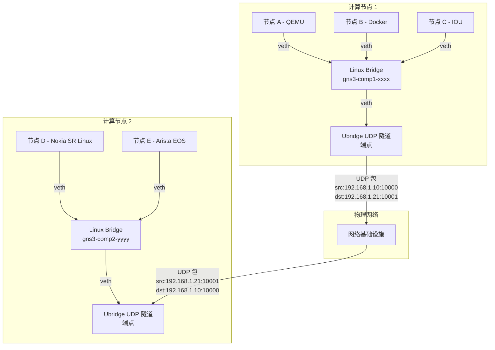

#### 包流：本地 vs 远程

**本地连接 (节点 A → 节点 B)**:
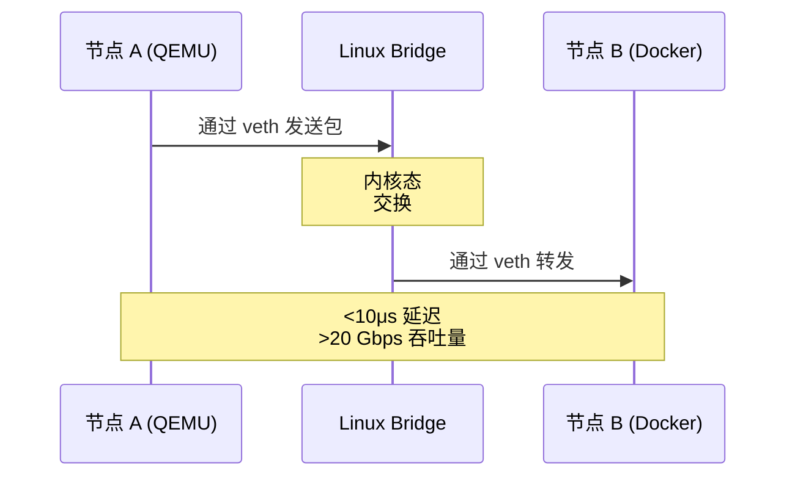

**远程连接 (节点 A → 节点 D)**:
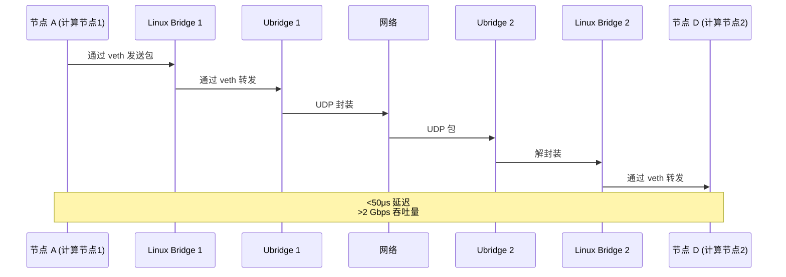

### 混合后端组件

| 组件 | 职责 | 技术 |
|-----------|---------------|------------|
| **Linux Bridge 管理器** | 创建/删除 bridges | `ip link add bridge` |
| **Veth 管理器** | 创建 veth pairs | `ip link add veth` |
| **Bridge-Ubridge 连接器** | 连接 bridge 到 ubridge | veth pair + tap |
| **UDP 隧道管理器** | 设置跨计算节点隧道 | ubridge nio_udp |
| **eBPF 加载器** | 将过滤器附加到 bridge | XDP/TC 程序 |

### 连接决策矩阵

| 节点 A 位置 | 节点 B 位置 | 使用的后端 | 数据路径 |
|----------------|-----------------|--------------|-----------|
| 计算节点 1 | 计算节点 1 | 纯 Linux Bridge | 内核态 |
| 计算节点 1 | 计算节点 2 | 混合 (LB + Ubridge UDP) | 内核 → 用户态 → 网络 |
| 计算节点 1 | 计算节点 3 | 混合 (LB + Ubridge UDP) | 内核 → 用户态 → 网络 |
| 计算节点 1 (非 Linux) | 计算节点 1 | 纯 Ubridge | 用户态 |

---

## 第三阶段：eBPF 集成

### eBPF 架构

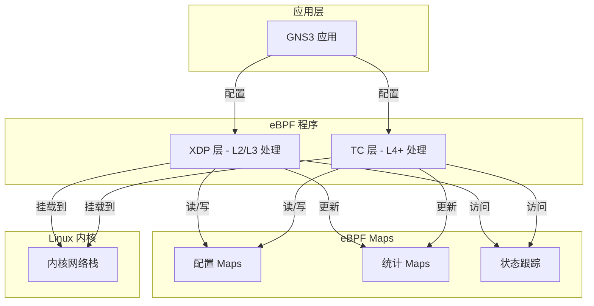

### eBPF 过滤器类型

| 过滤器类型 | 挂载点 | 使用场景 | 性能影响 |
|-------------|------------|----------|-------------------|
| **丢包** | XDP | 模拟丢包 | <1μs |
| **延迟注入** | TC | 添加包延迟 | ~5μs |
| **损坏** | XDP | 修改包内容 | <1μs |
| **带宽限制** | TC | 流量整形 | ~2μs |
| **自定义 BPF** | XDP/TC | 用户定义过滤器 | 可变 |
| **连接跟踪** | TC | 有状态过滤 | ~10μs |

### eBPF vs 用户态过滤器

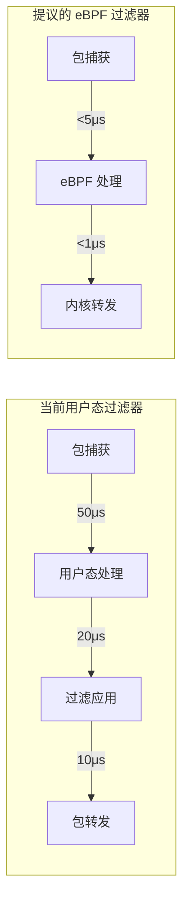

**性能对比**:

| 指标 | 用户态 | eBPF | 改进 |
|--------|-----------|------|-------------|
| 包处理 | ~50μs | ~5μs | 10x 更快 |
| CPU 开销 | 15-20% | <5% | 4x 更好 |
| 最大吞吐量 | ~5 Gbps | ~20 Gbps | 4x 更高 |
| 动态更新 | 需要重启 | 热加载 | 即时 |

### eBPF 程序类别

| 类别 | 程序 | 复杂度 | 使用场景 |
|----------|----------|------------|-----------|
| **基础过滤器** | 丢包、延迟、损坏 | 低 | 网络仿真 |
| **高级过滤器** | 带宽、QoS | 中 | 流量工程 |
| **有状态过滤器** | 连接跟踪 | 高 | 有状态检测 |
| **分析** | 包计数、计时 | 中 | 监控 |
| **自定义** | 用户定义 | 可变 | 特殊需求 |

---

## 第四阶段：Containerlab 集成

### 集成架构

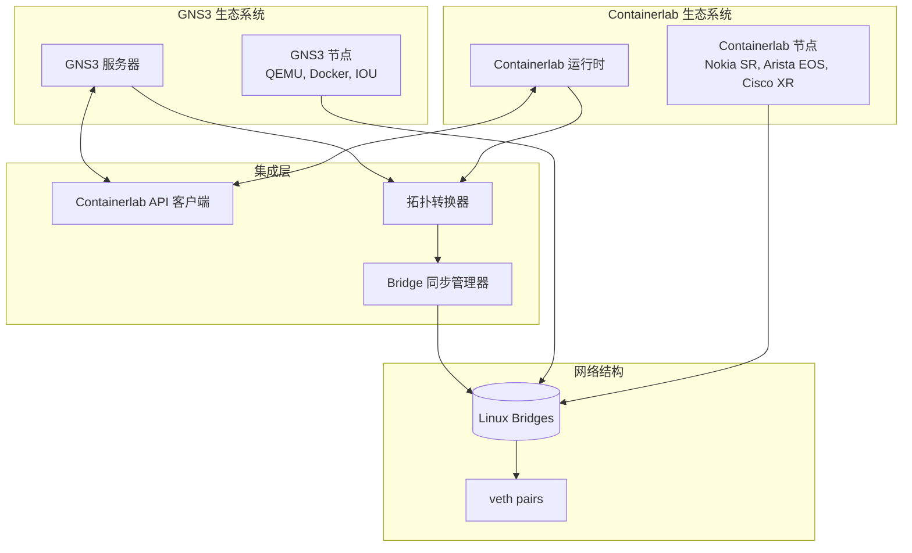

### 拓扑转换流程

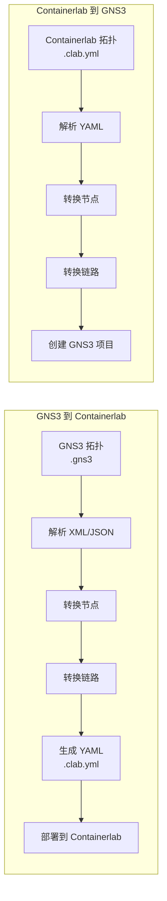

### 节点类型映射

| GNS3 节点类型 | Containerlab Kind | 转换复杂度 | 备注 |
|----------------|-------------------|----------------------|-------|
| Docker | docker | 低 | 直接映射 |
| QEMU | vm | 中 | 需要 VM 配置 |
| IOU | N/A | 高 | 需要容器包装 |
| 以太网交换机 | bridge | 低 | 原生 Linux bridge |
| Cloud | bridge | 低 | 特殊 bridge 配置 |
| Nokia SR Linux | nokia_srl | 低 | 原生支持 |
| Arista EOS | arista_ceos | 低 | 原生支持 |

### Bridge 同步

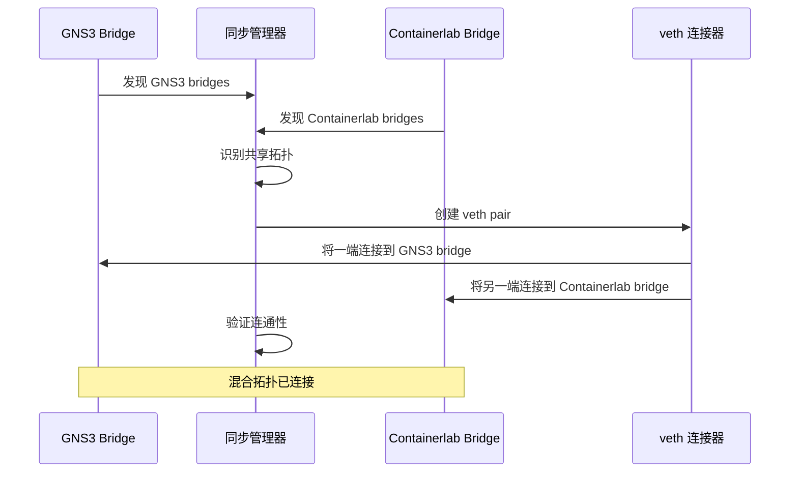

### 集成优势

| 方面 | GNS3 独立 | Containerlab 独立 | 集成后 |
|--------|----------------|------------------------|------------|
| 网络设备 | 有限 | 丰富 | ✅ 两者生态系统 |
| 性能 | 良好 (ubridge) | 优秀 (Linux) | ✅ Linux bridge |
| 厂商镜像 | 社区 | 官方 | ✅ 官方支持 |
| CI/CD 集成 | 基础 | 优秀 | ✅ 继承优势 |
| 开发速度 | 中等 | 快速 | ✅ 加速 |

---

## 部署场景

### 场景 1：单计算节点，全本地

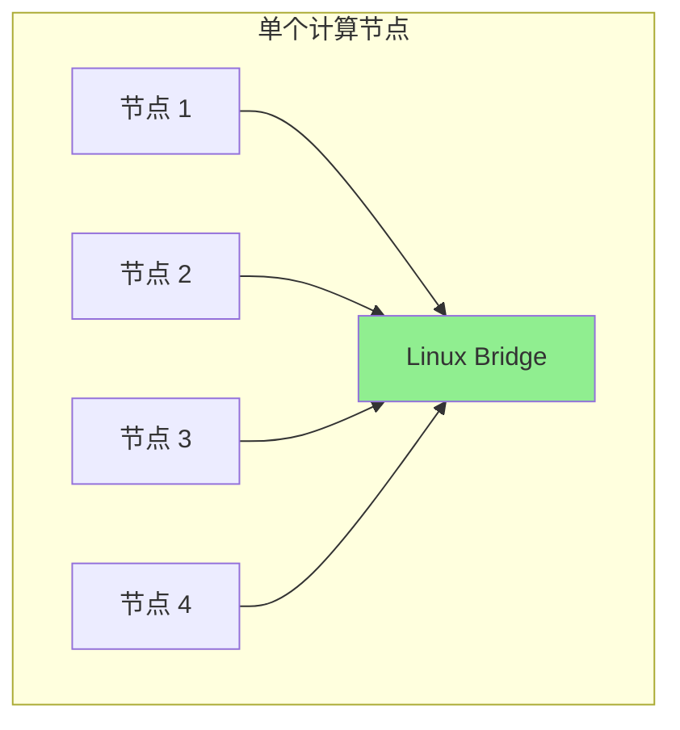

**特性**:
- 所有节点在同一台物理机器上
- 纯 Linux bridge 后端
- 最大性能 (>20 Gbps)
- eBPF 过滤器可用
- 延迟：<10μs

### 场景 2：多计算节点，混合模式

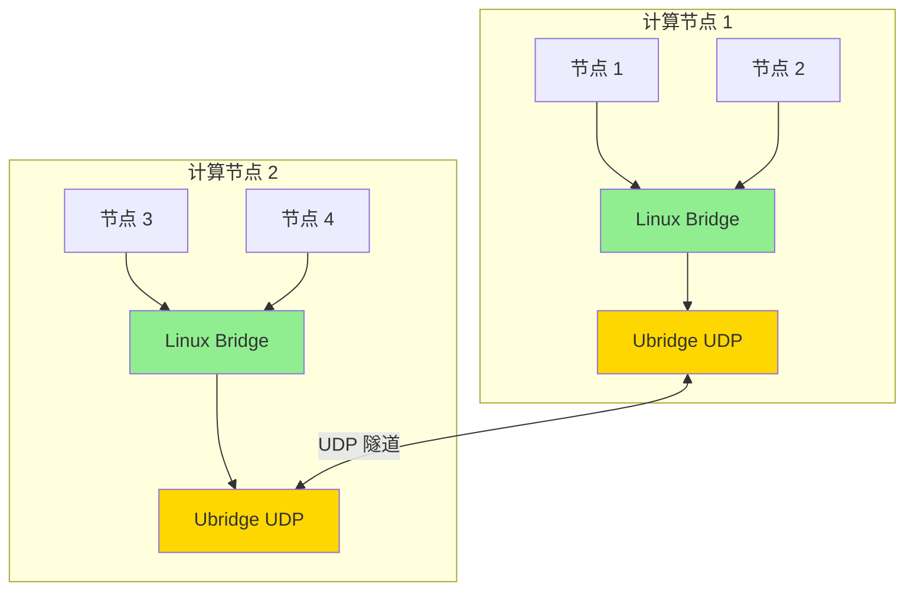

**特性**:
- 节点分布在多台机器上
- 本地：Linux bridge（快速）
- 远程：Ubridge UDP（可扩展）
- 最优性能组合

### 场景 3：混合 GNS3 + Containerlab

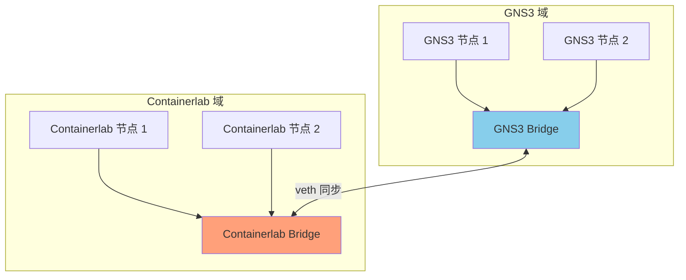

**特性**:
- 两个生态系统的优势
- 无缝互操作性
- 统一管理
- 扩展的设备目录

---

## 性能预期

### 吞吐量对比

| 场景 | 当前 (Ubridge) | 提议 (Linux Bridge) | 改进 |
|----------|------------------|----------------------|-------------|
| 本地 (2 节点) | ~5 Gbps | >20 Gbps | 4x |
| 本地 (8 节点) | ~3 Gbps | >20 Gbps | 6.7x |
| 远程 (同一机架) | ~2 Gbps | >2 Gbps | 基准 |
| 远程 (跨数据中心) | ~1.5 Gbps | >1.5 Gbps | 基准 |

### 延迟对比

| 连接类型 | 当前 (Ubridge) | 提议 (Linux Bridge) | 改进 |
|----------------|------------------|----------------------|-------------|
| 本地 (同一计算节点) | ~50μs | <10μs | 5x 更快 |
| 远程 (同一机架) | ~100μs | ~50μs | 2x 更快 |
| 远程 (跨数据中心) | ~500μs | ~450μs | 微小 |

### 资源使用

| 指标 | 当前 | 提议 | 改进 |
|--------|---------|----------|-------------|
| CPU (10 节点，全本地) | 20% | 5% | 4x 更好 |
| 每节点内存 | 50MB | 10MB | 5x 更好 |
| 包复制开销 | 4 次复制 | 1 次复制 | 4x 减少 |

---

## 风险评估与缓解

### 风险矩阵

| 风险 | 影响 | 概率 | 缓解策略 |
|------|--------|-------------|-------------------|
| Linux bridge 性能问题 | 高 | 低 | 早期基准测试、优化 |
| eBPF 安全漏洞 | 高 | 低 | 代码审查、沙箱、内核验证器 |
| Containerlab API 兼容性 | 中 | 中 | 版本锁定、适配层 |
| 用户体验中断 | 中 | 低 | 逐步推出、文档 |
| 跨平台兼容性 | 中 | 高 | 维持 ubridge 回退 |
| 部署复杂性 | 中 | 中 | 自动化工具、指南 |

### 迁移策略

**分阶段方法**:
1. **阶段 1**: 基础与抽象层
2. **阶段 2**: Linux Bridge 实现
3. **阶段 3**: eBPF 集成
4. **阶段 4**: Containerlab 集成
5. **阶段 5**: 测试与生产

**回退能力**:
- 基于配置的后端选择
- 运行时回退到 ubridge
- 每个项目后端选择
- 自动检测合适的后端

---

## 成功指标

### 性能 KPI

| KPI | 目标 | 测量方法 |
|-----|--------|-------------------|
| 本地吞吐量 | >20 Gbps | iperf3 |
| 远程吞吐量 | >2 Gbps | iperf3 |
| 本地延迟 | <10μs | 包时间戳 |
| CPU 效率 | <5% @ 10 节点 | 系统监控 |
| 内存效率 | <100MB @ 10 节点 | 进程指标 |

### 功能 KPI

| KPI | 目标 | 验证 |
|-----|--------|-----------|
| 后端兼容性 | 100% | 所有节点类型工作 |
| 拓扑转换 | 100% | 导入/导出成功 |
| eBPF 过滤器覆盖 | >90% | 常见过滤器已实现 |
| Containerlab 节点支持 | >80% | 主要厂商支持 |

### 质量 KPI

| KPI | 目标 | 测量 |
|-----|--------|-------------|
| 测试覆盖率 | >85% | 代码覆盖率工具 |
| 安全审计 | 通过 | 外部审查 |
| 性能回归 | 无 | 基准测试套件 |
| 用户接受度 | >90% | 调查反馈 |

---

## 配置示例

### 基本配置

```ini
[Server]
# 启用 Linux bridge 后端
use_linux_bridge = true

# 启用 eBPF 过滤器
enable_ebpf = true

[LinuxBridge]
# Bridge 命名模式
bridge_prefix = gns3

# 为节点间流量启用本地 bridge
enable_local_bridge = true
```

### 高级配置

```ini
[Server]
use_linux_bridge = true
ubridge_fallback = true

[LinuxBridge]
bridge_prefix = gns3
veth_prefix = veth
enable_vlan_filtering = false
mtu = 9000

[eBPF]
enabled = true
program_directory = /var/lib/gns3/ebpf
enable_custom_bpf = true
security_sandbox = true

[Containerlab]
enabled = true
api_endpoint = http://localhost:5000
auto_sync_bridges = true
supported_kinds = nokia_srlinux,arista_ceos,cisco_xrd

[Hybrid]
auto_detect_local = true
prefer_linux_bridge = true
udp_buffer_size = 1048576
```

---

## 未来增强

### 集成后功能

**高级 eBPF 能力**:
- 连接跟踪
- 流量分析和监控
- 自定义指标收集
- 高级 QoS

**多云支持**:
- AWS/Azure/GCP 集成
- 分布式拓扑部署
- 云原生网络

**Windows/macOS 支持**:
- WSL2 集成 (Windows)
- Linux VM 方案 (macOS)
- 功能对等检测

**AI 集成**:
- 智能拓扑优化
- 自动故障检测
- 性能调优建议

---

## 关键技术考量与最佳实践

### 1. eBPF 过滤器热加载设计

**挑战**: 用户需要通过 GNS3 GUI 实时调整链路质量参数（延迟、丢包、带宽）而不降低性能。

**解决方案**: 实现基于 eBPF Maps 的动态控制，而不是频繁的程序重载。

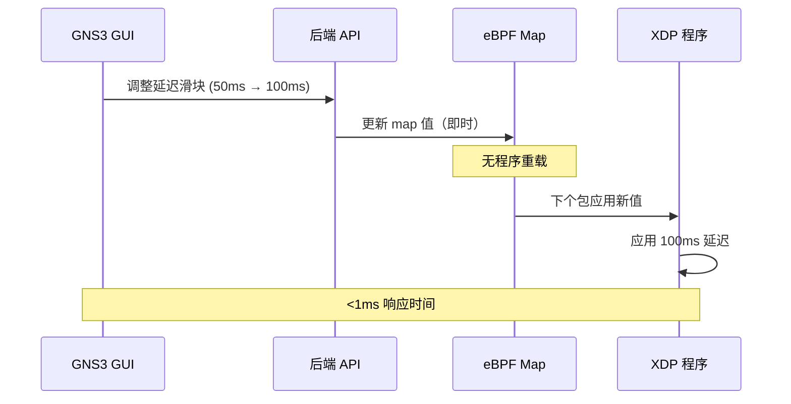

**架构优势**:

| 方法 | 重载时间 | CPU 影响 | GUI 响应性 |
|----------|-------------|------------|-------------------|
| **程序重载** | 10-50ms | 高 | 延迟 |
| **Map 更新** | <1ms | 可忽略 | 即时 |

**关键优势**:
- 零停机配置更改
- 无需进程重启
- 毫秒级 GUI 响应
- 支持实时滑块调整

---

### 2. 混合模式 Linux Bridge MTU 优化

**问题**: UDP 隧道封装增加约 50 字节开销。默认 1500 字节 MTU 在物理网络不支持巨型帧时会导致分片。

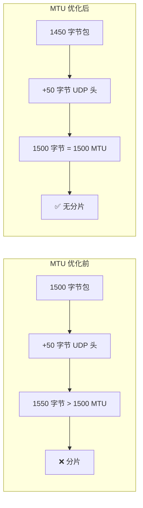

**推荐 MTU 设置**:

| 组件 | 标准 MTU | 混合模式 MTU | 原因 |
|-----------|--------------|-----------------|-----------|
| **Linux Bridge** | 1500 | 1450 | 为 UDP 头预留空间 |
| **veth pairs** | 1500 | 1450 | 匹配 bridge MTU |
| **Ubridge UDP** | N/A | 1450 | 内部隧道 MTU |
| **物理接口** | 1500 | 1500 | 标准以太网 |

**性能影响**:

| 场景 | MTU | 分片 | 吞吐量 | CPU 使用 |
|----------|-----|---------------|------------|-----------|
| **默认 1500** | 1500 | 是 | ~1.2 Gbps | 高（分片） |
| **优化 1450** | 1450 | 否 | ~2.0 Gbps | 低 |

**配置示例**:
```ini
[Hybrid]
# 自动 MTU 计算
auto_mtu = true
mtu_base = 1500
encapsulation_overhead = 50
safety_margin = 0
```

---

### 3. Containerlab Bridge 同步策略

**挑战**: 在 GNS3 和 Containerlab 之间高效同步网络状态，无需复杂的 veth 管理。

#### 选项 A：直接 veth pair 连接

**优点**: 原生 Linux bridge 支持
**缺点**: 复杂管理、扩展性问题

#### 选项 B：Open vSwitch（推荐）

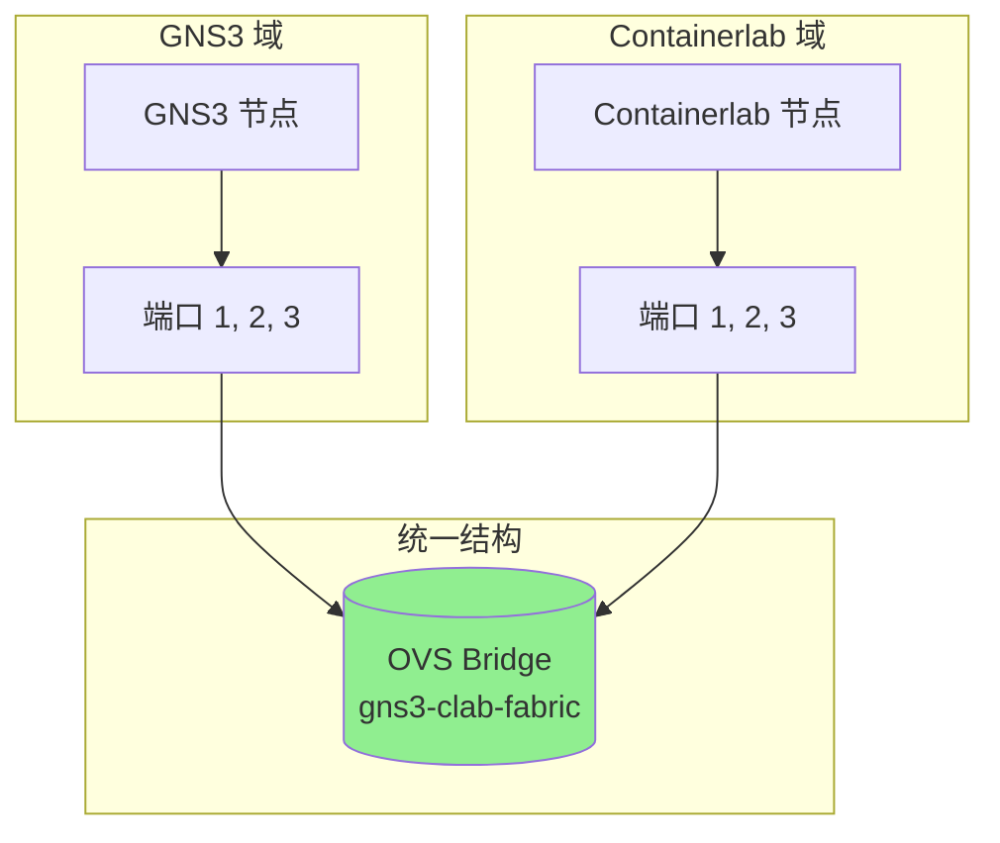

**OVS 优势**:

| 特性 | Linux Bridge | Open vSwitch |
|---------|--------------|--------------|
| **管理** | 手动 veth 设置 | 集中配置 |
| **扩展性** | 有限 | 优秀 |
| **VLAN 支持** | 基础 | 高级 (802.1Q) |
| **流量监控** | 有限 | 内置 sFlow/NetFlow |
| **调试** | 基础工具 | 丰富工具生态 |
| **Containerlab 集成** | 需要定制 | 原生支持 |

---

### 4. eBPF 安全与隔离

**安全考虑**: eBPF 需要 `CAP_BPF` 或 `CAP_SYS_ADMIN` 能力，这在多租户环境中构成安全风险。

#### 特权代理架构

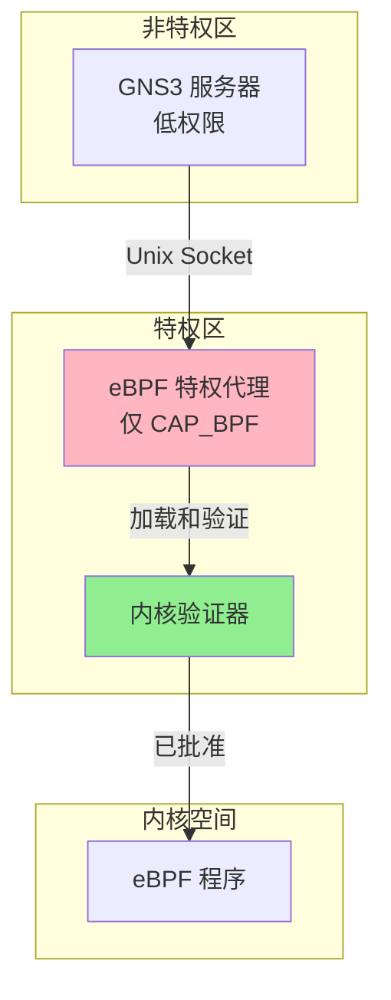

**安全优势**:

| 方法 | 攻击面 | 权限范围 | 隔离 |
|----------|----------------|-----------------|-----------|
| **直接 eBPF** | 大 | 完整 CAP_SYS_ADMIN | 无 |
| **特权代理** | 最小 | 仅 CAP_BPF | 基于进程 |

**安全特性**:

1. **能力丢弃**: 仅保留 `CAP_BPF` 和 `CAP_PERFMON`
2. **Seccomp 过滤**: 限制系统调用
3. **命名空间隔离**: 在独立网络命名空间中运行
4. **无新权限**: 防止权限提升
5. **资源限制**: 强制内存和 CPU 限制

---

### 5. 基于 eBPF 的实时性能监控

**机会**: 利用 eBPF 进行零开销流量监控和可视化。

#### 监控架构

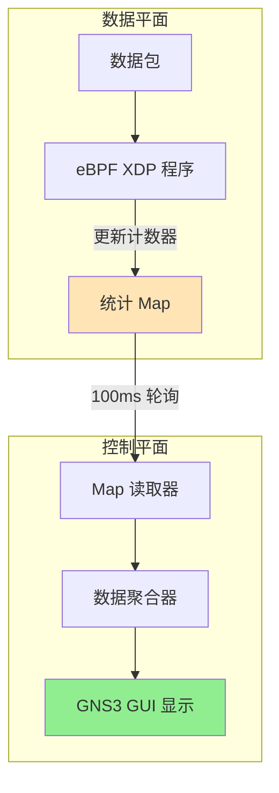

**监控功能**:

| 指标 | 更新率 | 准确度 | 开销 |
|--------|-------------|----------|----------|
| **带宽** | 100ms | ±0.1% | <0.1% CPU |
| **包速率** | 100ms | ±0.1% | <0.1% CPU |
| **丢包率** | 100ms | 精确 | <0.1% CPU |
| **延迟** | 1s | ±5μs | <0.5% CPU |

**与传统监控对比**:

| 方法 | CPU 开销 | 准确度 | 实时 |
|----------|-------------|----------|-----------|
| **pcap/tcpdump** | 5-10% | 高 | 否 |
| **iptables 计数器** | 1-2% | 中 | 否 |
| **eBPF maps** | <0.5% | 高 | 是 |

**配置**:
```ini
[Monitoring]
# 启用实时监控
enable_ebpf_monitoring = true
update_interval_ms = 100

# 收集指标
collect_bandwidth = true
collect_packet_rate = true
collect_drop_rate = true
collect_latency = false  # 更高开销
```

---

## 技术要求

### 依赖项

```
# Python 包
bcc>=0.25.0              # eBPF 工具链
libbpf>=1.0.0            # eBPF 库
clang>=12.0.0            # eBPF 编译器
llvm>=12.0.0             # eBPF JIT 后端
aiohttp>=3.8.0           # HTTP 客户端
pyyaml>=6.0              # YAML 解析器

# 系统要求
- Linux kernel >= 5.8    # eBPF 支持
- CAP_NET_ADMIN          # 网络管理
- bridge-utils           # Linux bridge 工具
```

### 系统能力

- Root 或 CAP_NET_ADMIN 用于创建 bridge
- 启用 eBPF JIT 编译器
- 足够的文件描述符用于 veth pairs
- 网络命名空间支持

---

**版本**: 1.0
**状态**: 🎯 提案
**最后更新**: 2025年1月7日
