# GNS3 Linux Bridge + eBPF Implementation Plan

---

**Copyright (C) 2026 GNS3 Technologies Inc.**

This work is licensed under the Creative Commons Attribution-ShareAlike 4.0 International License (CC BY-SA 4.0).

For full license terms, see: [../LICENSE](../LICENSE)

---

## Executive Summary

**Objective**: Migrate GNS3 from ubridge-based networking to a hybrid **Linux bridge + eBPF** architecture to improve local-node throughput, reduce latency, and provide kernel-space packet processing.

**Key Benefits (Design Targets)**:
- ⚡ **Performance**: Target 4x throughput improvement for local connections (same compute)
- 🔥 **eBPF Support**: Kernel-space packet processing with near-zero overhead
- 🚀 **CI/CD Ready**: Better automation and cloud-native integration

> **Note**: Performance figures throughout this document are **design targets**, not measured benchmarks. Actual gains depend on workload, kernel version, NIC offloading, and node type. A Phase 1 POC — starting with **Docker nodes only** — is required to validate these assumptions before committing to subsequent phases.

---

## Current Architecture (Baseline)

Before planning changes, it's critical to understand how the current codebase actually works.

### Link Creation Flow

The controller (`gns3server/controller/project.py:761`) always instantiates `UDPLink` — there is **no alternative link implementation** today. `UDPLink.create()` (`gns3server/controller/udp_link.py:49`) hard-codes:

```
allocate UDP port on compute A → allocate UDP port on compute B → create NIOUDP on both
```

Even when both nodes are on the **same compute**, UDP ports are still allocated and the data path goes through ubridge userspace bridging. The only optimization is that `get_ip_on_same_subnet()` (`gns3server/controller/compute.py:647`) returns the local host IP, so the UDP tunnel loops back via `127.0.0.1`:

```
Node A process → [local UDP tunnel] → uBridge_A → UDP 127.0.0.1 → uBridge_B → [local UDP tunnel] → Node B process
```

**No special "same compute" detection exists today.** This is a new feature to build, not an existing mechanism to extend.

### Node Type Connection Patterns

Different node types connect to ubridge differently — a one-size-fits-all adapter is not possible:

| Group | Node Types | Connection Pattern | Bridge Naming |
|-------|-----------|-------------------|---------------|
| **Direct TAP** | Docker | Single `nio_tap` + `nio_udp`, uses `docker set_mac_addr` / `docker move_to_ns` via ubridge | `bridge{adapter}` |
| **Local UDP Tunnel** | QEMU, VPCS, VirtualBox | Pair of `nio_udp` (one to emulator, one to remote), via `_create_local_udp_tunnel()` | `QEMU-{id}-{adapter}`, `VPCS-{id}`, `VBOX-{id}-{adapter}` |
| **Direct Ethernet** | VMware, Cloud | `nio_ethernet` binding to host interface | `ethernet{adapter}.vnet` |
| **IOL Bridge** | IOU | Special `iol_bridge` prefix with `{bay} {unit}` parameters, different method signature (`adapter_add_nio_binding(adapter_number, port_number, nio)`) | `IOL{id}-{bay}-{unit}` |

### Port Management

`PortManager` (`gns3server/compute/port_manager.py:350`) reserves UDP ports per compute node (each compute has its own `PortManager` instance). Port scanning (`find_unused_port()`) skips 70+ browser-banned ports defined in `BANNED_PORTS` (line 28-93).

### Existing Filter System

ubridge supports 5 filter types (`gns3server/compute/ubridge/src/packet_filter.c:391`):
- `frequency_drop` (int: -1=drop all, 0=pass all, N=1/N drop rate)
- `packet_loss` (int: 0-100 percent)
- `delay` (int latency 1-32767, int jitter 0-32767)
- `corrupt` (int: 0-100 percent)
- `bpf` (string: pcap-compatible expression)

Parameter validation already exists at `gns3server/utils/packet_filter_validation.py`. When a link is suspended, `get_active_filters()` overrides all filters to `{"frequency_drop": [-1]}` to drop all packets.

---

## Architecture Overview (Target)

### High-Level Architecture

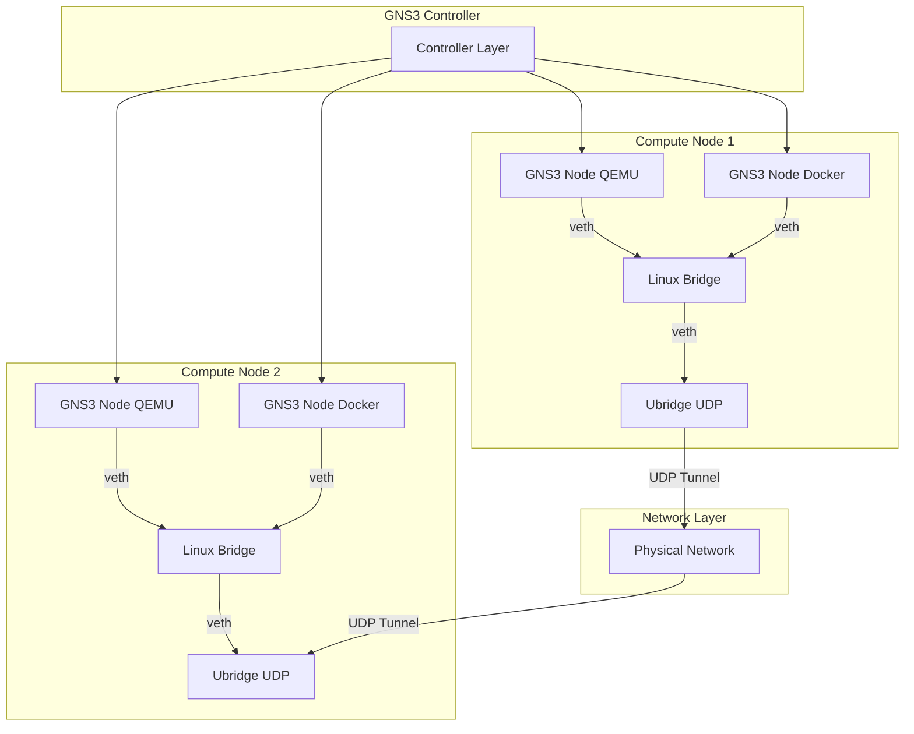

### Network Backend Decision Flow (To Be Built)

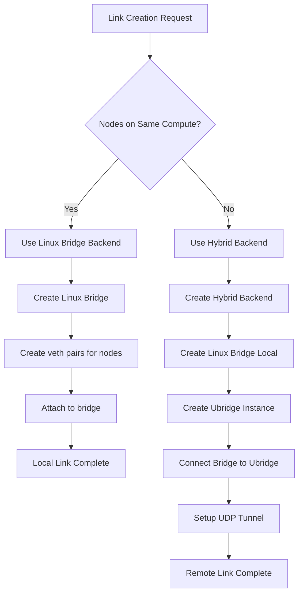

> **Important**: The "same compute" detection and path selection shown above **does not exist today**. It must be implemented in the controller layer (see Phase 1).

---

## Phase 1: Foundation & Docker POC

### Network Backend Abstraction

**Goal**: Create a unified interface that supports multiple network implementations.

**Design Principles**:
- Pluggable backend architecture
- Backward compatibility with ubridge
- Performance-optimized path selection
- Seamless fallback mechanisms

### Backend Type Comparison

| Backend Type | Use Case | Performance | Complexity |
|--------------|----------|-------------|------------|
| **Pure Linux Bridge** | Local connections (same compute) | Highest (>20 Gbps target) | Low |
| **Hybrid (Linux Bridge + Ubridge)** | Remote connections | Medium (>2 Gbps target) | Medium |
| **Pure Ubridge** | Fallback/legacy | Baseline (~5 Gbps local) | Low |

### Component Architecture

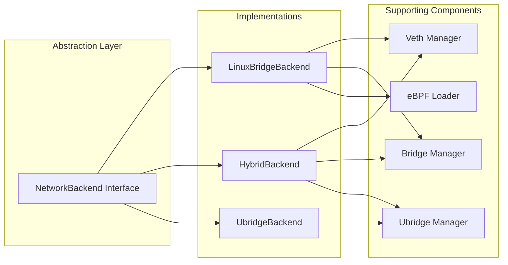

**Key Interfaces**:

| Method | Purpose | Implementation Variants |
|--------|---------|------------------------|
| `create_bridge()` | Create network bridge | Linux bridge command / ubridge bridge create |
| `add_node_interface()` | Connect node to bridge | veth pair / ubridge nio_tap |
| `add_udp_tunnel()` | Setup remote connection | ubridge nio_udp only |
| `apply_filters()` | Apply packet filters | eBPF XDP/TC / ubridge filters |
| `delete()` | Cleanup resources | Remove bridge / stop ubridge |

### Controller Layer Refactoring

The current `UDPLink.create()` (`gns3server/controller/udp_link.py:49`) hard-codes a UDP tunnel flow:

```
allocate UDP port on compute A → allocate UDP port on compute B → create NIOUDP on both
```

**What needs to change**:

1. **Detect same-compute links**: Add logic in `controller/link.py` (or a new link factory) to determine whether both nodes are on the same compute. Currently `get_ip_on_same_subnet()` (`controller/compute.py:647`) already checks `if other_compute == self` — this can be reused.

2. **New `LocalLink` subclass**: Create a parallel `Link` subclass that skips UDP port allocation and instead orchestrates veth/bridge attachment. The `Link` base class (`controller/link.py:70`) provides `create()` / `update()` / `delete()` — these must be overridden without assuming UDP endpoints.

3. **Feature-gated**: Default to ubridge fallback for existing projects — only use Linux bridge when explicitly enabled via config or project flag.

**Known refactoring scope**:
- `project.py:761` currently hard-codes `UDPLink(self)` — needs to accept a backend parameter
- IOU's `adapter_add_nio_binding()` has a different signature: `(adapter_number, port_number, nio)` — the abstraction must accommodate this
- Capture side selection logic (`_choose_capture_side()`) prefers local compute — must be preserved in the new link model
- Link suspend behavior (`get_active_filters()` overriding to `frequency_drop: [-1]`) must be maintained

### Node Type Adaptation Strategy

Connecting each node type to a Linux bridge requires different strategies. The current codebase has no uniform "attach to bridge" path — each node type implements `adapter_add_nio_binding()` independently.

| Node Type | Current Connection | Signature | Complexity | Work Required |
|-----------|-------------------|-----------|------------|---------------|
| **Docker** | ubridge TAP + UDP NIO (`docker_vm.py:1132`) | `(adapter_number, nio)` | Low | Replace ubridge bridge with `ip link set tapX master brY`; handle namespace crossing (currently done via ubridge `docker move_to_ns`); set MAC via `ip link set address` instead of `docker set_mac_addr` |
| **QEMU** | Local UDP tunnels + ubridge bridge | `(adapter_number, nio)` | Medium | Replace `-netdev socket` with `-netdev tap` on Linux bridge tap; requires privileged or pre-configured tap |
| **VPCS** | UDP NIO → ubridge bridge (via `local_udp_tunnels`) | `(adapter_number, nio)` | Medium | Host-level veth pair, one end on Linux bridge, other to VPCS UDP; needs local UDP ↔ veth bridge helper |
| **IOU** | IOL-specific ubridge bridge | `(adapter_number, port_number, nio)` | Medium | Same as VPCS — veth + local helper; special handling for bay/unit addressing |
| **Dynamips** | UDP NIO → ubridge bridge | `(adapter_number, nio)` | Medium | Same as VPCS/IOU |
| **Cloud** | ubridge bridge (per-port) | `(adapter_number, nio)` | Low | Direct Linux bridge via `ip link set ethX master brY` |
| **Ethernet Switch** | ubridge bridge | N/A | Low | Native `ip link add brX type bridge` |

**Key technical details to handle per node type**:

- **Docker TAP naming**: Docker uses `tap-gns3-e{index}` naming, scanning 0-4095 via `psutil.net_if_addrs()` to find a free interface. The Linux bridge path must either adopt this convention or ensure no conflicts.
- **Docker MAC address**: Currently set via ubridge's `docker set_mac_addr {ifc} {mac}`. With Linux bridge, must use `ip link set address {mac} dev {ifc}` inside the container namespace.
- **Docker namespace move**: Currently done via `docker move_to_ns {ifc} {ns} eth{adapter}`. With Linux bridge, must use `ip link set {ifc} netns {pid}`.
- **QEMU/VirtualBox/VPCS local UDP tunnels**: These node types create a pair of UDP tunnels locally (`_create_local_udp_tunnel()`) before connecting to ubridge. The Linux bridge path must either bridge the local UDP endpoint to a veth, or replace `-netdev socket` with `-netdev tap`.

**Userspace Node Helper**: For VPCS, IOU, and Dynamips (processes that speak UDP directly), a lightweight local shim (`localhost:UDP ⇄ veth`) is needed. This could be a new `gns3-bridge-helper` process or a small eBPF program, and is one of the highest-risk items in Phase 1.

### Configuration Schema Additions

The config schema at `gns3server/schemas/config.py` currently has no bridge or eBPF settings. It must be extended with:

```python
class LinuxBridgeSettings(BaseModel):
    enable_local_bridge: bool = False
    bridge_prefix: str = "gns3"
    veth_prefix: str = "veth"
    mtu: int = 1500

class EBPSettings(BaseModel):
    enabled: bool = False
    program_directory: str = "/var/lib/gns3/ebpf"

class HybridSettings(BaseModel):
    auto_detect_local: bool = True
    prefer_linux_bridge: bool = True
```

These are then composed into `ServerConfig` — none exist today.

### Port Management Implications

`PortManager` (`gns3server/compute/port_manager.py:350`) currently reserves UDP ports for all links. With Linux bridges for local connections, same-compute links would not consume UDP ports at all. The `get_free_udp_port()` / `release_udp_port()` calls in `UDPLink.create()` must become conditional on the backend decision.

**Note**: Each compute node has its own `PortManager` instance — port management is distributed, not global. The `find_unused_port()` method also skips 70+ browser-banned ports (`BANNED_PORTS`, line 28-93).

### Docker-First POC (Phase 1 Validation Gate)

**Decision**: Phase 1 implementation should target **Docker nodes only** as the sole validation gate before expanding to other node types.

**Rationale**:
| Factor | Docker | QEMU | VPCS/IOU/Dynamips |
|--------|--------|------|-------------------|
| Already uses TAP | ✅ Yes (`docker_vm.py:1132`) | ❌ Uses local UDP tunnel | ❌ Uses UDP NIO |
| Clear ns boundary | ✅ Container ns ↔ host | ❌ Same namespace | ❌ Same namespace |
| Userspace shim needed | ❌ No | ❌ Yes | ❌ Yes |
| Adoption weight | ⭐ Heavily used | ⭐ Heavily used | ⭐ Less used |

Docker has the lowest adaptation barrier and highest validation value.

**POC Scope**:

```python
# docker_vm.py — minimal parallel path
async def adapter_add_nio_binding(self, adapter_number, nio):
    if self._use_linux_bridge and self._is_local_same_compute(nio):
        await self._add_linux_bridge_connection(adapter_number, nio)
    else:
        await self._add_ubridge_connection(nio, adapter_number)  # unchanged

async def _add_linux_bridge_connection(self, adapter_number, nio):
    bridge = BridgeManager.get_or_create(f"gns3-{self._project.id}")
    veth_pair = VethManager.create(f"v{adapter_number}-{self._id[:8]}", f"tap{adapter_number}")
    VethManager.move_to_ns(veth_pair.host_end, self._container_id)
    BridgeManager.attach(bridge, veth_pair.host_end)
```

> **Parameter order note**: The existing `_add_ubridge_connection(self, nio, adapter_number)` takes `nio` first. The new `_add_linux_bridge_connection(self, adapter_number, nio)` places `adapter_number` first for API consistency with `adapter_add_nio_binding()`.

**Success Criteria**:
1. Two Docker containers on same compute can communicate via Linux bridge (iperf3)
2. Latency and throughput are measured and compared against ubridge baseline
3. No regressions when `use_linux_bridge = false` (default)
4. Container restart does not orphan bridge/veth state

**Exit Gate**: Only after Docker POC meets all success criteria should QEMU, VPCS, IOU, and Dynamips adaptation begin.

### Cleanup Considerations for Phase 1

The current ubridge-based cleanup has several issues that must be addressed proactively:

- `_stop_ubridge()` does not cascade-clean: it kills the ubridge process without deleting individual bridges first
- `adapter_remove_nio_binding()` does not delete bridges or clean up TAP interfaces — orphaned TAPs remain in the container namespace
- The `_bridges` set in `docker_vm.py` accumulates across restarts and is never cleared

The bridge/veth manager must provide explicit cleanup:
- On link delete: detach veth from bridge, delete veth pair
- On node stop: clean up all bridge attachments
- On crash recovery: scan for orphaned `gns3-*` bridges and veth pairs

---

## Phase 2: Linux Bridge + Hybrid Ubridge Architecture

### Multi-Compute Hybrid Architecture

This is the **core architecture** enabling optimal performance across distributed deployments.

#### Architecture Diagram

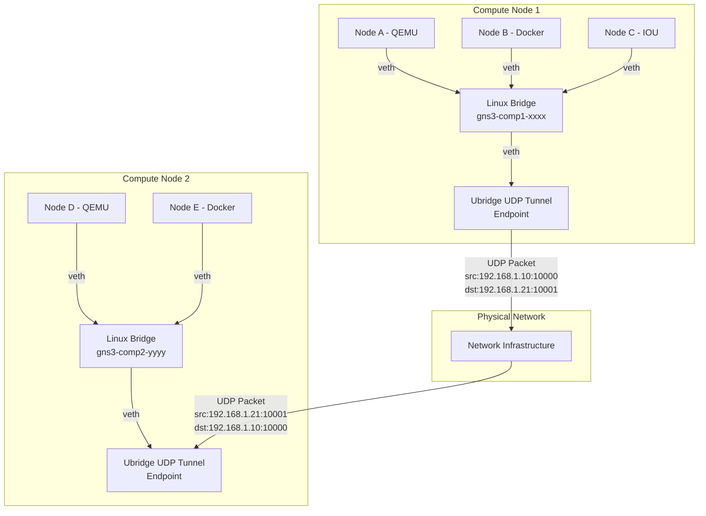

#### Packet Flow: Local vs Remote

**Local Connection (Node A → Node B)** — the key performance win:
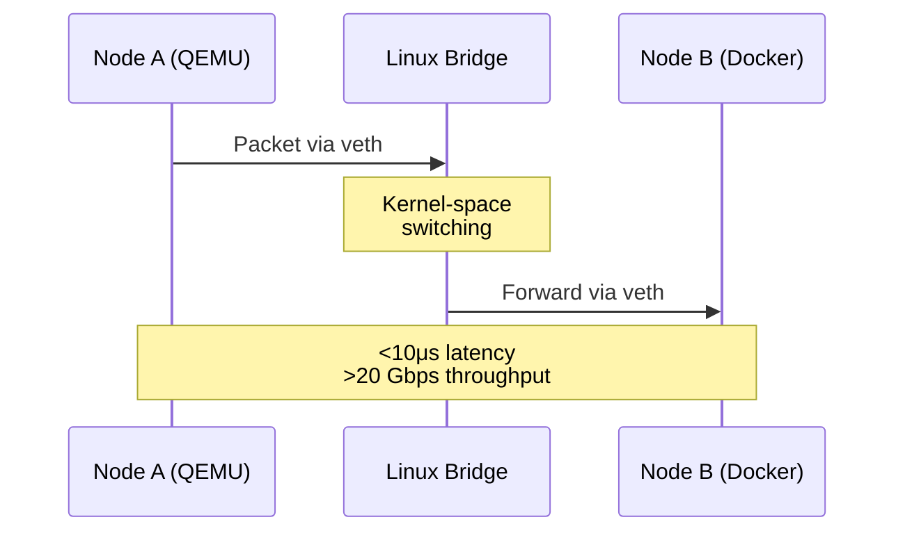

**Remote Connection (Node A → Node D)** — hybrid path, ubridge handles cross-compute:
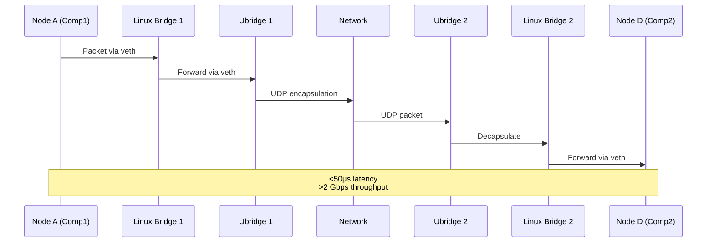

### Hybrid Backend Components

| Component | Responsibility | Technology |
|-----------|---------------|------------|
| **Linux Bridge Manager** | Create/delete bridges | `ip link add bridge / ip link delete` |
| **Veth Manager** | Create/delete veth pairs | `ip link add veth / ip link delete` |
| **Bridge-Ubridge Connector** | Connect bridge to ubridge | veth pair + tap |
| **UDP Tunnel Manager** | Setup cross-compute tunnels | ubridge nio_udp |
| **eBPF Loader** | Attach filters to bridge | XDP/TC programs |

### Connection Decision Matrix

| Node A Location | Node B Location | Backend Used | Data Path |
|----------------|-----------------|--------------|-----------|
| Compute 1 | Compute 1 | Pure Linux Bridge | Kernel-space |
| Compute 1 | Compute 2 | Hybrid (LB + Ubridge UDP) | Kernel → User → Network |
| Compute 1 | Compute 3 | Hybrid (LB + Ubridge UDP) | Kernel → User → Network |
| Compute 1 (non-Linux) | Compute 1 | Pure Ubridge | User-space |

### Network Namespace Handling for Docker Nodes

Docker containers run in isolated network namespaces. Connecting them to a host Linux bridge requires crossing namespace boundaries — this is a critical complexity.

**Current ubridge path** (Docker VM in `gns3server/compute/docker/docker_vm.py:1132`):
```
1. ubridge creates TAP `tap-gns3-e{index}` via `bridge add_nio_tap`
2. ubridge sets MAC via `docker set_mac_addr {ifc} {mac}`
3. ubridge moves TAP into container ns via `docker move_to_ns {ifc} {ns} eth{adapter}`
4. Container sees interface as `eth{adapter}`
```

**Proposed Linux bridge path**:
```
1. Create veth pair (host_end + container_end)
2. Move container_end into container namespace via `ip link set netns {pid}`
3. Rename container_end to `eth{adapter}` inside namespace
4. Set MAC on container_end via `ip netns exec {pid} ip link set address {mac} dev eth{adapter}`
5. Attach host_end to Linux bridge via `ip link set master brY`
6. Bring both ends up
```

**Key risks**:
- Requires `CAP_NET_ADMIN` and `CAP_SYS_ADMIN` for namespace operations
- Container restart loses veth interfaces — GNS3 must detect and re-attach
- Mixed namespace environments (some Docker, some QEMU, some VPCS) increase complexity
- The current `_add_ubridge_connection()` in `docker_vm.py:1132` uses ubridge-specific commands (`docker set_mac_addr`, `docker move_to_ns`) that have no ubridge equivalent in the Linux bridge path — these must be replaced with native `ip` commands

---

## Phase 3: eBPF Integration

### eBPF Architecture

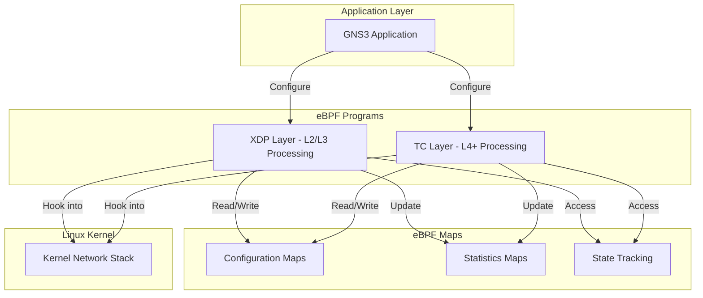

### eBPF Filter Parity with ubridge

The existing ubridge filter system supports 5 filter types (`gns3server/utils/packet_filter_validation.py` + ubridge C source). eBPF must provide equivalent or better functionality:

| ubridge Filter | eBPF Equivalent | Current ubridge Syntax | Notes |
|----------------|-----------------|----------------------|-------|
| `frequency_drop` | XDP drop with probability | `frequency_drop N` | Parameter `-1` = drop all, `0` = pass all |
| `packet_loss` | XDP random drop % | `packet_loss 0-100` | |
| `delay` | TC delay injection | `delay latency [jitter]` | ubridge rejects latency <= 0 |
| `corrupt` | XDP packet corruption | `corrupt 0-100` | XOR-corrupts middle quarter of packet |
| `bpf` | TC/XDP BPF filter | `bpf "expression"` | Validated via `tcpdump -d` |

**Validation reuse**: The existing filter validation at `gns3server/utils/packet_filter_validation.py` should remain the single validation entry point, regardless of backend. Only the application path differs (eBPF vs ubridge).

### eBPF vs Userspace Filters

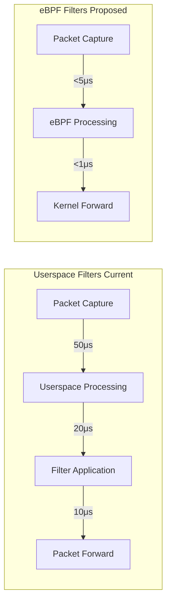

**Performance Comparison** (design targets):

| Metric | Userspace | eBPF | Improvement |
|--------|-----------|------|-------------|
| Packet processing | ~50μs | ~5μs | 10x faster |
| CPU overhead | 15-20% | <5% | 4x better |
| Max throughput | ~5 Gbps | ~20 Gbps | 4x higher |
| Dynamic updates | Requires restart | Hot reload | Instant |

### eBPF Build Pipeline & Distribution

eBPF programs are written in C and compiled to BPF bytecode. This introduces a build dependency not present in the Python-only codebase today.

**Source Structure**:
```
gns3-server/
├── gns3server/
│   ├── ebpf/                    # eBPF C source programs
│   │   ├── Makefile
│   │   ├── drop.c
│   │   ├── delay.c
│   │   ├── bandwidth.c
│   │   ├── monitor.c
│   │   └── include/
│   │       └── common.h
│   └── compute/
│       ├── ebpf/
│       │   ├── loader.py        # Load/attach/detach eBPF programs
│       │   └── maps.py          # eBPF map management
```

**Build Requirements**:

| Tool | Version | Purpose |
|------|---------|---------|
| `clang` | >= 12.0 | Compile C to BPF bytecode |
| `llvm` | >= 12.0 | BPF backend for target `bpf` |
| `libbpf` | >= 1.0 | Userspace library for loading (or `ctypes` bindings) |
| `kernel-headers` | Match running kernel | Required for `vmlinux.h` / BTF |

**CO-RE (Compile Once, Run Everywhere) Strategy**:

Pre-compiled `.o` files should be shipped with the Python package using BTF relocation:

1. Build: `clang -target bpf -O2 -c drop.c -o drop.o`
2. Ship: Include `drop.o` in the Python package (`gns3server/ebpf/programs/`)
3. Load: libbpf performs CO-RE relocation against the running kernel's BTF info
4. Fallback: If `/sys/kernel/btf/vmlinux` is unavailable → log warning, ubridge filter fallback

**Fallback Architecture**:
- If eBPF is unavailable (kernel < 5.8, no BTF, no permissions): ubridge filters are used
- If eBPF loading fails at runtime: per-link fallback to ubridge filter path
- Config knob: `[eBPF] enabled = false` to skip eBPF entirely

**Cross-Platform Constraints**:
- eBPF is Linux-only. On macOS/Windows, all eBPF config is ignored and ubridge remains the sole backend.
- Unit tests can use `unittest.mock` to simulate eBPF loader responses.
- Integration tests require a VM with kernel >= 5.8.

---

## Deployment Scenarios

### Scenario 1: Single Compute, All Local

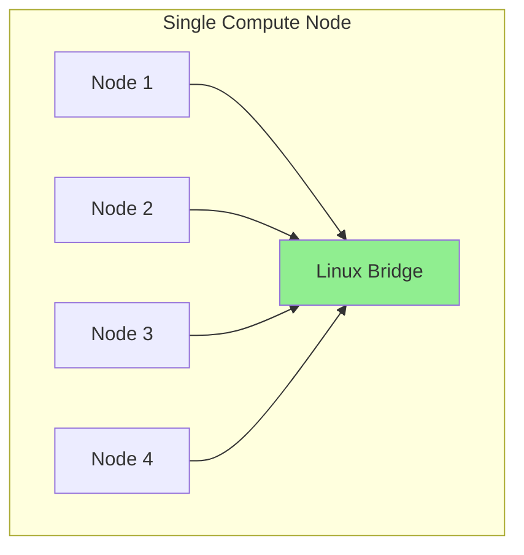

**Characteristics**:
- All nodes on same physical machine
- Pure Linux bridge backend (after Phase 1+2)
- Maximum performance (>20 Gbps target)
- eBPF filters available
- Latency: <10μs target

### Scenario 2: Multi-Compute, Hybrid

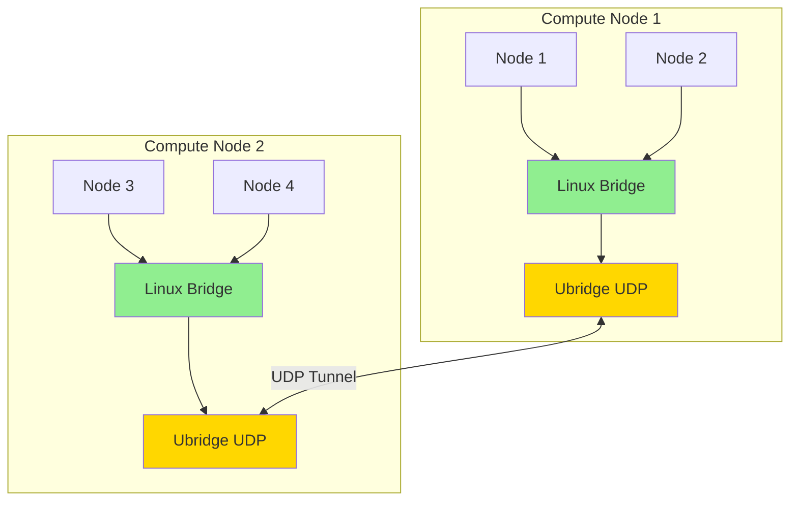

**Characteristics**:
- Nodes distributed across machines
- Local: Linux bridge (fast)
- Remote: Ubridge UDP (scalable)
- Optimal performance mix

---

## Performance Expectations (Design Targets)

All figures below are **design targets**, not empirical measurements. They are estimated based on the architectural differences between kernel-space bridging (proposed) and userspace bridging via ubridge (current). Actual results depend on hardware, kernel version, NIC offloading, node count, and traffic patterns. A Phase 1 benchmark suite should validate these assumptions before committing architectural decisions.

### Throughput Comparison

| Scenario | Current (Ubridge) | Proposed (Linux Bridge) | Improvement |
|----------|------------------|----------------------|-------------|
| Local (2 nodes) | ~5 Gbps | >20 Gbps | 4x |
| Local (8 nodes) | ~3 Gbps | >20 Gbps | 6.7x |
| Remote (same rack) | ~2 Gbps | >2 Gbps | Baseline |
| Remote (cross DC) | ~1.5 Gbps | >1.5 Gbps | Baseline |

### Latency Comparison

| Connection Type | Current (Ubridge) | Proposed (Linux Bridge) | Improvement |
|----------------|------------------|----------------------|-------------|
| Local (same compute) | ~50μs | <10μs | 5x faster |
| Remote (same rack) | ~100μs | ~50μs | 2x faster |
| Remote (cross datacenter) | ~500μs | ~450μs | Marginal |

### Resource Usage

| Metric | Current | Proposed | Improvement |
|--------|---------|----------|-------------|
| CPU (10 nodes, all local) | 20% | 5% | 4x better |
| Memory per node | 50MB | 10MB | 5x better |
| Packet copy overhead | 4 copies | 1 copy | 4x reduction |

---

## Risk Assessment & Mitigation

### Risk Matrix

| Risk | Impact | Probability | Mitigation Strategy |
|------|--------|-------------|-------------------|
| **Node type adaptation complexity** | High | High | Prototype with Docker first; add shim for userspace-only nodes (VPCS/IOU/Dynamips) |
| **Network namespace management** | High | High (Docker nodes common) | Careful `ip netns` integration; restart-detection hooks; container-stop cleanup handlers |
| **eBPF security vulnerabilities** | High | Low | Code review, sandboxing, kernel verifier, privilege proxy |
| **eBPF build pipeline + distribution** | Medium | High | Ship pre-compiled .o files; CO-RE BTF support; graceful fallback to ubridge filters |
| **Controller link refactoring scope** | High | Medium | Ship parallel Link subclass (not rewrite); feature-gated; IOU's different `adapter_add_nio_binding` signature requires special handling |
| **Performance claims unvalidated** | Medium | High | Phase 1 benchmark gate before Phase 2 investment |
| **User experience disruption** | Medium | Low | Graduated rollout (per-project toggle); ubridge fallback retained |
| **Cross-platform compatibility** | Medium | High | Linux bridge + eBPF are Linux-only; macOS/Windows retain ubridge |
| **Cleanup/orphaned resources** | Medium | Medium | Bridge/Veth Manager with lifecycle tracking; startup scan for orphaned `gns3-*` netdevs |
| **Deployment complexity** | Medium | Medium | Automated tooling, documentation, config validation |

### Migration Strategy

**Phased Approach**:
1. **Phase 1**: Foundation & Docker POC — Node adaptation (Docker only), controller refactoring, config schema, benchmark gate
2. **Phase 2**: Full Linux Bridge — Bridge Manager, Veth Manager, all node type support, namespace handling, cleanup
3. **Phase 3**: eBPF Integration — Build pipeline, loader, filter parity, monitor integration

**Rollback Capabilities**:
- Configuration-based backend selection: `[Server] use_linux_bridge = false`
- Runtime fallback to ubridge: if Linux bridge operations fail, per-project fallback
- Per-project backend choice (stored in .gns3 topology file)
- Automatic detection of suitable backend (Linux-only features auto-disabled on other platforms)

**Migration Path for Existing Projects**:
- Projects saved before Phase 2 load with `ubridge_fallback = true` by default
- User can opt in per-project: project settings → "Use Linux Bridge"
- Running nodes are NOT migrated mid-session; apply on next project open
- GNS3 topology format (.gns3) gains optional `"linux_bridge": true` flag in the project object

---

## Success Metrics

### Performance KPIs

| KPI | Target | Measurement Method |
|-----|--------|-------------------|
| Local throughput | >20 Gbps | iperf3 |
| Remote throughput | >2 Gbps | iperf3 |
| Local latency | <10μs | packet timestamping |
| CPU efficiency | <5% @ 10 nodes | system monitoring |
| Memory efficiency | <100MB @ 10 nodes | process metrics |

### Functional KPIs

| KPI | Target | Validation |
|-----|--------|-----------|
| Backend compatibility | 100% | All node types work |
| eBPF filter coverage | >90% | ubridge filter parity achieved |
| Cleanup correctness | No orphan resources | Bridge/veth scan after node stop |

### Quality KPIs

| KPI | Target | Measurement |
|-----|--------|-------------|
| Test coverage | >85% | Code coverage tools |
| Security audit | Pass | External review |
| Performance regression | None | Benchmark suite |
| User acceptance | >90% | Survey feedback |

---

## Configuration Examples

### Basic Configuration

```ini
[Server]
# Enable Linux bridge backend
use_linux_bridge = true

# Enable eBPF filters
enable_ebpf = true

[LinuxBridge]
# Bridge naming pattern
bridge_prefix = gns3

# Enable local bridge for intra-node traffic
enable_local_bridge = true
```

### Advanced Configuration

```ini
[Server]
use_linux_bridge = true
ubridge_fallback = true

[LinuxBridge]
bridge_prefix = gns3
veth_prefix = veth
enable_vlan_filtering = false
mtu = 9000

[eBPF]
enabled = true
program_directory = /var/lib/gns3/ebpf
enable_custom_bpf = true
security_sandbox = true

[Hybrid]
auto_detect_local = true
prefer_linux_bridge = true
udp_buffer_size = 1048576
```

---

## Key Technical Considerations and Best Practices

### 1. eBPF Filter Hot-Loading Design

**Challenge**: Users need to adjust link quality parameters (latency, packet loss, bandwidth) in real-time through the GNS3 GUI without performance degradation.

**Solution**: Implement eBPF Maps-based dynamic control instead of frequent program reloads.

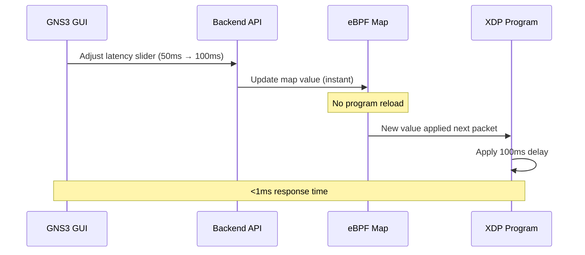

**Implementation Strategy**:
```c
// eBPF program with configurable parameters
struct {
    __uint(type, BPF_MAP_TYPE_ARRAY);
    __uint(max_entries, 1);
    __type(key, __u32);
    __type(value, struct filter_config);
} filter_config_map SEC(".maps");

struct filter_config {
    __u32 latency_ms;
    __u32 packet_loss_rate;
    __u32 bandwidth_limit_kbps;
};

SEC("xdp")
int packet_filter(struct xdp_md *ctx) {
    __u32 key = 0;
    struct filter_config *config = bpf_map_lookup_elem(&filter_config_map, &key);

    if (config && should_apply_filter(config)) {
        // Apply filter using current config values
    }
    return XDP_PASS;
}
```

**Key Advantages**:
- Zero-downtime configuration changes
- No process restarts required
- Sub-millisecond GUI response
- Supports real-time slider adjustments

---

### 2. Linux Bridge MTU Optimization for Hybrid Mode

**Problem**: UDP tunnel encapsulation adds ~50 bytes overhead. Default 1500-byte MTU causes fragmentation when physical network doesn't support jumbo frames.

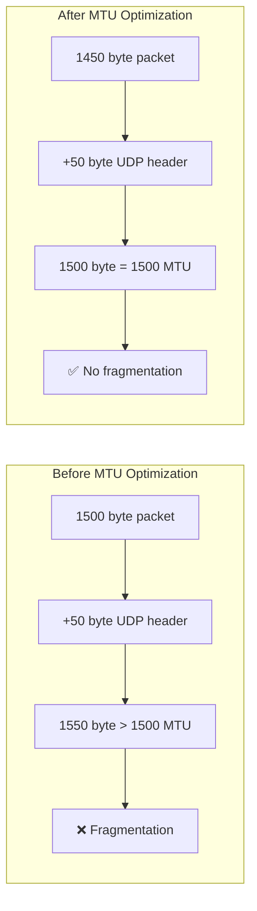

**Recommended MTU Settings**:

| Component | Standard MTU | Hybrid Mode MTU | Reasoning |
|-----------|--------------|-----------------|-----------|
| **Linux Bridge** | 1500 | 1450 | Reserve space for UDP header |
| **veth pairs** | 1500 | 1450 | Match bridge MTU |
| **Ubridge UDP** | N/A | 1450 | Internal tunnel MTU |
| **Physical interface** | 1500 | 1500 | Standard Ethernet |

**Performance Impact**:

| Scenario | MTU | Fragmentation | Throughput | CPU Usage |
|----------|-----|---------------|------------|-----------|
| **Default 1500** | 1500 | Yes | ~1.2 Gbps | High (fragmentation) |
| **Optimized 1450** | 1450 | No | ~2.0 Gbps | Low |

---

### 3. eBPF Security and Isolation

**Security Consideration**: eBPF requires `CAP_BPF` or `CAP_SYS_ADMIN` capabilities, which pose security risks in multi-tenant environments.

#### Privileged Proxy Architecture

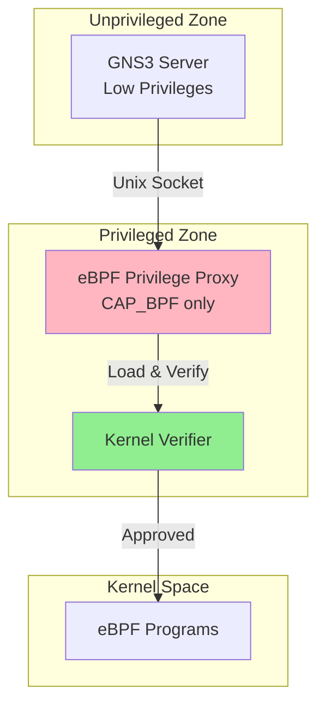

**Security Benefits**:

| Approach | Attack Surface | Privilege Scope | Isolation |
|----------|----------------|-----------------|-----------|
| **Direct eBPF** | Large | Full CAP_SYS_ADMIN | None |
| **Privileged Proxy** | Minimal | CAP_BPF only | Process-based |

**Security Features**:

1. **Capability Dropping**: Only retain `CAP_BPF` and `CAP_PERFMON`
2. **Seccomp Filtering**: Restrict system calls
3. **Namespace Isolation**: Run in separate network namespace
4. **No New Privs**: Prevent privilege escalation
5. **Resource Limits**: Enforce memory and CPU limits

**Configuration**:
```ini
[eBPF]
# Security settings
enable_privilege_proxy = true
proxy_socket_path = /var/run/gns3-ebpf.sock
proxy_capabilities = CAP_BPF,CAP_PERFMON

# Sandbox settings
enable_seccomp = true
enable_namespace_isolation = true
max_program_size = 4096
max_map_entries = 1024
```

---

### 4. Real-Time Performance Monitoring with eBPF

**Opportunity**: Leverage eBPF for zero-overhead traffic monitoring and visualization.

#### Monitoring Architecture

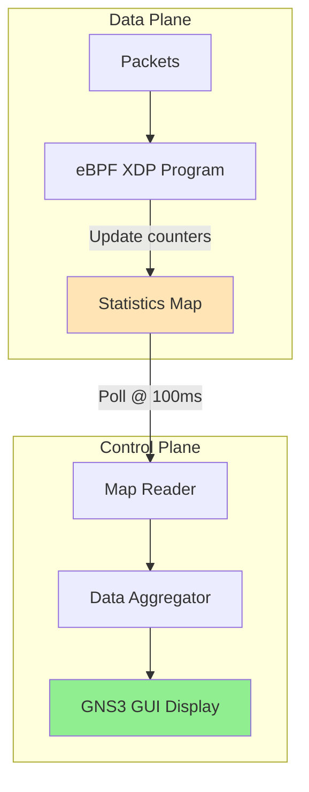

**Monitoring Features**:

| Metric | Update Rate | Accuracy | Overhead |
|--------|-------------|----------|----------|
| **Bandwidth** | 100ms | ±0.1% | <0.1% CPU |
| **Packet rate** | 100ms | ±0.1% | <0.1% CPU |
| **Drop rate** | 100ms | Exact | <0.1% CPU |
| **Latency** | 1s | ±5μs | <0.5% CPU |

**Comparison with Traditional Monitoring**:

| Approach | CPU Overhead | Accuracy | Real-time |
|----------|-------------|----------|-----------|
| **pcap/tcpdump** | 5-10% | High | No |
| **iptables counters** | 1-2% | Medium | No |
| **eBPF maps** | <0.5% | High | Yes |

---

### 5. Node Type Adaptation Strategy

**Problem**: Each GNS3 node type connects to the network differently (Docker via TAP, QEMU via local UDP tunnel, VPCS via direct UDP, etc.). A Linux bridge backend cannot use a one-size-fits-all adapter.

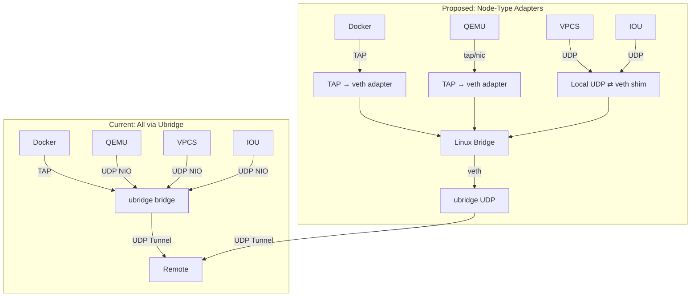

**Adapter Matrix**:

| Node Type | Connector | Signature | Notes |
|-----------|-----------|-----------|-------|
| **Docker** | TAP to veth | `adapter_add_nio_binding(adapter_number, nio)` | Native TAP already exists inside container; needs host-side veth with namespace crossing; replace `docker set_mac_addr` / `docker move_to_ns` with `ip link` commands |
| **QEMU** | `-netdev tap` | `adapter_add_nio_binding(adapter_number, nio)` | Replace `-netdev socket` with `-netdev tap`; requires privileged or pre-configured tap |
| **VPCS** | UDP local shim | `adapter_add_nio_binding(adapter_number, nio)` | New helper process: `gns3-bridge-shim` listens on localhost UDP, forwards to veth |
| **IOU** | UDP local shim | `adapter_add_nio_binding(adapter_number, port_number, nio)` ⚠️ | Same shim as VPCS, but IOU passes an extra `port_number` parameter — the abstraction must accommodate this |
| **Dynamips** | UDP local shim | `adapter_add_nio_binding(adapter_number, nio)` | Share the same shim process design |
| **Cloud (host iface)** | Direct bridge attach | `adapter_add_nio_binding(adapter_number, nio)` | Use `ip link set ethX master brY` instead of ubridge raw socket |
| **Ethernet Switch** | Native Linux bridge | N/A | Map to kernel bridge directly |

**Implementation Priority — Docker-First Strategy**:

> **Why Docker first?** Docker already uses TAP interfaces (`docker_vm.py:1132`), has clear namespace boundaries, requires no userspace shim, and is the most widely used node type — making it the lowest-risk, highest-value validation target.

```
Phase 1 POC: Docker only              ← VALIDATION GATE — no further phases proceed without passing
Phase 2a:    Docker + Cloud + Ethernet Switch
Phase 2b:    QEMU (tap adapter)
Phase 2c:    VPCS / IOU / Dynamips (UDP shim — highest risk)
```

---

## Technical Requirements

### Dependencies

```
# Python packages
pyroute2>=0.7.0           # Netlink (bridge, veth, addr management)

# Build dependencies (not runtime)
clang>=12.0               # eBPF C → BPF bytecode compilation
llvm>=12.0                # BPF backend (target bpf)
libbpf>=1.0.0             # eBPF CO-RE library (or shipped as .so)
kernel-headers            # For BTF/CO-RE generation

# System requirements
- Linux kernel >= 5.8     # eBPF support (XDP, TC, BPF_MAP_TYPE_ARRAY)
- CAP_NET_ADMIN           # Bridge/veth creation, network management
- CAP_BPF + CAP_PERFMON   # eBPF program loading (via privilege proxy)
- iproute2                # `ip link`, `ip netns`, `bridge` commands

# Optional system packages
- bridge-utils            # Legacy `brctl` (prefer `ip link` / `bridge` from iproute2)
```

### System Capabilities

- Root or CAP_NET_ADMIN for bridge creation
- eBPF JIT compiler enabled
- Sufficient file descriptors for veth pairs
- Network namespace support

---

**Version**: 1.1
**Status**: 📋 Implementation Plan (revised after codebase audit)
**Last Updated**: June 2, 2026
